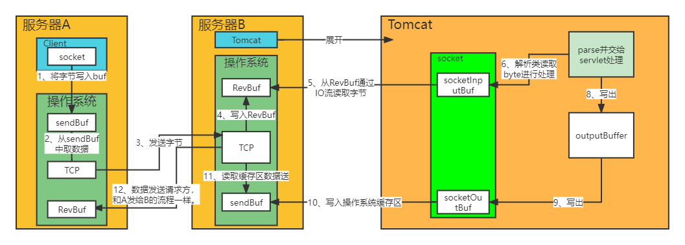

@[TOC](Spring boot)

# 0 格式
## 0.0 格式要求
html代码后面一定加一行空行；
标题后面需要添加空行；
https://www.cnblogs.com/cndarren/p/14415213.html
视频地址：https://www.bilibili.com/video/BV1o34y197fz?p=13&spm_id_from=pageDriver
每个大标题之间空2行，每个小标题之间空1行

# 7 Tomcat中jsp功能的实现
# 6 Tomcat中Session功能的实现
# 5 Tomcat启动过程
# 4 Tomcat请求处理详解

# 1 idea导入tomcat9源码及运行
## 1.1 导入

~~~
官网下载源码：
    https://tomcat.apache.org/download-90.cgi
    source code distributions
        zip (pgp, sha512)。

解压后根目录添加pom.xml：内容在最后面

根目录创建catalina-home，并将根目录下conf、webapps剪切到此目录下，放在这个目录下好管理。

导入idea：
    File -> open -> Project from existing sources。

配置main class
    Edit configurations -> + -> application：
    main class： org.apache.catalina.startup.Bootstrap
    VM options：将下面"{Tomcat根目录}"替换成本地目录(用/而不是\)，注意这个根目录是conf、webapps所在的目录：
        -Dcatalina.home={Tomcat根目录}
        -Dcatalina.base={Tomcat根目录}
        -Djava.endorsed.dirs={Tomcat根目录}/endorsed
        -Djava.io.tmpdir={Tomcat根目录}/temp
        -Duser.language=en  解决控制台乱码
        -Duser.region=US

解决问题1：
    org.apache.catalina.startup.ContextConfig#configureStart
    webConfig()下面添加：
    context.addServletContainerInitializer(new JasperInitializer(),null);

启动即可。

pom.xml文件内容
    <?xml version="1.0" encoding="UTF-8"?>
    <project xmlns="http://maven.apache.org/POM/4.0.0"
         xmlns:xsi="http://www.w3.org/2001/XMLSchema-instance"
         xsi:schemaLocation="http://maven.apache.org/POM/4.0.0
         http://maven.apache.org/xsd/maven-4.0.0.xsd">

        <modelVersion>4.0.0</modelVersion>
        <groupId>org.apache.tomcat</groupId>
        <artifactId>apache-tomcat-9.0.22-src</artifactId>
        <name>apache-tomcat-9.0.22-src</name>
        <version>9.0.22</version>

        <build>
            <finalName>apache-tomcat-9.0.22-src</finalName>
            <sourceDirectory>java</sourceDirectory>
            <resources>
                <resource>
                    <directory>java</directory>
                </resource>
            </resources>
            <plugins>
                <plugin>
                    <groupId>org.apache.maven.plugins</groupId>
                    <artifactId>maven-compiler-plugin</artifactId>
                    <version>3.5.1</version>
                    <configuration>
                        <encoding>UTF-8</encoding>
                        <source>1.8</source>
                        <target>1.8</target>
                    </configuration>
                </plugin>
            </plugins>
        </build>
        <dependencies>
            <dependency>
                <groupId>org.apache.ant</groupId>
                <artifactId>ant</artifactId>
                <version>1.10.6</version>
            </dependency>
            <dependency>
                <groupId>wsdl4j</groupId>
                <artifactId>wsdl4j</artifactId>
                <version>1.6.3</version>
            </dependency>
            <dependency>
                <groupId>javax.xml</groupId>
                <artifactId>jaxrpc</artifactId>
                <version>1.1</version>
            </dependency>
            <dependency>
                <groupId>org.eclipse.jdt</groupId>
                <artifactId>ecj</artifactId>
                <version>3.18.0</version>
            </dependency>
        </dependencies>
    </project>
~~~

## 1.2 运行web项目

~~~
打包一个web项目，打成war包、war包展开都可以。
    build -> build artifacts -> 选包(需要先在project structure中配置)
放入webapps目录下。
启动tomcat即可。
~~~

## 1.3 脚本启动分析

startup.bat文件实际上就做了一件事情: 启动catalina.bat。
catalina.bat：以后看TODO。

# 2 Tomcat目录及启动参数介绍
## 2.1 Tomcat目录介绍

- /bin：用于Tomcat 的启动，关闭。*.sh 用于linux，*.bat用于windows系统。
- /conf：用于Tomcat的配置，其中 server.xml是最重要的，它用于配置容器的文件，如配置项目项目的端口号80等。
- /logs ：是Tomcat默认的日志文件，可以通过它查看Tomcat的系统情况，非常有用。
- /webapps：是你的web应用放到位置。

## 2.2 启动参数介绍
### 2.2.1

**CATALINA_HOME**：是Tomcat的安装目录，在windows的环境变量中一般会配置CATALINA_HOME。其他目录主要包括了Tomcat的二进制文件和脚本，CATALINA_HOME就指向这些目录。
**CATALINA_BASE**：是Tomcat的工作目录。Tomcat每个运行实例需要使用自己的conf、logs、temp、webapps、work和shared目录，因此CATALINA_BASE就指向这些目录。
默认CATALINA_BASE和CATALINA_HOME指向相同的目录。

# 3 Tomcat中关于长连接的底层原理与源码实现
## 3.1 应用程序间的通信

服务器(浏览器)A ------> 服务器B
~~~
浏览器点击提交，对http信息的字节数组通过socket调用操作系统的方法；
操作系统A通过ip:port和TCP协议和服务器B建立连接；
A将字节通过网络传输给B；
B上的应用程序通过socket监听port消息，并通过IO进行字节读取。
~~~

## 3.2 长连接和短连接
### 3.2.1 定义
长连接(long connnection)：指在一个连接上可以连续发送多个数据包，在连接保持期间，如果没有数据包发送，需要双方发链路检测包。
短连接(short connnection)：是相对于长连接而言的概念，指的是在数据传送过程中，只在需要发送数据时才去建立一个连接，数据发送完成后则断开此连接，即每次连接只完成一项业务的发送。

通俗一点：
长连接：连接->传输数据->保持连接 -> 传输数据-> …->直到一方关闭连接，客户端关闭连接。长连接指建立SOCKET连接后无论使用与否都要保持连接。
短连接：连接->传输数据->关闭连接。下次一次需要传输数据需要再次连接。

### 3.2.3 应用场景

长连接
长连接多用于操作频繁，点对点的通讯，而且连接数不能太多情况。每个TCP连接都需要三步握手，这需要时间，如果每个操作都是先连接，再操作的话那么处理速度会降低很多，所以每个操作完后都不断开，次处理时直接发送数据包就OK了，不用新建立TCP连接。
例如：数据库的连接用长连接， 如果用短连接频繁的通信会造成socket错误，而且频繁的socket 创建也是对资源的浪费。

短连接
而像WEB网站的http服务一般都用短链接，因为长连接对于服务端来说会耗费一定的资源，而像WEB网站这么频繁的成千上万甚至上亿客户端的连接用短连接会更省一些资源，如果用长连接，而且同时有成千上万的用户，如果每个用户都占用一个连接的话，那可想而知。
所以并发量大，但每个用户无需频繁操作情况下需用短连好。

### 3.2.4 TCP长短连接的优势

**TCP短连接**
模拟一下TCP短连接的情况，client向server发起连接请求，server接到请求，然后双方建立连接。client向server发送消息，server回应client，然后一次读写就完成了，这时候双方任何一个都可以发起close操作，不过一般都是client先发起close操作。
从上面的描述看，短连接一般只会在client/server间传递一次读写操作。
短连接优点：管理起来方便，存在的连接都是有效的连接，不需要额外的控制手段。

**TCP长连接**
接下来我们再模拟一下长连接的情况，client向server发起连接，server接受client连接，双方建立连接。Client与server完成一次读写之后，它们之间的连接并不会主动关闭，后续的读写操作会继续使用这个连接。**注意永远是一个请求、响应结束了，client才会发另一个请求**。下面介绍一下TCP的保活功能。

**TCP的保活功能**主要为服务器应用提供。如果客户端已经消失而连接未断开，则会使得服务器上保留一个半开放的连接，而服务器又在等待来自客户端的数据，此时服务器将永远等待客户端的数据。保活功能就是试图在服务端器端检测到这种半开放的连接。就像2个人微信聊天，B过了一会不说话，A就得问下还在不，问了好几次B没答话，A就下线了。

**如果一个给定的连接在两小时内没有任何的动作，则服务器就向客户发一个探测报文段，客户主机必须处于以下4个状态之一：**
~~~~
客户主机依然正常运行，并从服务器可达。客户的TCP响应正常，而服务器也知道对方是正常的，服务器在两小时后将保证定时器复位。
客户主机已经崩溃，并且关闭或者正在重新启动。在任何一种情况下，客户的TCP都没有响应。服务端将不能收到对探测的响应，并在75秒后超时。服务器总共发送10个这样的探测 ，每个间隔75秒。如果服务器没有收到一个响应，它就认为客户主机已经关闭并终止连接。
客户主机崩溃并已经重新启动。服务器将收到一个对其保证探测的响应，这个响应是一个复位，使得服务器终止这个连接。
客户机正常运行，但是服务器不可达，这种情况与2类似，TCP能发现的就是没有收到探查的响应。
~~~~

### 3.2.5 HTTP协议与TCP/IP协议的关系

HTTP协议的长连接和短连接，本质上是TCP协议的长连接和短连接。HTTP属于应用层协议，在传输层使用TCP协议，在网络层使用IP协议。 IP协议主要解决网络路由和寻址问题，TCP协议主要解决如何在IP层之上可靠地传递数据包，使得网络上接收端收到发送端所发出的所有包，并且接受顺序与发送顺序一致。TCP协议是可靠的、面向连接的。TCP才负责连接，只有负责传输的这一层才需要建立连接

在HTTP/1.0中默认使用短连接。也就是说，客户端和服务器每进行一次HTTP操作，就建立一次连接，任务结束就中断连接。当客户端浏览器访问的某个HTML或其他类型的Web页中包含有其他的Web资源（如JavaScript文件、图像文件、CSS文件等），每遇到这样一个Web资源，浏览器就会重新建立一个HTTP会话。

而从HTTP/1.1起，默认使用长连接，用以保持连接特性。使用长连接的HTTP协议，会在响应头加入这行代码（但要服务器和客户端都设置）：
~~~
Connection:keep-alive
~~~

# 4 理解Tomcat架构
## 4.1 Tomcat作用

一个Servlet主要做下面三件事情：
- 创建并填充Request对象，包括：URI、参数、method、请求头信息、请求体信息等
- 创建Response对象
- 执行业务逻辑，将结果通过Response的输出流输出到客户端

Servlet没有main方法，所以，如果要执行，则需要在一个容器里面才能执行，这个容器就是为了支持Servlet的功能而存在，Tomcat其实就是一个Servlet容器的实现。

## 4.1 从组件的角度看

整体关系(具体每个组件作用查看server.xml文件)：
Server：
- List\<Service>：
  - List\<Connector>：
  - List\<Listener>：
  - Engine：
    - Pipeline：
      - List\<Valve>:
    - List\<Host>:
      - Pipeline：
        - List\<Valve>:
      - List\<Context>:
        - Pipeline：
            - List\<Valve>:
        - List\<Wrapper>：
          - Pipeline：
              - List\<Valve>:
          - List\<Servlet>：

**Server**
- 表示服务器，它提供了一种优雅的方式来启动和停止整个系统，不必单独启停连接器和容器；它是Tomcat构成的顶级构成元素，所有一切均包含在Server中；

**Service**
- 表示服务，Server可以运行多个服务。比如一个Tomcat里面可运行订单服务、支付服务、用户服务等等；Server的实现类StandardServer可以包含一个到多个Services, Service的实现类为StandardService调用了容器(Container)接口，其实是调用了Servlet Engine(引擎)，而且StandardService类中也指明了该Service归属的Server。

**Container**
- 表示容器，可以看做Servlet容器；引擎(Engine)、主机(Host)、上下文(Context)和Wraper均继承自Container接口，所以它们都是容器。
  - Engine：引擎
    - Host：主机
      - Context：上下文
        - Wrapper：包装器
          - Servlet：从Engine都包含了Servlet，所以他们叫容器。

**Connector**
- 表示连接器, 它将Service和Container连接起来，首先它需要注册到一个Service，它的作用就是把来自客户端的请求转发到Container(容器)，这就是它为什么称作连接器, 它支持的协议如下：
  - 支持AJP协议
  - 支持Http协议
  - 支持Https协议

Engine、Host、Context、Wrapper都是servlet容器。
一个engine可包含多个host；
一个Host可包含多个context(具体应用)；
一个wrapper可包含**多个同类型**的servlet。

为什么不直接用context包含servlet？
直接用context管理servlet：相当于一个校长管理所有学生。
context<Wrapper<Servlet>>：相当于把所有学生分到各自的年级，由各自年级的老师管理，校长只用管理各年级的老师就行。
context只用管理每种Servlet对应的Wrapper，Wrapper只用管理这种Servlet中的所有实例。

**Service内部还有各种支撑组件，下面简单罗列一下这些组件**
- Manager：管理器，用于管理会话Session
- Logger：日志器，用于管理日志
- Loader：加载器，和类加载有关，只会开放给Context所使用
- Pipeline：管道组件，配合Valve实现过滤器功能
- Valve：阀门组件，配合Pipeline实现过滤器功能
- Realm：认证授权组件

## 4.2 从一个完整请求的角度来看

假设来自客户的请求为：http://localhost:8080/test/index.jsp 请求被发送到本机端口8080，被在那里侦听的Coyote HTTP/1.1 Connector,然后：
- Connector把该请求交给它所在的Service的Engine来处理，并等待Engine的回应 Engine获得请求
- localhost:8080/test/index.jsp，匹配它所有虚拟主机Host
- Engine匹配到名为localhost的Host(即使匹配不到也把请求交给该Host处理，因为该Host被定义为该Engine的默认主机)
- localhost Host获得请求/test/index.jsp，匹配它所拥有的所有Context
- Host匹配到路径为/test的Context(如果匹配不到就把该请求交给路径名为""的Context去处理)
- path="/test"的Context获得请求/index.jsp，在它的mapping table中寻找对应的servlet
- Context匹配到URL PATTERN为*.jsp的servlet，对应于JspServlet类，构造HttpServletRequest对象和HttpServletResponse对象，作为参数调用JspServlet的doGet或doPost方法
- Context把执行完了之后的HttpServletResponse对象返回给Host
- Host把HttpServletResponse对象返回给Engine
- Engine把HttpServletResponse对象返回给Connector
- Connector把HttpServletResponse对象返回给客户browser

## 4.3 从源码的设计角度看

从功能的角度将Tomcat源代码分成5个子模块，分别是:
**Jasper模块**
- 这个子模块负责jsp页面的解析、jsp属性的验证，同时也负责将jsp页面动态转换为java代码并编译成class文件。在Tomcat源代码中，凡是属于org.apache.jasper包及其子包中的源代码都属于这个子模块。

**Servlet和Jsp模块**
- 这个子模块的源代码属于javax.servlet包及其子包，如我们非常熟悉的javax.servlet.Servlet接口、javax.servet.http.HttpServlet类及javax.servlet.jsp.HttpJspPage就位于这个子模块中。

**Catalina模块**
- 这个子模块包含了所有以org.apache.catalina开头的java源代码。该子模块的任务是规范了Tomcat的总体架构，定义了Server、Service、Host、Connector、Context、Session及Cluster等关键组件及这些组件的实现，这个子模块大量运用了Composite设计模式。同时也规范了Catalina的启动及停止等事件的执行流程。从代码阅读的角度看，这个子模块应该是我们阅读和学习的重点。

**Connector模块**
- 如果说上面三个子模块实现了Tomcat应用服务器的话，那么这个子模块就是Web服务器的实现。所谓连接器(Connector)就是一个连接客户和应用服务器的桥梁，它接收用户的请求，并把用户请求包装成标准的Http请求(包含协议名称，请求头Head，请求方法是Get还是Post等等)。同时，这个子模块还按照标准的Http协议，负责给客户端发送响应页面，比如在请求页面未发现时，connector就会给客户端浏览器发送标准的Http 404错误响应页面。

**Resource模块**
- 这个子模块包含一些资源文件，如Server.xml及Web.xml配置文件。严格说来，这个子模块不包含java源代码，但是它还是Tomcat编译运行所必需的。

## 4.4 从后续深入理解的角度

我们看完上述组件结构后，后续应该重点从哪些角度深入理解Tomcat呢？
**基于组件的架构**
- 我们知道组成Tomcat的是各种各样的组件，每个组件各司其职，组件与组件之间有明确的职责划分，同时组件与组件之间又通过一定的联系相互通信。Tomcat整体就是一个个组件的堆砌！

**基于JMX**
- 我们在后续阅读Tomcat源码的时候，会发现代码里充斥着大量的类似于下面的代码。而这实际上就是通过JMX来管理相应对象的代码。
~~~
Registry.getRegistry(null, null).invoke(mbeans, "init", false);
Registry.getRegistry(null, null).invoke(mbeans, "start", false);
~~~

**基于生命周期**
- 如果我们查阅各个组件的源代码，会发现绝大多数组件实现了Lifecycle接口，这也就是我们所说的基于生命周期。生命周期的各个阶段的触发又是基于事件的方式。

## 4.5 如何确定请求由谁处理？

当请求被发送到Tomcat所在的主机时，如何确定最终哪个Web应用来处理该请求呢？
http://域名:端口/context/path

**根据协议和端口号选定Service和Engine**
~~~
Service中的Connector组件可以接收特定端口的请求，因此，当Tomcat启动时，Service组件就会监听特定的端口。
根据端口可以确定Connector，再根据Connector确定其所属的Service，找到Service下唯一的Engine。
通过在Server中配置多个Service，可以实现通过不同的端口号来访问同一台机器上部署的不同应用。
~~~

**根据域名或IP地址选定Host**
~~~
将域名或ip与Engine中所有Host的name进行匹配，就可以确定Host，如果没有匹配成功，则用Engine配置的defaultHost对应的Host处理。
~~~

**根据URI选定Context/Web应用**
~~~
在选定Host后，Tomcat根据应用的 path属性与URI的匹配程度来选择Web应用处理相应请求。
~~~

举例：以请求http://localhost:8080/app1/index.html为例，首先通过协议和端口号（http和8080）选定Service；然后通过主机名（localhost）选定Host；然后通过uri（/app1/index.html）选定Web应用。

## 4.6 如何配置多个服务

在Server中配置多个Service服务，可以实现通过不同的端口号来访问同一台机器上部署的不同Web应用。就是把上一次Service复制一份，相应的配置改一改。

## 4.7 其它组件

除核心组件外，server.xml中还可以配置很多其他组件。下面只介绍第一部分例子中出现的组件，如果要了解更多内容，可以查看https://tomcat.apache.org/tomcat-8.0-doc/config/index.html。

### 4.7.1 Listener

Listener(即监听器)定义的组件，可以在特定事件发生时执行特定的操作；被监听的事件通常是Tomcat的启动和停止。

监听器可以在Server、Engine、Host或Context中，本例中的监听器都是在Server中。实际上，本例中定义的6个监听器，都只能存在于Server组件中。监听器不允许内嵌其他组件。

监听器需要配置的最重要的属性是className，该属性规定了监听器的具体实现类，该类必须实现了org.apache.catalina.LifecycleListener接口。

**下面依次介绍例子中配置的监听器：**
- VersionLoggerListener：当Tomcat启动时，该监听器记录Tomcat、Java和操作系统的信息。该监听器必须是配置的第一个监听器。
- AprLifecycleListener：Tomcat启动时，检查APR库，如果存在则加载。APR，即Apache Portable Runtime，是Apache可移植运行库，可以实现高可扩展性、高性能，以及与本地服务器技术更好的集成。
- JasperListener：在Web应用启动之前初始化Jasper，Jasper是JSP引擎，把JVM不认识的JSP文件解析成java文件，然后编译成class文件供JVM使用。
- JreMemoryLeakPreventionListener：与类加载器导致的内存泄露有关。
- GlobalResourcesLifecycleListener：通过该监听器，初始化< GlobalNamingResources>标签中定义的全局JNDI资源；如果没有该监听器，任何全局资源都不能使用。< GlobalNamingResources>将在后文介绍。
- ThreadLocalLeakPreventionListener：当Web应用因thread-local导致的内存泄露而要停止时，该监听器会触发线程池中线程的更新。当线程执行完任务被收回线程池时，活跃线程会一个一个的更新。只有当Web应用(即Context元素)的renewThreadsWhenStoppingContext属性设置为true时，该监听器才有效。

### 4.7.2 GlobalNamingResources与Realm

Realm，可以把它理解成“域”；Realm提供了一种用户密码与web应用的映射关系，从而达到角色安全管理的作用。在本例中，Realm的配置使用name为UserDatabase的资源实现。而该资源在Server元素中使用GlobalNamingResources配置：

GlobalNamingResources元素定义了全局资源，通过配置可以看出，该配置是通过读取$TOMCAT_HOME/ conf/tomcat-users.xml实现的。

https://www.cnblogs.com/xing901022/p/4552843.html

### 4.7.3 Valve

单词Valve的意思是“阀门”，在Tomcat中代表了请求处理流水线上的一个组件；Valve可以与Tomcat的容器(Engine、Host或Context)关联。

AccessLogValve的作用是通过日志记录其所在的容器中处理的所有请求，在本例中，Valve放在Host下，便可以记录该Host处理的所有请求。AccessLogValve记录的日志就是访问日志，每天的请求会写到一个日志文件里。AccessLogValve可以与Engine、Host或Context关联；在本例中，只有一个Engine，Engine下只有一个Host，Host下只有一个Context，因此AccessLogValve放在三个容器下的作用其实是类似的。

**属性如下：**
- className：规定了Valve的类型，是最重要的属性；本例中，通过该属性规定了这是一个AccessLogValve。
- directory：指定日志存储的位置，本例中，日志存储在$TOMCAT_HOME/logs目录下。
- prefix：指定了日志文件的前缀。
- suffix：指定了日志文件的后缀。通过directory、prefix和suffix的配置，在$TOMCAT_HOME/logs目录下，可以看到如下所示的日志文件。
- pattern：指定记录日志的格式，本例中各项的含义如下：
  - %h：远程主机名或IP地址；如果有nginx等反向代理服务器进行请求分发，该主机名/IP地址代表的是nginx，否则代表的是客户端。后面远程的含义与之类似，不再解释。
  - %l：远程逻辑用户名，一律是”-”，可以忽略。
  - %u：授权的远程用户名，如果没有，则是”-”。
  - %t：访问的时间。
  - %r：请求的第一行，即请求方法(get/post等)、uri、及协议。
  - %s：响应状态，200,404等等。
  - %b：响应的数据量，不包括请求头，如果为0，则是”-”。
  - %D，含义是请求处理的时间(单位是毫秒)，对于统计分析请求的处理速度帮助很大。

开发人员可以充分利用访问日志，来分析问题、优化应用。例如，分析访问日志中各个接口被访问的比例，不仅可以为需求和运营人员提供数据支持，还可以使自己的优化有的放矢；分析访问日志中各个请求的响应状态码，可以知道服务器请求的成功率，并找出有问题的请求；分析访问日志中各个请求的响应时间，可以找出慢请求，并根据需要进行响应时间的优化。

# 5 启动过程：初始化和启动流程
## 5.1 总体流程

## 5.2 程序主入口

org.apache.catalina.startup.Bootstrap.main(String[] args)。
主要做了以下工作：
~~~
main(String[] args) {
    Bootstrap bootstrap = new Bootstrap();
    bootstrap.init() {
        // 初始化 CommonClassLoader、CatalinaClassLoader、SharedClassLoader，并且3个是同一个；
        initClassLoaders();

        // 设置线程的classLoader为catalinaLoader，即后面加载用tomcat自己的类加载器
        Thread.currentThread().setContextClassLoader(catalinaLoader);

        // 实例化：org.apache.catalina.startup.Catalina
        catalinaDaemon = startupInstance(通过反射生成);
    }

    bootstrap.load(args);
    bootstrap.start();
}
~~~

# 6 启动过程:类加载机制详解
## 6.1 双亲委派模型问题是如何解决的？

**双亲委派模型问题**
A类在使用到另一个未被加载的B类时，首先会使用A类的classLoader加载B类，进行双亲委派加载。如果由核心类A加载其它自定义类B，按理应该由BootstrapClassLoader加载B，但是B无法加载自定义的类，导致类B无法加载。
在Java核心类里面有SPI（Service Provider Interface），它由Sun编写规范，第三方来负责实现。SPI需要用到第三方实现类。如果使用双亲委派模型，那么第三方实现类也需要放在Java核心类里面才可以，不然的话第三方实现类将不能被加载使用。

**解决方法**
核心类获取当前线程，直接调用getContextClassLoader()获取AppClassLoder，或调用setContextClassLoader()设置自定义类加载器MyClassLoader，再调用其getContextClassLoader()，获取MyClassLoader，用MyClassLoader或AppClassLoder加载自定义的类。

## 6.2 为什么Tomcat的类加载器也不是双亲委派模型

原因在于一个Tomcat容器允许同时运行多个Web程序，每个Web程序依赖的类又必须是相互隔离的。因此，如果Tomcat使用双亲委派模式来加载类的话，将导致Web程序依赖的类变为共享的。
例Tomcat中部署了2个web应用，且都有User类，但类结构不一样，当tomcat加载了A.User类时，B使用User时，就不会使用B自己的User，而是A.User，就会出错致命错误。

## 6.3 Tomcat类加载机制是怎么样的呢

tomcat9之前的类加载器

tomcat9的类加载器

我们在这张图中看到很多类加载器，除了Jdk自带的类加载器，我们尤其关心Tomcat自身持有的类加载器。仔细一点我们很容易发现：Catalina类加载器、Shared类加载器，他们并不是父子关系，而是兄弟关系。
**tomcat类加载器的作用**
- Common类加载器，负责加载Tomcat和Web应用都复用的类
- Catalina类加载器，负责加载Tomcat专用的类，而这些被加载的类在Web应用中将不可见
- Shared类加载器，负责加载Tomcat下所有的Web应用程序都复用的类，而这些被加载的类在Tomcat中将不可见
- WebApp类加载器，负责加载具体的某个Web应用程序所使用到的类，而这些被加载的类在Tomcat和其他的Web应用程序都将不可见
- Jsp类加载器，每个jsp页面一个类加载器，不同的jsp页面有不同的类加载器，方便实现jsp页面的热插拔

~~~
org/apache/catalina/startup/Bootstrap
public void init() throws Exception {
    ...
    // tomcat在此设置了其根加载器，后面tomcat加载的所有类最多到此加载器，此加载器也是commonClsLoader、SharedClsLoader。
    Thread.currentThread().setContextClassLoader(catalinaLoader);
    ...
}
~~~

**类加载器被创建位置：**
- CommonClassLoader、CatalinaClassLoader、SharedClassLoader：BootStrap.init(){initClassLoaders();}
- WebAppClassLoader：是每个Context的类加载器，所以在Context的标准实现StandardContext中被创建的
~~~
StandardContext.startInternal(){
    ...
    if (getLoader() == null) {
        WebappLoader webappLoader = new WebappLoader();
        webappLoader.setDelegate(getDelegate());
        setLoader(webappLoader);
    }
    ...
}
~~~

# 7 启动过程:Catalina的加载
## 7.1 Catalina的实例化、启动和关闭

我们最终的目的是启动Server，Bootstrap引导Catalina的创建和销毁，Catalina对Server进行了解析、创建、销毁。

先看下Bootstrap.main()方法的流程：
~~~
new Bootstrap();
bootstrap.init(); // 创建catalina实例
daemon.load(args); // 调用catalina.load()
daemon.start(); // 调用catalina.start()
~~~

### 7.2 Catalina的实例化

就是根据全限定名，通过反射生成Catalina实例。

### 7.3 Catalina的加载

加载：是加载${CATALINA_BASE}/conf/server.xml文件；

**catalina.load()**
~~~
initNaming(); // 设置额外的系统变量
parseServerXml(); // 使用Digester解析server.xml文件，并生成对应的对象
~~~

### 7.4 Catalina的启动和关闭

启动：是调用server.xml文件中解析出来的Server对象的start()。
关闭：是调用Server、及其所有子组件的关闭方法，通过Server.stop()、server.destroy()关闭。
**catalina.load()**
~~~
start(); // 根据解析出的对象，在内部调用server.start()
await(); // 在此处阻塞线程，直到接收到SHUTDOWN命令
stop(); // 调用server.stop()、server.destroy()。
~~~

**但是什么时候调用stop方法？**
**方法一**：jvm的关闭钩子方式(查看jvm相关文档TODO)，Runtime.getRuntime().addShutdownHook(new CatalinaShutdownHook())。
- 在start()后、await()前，调用Runtime.getRuntime().addShutdownHook(new CatalinaShutdownHook())，这样在不是通过SHUTDOWN命令关闭jvm时，就会调用CatalinaShutdownHook线程中的run方法。

**方法二**：
- 调用shutdown.bat，通过socket向tomcat发送SHUTDOWN请求；
- 接收到请求后，await()不再阻塞，接着运行stop()方法，这个stop()和CatalinaShutdownHook()的run()方法代码一致；
- 再运行main()的System.exit(1)，注意，这个是jvm退出方法，也会运行Runtime.getRuntime().addShutdownHook()添加的钩子方法，这样会2次调用server.stop()，但是第一次关闭时，已经将Server置为null，第2次调用时会出现NPE。为了不出现这个，当接收到是SHUTDOWN命令时，需要先移除刚才那个钩子方法。Runtime.getRuntime().removeShutdownHook(shutdownHook);
- 查看catalina.stop()方法。

# 8 组件生命周期管理:LifeCycle

上节中，我们已经知道Catalina初始化了Server（它调用了 Server 类的 init 和 start 方法来启动 Tomcat）；你会发现Server是Tomcat的配置文件server.xml的顶层元素，那这个阶段其实我们已经进入到Tomcat内部组件的详解；这时候有一个问题，这么多组件是如何管理它的生命周期的呢？

**理解Lifecycle主要有两点：第一是三类接口方法；第二是状态机。**

## 8.1 组件、生命周期图

Server及其它组件

Server后续组件生命周期及初始化

Server的依赖结构

## 8.2 LifecycleState状态

LifeCycle状态机有哪些状态？
Tomcat 给各个组件定义了一些生命周期中的状态。
查看org.apache.catalina.Lifecycle可以查看转换流程。具体如下

**在枚举类org.apache.catalina.LifecycleState里查看各种状态**
~~~
public enum LifecycleState {
    NEW(false, null), // 刚new好的组件
    INITIALIZING(false, Lifecycle.BEFORE_INIT_EVENT), // 初始化中
    INITIALIZED(false, Lifecycle.AFTER_INIT_EVENT), // 已完成初始化
    STARTING_PREP(false, Lifecycle.BEFORE_START_EVENT), // 启动前
    STARTING(true, Lifecycle.START_EVENT), // 启动中
    STARTED(true, Lifecycle.AFTER_START_EVENT), // 已启动
    STOPPING_PREP(true, Lifecycle.BEFORE_STOP_EVENT), // 关闭前
    STOPPING(false, Lifecycle.STOP_EVENT), // 关闭中
    STOPPED(false, Lifecycle.AFTER_STOP_EVENT), // 已关闭
    DESTROYING(false, Lifecycle.BEFORE_DESTROY_EVENT), // 销毁中
    DESTROYED(false, Lifecycle.AFTER_DESTROY_EVENT), // 已销毁
    FAILED(false, null); // 失败

    private final boolean available;
    private final String lifecycleEvent;

    private LifecycleState(boolean available, String lifecycleEvent) {
        this.available = available;
        this.lifecycleEvent = lifecycleEvent;
    }
    ……
}
~~~

## 8.3 LifeCycle接口

一个标准的LifeCycle有哪些方法？三类方法如下
~~~
public interface Lifecycle {
    /** 第1类：针对监听器 **/
    // 添加监听器
    public void addLifecycleListener(LifecycleListener listener);
    // 获取所以监听器
    public LifecycleListener[] findLifecycleListeners();
    // 移除某个监听器
    public void removeLifecycleListener(LifecycleListener listener);

    /** 第2类：针对控制流程 **/
    // 初始化方法
    public void init() throws LifecycleException;
    // 启动方法
    public void start() throws LifecycleException;
    // 停止方法，和start对应
    public void stop() throws LifecycleException;
    // 销毁方法，和init对应
    public void destroy() throws LifecycleException;

    /** 第3类：针对状态 **/
    // 获取生命周期状态
    public LifecycleState getState();
    // 获取字符串类型的生命周期状态
    public String getStateName();
}
~~~

## 8.4 LifecycleBase - LifeCycle的基本实现

LifecycleBase是Lifecycle的基本实现。

### 8.4.1 监听器相关

对监听器的增、删、查询所有都是操作一个**List<LifecycleListener>**成员变量实现的，是CopyOnWriteArrayList(具体查看juc)类型，保证插入的时候线程安全。

### 8.4.2 生命周期相关

**init()**
查看源代码可知，只有在**LifecycleState.NEW**状态下，才能进行init()。
此处使用了模板模式，在LifecycleBase的方法中，处理组件的状态变更、状态变更顺序及调用初始化方法，但具体的初始化逻辑由子类完成。
~~~
init() {
    // 初始化逻辑之前，先将状态变更为`INITIALIZING`
    setStateInternal(LifecycleState.INITIALIZING, null, false);
    // 初始化，该方法为一个abstract方法，需要组件自行实现
    initInternal();
    // 初始化完成之后，状态变更为`INITIALIZED`
    setStateInternal(LifecycleState.INITIALIZED, null, false);
}
~~~

为了状态的可见性，所以state声明为volatile类型的。

**setStateInternal()**
使用了观察都模式，在设置完状态后，调用listeners.lifecycleEvent(event)，通知前面所有注册的listener，listern会查event的事件是不是需要自己处理的，是的话处理，不是就不处理。

**start()、stop()、destory()**
这3个的逻辑与init()一致，就是处理的**LifecycleState状态**不同。

从上述源码看得出来，LifecycleBase是使用了状态机+模板模式来实现的。模板方法有下面这几个：
~~~
// 初始化方法
protected abstract void initInternal() throws LifecycleException;
// 启动方法
protected abstract void startInternal() throws LifecycleException;
// 停止方法
protected abstract void stopInternal() throws LifecycleException;
// 销毁方法
protected abstract void destroyInternal() throws LifecycleException;
~~~

