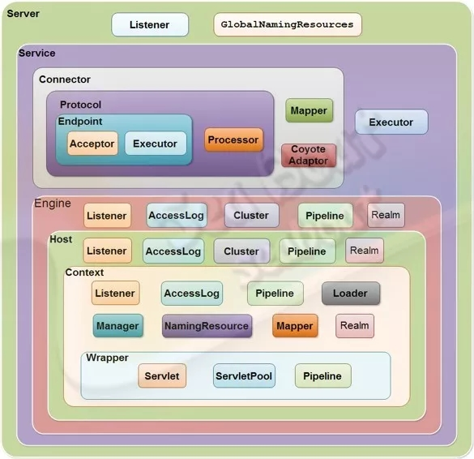

@[TOC](Spring boot)

# 0 格式
## 0.0 格式要求
html代码后面一定加一行空行；
标题后面需要添加空行；
https://www.cnblogs.com/cndarren/p/14415213.html
视频地址：https://www.bilibili.com/video/BV1o34y197fz?p=13&spm_id_from=pageDriver
每个大标题之间空2行，每个小标题之间空1行

# 7 Tomcat中jsp功能的实现
# 6 Tomcat中Session功能的实现
# 5 Tomcat启动过程
# 4 Tomcat请求处理详解
# 3 Tomcat中自定义类加载器的使用与源码实现
# 2 Tomcat中关于长连接的底层原理与源码实现

# 1 idea导入tomcat9源码及运行
## 1.1 导入

~~~
官网下载源码：
    https://tomcat.apache.org/download-90.cgi
    source code distributions
        zip (pgp, sha512)。

解压后根目录添加pom.xml：内容在最后面

根目录创建catalina-home，并将根目录下conf、webapps剪切到此目录下，放在这个目录下好管理。

导入idea：
    File -> open -> Project from existing sources。

配置main class
    Edit configurations -> + -> application：
    main class： org.apache.catalina.startup.Bootstrap
    VM options：将下面"{Tomcat根目录}"替换成本地目录(用/而不是\)，注意这个根目录是conf、webapps所在的目录：
        -Dcatalina.home={Tomcat根目录}
        -Dcatalina.base={Tomcat根目录}
        -Djava.endorsed.dirs={Tomcat根目录}/endorsed
        -Djava.io.tmpdir={Tomcat根目录}/temp
        -Duser.language=en  解决控制台乱码
        -Duser.region=US

解决问题1：
    org.apache.catalina.startup.ContextConfig#configureStart
    webConfig()下面添加：
    context.addServletContainerInitializer(new JasperInitializer(),null);

启动即可。

pom.xml文件内容
    <?xml version="1.0" encoding="UTF-8"?>
    <project xmlns="http://maven.apache.org/POM/4.0.0"
         xmlns:xsi="http://www.w3.org/2001/XMLSchema-instance"
         xsi:schemaLocation="http://maven.apache.org/POM/4.0.0
         http://maven.apache.org/xsd/maven-4.0.0.xsd">

        <modelVersion>4.0.0</modelVersion>
        <groupId>org.apache.tomcat</groupId>
        <artifactId>apache-tomcat-9.0.22-src</artifactId>
        <name>apache-tomcat-9.0.22-src</name>
        <version>9.0.22</version>

        <build>
            <finalName>apache-tomcat-9.0.22-src</finalName>
            <sourceDirectory>java</sourceDirectory>
            <resources>
                <resource>
                    <directory>java</directory>
                </resource>
            </resources>
            <plugins>
                <plugin>
                    <groupId>org.apache.maven.plugins</groupId>
                    <artifactId>maven-compiler-plugin</artifactId>
                    <version>3.5.1</version>
                    <configuration>
                        <encoding>UTF-8</encoding>
                        <source>1.8</source>
                        <target>1.8</target>
                    </configuration>
                </plugin>
            </plugins>
        </build>
        <dependencies>
            <dependency>
                <groupId>org.apache.ant</groupId>
                <artifactId>ant</artifactId>
                <version>1.10.6</version>
            </dependency>
            <dependency>
                <groupId>wsdl4j</groupId>
                <artifactId>wsdl4j</artifactId>
                <version>1.6.3</version>
            </dependency>
            <dependency>
                <groupId>javax.xml</groupId>
                <artifactId>jaxrpc</artifactId>
                <version>1.1</version>
            </dependency>
            <dependency>
                <groupId>org.eclipse.jdt</groupId>
                <artifactId>ecj</artifactId>
                <version>3.18.0</version>
            </dependency>
        </dependencies>
    </project>
~~~

## 1.2 运行web项目

~~~
打包一个web项目，打成war包、war包展开都可以。
    build -> build artifacts -> 选包(需要先在project structure中配置)
放入webapps目录下。
启动tomcat即可。
~~~

# 2 Tomcat整体架构和处理请求流程解析
## 2.1 server.xml文件分析

查看server.xml文件

## 2.2 tomcat核心组件的关联

整体关系：
~~~
Server：代表tomcat容器
    Service * n：
        List<Connector>：接收请求，封装req、resp，交给Engine
        Engine：处理请求
            Pipeline：Engine接收到数据了，数据的处理流程由Pipeline确定，类似责任链模式，每个的处理节点叫Valve阀门
                List<Valve>：
            List<Host>：
                Pipeline：
                List<Context>：每个具体的web应用。
                    Pipeline：
                        List<Valve>：
                    List<Wrapper>：包含了所有某种servlet类型的所有实例
                        Pipeline：
                            List<Valve>：
                        List<Servlet>：n个相同Servlet类型的实例。
                        Servlet：可以这种Servlet类型是单例，就用这个属性。
~~~
Engine、Host、Context、Wrapper都是servlet窗口。
一个engine可包含多个host；
一个Host可包含多个context(具体应用)；
一个wrapper可包含**多个同类型**的servlet。

为什么不直接用context包含servlet？
直接用context管理servlet：相当于一个校长管理所有学生。
context<Wrapper<Servlet>>：相当于把所有学生分到各自的年级，由各自年级的老师管理，校长只用管理各年级的老师就行。
context只用管理每种Servlet对应的Wrapper，Wrapper只用管理这种Servlet中的所有实例。

## 2.3 如何确定请求由谁处理？

当请求被发送到Tomcat所在的主机时，如何确定最终哪个Web应用来处理该请求呢？
http://域名:端口/context/path

**根据协议和端口号选定Service和Engine**
~~~
Service中的Connector组件可以接收特定端口的请求，因此，当Tomcat启动时，Service组件就会监听特定的端口。
根据端口可以确定Connector，再根据Connector确定其所属的Service，找到Service下唯一的Engine。
通过在Server中配置多个Service，可以实现通过不同的端口号来访问同一台机器上部署的不同应用。
~~~

**根据域名或IP地址选定Host**
~~~
将域名或ip与Engine中所有Host的name进行匹配，就可以确定Host，如果没有匹配成功，则用Engine配置的defaultHost对应的Host处理。
~~~

**根据URI选定Context/Web应用**
~~~
在选定Host后，Tomcat根据应用的 path属性与URI的匹配程度来选择Web应用处理相应请求。
~~~

举例：以请求http://localhost:8080/app1/index.html为例，首先通过协议和端口号（http和8080）选定Service；然后通过主机名（localhost）选定Host；然后通过uri（/app1/index.html）选定Web应用。

## 2.4 如何配置多个服务

在Server中配置多个Service服务，可以实现通过不同的端口号来访问同一台机器上部署的不同Web应用。就是把上一次Service复制一份，相应的配置改一改。

## 2.5 其它组件

除核心组件外，server.xml中还可以配置很多其他组件。下面只介绍第一部分例子中出现的组件，如果要了解更多内容，可以查看https://tomcat.apache.org/tomcat-8.0-doc/config/index.html。

### 2.5.1 Listener

Listener(即监听器)定义的组件，可以在特定事件发生时执行特定的操作；被监听的事件通常是Tomcat的启动和停止。

监听器可以在Server、Engine、Host或Context中，本例中的监听器都是在Server中。实际上，本例中定义的6个监听器，都只能存在于Server组件中。监听器不允许内嵌其他组件。

监听器需要配置的最重要的属性是className，该属性规定了监听器的具体实现类，该类必须实现了org.apache.catalina.LifecycleListener接口。

下面依次介绍例子中配置的监听器：

VersionLoggerListener：当Tomcat启动时，该监听器记录Tomcat、Java和操作系统的信息。该监听器必须是配置的第一个监听器。
AprLifecycleListener：Tomcat启动时，检查APR库，如果存在则加载。APR，即Apache Portable Runtime，是Apache可移植运行库，可以实现高可扩展性、高性能，以及与本地服务器技术更好的集成。
JasperListener：在Web应用启动之前初始化Jasper，Jasper是JSP引擎，把JVM不认识的JSP文件解析成java文件，然后编译成class文件供JVM使用。
JreMemoryLeakPreventionListener：与类加载器导致的内存泄露有关。
GlobalResourcesLifecycleListener：通过该监听器，初始化< GlobalNamingResources>标签中定义的全局JNDI资源；如果没有该监听器，任何全局资源都不能使用。< GlobalNamingResources>将在后文介绍。
ThreadLocalLeakPreventionListener：当Web应用因thread-local导致的内存泄露而要停止时，该监听器会触发线程池中线程的更新。当线程执行完任务被收回线程池时，活跃线程会一个一个的更新。只有当Web应用(即Context元素)的renewThreadsWhenStoppingContext属性设置为true时，该监听器才有效。

### 2.5.2 GlobalNamingResources与Realm

Realm，可以把它理解成“域”；Realm提供了一种用户密码与web应用的映射关系，从而达到角色安全管理的作用。在本例中，Realm的配置使用name为UserDatabase的资源实现。而该资源在Server元素中使用GlobalNamingResources配置：

GlobalNamingResources元素定义了全局资源，通过配置可以看出，该配置是通过读取$TOMCAT_HOME/ conf/tomcat-users.xml实现的。

https://www.cnblogs.com/xing901022/p/4552843.html

### 2.5.3 Valve

单词Valve的意思是“阀门”，在Tomcat中代表了请求处理流水线上的一个组件；Valve可以与Tomcat的容器(Engine、Host或Context)关联。

AccessLogValve的作用是通过日志记录其所在的容器中处理的所有请求，在本例中，Valve放在Host下，便可以记录该Host处理的所有请求。AccessLogValve记录的日志就是访问日志，每天的请求会写到一个日志文件里。AccessLogValve可以与Engine、Host或Context关联；在本例中，只有一个Engine，Engine下只有一个Host，Host下只有一个Context，因此AccessLogValve放在三个容器下的作用其实是类似的。

属性如下：
~~~
className：规定了Valve的类型，是最重要的属性；本例中，通过该属性规定了这是一个AccessLogValve。
directory：指定日志存储的位置，本例中，日志存储在$TOMCAT_HOME/logs目录下。
prefix：指定了日志文件的前缀。
suffix：指定了日志文件的后缀。通过directory、prefix和suffix的配置，在$TOMCAT_HOME/logs目录下，可以看到如下所示的日志文件。
pattern：指定记录日志的格式，本例中各项的含义如下：
    %h：远程主机名或IP地址；如果有nginx等反向代理服务器进行请求分发，该主机名/IP地址代表的是nginx，否则代表的是客户端。后面远程的含义与之类似，不再解释。
    %l：远程逻辑用户名，一律是”-”，可以忽略。
    %u：授权的远程用户名，如果没有，则是”-”。
    %t：访问的时间。
    %r：请求的第一行，即请求方法(get/post等)、uri、及协议。
    %s：响应状态，200,404等等。
    %b：响应的数据量，不包括请求头，如果为0，则是”-”。
    %D，含义是请求处理的时间(单位是毫秒)，对于统计分析请求的处理速度帮助很大。
~~~

开发人员可以充分利用访问日志，来分析问题、优化应用。例如，分析访问日志中各个接口被访问的比例，不仅可以为需求和运营人员提供数据支持，还可以使自己的优化有的放矢；分析访问日志中各个请求的响应状态码，可以知道服务器请求的成功率，并找出有问题的请求；分析访问日志中各个请求的响应时间，可以找出慢请求，并根据需要进行响应时间的优化。

