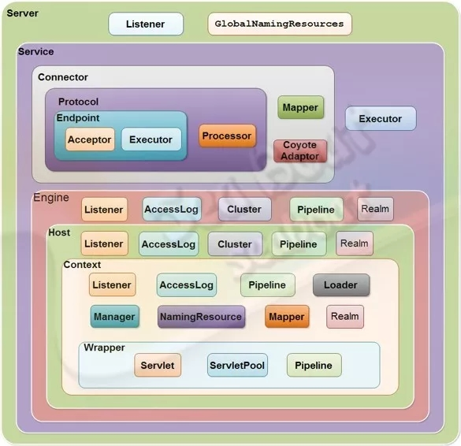
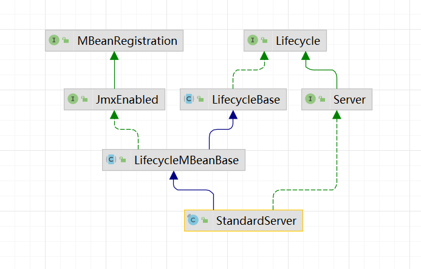
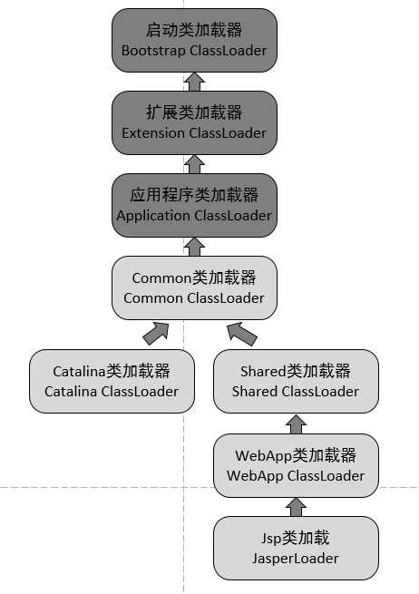

@[TOC](Spring boot)

# 0 格式
## 0.0 格式要求
html代码后面一定加一行空行；
标题后面需要添加空行；
https://www.cnblogs.com/cndarren/p/14415213.html
视频地址：https://www.bilibili.com/video/BV1o34y197fz?p=13&spm_id_from=pageDriver
每个大标题之间空2行，每个小标题之间空1行

# 1 idea导入tomcat9源码及运行
## 1.1 导入

~~~
官网下载源码：
    https://tomcat.apache.org/download-90.cgi
    source code distributions
        zip (pgp, sha512)。

解压后根目录添加pom.xml：内容在最后面

根目录创建catalina-home，并将根目录下conf、webapps剪切到此目录下，放在这个目录下好管理。

导入idea：
    File -> Project Structure -> Modules -> + -> Import module ... -> Import module from external model -> maven。

配置main class
    Edit configurations -> + -> application：
    main class： org.apache.catalina.startup.Bootstrap
    VM options：将下面"{Tomcat根目录}"替换成本地目录(用/而不是\)，注意这个根目录是conf、webapps所在的目录：
        -Dcatalina.home={Tomcat根目录}
        -Dcatalina.base={Tomcat根目录}
        -Djava.endorsed.dirs={Tomcat根目录}/endorsed
        -Djava.io.tmpdir={Tomcat根目录}/temp
        -Duser.language=en  解决控制台乱码
        -Duser.region=US

启动即可。

解决问题1：
    org.apache.catalina.startup.ContextConfig#configureStart
    webConfig()下面添加：
    context.addServletContainerInitializer(new JasperInitializer(),null);
解决问题2：启动时找不到主类
    tomcat源码、${CATALINA_HOME}、${CATALINA_BASE}及其它所有目录都不要有除了英文、数字之外的字符。

pom.xml文件内容
    <?xml version="1.0" encoding="UTF-8"?>
    <project xmlns="http://maven.apache.org/POM/4.0.0"
         xmlns:xsi="http://www.w3.org/2001/XMLSchema-instance"
         xsi:schemaLocation="http://maven.apache.org/POM/4.0.0
         http://maven.apache.org/xsd/maven-4.0.0.xsd">

        <modelVersion>4.0.0</modelVersion>
        <groupId>org.apache.tomcat</groupId>
        <artifactId>apache-tomcat-9.0.22-src</artifactId>
        <name>apache-tomcat-9.0.22-src</name>
        <version>9.0.22</version>

        <build>
            <finalName>apache-tomcat-9.0.22-src</finalName>
            <sourceDirectory>java</sourceDirectory>
            <resources>
                <resource>
                    <directory>java</directory>
                </resource>
            </resources>
            <plugins>
                <plugin>
                    <groupId>org.apache.maven.plugins</groupId>
                    <artifactId>maven-compiler-plugin</artifactId>
                    <version>3.5.1</version>
                    <configuration>
                        <encoding>UTF-8</encoding>
                        <source>1.8</source>
                        <target>1.8</target>
                    </configuration>
                </plugin>
            </plugins>
        </build>
        <dependencies>
            <dependency>
                <groupId>org.apache.ant</groupId>
                <artifactId>ant</artifactId>
                <version>1.10.6</version>
            </dependency>
            <dependency>
                <groupId>wsdl4j</groupId>
                <artifactId>wsdl4j</artifactId>
                <version>1.6.3</version>
            </dependency>
            <dependency>
                <groupId>javax.xml</groupId>
                <artifactId>jaxrpc</artifactId>
                <version>1.1</version>
            </dependency>
            <dependency>
                <groupId>org.eclipse.jdt</groupId>
                <artifactId>ecj</artifactId>
                <version>3.18.0</version>
            </dependency>
        </dependencies>
    </project>
~~~

## 1.2 运行web项目

~~~
打包一个web项目，打成war包、war包展开都可以。
    build -> build artifacts -> 选包(需要先在project structure中配置)
放入webapps目录下。
启动tomcat即可。
~~~

## 1.3 脚本启动分析

startup.bat文件实际上就做了一件事情: 启动catalina.bat。
catalina.bat：以后看TODO。

# 2 Tomcat目录及启动参数介绍
## 2.1 Tomcat目录介绍

- /bin：用于Tomcat 的启动，关闭。*.sh 用于linux，*.bat用于windows系统。
- /conf：用于Tomcat的配置，其中 server.xml是最重要的，它用于配置容器的文件，如配置项目项目的端口号80等。
- /logs ：是Tomcat默认的日志文件，可以通过它查看Tomcat的系统情况，非常有用。
- /webapps：是你的web应用放到位置。
- /work：tomcat启动web应用时，会将jsp(本质需要转成servlet.java文件)等文件，编译为java文件，就是在此目录下存入。

## 2.2 启动参数介绍
### 2.2.1

**CATALINA_HOME**：是Tomcat的安装目录，在windows的环境变量中一般会配置CATALINA_HOME。其他目录主要包括了Tomcat的二进制文件和脚本，CATALINA_HOME就指向这些目录。
**CATALINA_BASE**：是Tomcat的工作目录。Tomcat每个运行实例需要使用自己的conf、logs、temp、webapps、work和shared目录，因此CATALINA_BASE就指向这些目录。
默认CATALINA_BASE和CATALINA_HOME指向相同的目录。

# 3 Tomcat架构设计

架构属于设计层次，源码是对设计的实现，tomcat属于套娃式设计。

## 3.1 tomcat的功能(即需求)

有2个重要的功能：
- Http服务器功能：Socket通信(TCP/IP)、解析Http报文；
- Servlet容器功能：有很多Servlet(tomcat自带 + 自定义servlet)，servlet处理具体业务逻辑。

## 3.2 tomcat架构是怎样的(架构是为了完成功能需求做的设计)

除了Connector和Container组件，tomcat还定义了很多其它组件来工作(Server-Service-Connector/Container-Engine-Host-Context-Wrapper)。这些组件采用一层套一层的设计方式(套娃式)，其中自Engine及以下的包含Servlet的组件的都称为容器，即Servlet容器。
**主要组件如下：**
**Server**
- 表示服务器，它提供了一种优雅的方式来启动和停止整个系统，不必单独启停连接器和容器；它是Tomcat构成的顶级构成元素，所有一切均包含在Server中；

**Service**
- 表示服务，Server可以运行多个服务。比如一个Tomcat里面可运行订单服务、支付服务、用户服务等等；Server的实现类StandardServer可以包含一个到多个Services。
- 一个Service会包含n个Connector和一个Engine，表示多个端口的连接最终都会交给此Container(实际是Engine)处理。

**Connector**
- 表示连接器, 它将Service和Container连接起来，首先它需要注册到一个Service，它的作用就是把来自客户端的请求转发到Container(容器)，这就是它为什么称作连接器, 它支持的协议如下：
  - 支持AJP协议
  - 支持Http协议
  - 支持Https协议
- ProtocolHandler：协议处理器，包含2部分
  - EndPoint：此组件进行Socket通信，处理TCP/IP协议，有以下几种处理模型：
    - BIO
    - NIO
    - NIO2
    - APR
  - Processor：此组件解析处理Http报文，处理Http协议，组装成req、resp
- adapter：将协议处理器组装的req、resp对象进行封装，变成ServletRequest、ServletResponse，交给Servlet容器处理。

**Container**
- 表示容器，可以看做Servlet容器；引擎(Engine)、主机(Host)、上下文(Context)和Wraper均继承自Container接口，所以它们都是容器。
    - Engine：引擎
        - Host：主机
            - Context：上下文
                - Wrapper：包装器
                    - Servlet：从Engine都包含了Servlet，所以他们叫容器。

**Engine**
- 是Catalina的核心，支持在其下定义多个虚拟主机(Host)。

**Host**
- 允许Engine在一台机器上配置多个域名，如：www.baidu.com、www.bat.com。

**Context**
- 每个Host支持多个webapp部署在它下边，这个Context就是我们在开发web应用时的上下文对象，上下文是使用由Servlet规范中指定的web应用程序格式来表示，不论是war包、还是目录形式。

**Wrapper**
- 在Context中可以部署多个Servlet，且**类型相同**的Servlet会放到一个包装组件中(Wrapper)，方便管理。

**Service内部还有各种支撑组件，下面简单罗列一下这些组件**
- Manager：管理器，用于管理会话Session
- Logger：日志器，用于管理日志
- Loader：加载器，和类加载有关，只会开放给Context所使用
- Pipeline：管道组件，配合Valve实现过滤器功能
- Valve：阀门组件，配合Pipeline实现过滤器功能
- Realm：认证授权组件

## 3.3 tomcat套娃式组件的好处

好处：
- 组件关系清晰，也便于后期生命周期管理；
- 架构设计正好与server.xml中标签对应上，后续在解析xml时封装对象容易对应；
- 便于子组件继承父组件的一些配置。

# 4 组件生命周期管理:LifeCycle

Catalina初始化了Server（它调用了 Server 类的 init 和 start 方法来启动 Tomcat）；你会发现Server是Tomcat的配置文件server.xml的顶层元素，那这个阶段其实我们已经进入到Tomcat内部组件的详解；这时候有一个问题，这么多组件是如何管理它的生命周期的呢？

**为什么要使用生命周期？**
- 因为便于管理，当server.xml解析完成后，再进行开始工作，要是不分开的话，都写一起会很乱、很麻烦。
- 而且有一些工作必须在另一些工作完成后，才能进行，所以需要使用生命周期。
- 接口方法规定了有init()、start()、stop()、destroy()方法，这样我们在每个方法内部写对应的工作就可以。

**为什么要使用状态**
- 用生产手机的流水线做个比喻，比如有6道程序，分别用程序p1到pb表示。
- p5想要做成成品手机，需要进行以下操作：
    - 检查p1 - p4所有的组件是否安装完成，前面如果不完成后面工作可能会出错；
    - 进行p5工序
- 但是检查p1 - p4的工作量巨大，如果有一百道工序不是更麻烦？
    - 所以领导说，每一个工序接收到的手机，不用检查前面是否做好，只需要检查状态是不是前一个工序的已完成状态(就)，那现在就需要给每个工序分状态了：
        - pna：表示开始本工序前；
        - pnb：表示正在进行本工序；
        - pnc：表示本工序已结束。
- 所以现在p5需要进行的操作是：
    - 查看手机状态是否是p4c，
        - 不是，查看手机状态为pn，就交给n，结束；
        - 是，将状态转为p5a，表示进行准备工作，如准备零件等;
    - 进行本工序，将状态置为p5b，表示正在将零件装到手机上；
    - 本工序完成后，将状态转为p5c，并交给下一个工序

**理解Lifecycle主要有两点：第一是三类接口方法；第二是状态机。主要运用的模板方法**
- 接口方法：
    - 比如所有的手机都有6道工序，那么对于不同的手机，其每道工序的操作是不同的，所以就使用模板方式，规定了工序的流程(即接口A调用顺序)，在进行具体的手机装配时，调用具体的操作(即实现)。
- 状态机：
    - 在每道工序中，都有a、b、c三种状态，那是否可以用一个抽象类absA实现接口A，再实现其中所有的接口方法，在此方法内部实现状态a、状态c的转换，并在a、c中间调用抽象方法b。
    - 再由具体的实现类extends absA，实现抽象方法，在实现方法内，进行状态的转换。

**下面其实就是tomcat对组件生命周期的做法：**
~~~
main() {
    A a = new AImpl();
    a.p1();
    a.p2();
    a.p3();
}

interface A {
    p1();
    p2();
    p3();
}

abstract AbsA implement A {
    protected String state;
    p1() {
        this.state = "p1a";
        setp1B();
        this.state = "p1c";
    }

    p2() {...}

    p3() {...}

    abstract setp1B();
}

AImpl extends AbsA {
    void setp1B()() {
        super.state = "p1b";
    }
    // 其它类似
}

~~~

## 4.1 组件、生命周期图

Server及其它组件

Server后续组件生命周期及初始化

Server的依赖结构

生命周期涉及的子类有：Container、Executor、Service、Server、Host、Context、Wrapper等。

## 4.2 LifecycleState状态

LifeCycle状态机有哪些状态？
Tomcat 给各个组件定义了一些生命周期中的状态。
查看org.apache.catalina.Lifecycle可以查看转换流程。具体如下

**在枚举类org.apache.catalina.LifecycleState里查看各种状态**
~~~
public enum LifecycleState {
    NEW(false, null), // 刚new好的组件

    INITIALIZING(false, Lifecycle.BEFORE_INIT_EVENT), // 初始化中
    INITIALIZED(false, Lifecycle.AFTER_INIT_EVENT), // 已完成初始化

    STARTING_PREP(false, Lifecycle.BEFORE_START_EVENT), // 启动前
    STARTING(true, Lifecycle.START_EVENT), // 启动中
    STARTED(true, Lifecycle.AFTER_START_EVENT), // 已启动

    STOPPING_PREP(true, Lifecycle.BEFORE_STOP_EVENT), // 关闭前
    STOPPING(false, Lifecycle.STOP_EVENT), // 关闭中
    STOPPED(false, Lifecycle.AFTER_STOP_EVENT), // 已关闭

    DESTROYING(false, Lifecycle.BEFORE_DESTROY_EVENT), // 销毁中
    DESTROYED(false, Lifecycle.AFTER_DESTROY_EVENT), // 已销毁

    FAILED(false, null); // 失败

    private final boolean available;
    private final String lifecycleEvent;

    private LifecycleState(boolean available, String lifecycleEvent) {
        this.available = available;
        this.lifecycleEvent = lifecycleEvent;
    }
    ……
}
~~~

## 4.3 LifeCycle接口

LifeCycle接口其实就是上面举的例子中的接口A，声明了哪些方法，类似于工序。

一个标准的LifeCycle有哪些方法？三类方法如下
~~~
public interface Lifecycle {
    /** 第1类：针对监听器 **/
    // 添加监听器
    public void addLifecycleListener(LifecycleListener listener);
    // 获取所以监听器
    public LifecycleListener[] findLifecycleListeners();
    // 移除某个监听器
    public void removeLifecycleListener(LifecycleListener listener);

    /** 第2类：针对控制流程 **/
    // 初始化方法
    public void init() throws LifecycleException;
    // 启动方法
    public void start() throws LifecycleException;
    // 停止方法，和start对应
    public void stop() throws LifecycleException;
    // 销毁方法，和init对应
    public void destroy() throws LifecycleException;

    /** 第3类：针对状态 **/
    // 获取生命周期状态
    public LifecycleState getState();
    // 获取字符串类型的生命周期状态
    public String getStateName();
}
~~~

## 4.4 LifecycleBase - LifeCycle的基本实现

**LifecycleBase是Lifecycle的基本实现，为什么要有个基本实现？直接用一个实现类实现此接口不行吗？**

还是以上面手机加工p5进行举例，现在每个人加工手机需要进行3步操作：
- 查看手机状态是否p4c，并修改为p5a；
- 进行本工序操作；
- 修改状态p5c。

**添加功能1**，现在某个领导要加一个功能，**必须**记录每个工序每天接收多少个手机，转出多少个手机，则需要进行如下操作：
- 查看是否为p4c，是修改状态为p5a，且发送通知"接收数量1"到领导处；
- 进行本工序操作；
- 修改状态p5c，且发送通知"转出数量1"到领导处。

那如果直接实现接口，但是忘写了发送通知的功能，就不能记录每天的接收和转出数量，所以为了有这个功能，添加了此抽象类AbsA。具体的实现类，不要直接实现接口，而需要实现这个抽象类，抽象类的会进行消息的发送，工人只用操心此工序的内容是什么了。

**添加功能2**，那现在如果**多个领导**都想知道，每天每个人的工作量是多少怎么办(观察者模式)？
- 在抽象类维护一个List集合，哪个领导想知道数据量，在里面注册下；
- 发出通知的时候遍历集合，给每一个领导发送消息。

**此抽象类有2个主要作用：**
- 根据当前状态，来决定调用不同的方法，或修改不同的状态，即具体实现类，这部分是公共的，所以可以抽象出来如：
    - 当进入init()方法时，发现状态不是new，那就修改状态为Failed；
    - 当进入start()方法时，发现此时状态是刚new好，还没有初始化，那么就可以在start()方法中调用init()，之后再进行start()；
    - 即具体实现类只用设置好状态为进行中，做好具体的工作就行，此抽象类会将其它工作做好。
- 每当设置组件的生命状态时，需要给所有的监听器发送消息，比如组件正在启动、组件已启动、组件已销毁等。当然子实现类也可调用通知观察者的方法。

### 4.4.1 监听器相关

对监听器的增、删、查询所有都是操作一个**List\<LifecycleListener\>**成员变量实现的，是CopyOnWriteArrayList(具体查看juc)类型，保证插入的时候线程安全。

**setStateInternal()**
使用了观察都模式，在设置完状态后，调用listeners.lifecycleEvent(event)，通知前面所有注册的listener，listern会查event的事件是不是需要自己处理的，是的话处理，不是就不处理。

### 4.4.2 生命周期相关

**init()**
查看源代码可知，只有在**LifecycleState.NEW**状态下，才能进行init()。
此处使用了模板模式，在LifecycleBase的方法中，处理组件的状态变更、状态变更顺序及调用初始化方法，但具体的初始化逻辑由子类完成。
~~~
init() {
    // 初始化逻辑之前，先将状态变更为`INITIALIZING`
    setStateInternal(LifecycleState.INITIALIZING, null, false);
    // 初始化，该方法为一个abstract方法，需要组件自行实现
    initInternal();
    // 初始化完成之后，状态变更为`INITIALIZED`
    setStateInternal(LifecycleState.INITIALIZED, null, false);
}
~~~

为了状态的可见性，所以state声明为volatile类型的。

**start()、stop()、destory()**
这3个的逻辑与init()一致，就是处理的**LifecycleState状态**不同。

从上述源码看得出来，LifecycleBase是使用了状态机+模板模式来实现的。模板方法有下面这几个：
~~~
// 初始化方法
protected abstract void initInternal() throws LifecycleException;
// 启动方法
protected abstract void startInternal() throws LifecycleException;
// 停止方法
protected abstract void stopInternal() throws LifecycleException;
// 销毁方法
protected abstract void destroyInternal() throws LifecycleException;
~~~

## 4.5 LifecycleMBeanBase - LifecycleBase的抽象子类

此处使用了JMX技术(具体查看java基础)。

还以手机举例，现在本公司的人可以随意获取手机数量等当前信息，但是总公司是没办法获取的，需要本公司通过JMX技术将一些MBean注册到MBeanServer上，总公司通过JMX技术去查询当前数据量。

**那现在有1个难点**：
- 如何保证保存当前手机数量信息的类被注册到MBeanServer上(具体到tomcat就是如何将Server、Service等组件实例注册到MBeanServer上)。
- 但是你不能保证每个程序员每次都会记得在new 完这个类后，将它的实例注册到MBeanServer上。
- 那就在init()的过程中把这个实例注册上。

**解决方案**：
- 在调用init()方法的时候，直接将当前对象注册到MBeanServer上。
- 那如何让每个程序员都记着在生成Server等组件的时候，把这个MBean注册到MBeanServer上呢？
    - tomcat是这样实现的，再写一个抽象类AbsAbsA extends AbsA；
        - AbsA中init()方法中调用了init1()抽象方法；
        - init1()方法是让子实现类写实际操作的方法，即本工序真正要干的活；
        - 再写一个抽象类AbsAbsA中实现了此方法，init1()中将此组件注册到了MBeanServer，
~~~
abstract class AbsA {
    p1() {
        this.state = "p1a";
        setp1B();
        this.state = "p1c";
    }

    abstract void setp1B();
}

abstract class AbsAbsA extends AbsA{
    setp1B() {
        // 就在第一道工序就把这个this注册上，这样就不会忘注册了
        server.registerMBean(this, objectName);
    }
}

class AImpl {
    setp1B() {
        // 先调用父类AbsAbsA.setp1B()，就样就能注册上了
        // 虽然也可能忘记，但最起码忘记的概率小一点
        super().setp1B();
        // 后面再写自己的实际操作方法。
    }
}
~~~

## 4.6 JmxEnabled - LifecycleMBeanBase的接口

接口，主要是让组件实现获取objectName的域、和type值。
域名首先通过server.xml的service标签的name获取，没有则从Engine.name获取。
type：不同的组件有不同的实现，如type=Server、type=Service等。

## 4.7 MBeanRegistration - JmxEnabled的接口

有4个方法，在注册前、后干什么，在销毁注册前后干什么，按理说应该在注册或销毁的前后调用，但是在LifecycleMBeanBase.initInternal()方法发现此方法被注释掉了，可能觉得这4个方法没用了吧。
而且这4个在LifecycleMBeanBase实现中除了preRegister()都是空实现，且在LifecycleMBeanBase.initInternal()中调用preRegister()时，还被注释掉了。

## 4.8 生命周期实际代码解析

以StandardServer举例：
~~~
interface Lifecycle {
    void init();
    void start();
    void stop();
    void destory();
}

abstract class LifecycleBase {

    // 4个流程方法每个都配备了一个对应的Internal()方法，方便具体子类实现
    abstract void initInternal();
    abstract void startInternal();

    // 以init()、start()举例
    void init() {
        // 每一步都在本方法内，设置状态，并发送通知
        setStateInternal(LifecycleState.INITIALIZING, null, false)
        initInternal();
        setStateInternal(LifecycleState.INITIALIZED, null, false)
    }

    void start() {
        // 查看如果是NEW状态，则调用init()方法，所以有的类虽然只没有显式调用init()，但实际会在此方法中调用init()
        if(new)
            init();

        // 依次修改状态，发送通知，并在中间进行start()操作。
        setStateInternal(LifecycleState.STARTING_PREP, null, false);
        startInternal();
        setStateInternal(LifecycleState.STARTED, null, false);
    }
}

class StandardEngine extends LifecycleBase {
    // 重写
    void initInternal() {
        // 调用super.initInternal
        super.initInternal();
        // 实现自己的逻辑并
    }
}
~~~

# 5 Tomcat启动分析

源码入口：org.apache.catalina.startup.Bootstrap.main(String[]) 方法。
主要进行了3个操作，下面的代码的流程都符合Lifecycle，所以只展示，每个功能做的重要的事，不显示在哪个方法中被调用的。
具体查看1-tomcat启动流程.puml

主要注意以下几点：
- Host、Context的start()工作主要不是StandardHost、StandardContext来做，而是由在Catalina.load()阶段的parseServerXml()解析server.xml过程中为这2个实例添加的HostConfig、ContextConfig来做的。
- mapperListener.start()：主要工作是把host、context、servlet对应的名与实例对应起来；
- connector.start()：2个作用
  - 启动Acceptor线程：用Socket接收外界消息；
  - 启动poller线程，去监听channel，看哪个有channel有消息，就处理哪个。

# 6 Servlet请求处理链路

tomcat启动后，在有请求访问Servlet时，tomcat的处理流程是什么样的？
- Endpoint.Poller线程查看有无数据的channel；
-

# 7 Mapper组件

主要是在StandardService.startInternal()的mapperListener.start()中添加所有name。
即依次遍历所有的子容器，将其name与对应实例，设置进去。

# 9 理解Tomcat架构
## 9.2 从一个完整请求的角度来看

假设来自客户的请求为：http://localhost:8080/test/index.jsp 请求被发送到本机端口8080，被在那里侦听的Coyote HTTP/1.1 Connector,然后：
- Connector把该请求交给它所在的Service的Engine来处理，并等待Engine的回应 Engine获得请求
- localhost:8080/test/index.jsp，匹配它所有虚拟主机Host
- Engine匹配到名为localhost的Host(即使匹配不到也把请求交给该Host处理，因为该Host被定义为该Engine的默认主机)
- localhost Host获得请求/test/index.jsp，匹配它所拥有的所有Context
- Host匹配到路径为/test的Context(如果匹配不到就把该请求交给路径名为""的Context去处理)
- path="/test"的Context获得请求/index.jsp，在它的mapping table中寻找对应的servlet
- Context匹配到URL PATTERN为*.jsp的servlet，对应于JspServlet类，构造HttpServletRequest对象和HttpServletResponse对象，作为参数调用JspServlet的doGet或doPost方法
- Context把执行完了之后的HttpServletResponse对象返回给Host
- Host把HttpServletResponse对象返回给Engine
- Engine把HttpServletResponse对象返回给Connector
- Connector把HttpServletResponse对象返回给客户browser

## 9.5 如何确定请求由谁处理？

当请求被发送到Tomcat所在的主机时，如何确定最终哪个Web应用来处理该请求呢？
http://域名:端口/context/path

**根据协议和端口号选定Service和Engine**
~~~
Service中的Connector组件可以接收特定端口的请求，因此，当Tomcat启动时，Service组件就会监听特定的端口。
根据端口可以确定Connector，再根据Connector确定其所属的Service，找到Service下唯一的Engine。
通过在Server中配置多个Service，可以实现通过不同的端口号来访问同一台机器上部署的不同应用。
~~~

**根据域名或IP地址选定Host**
~~~
将域名或ip与Engine中所有Host的name进行匹配，就可以确定Host，如果没有匹配成功，则用Engine配置的defaultHost对应的Host处理。
~~~

**根据URI选定Context/Web应用**
~~~
在选定Host后，Tomcat根据应用的 path属性与URI的匹配程度来选择Web应用处理相应请求。
~~~

举例：以请求http://localhost:8080/app1/index.html为例，首先通过协议和端口号（http和8080）选定Service；然后通过主机名（localhost）选定Host；然后通过uri（/app1/index.html）选定Web应用。

## 9.6 如何配置多个服务

在Server中配置多个Service服务，可以实现通过不同的端口号来访问同一台机器上部署的不同Web应用。就是把上一次Service复制一份，相应的配置改一改。

## 9.7 其它组件

除核心组件外，server.xml中还可以配置很多其他组件。下面只介绍第一部分例子中出现的组件，如果要了解更多内容，可以查看https://tomcat.apache.org/tomcat-8.0-doc/config/index.html。

### 9.7.1 Listener

Listener(即监听器)定义的组件，可以在特定事件发生时执行特定的操作；被监听的事件通常是Tomcat的启动和停止。

监听器可以在Server、Engine、Host或Context中，本例中的监听器都是在Server中。实际上，本例中定义的6个监听器，都只能存在于Server组件中。监听器不允许内嵌其他组件。

监听器需要配置的最重要的属性是className，该属性规定了监听器的具体实现类，该类必须实现了org.apache.catalina.LifecycleListener接口。

**下面依次介绍例子中配置的监听器：**
- VersionLoggerListener：当Tomcat启动时，该监听器记录Tomcat、Java和操作系统的信息。该监听器必须是配置的第一个监听器。
- AprLifecycleListener：Tomcat启动时，检查APR库，如果存在则加载。APR，即Apache Portable Runtime，是Apache可移植运行库，可以实现高可扩展性、高性能，以及与本地服务器技术更好的集成。
- JasperListener：在Web应用启动之前初始化Jasper，Jasper是JSP引擎，把JVM不认识的JSP文件解析成java文件，然后编译成class文件供JVM使用。
- JreMemoryLeakPreventionListener：与类加载器导致的内存泄露有关。
- GlobalResourcesLifecycleListener：通过该监听器，初始化< GlobalNamingResources>标签中定义的全局JNDI资源；如果没有该监听器，任何全局资源都不能使用。< GlobalNamingResources>将在后文介绍。
- ThreadLocalLeakPreventionListener：当Web应用因thread-local导致的内存泄露而要停止时，该监听器会触发线程池中线程的更新。当线程执行完任务被收回线程池时，活跃线程会一个一个的更新。只有当Web应用(即Context元素)的renewThreadsWhenStoppingContext属性设置为true时，该监听器才有效。

### 9.7.2 GlobalNamingResources与Realm

Realm，可以把它理解成“域”；Realm提供了一种用户密码与web应用的映射关系，从而达到角色安全管理的作用。在本例中，Realm的配置使用name为UserDatabase的资源实现。而该资源在Server元素中使用GlobalNamingResources配置：

GlobalNamingResources元素定义了全局资源，通过配置可以看出，该配置是通过读取$TOMCAT_HOME/ conf/tomcat-users.xml实现的。

https://www.cnblogs.com/xing901022/p/4552843.html

### 9.7.3 Valve

单词Valve的意思是“阀门”，在Tomcat中代表了请求处理流水线上的一个组件；Valve可以与Tomcat的容器(Engine、Host或Context)关联。

AccessLogValve的作用是通过日志记录其所在的容器中处理的所有请求，在本例中，Valve放在Host下，便可以记录该Host处理的所有请求。AccessLogValve记录的日志就是访问日志，每天的请求会写到一个日志文件里。AccessLogValve可以与Engine、Host或Context关联；在本例中，只有一个Engine，Engine下只有一个Host，Host下只有一个Context，因此AccessLogValve放在三个容器下的作用其实是类似的。

**属性如下：**
- className：规定了Valve的类型，是最重要的属性；本例中，通过该属性规定了这是一个AccessLogValve。
- directory：指定日志存储的位置，本例中，日志存储在$TOMCAT_HOME/logs目录下。
- prefix：指定了日志文件的前缀。
- suffix：指定了日志文件的后缀。通过directory、prefix和suffix的配置，在$TOMCAT_HOME/logs目录下，可以看到如下所示的日志文件。
- pattern：指定记录日志的格式，本例中各项的含义如下：
  - %h：远程主机名或IP地址；如果有nginx等反向代理服务器进行请求分发，该主机名/IP地址代表的是nginx，否则代表的是客户端。后面远程的含义与之类似，不再解释。
  - %l：远程逻辑用户名，一律是”-”，可以忽略。
  - %u：授权的远程用户名，如果没有，则是”-”。
  - %t：访问的时间。
  - %r：请求的第一行，即请求方法(get/post等)、uri、及协议。
  - %s：响应状态，200,404等等。
  - %b：响应的数据量，不包括请求头，如果为0，则是”-”。
  - %D，含义是请求处理的时间(单位是毫秒)，对于统计分析请求的处理速度帮助很大。

开发人员可以充分利用访问日志，来分析问题、优化应用。例如，分析访问日志中各个接口被访问的比例，不仅可以为需求和运营人员提供数据支持，还可以使自己的优化有的放矢；分析访问日志中各个请求的响应状态码，可以知道服务器请求的成功率，并找出有问题的请求；分析访问日志中各个请求的响应时间，可以找出慢请求，并根据需要进行响应时间的优化。

# 5 启动过程：初始化和启动流程
## 5.1 总体流程

## 5.2 程序主入口

org.apache.catalina.startup.Bootstrap.main(String[] args)。
主要做了以下工作：
~~~
main(String[] args) {
    Bootstrap bootstrap = new Bootstrap();
    bootstrap.init() {
        // 初始化 CommonClassLoader、CatalinaClassLoader、SharedClassLoader，并且3个是同一个；
        initClassLoaders();

        // 设置线程的classLoader为catalinaLoader，即后面加载用tomcat自己的类加载器
        Thread.currentThread().setContextClassLoader(catalinaLoader);

        // 实例化：org.apache.catalina.startup.Catalina
        catalinaDaemon = startupInstance(通过反射生成);
    }

    bootstrap.load(args);
    bootstrap.start();
}
~~~

# 6 启动过程:类加载机制详解
## 6.1 双亲委派模型问题是如何解决的？

**双亲委派模型问题**
A类在使用到另一个未被加载的B类时，首先会使用A类的classLoader加载B类，进行双亲委派加载。如果由核心类A加载其它自定义类B，按理应该由BootstrapClassLoader加载B，但是B无法加载自定义的类，导致类B无法加载。
在Java核心类里面有SPI（Service Provider Interface），它由Sun编写规范，第三方来负责实现。SPI需要用到第三方实现类。如果使用双亲委派模型，那么第三方实现类也需要放在Java核心类里面才可以，不然的话第三方实现类将不能被加载使用。

**解决方法**
核心类获取当前线程，直接调用getContextClassLoader()获取AppClassLoder，或调用setContextClassLoader()设置自定义类加载器MyClassLoader，再调用其getContextClassLoader()，获取MyClassLoader，用MyClassLoader或AppClassLoder加载自定义的类。

## 6.2 为什么Tomcat的类加载器也不是双亲委派模型

原因在于一个Tomcat容器允许同时运行多个Web程序，每个Web程序依赖的类又必须是相互隔离的。因此，如果Tomcat使用双亲委派模式来加载类的话，将导致Web程序依赖的类变为共享的。
例Tomcat中部署了2个web应用，且都有User类，但类结构不一样，当tomcat加载了A.User类时，B使用User时，就不会使用B自己的User，而是A.User，就会出错致命错误。

## 6.3 Tomcat类加载机制是怎么样的呢

tomcat9之前的类加载器

tomcat9的类加载器

我们在这张图中看到很多类加载器，除了Jdk自带的类加载器，我们尤其关心Tomcat自身持有的类加载器。仔细一点我们很容易发现：Catalina类加载器、Shared类加载器，他们并不是父子关系，而是兄弟关系。
**tomcat类加载器的作用**
- Common类加载器，负责加载Tomcat和Web应用都复用的类
- Catalina类加载器，负责加载Tomcat专用的类，而这些被加载的类在Web应用中将不可见
- Shared类加载器，负责加载Tomcat下所有的Web应用程序都复用的类，而这些被加载的类在Tomcat中将不可见
- WebApp类加载器，负责加载具体的某个Web应用程序所使用到的类，而这些被加载的类在Tomcat和其他的Web应用程序都将不可见
- Jsp类加载器，每个jsp页面一个类加载器，不同的jsp页面有不同的类加载器，方便实现jsp页面的热插拔

~~~
org/apache/catalina/startup/Bootstrap
public void init() throws Exception {
    ...
    // tomcat在此设置了其根加载器，后面tomcat加载的所有类最多到此加载器，此加载器也是commonClsLoader、SharedClsLoader。
    Thread.currentThread().setContextClassLoader(catalinaLoader);
    ...
}
~~~

**类加载器被创建位置：**
- CommonClassLoader、CatalinaClassLoader、SharedClassLoader：BootStrap.init(){initClassLoaders();}
- WebAppClassLoader：是每个Context的类加载器，所以在Context的标准实现StandardContext中被创建的
~~~
StandardContext.startInternal(){
    ...
    if (getLoader() == null) {
        WebappLoader webappLoader = new WebappLoader();
        webappLoader.setDelegate(getDelegate());
        setLoader(webappLoader);
    }
    ...
}
~~~

# 7 启动过程:Catalina的加载
## 7.1 Catalina的实例化、启动和关闭

我们最终的目的是启动Server，Bootstrap引导Catalina的创建和销毁，Catalina对Server进行了解析、创建、销毁。

先看下Bootstrap.main()方法的流程：
~~~
new Bootstrap();
bootstrap.init(); // 创建catalina实例
daemon.load(args); // 调用catalina.load()
daemon.start(); // 调用catalina.start()
~~~

## 7.2 Catalina的实例化

就是根据全限定名，通过反射生成Catalina实例。

## 7.3 Catalina的加载

加载：是加载${CATALINA_BASE}/conf/server.xml文件；

**catalina.load()**
~~~
initNaming(); // 设置额外的系统变量
parseServerXml(); // 使用Digester解析server.xml文件，并生成对应的对象
getServer().init(); // 将解析生成的对象进行相关初始化，只会初始化到Engine和Connector，因为无法初始化server.xml中没有配置的Host及以下内容。
~~~

### 7.3.1 server.init()初始化内容

线程池初始化、使用的哪种协议初始化等。

## 7.4 Catalina的启动和关闭

启动：是调用server.xml文件中解析出来的Server对象的start()。
关闭：是调用Server、及其所有子组件的关闭方法，通过Server.stop()、server.destroy()关闭。
**catalina.load()**
~~~
start(); // 根据解析出的对象，在内部调用server.start()
await(); // 在此处阻塞线程，直到接收到SHUTDOWN命令
stop(); // 调用server.stop()、server.destroy()。
~~~

**但是什么时候调用stop方法？**
**方法一**：jvm的关闭钩子方式(查看jvm相关文档TODO)，Runtime.getRuntime().addShutdownHook(new CatalinaShutdownHook())。
- 在start()后、await()前，调用Runtime.getRuntime().addShutdownHook(new CatalinaShutdownHook())，这样在不是通过SHUTDOWN命令关闭jvm时，就会调用CatalinaShutdownHook线程中的run方法。

**方法二**：
- 调用shutdown.bat，通过socket向tomcat发送SHUTDOWN请求；
- 接收到请求后，await()不再阻塞，接着运行stop()方法，这个stop()和CatalinaShutdownHook()的run()方法代码一致；
- 再运行main()的System.exit(1)，注意，这个是jvm退出方法，也会运行Runtime.getRuntime().addShutdownHook()添加的钩子方法，这样会2次调用server.stop()，但是第一次关闭时，已经将Server置为null，第2次调用时会出现NPE。为了不出现这个，当接收到是SHUTDOWN命令时，需要先移除刚才那个钩子方法。Runtime.getRuntime().removeShutdownHook(shutdownHook);
- 查看catalina.stop()方法。

