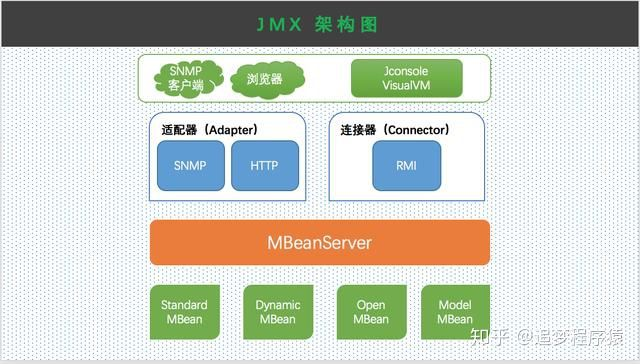

@[TOC](第1章 java基础)

# 0 文档说明

导入图片：

# 1 基础知识

# 2 jdk8新特性
## 2.1 lambda表达式

Lambda 是一个匿名函数，可以把 Lambda 表达式理解为是一段可以传递的代码（将代码像数据一样进行传递）。使用它可以写出更简洁、更灵活的代码。作为一种更紧凑的代码风格，使 Java 的语言表达能力得到了提升。
Lambda就是给抽象方法编写实现。

lambda表达式语法总结：
~~~
1、只能用于创建"函数式接口(只包含一个抽象方法的接口)"的实现的实例；
2、举例：(o1, o2) -> System.out.println("这是FunctionalInterface1.f1()方法。");
->符号：lambda 操作符 或 箭头操作符；
->左边：代表唯一抽象方法的形参列表，可以不用写类型，因为只有一个抽象方法，编译器自己能判断
    没有参数：必须写"()"；
    仅有一个参数：括号可以省略，可以写"o1"或"(o1)"；
    有多个参数："(o1, o2)"。
->右边：
    多行方法体："{ 方法体 }";
    单行方法体：
        有返回值："{}、return"必须一起存在或省略；
        无返回值：可以省略"{}"。
~~~

## 2.2 函数式接口

只包含一个抽象方法的接口，称为函数式接口。
可以通过 Lambda 表达式来创建该接口的对象。（若 Lambda 表达式抛出一个受检异常（即：非运行时异常），那么该异常需要在目标接口的抽象方法上进行声明）。
可以在一个接口上使用 @FunctionalInterface 注解，这样做可以检查它是否是一个函数式接口。同时 javadoc 也会包含一条声明，说明这个接口是一个函数式接口。
Lambda 表达式的本质：作为函数式接口的实例。
在 java.util.function 包下定义了Java 8的丰富的函数式接口。

4大核心函数式接口：
|函数式接口|参数类型|返回类型|用途|
|:--|:--|:--|:--|
|Consumer<T>消费型接口|T|void|对类型为T的对象应用操作，void accept(T t)|
|Supplier<T>供给型接口|无|T|返回类型为T的对象，T get()|
|Function<T, R>函数型接口|T|R|对类型为T的对象应用操作，并返回R类型结果，R apply(T t)|
|Predicate<T>断定型接口|T|boolean|确定类型为T的对象是否满足某约束，并返回boolean值，boolean test(T t)|

## 2.3 方法引用和构造器引用（Stream API中用到）
### 2.3.1 方法引用(Metod References)

方法引用可以看做是 Lambda 表达式深层次的表达。换句话说，方法引用就是 Lambda 表达式，也就是函数式接口的一个实例，通过方法的名字来指向一个方法。
当要传递给 Lambda 体的操作，已经实现的方法了，可以使用方法引用！

### 2.3.1.1 三种主要使用情况

要求接口中的抽象方法的形参列表和返回值类型与方法引用的方法的形参列表和返回值类型相同！（针对于情况1和情况2）
当函数式接口方法的第一个参数是需要引用方法的调用者，并且第二个参数是需要引用方法的参数(或无参数)时：ClassName::methodName（针对于情况3）

~~~
对象::实例方法名，要求如下：
    接口方法：interface I1 {T f1(R);}
    实现方法：class Cls { T f2(R){} }
    演示：I1 i1 = new Cls()::f2;

类::静态方法名，要求如下：
    接口方法：interface I1 {void f1(T, R);}
    实现方法：class Cls { static T f2(R){} }
    演示：I1 i1 = Cls::f2;

类::实例方法名，要求如下：
    接口方法：interface I1 {void f1(T, R);}
    实现方法：class T { void f2(R){} }
    演示：I1 i1 = T::f2;
    说明：I1 i1 = T::f2; 本质上是 I1 i1 = new I1() {
        void f1(T t, R r) {
            t.f2(r);
        }
    }，既然t.f2(r)可以实现相同的功能，那就没有必须再写一个方法签名相同的方法，直接I1 i1 = T::f2;，编译器在发现T没有f2静态方法时，就会将其组装为new T().f2()方法，但是在调用的时候，还是要用对象调，因为本质上还是对象.方法。
~~~

### 2.3.2 构造器引用和数组引用

使用格式：
~~~
方法引用：类名 ::new
数组引用：数组类型 [] :: new
~~~

使用要求
~~~
构造器引用：和方法引用类似，函数式接口的抽象方法的形参列表和构造器的形参列表一致。抽象方法的返回值类型即为构造器所属的类的类型。
方法引用：可以把数组看做是一个特殊的类，则写法与构造器引用一致。
~~~

## 2.4 Stream API
### 2.4.1 概述

Stream 关注的是对数据的运算，与 CPU 打交道;集合关注的是数据的存储，与内存打交道;
Java 8 提供了一套 api ，使用这套 api 可以对内存中的数据进行过滤、排序、映射、归约等操作。类似于 sql 对数据库中表的相关操作。
Stream 是数据渠道，用于操作数据源（集合、数组等）所生成的元素序列。“集合讲的是数据， Stream讲的是计算！”

注意：
~~~
Stream 自己不会存储元素。
Stream 不会改变源对象。相反，他们会返回一个持有结果的新 Stream。
Stream 操作是延迟执行的。这意味着他们会等到需要结果的时候才执行。
~~~

### 2.4.2 使用流程

~~~
Stream 的实例化
一系列的中间操作（过滤、映射、...)
终止操作
注意：
    一个中间操作链，对数据源的数据进行处理
    一旦执行终止操作，就执行中间操作链，并产生结果。之后，不会再被使用
~~~

**注意，当碰到终止符的时候，才开始进行中间操作链。**

### 2.4.3 使用方法
#### 2.4.3.1 步骤一：多种创建方式

~~~
方式1：通过集合
Java 8的 Collection 接口被扩展，提供了两个获取流的方法：
    default Stream<E> stream()：返回一个顺序流，即按集合中的元素顺序操作；
    default Stream<E> parallelStream(): 返回一个并行流，即操作的时候，启动多点线程去处理，处理顺序就不一定是集合中的顺序了。

方式2：通过数组
Java 8中的 Arrays 的静态方法 stream() 可以获取数组流
    调用 Arrays 类的 static <T> Stream<T> stream(T[] array): 返回一个流
    重载形式，能够处理对应基本类型的数组：
        public static IntStream stream（int[] array）
        public static LongStream stream（long[] array）
        public static DoubleStream stream（double[] array）

方式3：通过Stream的of()方法
    可以调用Stream类静态方法of()，通过显示值创建一个流。可以用于接收任意数量的参数：public static <T> Stream<T> of(T...values):返回一个流

方式4：创建无限流
    迭代: public static <T> Stream<T> iterate(final T seed, final UnaryOperator<T> f)
        查看源码可知，return t = (t == Streams.NONE) ? seed : f.apply(t);
        如果t是null，第一次给t赋值seed，如果t不是null，则证明已经赋值过seed了，
        则调用f.apply(t)，即Lambda表达式 t = t + 2;
        再返回给t，从开始到结束，seed是没有修改过的。
    生成: public static <T> Stream<T> generate(Supplier<T> s)
~~~

#### 2.4.3.2 步骤2：中间操作

多个中间操作可以连接起来形成一个流水线，除非流水线上触发终止操作，否则中间操作不会执行任何的处理！而在终止操作时一次性全部处理，称为惰性求值。
**Stream在进行第一次中间操作前一定要让知道其泛型是什么，并且中间如果要改变泛型的类型，用一个新的stream接受旧stream进行一次中间操作，且中间操作的返回值是要转换后的类型。**

**筛选与切片**
|方法|描述|
|:--|:--|
|filter(Predicate p)|接收Lambda，从流中排除校验返回false的元素|
|distinct()|筛选，通过流所生成元素的hashCode()和equals()去除重复元素|
|limit(long maxSize)|截断流，使其元素不超过给定数量|
|skip(long n)|跳过元素，返回一个扔掉了前n个元素的流。若流中元素不足n个，则返回一个空流。与limit(n)互补。|

**映射**
|方法|描述|
|:--|:--|
|map(Function f)|接收一个函数做为参数，该函数会被应用到每个元素上，并将其映射成一个新函数|
|mapToDouble(ToDoubleFunction f)|接收一个函数做为参数，该函数会被应用到每个元素上，产生一个新的DoubleStream|
|mapToInt(ToIntFunction f)|接收一个函数做为参数，该函数会被应用到每个元素上，产生一个新的IntStream|
|mapToLong(ToLongFunction f)|接收一个函数做为参数，该函数会被应用到每个元素上，产生一个新的LongStream|
|flatMap(Function f)|接收一个函数做为参数，将流中的每个值都换成另一个流，然后把所有的流连接成一个流
map与flatMap的区别，map相当于list.add(list1)，flatMap相当于list.addAll(list1)。

**排序**
|方法|描述|
|:--|:--|
|sorted()|产生一个新流，其中按自然顺序排序|
|sorted(Comparator com)|产生一个新流，其中按比较器顺序排序|
注意，sorted()要求被排序对象的类实现Comparable接口

#### 2.4.3.3 步骤3：终止操作

终端操作会从流的流水线生成结果。其结果可以是任何不是流的值，例如：List、 Integer，甚至是 void。
流进行了终止操作后，不能再次使用。

**匹配与查找**
|方法|描述|
|:--|:--|
|allMatch(Predicate p)|检查是否匹配所有元素|
|anyMatch(Predicate p)|检查是否至少匹配一个元素|
|noneMatch(Predicate p)|检查是否没有匹配所有元素|
|findFirst()|返回第一个元素|
|findAny()|返回当前流中的任意元素|
|count()|返回流中元素总数|
|max(Comparator c)|返回流中最大值|
|min(Comparator c)|返回流中最小值|
|forEach(Consumer c)|内部迭代(使用Collection接口需要用户去做迭代，称为外部迭代。相反，Stream API使用内部迭代——它帮你把迭代做了)|

**归约**
将流中所有元素反复结合得到一个新值，这样的查询可用被归类为规约操作（将流规约成一个值）
|方法|描述|
|:--|:--|
|reduce(T iden, BinaryOperator b)|可以将流中元素反复结合起来，得到一个值。返回T|
|reduce(BinaryOperator b)|可以将流中元素反复结合起来，得到一个值。返回Optional<T>|

注：map和reduce的连接通常称为map-reduce模式，因Google用它来进行网络搜索而出名。

**收集**
|方法|描述|
|:--|:--|
|collect(Collector c)|将流转换为其它形式。接收一个Collector接口的实现，用于给Stream中元素做汇总的方法|

Collector 接口中方法的实现决定了如何对流执行收集的操作（如收集到 List、Set、Map）
Collectors 实用类提供了很多静态方法，可以方便地创建常见收集器实例具体方法与实例如下表：

## 2.5 Optional
### 2.5.1 概述

为了解决 java 中的空指针问题而生！
Optional<T> 类(java.util.Optional) 是一个容器类，它可以保存类型 T 的值，代表这个值存在。或者仅仅保存 null，表示这个值不存在。原来用 null 表示一个值不存在，现在 Optional 可以更好的表达这个概念。并且可以避免空指针异常。
一般用于流返回后，对非空数据进行操作。

### 2.5.2 创建 Optional 类对象的方法

Optional.of(T t) : 创建一个 Optional 实例，t 必须非空；
Optional.empty() : 创建一个空的 Optional 实例
Optional.ofNullable(T t)：t 可以为 null

### 2.5.3 判断Optional容器是否包含对象

boolean isPresent()：判断是否包含对象
void ifPresent(Consumer<? super T> consumer)：如果有值，就执行 Consumer 接口的实现代码，并且该值会作为参数传给它。

### 2.5.4 获取 Optional 容器的对象

T get()：如果调用对象包含值，返回该值，否则抛异常
T orElse(T other)：如果有值则将其返回，否则返回指定的 other 对象
T orElseGet(Supplier<? extends t> other)：如果有值则将其返回，否则返回由 Supplier 接口实现提供的对象。
T orElseThrow(Supplier<? extends X> exceptionSupplier)：如果有值则将其返回，否则抛出由 Supplier 接口实现提供的异常。

### 2.5.5 搭配使用

of() 和 get() 方法搭配使用，明确对象非空
ofNullable() 和 orElse() 搭配使用，不确定对象非空

# 3 jmx
## 3.1 什么是 JMX

JMX 全称为 Java Management Extensions，翻译过来就是 Java 管理扩展，用来管理和监测 Java 程序。最常用到的就是对于 JVM 的监测和管理，比如 JVM 内存、CPU 使用率、线程数、垃圾收集情况等等。另外，还可以用作日志级别的动态修改，比如 log4j 就支持 JMX 方式动态修改线上服务的日志级别。最主要的还是被用来做各种监控工具，比如文章开头提到的 Spring Boot Actuator、JConsole、VisualVM 等。

JMX 既是 Java 管理系统的一个标准，一个规范，也是一个接口，一个框架。有标准、有规范是为了让开发者可以定制开发自己的扩展功能，而且作为一个框架来讲，JDK 已经帮我们实现了常用的功能，尤其是对 JVM 的监控和管理。

## 3.2 JMX架构图及组件说明

**MBean**
MBean(Managed Bean)：
- JMX是通过MBean各种传递消息的，是特殊Java Bean，称为MBean。
- 既然是个Bean，外界就可以获取被管理的资源(类的属性)的状态(属性值)和操纵MBean的行为(调用MBean方法)。
- 有4种类型的MBean，主要在包里面
  - Standard MBean：就是普通javaBean，它是JMX中最简单、使用最多的一种；
  - Dynamic MBean：动态Bean，是一种妥协的产物，由于已经存在一些这种MBean，而将其改造成标准MBean比较费力而且不切实际，所以就有了动态MBean，接口在 javax.management.DynamicMBean这里，里面定义一些接口方法，比如动态获取属性、设置属性等。
  - Open MBean：是动态Bean，与其它动态MBean的唯一区别在于，对其公开接口的参数和返回值有所限制，主要是考虑到管理系统的分布，很可能远端管理系统甚至MBServer层都不具有MBean接口中特殊的类，
    - 基本类型；
    - javax.management.openmbean包下：
      - ArrayType
      - CompositeType
      - TarbularType等
  - Model MBean：是动态Bean，
  - MXBeans：
- 以上5个MBean主要在java.lang.management、javax.management中，包中还包括了Memory、Thread相关的，VisualVM数据就是从这里来的。

**MBeanServer**
- MBeanServer是负责管理MBean的，一般一个JVM只有一个MBeanServer；
- 所有的MBean想要被外界访问，都要注册到 MBeanServer上，并通过MBeanServer对外提供服务。
- 一般用ManagementFactory.getPlatformMBeanServer()方法获取当前JVM内的MBeanServer。

**适配器和连接器**
- MBean注册到MBeanServer上后，就能干活了，但是决定干什么活，还需要外界通知，适配器和连接器就是将这些功能开放出来的方式。
- 比如HTTP协议适配器，就是将功能以HTTP协议开放出去，这样我们就可以在浏览器使用了。
- JDK只是提供了适配器的(接口)，没有实现，比较常用的是HtmlAdaptorServer，需要jmxtools.jar包的支持。
- 连接器是各种客户端最常用的，JDK 提供的默认连接器是 RMI 连接器，JConsole、VisualVM 都是使用它。

## 3.3 JMX的开发流程

**开发流程：**
- 定义MBean接口和实体类
  - 实体类名称可任意取，比如叫User；
  - 接口名称必须为实体类名+MBean，如UserMBean；
- 将MBean注册到MBeanServer，并启动
- 本地打开jconsole，本地连接此main方法，MBean就可以调用了。

**定义MBean接口和实体类**
- 只有接口中定义的方法，才能被外部调用；
- 如果接口方法去除get或set后，剩余部分是实例体的属性名(不区分大小写)，那么这些方法就会在外界看来就是属性；

**将MBean注册到MBeanServer(查看com.xyb.a3jmx.A1JmxServer)**
- 获取MBeanServer；
- 创建可以被MBeanServer接受的ObjectName，ObjectName 是 MBean 的唯一标示，一个 MBeanServer 不能有重复。完整的格式「自定义命名空间:type=自定义类型,name=自定义名称」。当然你可以只声明 type ，不声明 name。
- 创建可被控制的资源；
- 将资源及ObjectName注册到MBeanServer；
- 进行启动。

## 3.4 监控变化和通知

JMX API定义了一种可以使 MBean 生成通知的机制，可以用于指示状态变更，检测事件或问题。

**要生成通知，需要以下几个条件：(查看com.xyb.a3jmx.User)**
- 实体类支持通知，2种方式：
  - MBean implements NotificationEmitter
  - UserMBean extends NotificationBroadcasterSupport
- 确实实体类支持哪些通知：
  - 查看jdk已有的通知类型：Notification的子类；
  - 实体类重写：NotificationBroadcasterSupport.getNotificationInfo()方法，此方法确定此MBean支持哪些类型通知。
- 生成通知：
  - new Notification，并传入数据源、序号等参数信息
- 发送通知：
  - 像观察者模式一样，将通知发送到监听器上去。

## 3.5 使用 JConsole、JVisualVM 查看 JMX 服务

**流程：**
- 打开本地JConsole、JVisualVM；
- 连接刚才的main方法；
- 不安全连接；
- MBean 找到刚才定义的「自定义命名空间:type=自定义类型,name=自定义名称」，就可以操作资源了；
- 可以获取属性，通过get方法；修改属性，通过set方法；
- 可以进行操作，调用实体类的方法；
- 点击通知，可以进行订阅，会将此client注册到监听列表里面。

在JConsole里面可能看到许多和jvm参数相关的资源信息，其实JConsole观察jvm信息都是通过这些MBean实现的。

## 3.6 远程连接

本地连接只需要通过jps知道jid就可能进行监控了。
远程连接也一样，但是需要知道远程的ip和jmx监听的端口，ip就是应用程序启动时所在服务器的ip，我们只用指定端口就行。

**远程连接设置：**
- 设置端口：-Dcom.sun.management.jmxremote.port=9999
- 不启用认证：-Dcom.sun.management.jmxremote.authenticate=false
- 不开启ssl验证：-Dcom.sun.management.jmxremote.ssl=false
- 设置ip对应的域名：-Djava.rmi.server.hostname=www.xyb.com

## 3.7 java代码客户端

具体查看A2JmxClient。
**流程**：
- 创建url：
  - port
  - ip
- 根据url建立JMXConnector连接：
- JMXConnector根据连接获取MBServerConnection
- 通过ObjectName从MBServerConnection获取MBeanInfo
- 通过MBeanInfo可以读取属性、进行操作、订阅通知等。

~~~

~~~

