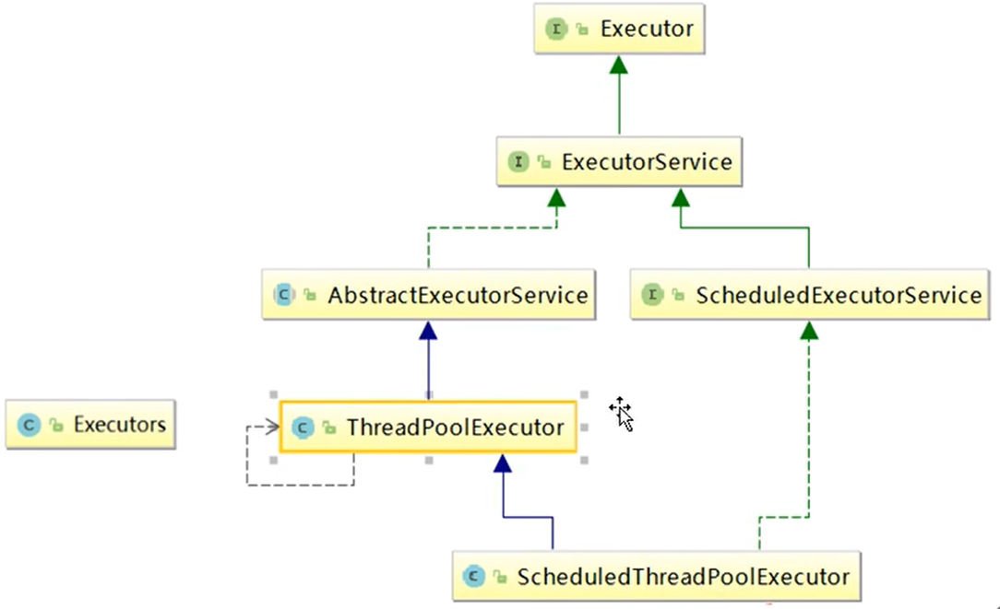
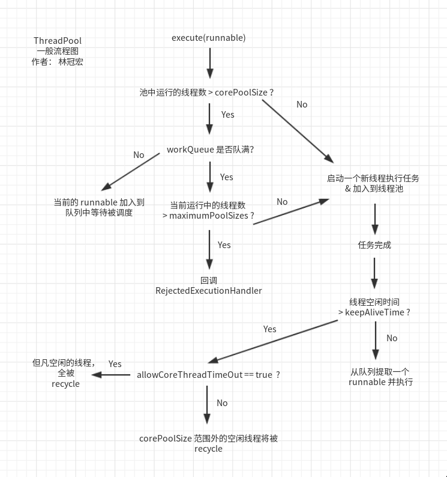

@[TOC](第4章 jvm)

# 0 格式
## 0.0 格式要求
　　换行前要求2个全角空格(html代码不要加全角空格)；
　　html代码后面一定加一行空行；
　　注意点、特点，如果换行，前面加2个全角空格；
　　标题后面需要添加空行；
　　列表全部使用ul标签控制；
　　https://www.cnblogs.com/cndarren/p/14415213.html
　　视频地址：https://www.bilibili.com/video/BV1Kw411Z7dF?p=2&spm_id_from=pageDriver
　　每个大标题之间空2行，每个小标题之间空1行
　　
　　

　　

# 1 什么是JUC
## 1.1 JUC简介

　　在java中，线程部分是一个重点。JUC是java.util.concurrent工具包的简称，是一个处理线程的工具包，jdk5开始出现。

## 1.2 进程与线程

　　**进程(Process)**
　　是计算机中的程序关于某数据集合上的一次运行活动，是系统进行资源分配和调度的基本单位，是操作系统结构的基础。在当代面向线程设计的计算机结构中，进程是线程的容器。程序是指令、数据及其组织形式的描述，进程是程序的实体。

　　**线程(Thread)**
　　是操作系统能够进行运算调度的最小单位。它被包含在进程之中，是进程中的实际运作单位。一条线程指的是进程中一个单一顺序的控制流，一个进程中可以并发多个线程，每条线程并发执行不同的任务。

　　**总结来说**
　　进程：指在系统中正在运行的一个应用程序；程序一旦运行就是进程；进程——资源分配的最小单位。
　　线程：系统分配处理器时间资源的基本单元，或者说进程之内独立执行的一个单元执行流。线程——程序执行的最小单位。

## 1.3 线程的状态
### 1.3.1 线程状态枚举类

~~~
Thread.State{
    NEW, (新建)
    RUNNABLE, (准备就绪)
    BLOCKED, (阻塞)
    WAITING, (等待，就像约会，5点她没来，你大概还会等)
    TIME_WAITING, (超时等待，即只等待固定时间，就像班车9点就没有了)
    TERMINATED (终结)
};
~~~

### 1.3.2 wait和sleep的区别

~~~
sleep是Thread的静态方法，wait是Object的方法，任何对象实例都能调用。
sleep不会释放锁，它也不需要占用锁。wait会释放锁，但调用它的前提是当前线程占有锁(即代码要在synchronized中)。
它们都可以被interrupted方法中断。
~~~

## 1.4 并发和并行

　　**串行模式**
　　表示所有的任务都按顺序进行。串行是一次只能取得一个任务，并执行这个任务。

　　**并行模式**
　　并行意味着可以同时取得多个任务，并同时去执行所取得的这些任务。并行模式相当于将一条长长的队列，分成了多条短队列，所以并行缩短了任务队列长度。并行效率从代码层次上依赖于多进程/多线程代码，从硬件角度上则依赖于多核CPU。

　　**并发**
　　并发(concurrent)指的是多个程序可以同时运行的现象，更细化的是多进程可以同时运行或者多指令可以同时运行。但这不是重点，在描述并发的时候也不会去扣这种字眼是否精确，并发的重点在于它是一种现象，并发描述的是多进程同时运行的现象。但实际上，对于单核CPU来说，同一时刻只能运行一个线程。所以，这里的"同时运行"表示的不是真的同一时刻有多个线程运行的现象，这是并行的概念，而是提供一种功能让用户看来多个程序同时运行起来了，但实际上这些程序中的进程不是一直霸占CPU的，而是执行一会停一会。

　　**要解决大并发问题，通常是将大任务分解成多个小任务**，由于操作系统对进程的调度是随机的，所以切分成多个小任务后，可能会从任一小任务处执行。这可能会出现一引起现象：
~~~
可能出现一个小任务执行了多次，还没开始下个任务的情况。这里一般会采用队列或者类似的数据结构来存放各个小任务的成果。
可能出现还没准备好第一步就执行第二步的可能。这里，一般采用多路复用或异步的方式，比如只有准备好产生了事件通知才执行某个任务。
可以多进程/多线程的方式并行执行这些小任务。也可以单进程/单线程执行这些小任务，这时很可能要配合多路复用才能达到较高的效率。
~~~

　　**小结**
　　并发：同一时刻多个线程在访问同一个资源，多个线程对一个点，如春运抢票、电商秒杀；
　　并行：同一时期，多项工作一起执行，之后再汇总，如泡面(烧水、将调料倒桶)；

　　**管程**
　　Monitor操作系统中叫监视器，就是java中的锁，是一种同步机制，保证同一时间，只有一个线程去访问被保护的数据或代码。JVM同步基于的进入和即出，是通过管程对象实现的，每个对象都会有一个Monitor管程对象，管程对象会随java对象一起创建或销毁。管程对象会对临界区进行加锁、解锁。

　　**用户线程和守护线程**
　　用户线程即自定义线程，主线程结束了，用户线程还在运行，jvm存活；
　　守护线程运行在后台如垃圾线程，没有用户线程了，都是守护线程，jvm结束。

# 2 Lock接口
## 2.1 Synchronized
### 2.1.1 Synchronized关键字

~~~
是一种同步锁
修饰一个代码块，被修饰的代码块称为同步语句块，其作用范围是大括号{}括起来的偌，作用的对象是调用这个代码块的对象。
修饰一个方法，被修饰的方法称为同步方法，其作用范围是整个方法，作用的对象是调用这个方法的对象。
    虽然可以使用synchronized来定义方法，但子类重写父类方法的方法并不是同步方法，如果想要同步，依然要在子类方法上加此关键字。
    但如果子类调用的是父类的此方法，则调用的父类方法依然是同步的。
修改一个静态的方法，其作用的范围是整个静态方法，作用的对象是这个类的所有对象；
修改一个类，其作用范围是此关键字括号括起来的部分，作用主要的对象是这个类的所有对象。
~~~

　　**多线程编程步骤**
~~~
创建资源类，在资源类创建属性和操作方法；
在资源类中的操作方法中进行以下操作：判断、业务、通知；
创建多个线程，调用资源类的操作方法；
防止虚假唤醒，即判断wait()时，需要把条件放到while中，而不能放到if()中，因为wait()在哪儿wait，则被唤醒时，就接着从哪儿执行，如果用的是if，则被唤醒时就根本没进行if判断，即虚假唤醒(将A2SyncUse中的while换成if就可以看到虚假唤醒)。
~~~

## 2.2 Lock

　　Lock锁实现提供了比使用同步方法和语句可以获得的更广泛的锁操作。它们允许更灵活的结构，可能具有非常不同的属性，并且可能支持多个关联的条件对象。Lock提供了比synchronized更多的功能。

　　**Lock与synchronized的区别**
~~~
Lock不是java语言内置的，synchronized是java语言的关键字，因此是内置特性。Lock是一个类，通过这个类可以实现同步访问。
Lock和synchronized有一点非常大的不同，采用synchronized不需要用户去手动释放锁，当synchronized方法或者代码块执行完之后，系统会自动让线程释放对锁的占用；而Lock则必须要用户去手动释放锁，如果没有释放，可能出现死锁。
~~~

## 2.5 小结(重点)

　　**Lock和synchronized有以下几点不同**
~~~
Lock是一个接口，而synchronized是java中的关键字，是内置的语言实现；
synchronized在发生异常时，会自动释放线程占有的锁，不会导致死锁；而Lock在异常时，如果没有主动unLock()去释放锁，则很可以造成死锁，因此使用Lock时需要在finally块中释放锁；
Lock可以让等待锁的线程响应中断，而synchronized则不行，它会使等待的线程一直等待下去，不能响应中断；
通过Lock可以知道有没有成功获取锁，synchronized则无法办到；
Lock可以提高多个线程进行读操作的效率。

在性能上来说，如果竞争资源不激烈，两者性能差不多，当激烈(即有大量线程同时竞争)时，Lock性能好于较synchronized。
~~~

# 3 线程间的通信
## 3.1 使用synchronized

　　即通过wait()、notifyAll()方法进行线程间通信。

## 3.2 使用Lock

　　即通过lock.newCondition()的await()、signalAll()方法去进行通信。

# 4 线程的定制化通信

　　即要唤醒确定的线程，synchronized无法实现，但Lock.newCondition().signal()方法可以唤醒确定的线程。

# 5 集合的线程安全

　　**为了解决线程不安全的问题可以使用以下3种方法**
~~~
List<String> list = new Vector<>(); 效率差
List<String> list = Collections.synchronizedList(new ArrayList<>()); 效率差
List<String> list = new CopyOnWriteArrayList<>(); 写时复制技术，通过JUC包下的这个类去解决，效率好。
~~~

　　**CopyOnWriteArrayList原理**
~~~
可以查看其add方法，本质如下：
进入add方法后，用ReentrantLock加锁；
复制一份当前数组A为B，并令B的长度比A大1，将新元素插入B；
将B赋值给A；
解锁。

这样可以多个线程读，一个线程写。
对应的Set有CopyOnWriteArraySet。
Map有ConcurrentHashMap。
~~~

# 6 多线程锁
## 6.1 synchronized锁的是谁

　　synchronized实现同步的基础：java中的每一个对象都可以作为锁，具体表现为以下3种形式。
~~~
对于普通同步方法，锁的是当前实例对象；
对于静态同步方法，锁的是当前类的Class对象；
对于同步方法块，锁是synchronized括号里配置的对象。
~~~

## 6.2 公平锁和非公平锁

　　new ReentrantLock(true); true为公平锁，false或空为非公平锁。
　　非公平锁特点：会导致某些线程饿死(即线程没活干)、效率高；
　　公平锁特点：阳光普照(即所有线程都有活干)、效率相对低；

## 6.3 可重入锁(递归锁)

　　可重入锁指的是在一个线程中可以多次获取同一把锁，就是说某个线程已经获得某个锁，可以再次获取锁而不会出现死锁，比如：一个线程在执行一个带锁的方法，该方法中又调用了另一个需要相同锁的方法，则该线程可以直接执行调用的方法，而无需重新获得锁；
　　实现原理：每次获得锁之后，记录拥有锁的线程id以及获得锁的次数。再次获取的时候，如果这个锁不是它的则要等待，如果是它的话，总数+1。当释放的时候，拥有锁的个数减一。
　　作用：可重入锁是为了避免死锁。
　　synchronized和Lock都是可重入锁，不过前面是隐式的，即jvm自己去处理的，Lock需要手动加锁和解锁。

## 6.4 死锁

　　死锁：2个或2个以上的进程在执行过程中，因争夺资源而造成的互相等待的现象，如果没有外力干涉，他们就无法再执行下去。

　　**产生死锁的原因**
~~~
系统资源不足；
进程运行推进顺序不合适；
资源分配不当。
~~~

　　**验证是否是死锁**
~~~
可以通过jvisual vm、MAT、JProfiler等工具
jstack命令：jstack pid
~~~

# 7 Callable接口
## 7.1 Callable接口说明

　　现在有2种创建线程的方式：new Thread()、new Thread(new Runnable())，但是Runnable当线程终止时，我们无法使线程返回结果。为支持此功能，java中提供了Callable接口。

　　现在学习创建线程的第3种方案：Callable接口。

　　**Callable接口的特点如下(重点)**
~~~
为了实现Runnable，需要实现不返回任何内容的run()方法，而对于Callable，需要实现在完成时返回结果的call()方法；
call()方法可以抛出异常，而run()则不能；
为实现Callable而必须重写call()方法。

创建方式：
    FutureTask ft = new FutureTask(new T2()); 其中T2是自定义的Callable的实现类，
    new Thread(ft, 线程名); 
    FutureTask实现了Runnable，且其构造方法可以传入Callable接口。

查看Callable是否运行完成：futureTask.isDone()

获取Callable结果方式：
    FutureTask的get()方法：
        可以获取Callalbe运行结果；
        有阻塞功能，即如果写在main线程去获取，只有在call()方法运行完成后，才能再进行主线程；
        如果第一次已经成功get()了结果，那么后面再get()就不用等了，且结果一样；
        如果call()方法有异常，则get()方法会抛出异常。
~~~

# 8 JUC强大的辅助类
## 8.1 减少计数CountDownLatch

　　CountDownLatch类可以设置一个计数器，然后通过countDown方法来进行减1的操作，使用await方法等待计数器 <= 0，然后继续执行await方法之后的语句。
　　CountDownLatch主要有2个方法，当一个或n个线程调用await方法时，这些线程会阻塞。
　　其它线程调用countDown方法会将计数器减1(调用countDown方法的线程不会阻塞)。
　　当计数器的值变为0时，因await方法阻塞的线程会被唤醒，继续执行。

## 8.2 循环栅栏CyclicBarrier

　　是一个同步辅助类，它允许一组线程互相等待，直到到达某个公共屏障点(common barrier point)。在涉及一组固定大小的线程的程序中，这些线程必须不时地相互等待，此时CyclicBarrier很有用。因为该barrier在释放等待线程后可以重用，所以称它为循环的barrier。
　　CyclicBarrier构造方法的第一个参数为目标障碍数，每执行一次CyclicBarrier的await()方法，障碍数就会加1，如果达到了目标障碍数，都会执行await()后面的代码。可以将CyclicBarrier理解为加1操作。

　　**执行顺序**
~~~
线程的await()之前的代码，直到await()；
等到执行到目标障碍数，执行cb.runnable中的代码；
执行线程await()之后的代码。
以下过程相同，可查看com\xyb\a8assistcls\A2CyclicBarrier.java
~~~

　　**方法介绍**
~~~
public CyclicBarrier(int parties)：构造方法，初始化相互等待的线程数量的构造方法。

public CyclicBarrier(int parties, Runnable barrierAction)：初始化相互等待的线程数量以及屏障线程的构造方法，当 CyclicBarrier 的计数器变为 0 时，会执行 barrierAction 构造方法。

getParties()：获取 CyclicBarrier 打开屏障的线程数量，也称为方数。

getNumberWaiting()：获取正在CyclicBarrier上等待的线程数量。

await()：在 CyclicBarrier 上进行阻塞等待，直到发生以下情形之一： 
    在 CyclicBarrier 上等待的线程数量达到 parties，则所有线程被释放，继续执行；
    当前线程被中断，则抛出 InterruptedException 异常，并停止等待，继续执行；
    其他等待的线程被中断，则当前线程抛出 BrokenBarrierException 异常，并停止等待，继续执行；
    其他等待的线程超时，则当前线程抛出 BrokenBarrierException 异常，并停止等待，继续执行；
    其他线程调用 CyclicBarrier.reset() 方法，则当前线程抛出 BrokenBarrierException 异常，并停止等待，继续执行。
    
await(timeout,TimeUnit)：在 CyclicBarrier 上进行限时的阻塞等待，直到发生以下情形之一：
    在 CyclicBarrier 上等待的线程数量达到 parties，则所有线程被释放，继续执行；
    当前线程被中断，则抛出 InterruptedException 异常，并停止等待，继续执行；
    当前线程等待超时，则抛出 TimeoutException 异常，并停止等待，继续执行；
    其他等待的线程被中断，则当前线程抛出 BrokenBarrierException 异常，并停止等待，继续执行；
    其他等待的线程超时，则当前线程抛出 BrokenBarrierException 异常，并停止等待，继续执行；
    其他线程调用 CyclicBarrier.reset() 方法，则当前线程抛出 BrokenBarrierException 异常，并停止等待，继续执行。
    
isBroken()：获取是否破损标志位 broken 的值，此值有以下几种情况：
    CyclicBarrier 初始化时，broken=false，表示屏障未破损；
    如果正在等待的线程被中断，则 broken=true，表示屏障破损；
    如果正在等待的线程超时，则 broken=true，表示屏障破损；
    如果有线程调用 CyclicBarrier.reset() 方法，则 broken=false，表示屏障回到未破损状态。
    
reset()：使得CyclicBarrier回归初始状态，直观来看它做了两件事：
    如果有正在等待的线程，则会抛出 BrokenBarrierException 异常，且这些线程停止等待，继续执行。
    将是否破损标志位 broken 置为 false。
~~~

## 8.3 信号灯Semaphore

　　Semaphore的构造方法中传入的第一个参数是最大信号量(可看作最大线程池)，每个信号量初始化为一个最多只能分发一个许可证。使用acquire方法获得许可证，release方法释放许可。

# 9 ReentrantReadWriteLock读写锁
## 9.1 读写锁

　　读写锁：一个资源可以被多个读线程访问，或者可以被一个写线程访问，但是不能同时存在读写线程，读写互斥，读读共享。

　　读写锁演变过程
~~~
无锁：多线程抢夺资源，会造成数据不准确。
添加锁：synchronized和ReentrantLock
    优点：，都是独占的，每次只能进行一个操作，会造成只能有一个线程读或一个线程写；
    缺点：对于读来说效率低；
读写锁：
    优点：ReentrantReadWriteLock，可以多个线程同时读，同时一个线程写，读效率高；
    缺点：可能会造成锁饥饿，一直读，没有写操作；读的时候不能写。
~~~

　　乐观锁是对于数据冲突保持一种乐观态度，操作数据时不会对操作的数据进行加锁（这使得多个任务可以并行的对数据进行操作），只有到数据提交的时候才通过一种机制来验证数据是否存在冲突(一般实现方式是通过加版本号然后进行版本号的对比方式实现);
　　特点：乐观锁是一种并发类型的锁，其本身不对数据进行加锁通而是通过业务实现锁的功能，不对数据进行加锁就意味着允许多个请求同时访问数据，同时也省掉了对数据加锁和解锁的过程，这种方式因为节省了悲观锁加锁的操作，所以可以一定程度的的提高操作的性能，不过在并发非常高的情况下，会导致大量的请求冲突，冲突导致大部分操作无功而返而浪费资源，所以在高并发的场景下，乐观锁的性能却反而不如悲观锁。

　　悲观锁是基于一种悲观的态度类来防止一切数据冲突，它是以一种预防的姿态在修改数据之前把数据锁住，然后再对数据进行读写，在它释放锁之前任何人都不能对其数据进行操作，直到前面一个人把锁释放后下一个人数据加锁才可对数据进行加锁，然后才可以对数据进行操作，一般数据库本身锁的机制都是基于悲观锁的机制实现的;
　　特点：可以完全保证数据的独占性和正确性，因为每次请求都会先对数据进行加锁， 然后进行数据操作，最后再解锁，而加锁释放锁的过程会造成消耗，所以性能不高;

　　表锁就是一锁锁一整张表，在表被锁定期间，其他事务不能对该表进行操作，必须等当前表的锁被释放后才能进行操作。表锁响应的是非索引字段，即全表扫描，全表扫描时锁定整张表，sql语句可以通过执行计划看出扫描了多少条记录。

　　行锁就是一锁锁一行或者多行记录。

　　共享锁(S锁)又称读锁，若事务T对数据对象A加上S锁，则事务T可以读A但不能修改A，其他事务只能再对A加S锁，而不能加X锁，直到T释放A上的S 锁。这保证了其他事务可以读A，但在T释放A上的S锁之前不能对A做任何修改。

　　排他锁(X锁)又称写锁。若事务T对数据对象A加上X锁，事务T可以读A也可以修改A，其他事务不能再对A加任何锁，直到T释放A上的锁。这保证了其他事务在T释放A上的锁之前不能再读取和修改A。

## 9.2 锁降级

　　锁降级：将写锁降级为读锁(读的时候不能写，但写的时候可以读)。
　　操作流程(一个线程内)：获取写锁 -> 获取读锁 -> 释放写锁(此时锁降级了) -> 释放读锁。注意，读锁不能升级为写锁。

# 10 BlockingQueue阻塞队列
## 10.1 阻塞队列概述

~~~
当队列为空时，从队列中获取元素的操作将会被阻塞；
当队列为满时，向队列中添加元素的操作将会被阻塞；
试图从空队列中获取元素的线程会被阻塞，直到其它线程往队列中插入新元素；
试图向已满的队列中添加新元素的线程将会被阻塞，直到其它线程从队列中移除一个或多个元素，使队列变得空闲起来后再浅咖。
~~~

　　在多线程领域中，所谓阻塞，在某些情况下会挂起线程(即阻塞)，一旦条件满足，被挂起的线程又会被自动唤醒。

　　**为什么需要BlockingQueue**
~~~
这样我们就不需要关心什么时候需要阻塞线程，什么时候需要唤醒线程，因为BlockingQueue会自动完成这些操作。
在JUC包发布前，多线程情况下，开发需要自己去控制这些细节，还要兼顾效率和线程安全，降低开发效率和质量。
~~~

## 10.2 阻塞队列的架构

## 10.3 阻塞队列的分类
### 10.3.1 ArrayBlockingQueue(常用)

　　基于数组的阻塞队列实现，在ArrayBlockingQueue内部，维护了一个定长数组，以便缓存队列中的数据对象，这是一个常用的阻塞队列，除了一个定长数组外，它内部还只在着2个int变量，分别标识着队列的头部和尾部在数组中的位置。
　　ArrayBlockingQueue在生产者放入消费数据，消费者获取数据，都是共用同一个锁对象，由此也意味着两者无法真正并行运行，这点尤其不同于LinkedBlockingQueue；按照实现原理来分析，ArrayBlockingQueue完全可以采用分离锁，从而实现生产者和消费者操作的完全并行运行。之所以没有这样做，可能是认为ArrayBlockingQueue的数据写入和获取操作已经足够轻巧，以至于引入独立的锁机制，除了给代码带来额外的复杂性外，其在性能上完全占不到任何便宜。
　　ArrayBlockingQueue和LinkedBlockingQueue间还有一个明显不同之处在于，前者在插入或删除元素时不会产生或销毁任何额外的对象实例，而后者则会生成民一个额外的Node对象。这在长时间内需要高效并发处理大批量数据的系统中，其对于GC的影响还是存在一定的区别。而在创建ArrayBlockingQueue时，我们还可以控制对象的内部锁是否采用公平锁，默认采用非公平锁。
　　总结：由数组结构组成的有界阻塞队列。

### 10.3.2 LinkedBlockingQueue(常用)

　　基于链表的阻塞队列，其内部维护一个数据缓冲队列(链表组成)，当生产者往队列中放入一个数据时，队列会从生产都手中获取数据，并缓存在队列内部，而生产都立即返回；只有当队列缓冲区达到最大值缓存容量时(可通过构造函数指定初始容量)，才会阻塞生产都队列，直到消费者从队列中消费掉一份数据，生产都线程会被唤醒，反之对于消费者的处理也是一样。而LinkedBlockingQueue之所以能够高效地处理并发数据，还因为其对于生产都和消费都分别采用了独立的锁来控制数据同步，这也意味着在高并发的情况下，生产者和消费者可以并行地操作队列中的数据，以此来提高整个队列的并发性能。
　　ArrayBlockingQueue和LinkedBlockingQueue是两个最普通也是最常用的阻塞队列，一般情况下，在处理多线程间的生产者消费问题，使用这2个类足以。
　　总结：由链表组成的有界(默认为Integer.MAX_VALUE)阻塞队列。

### 10.3.3 DelayQueue

　　DelayQueue中的元素只有当其指定的延迟时间到了，才能够从队列中获取到该元素。DelayQueue是一个没有大小限制的队列，因此往队列中插入数据的操作(生产者)永远不会被阻塞，而只有获取数据的操作(消费者)才会被阻塞
　　总结：使用优先级队列实现的延迟无界阻塞队列。

### 10.3.4 PriorityBlockingQueue

　　基于优先级的阻塞队列(优先级的判断通过构造函数传入的Compator对象来决定)，但需要注意的是**PriorityBlockingQueue并不会阻塞数据生产者，而只会在没有可消费的数据时，阻塞数据的消费者**。

　　因此使用时要特别注意，**生产者生产速度绝对不能快于消费都消费数据的速度**，否则时间一长，会最终耗尽所有的可用堆内存空间。
　　在实现PriorityBlockingQueue时，内部控制线程同步的锁采用的是公平锁。
　　总结：支持优先级排序的无界阻塞队列。

### 10.3.5 SynchronousQueue

　　无缓冲的等待队列，类似于无中介的直接交易，有点像原始社会中的生产者和消费者，生产者拿着产品去集市销售给产品的最终消费者，而消费者必须亲自去集市找到所要商品的直接生产者，如果一方没有找到合适的目标，那么大家都要在集市等待。相对于有缓冲的BlockingQueue来说，少了一个中间经销商的环节(缓冲区)，如果有经销商，生产者直接把产品批发给经销商，而无需在意经销商最终会将这些产品卖给那些消费者，由于经销商可以库存一部分商品，因此对于直接交易模式，总体来说采用中间经销商的模式会吞吐量高一些(可以批量买卖)；但另一方面，又因为经销商的引入，使得产品从生产者到消费者蹭增加了额外的交易环节，单个产品的及时响应性能可能会降低。

　　声明一个SynchronousQueue有2种不同的方式，它们之间有着不术一样的行为。

　　**公平模式和非公平模式**
~~~
公平模式：SynchronousQueue会采用公平锁，并配合一个FIFO队列来阻塞多余的生产者和消费者，从而体系整体的公平策略。
非公平模式：SynchronousQueue默认，采用非公平锁，同时配合一个LIFO队列来管理多余的生产者和消费者，而后一种模式，如果生产者和消费者的处理速度有差距，则很容易出现饥渴情况，即可能有某些生产者或消费者的数据永远得不到处理。
~~~

　　总结：不存储元素的阻塞队列，也即单个元素队列。

### 10.3.6 LinkedTransferQueue

　　是由一个链表结构组成的无界阻塞队列。相对于其它阻塞队列，此队列多了tryTransfer和transfer方法。
　　采用一种预占模式。意思就是消费者线程取元素时，如果队列不为空，则直接取走数据，若为空，就生成一个节点(节点元素为null)入队，然后消费者线程被等待在这个节点上，后面生产者线程入队时发现有一个null节点，生产者线程就不入队了，直接将元素填充到该节点，并唤醒该节点线程，被唤醒的消费者取走元素，从调用的方法返回。
　　总结：由链表组成的无界阻塞队列。

### 10.3.7 LinkedBlockingDeque

　　是一个由链表结构组成的双向阻塞队列，即可以从队列的两端插入和移除元素。

　　对于一些指定的操作，在插入或获取队列元素时，如果队列状态不允许该操作可能会阻塞住该线程直到队列状态变更为允许操作，这里的阻塞一般有2种情况：
　　插入元素时：如果当前队列已满将会进入阻塞状态，一直等到队列有空的位置时再将该元素插入，该操作可以通过设置超时参数，超时后返回false表示操作失败，也可以不设置超时参数一起阻塞，中断后招聘InterruptedException异常；
　　读取元素时：如果当前队列为空会阻塞住直到队列不为空然后返回元素，同样可以通过设置超时参数。

## 10.4 阻塞队列核心方法

　　查看com\xyb\a10blockingqueue\A1BlockingQueueDemo.java类。

# 11 ThreadPool线程池
## 11.1 线程池概述

　　线程池：一种线程使用模式。线程过多会带来调度开销，进而影响缓存局部性和整体性能。而线程池维护着多个线程，等待着监督管理者分配可并发执行的任务。这避免了在处理短时间任务时创建与销毁线程的代价。线程池不仅能够保证内核的充分利用，还能防止过分调度。
　　优势：线程池的工作主要是控制运行的线程数量，处理过程中将任务放入队列，然后在线程创建后启动这些任务，如果线程数量超过了最大数量，超出数量的线程排除等候，等其它线程执行完毕，再从队列中取出任务来执行。

　　**主要特点**
~~~
降低资源消耗：通过重复利用已创建的线程降低线程创建和销毁造成的消耗；
提高响应速度：当任务到达时，任务可以不需要等待线程创建就能立即执行；
提高线程的可管理性：线程是稀缺资源，如果无限制的创建，不仅会消耗系统资源，还会降低系统的稳定性，使用线程池可以进行统一的分配，监控和调优。
~~~

## 11.2 线程池架构

　　java中的线程池是通过Executor框架实现的，该框架中乃至了Executor、Executors、ExecutorService、ThreadPoolExecutor这几个类。
　　关系如下：
　　

## 11.3 线程池使用方法
### 11.3.1 newFixedThreadPool(常用)

　　Executors.newFixedThreadPool(int)，一池N线程，类似多个银行窗口。
　　作用：创建一个可重用固定线程数的线程池，以共享的无界队列方式来运行这些线程。在任意点，大多数线程处于处理任务的活动状态。如果在所有线程处于活动状态时提交附加任务，则在有可用线程前，附加任务将在队列中等待。如果在关闭前的执行期间由于失败而导致任何线程终止，那么一个新线程将代替它执行后续的任务(如果需要)。在某个线程被显式地关闭前，池中的线程将一直存在。

　　**特征**
~~~
线程池中的线程处于一定的量，可以很好地控制线程的并发量；
线程可以被重复使用，在显式关闭前，将一直存在；
超出一定量的线程被提交时需在队列中等待。
~~~

　　**缺点：**顾名思义创建一个固定长度的线程池，该线程池核心线程数与最大线程数是一致的，因此非核心线程存活时间参数也就没什么意义了，其最大问题就是选用的阻塞队列是无界的，若任务无穷多便会一直加加加，最终将内存撑爆，一般用于负载较重的服务器，需要限制指定的线程数。

### 11.3.2 newSingleThreadExecutor 一池一线程

　　Executors.newSingleThreadExecutor()：一个任务一个任务执行，一池一线程；
　　缺点：看参数也能发现其只初始化了一个线程，自始至终池里也只有一个线程在工作，唯一的问题也是阻塞队列是无界的，可能会将内存撑爆，一般用于需要严格控制任务执行顺序的场景。

### 11.3.3 newCachedThreadPool

　　Executors.newCachedThreadPool()：线程池根据需求创建线程，可扩容，遇强则强。
　　核心线程数为0，最大线程数趋近于无限大，即全部采用非核心线程来处理任务，每个线程的存活时间则为60s，注意这里使用到了同步队列，即只会传递任务不会保存任务，一旦有任务来则查看是否有空闲线程，若无则新建一个线程，当任务请求的速率大于线程处理的速率，那么线程数会越来越多，最终将内存撑爆，一般用于并发执行大量短期的小任务，由于空闲60s的线程会被回收，因此长时间保持空闲的该线程池不会占用任何资源。
　　

## 11.4 线程池底层原理

　　11.3的3个方法本质上是调用new ThreadPoolExecutor()方法，如果我们要实现自定义的线程池，也调用这个方法就行。

## 11.5 线程池的7个参数

　　ThreadPoolExecutor 7个参数含义
~~~
int corePoolSize：线程池中的核心线程数量，即使没有任务，这些线程也不会销毁。
int maximumPoolSize：线程池中的最大线程数量，即线程池所支持创建的最大数量线程，即使任务超级多，也只会有 maximumPoolSize 数量的线程在运行。
long keepAliveTime：非核心线程的存活时间，当任务数量超过核心线程数量时，只要 corePoolSize < maximumPoolSize，线程池便会创建对应的线程数去执行任务，当线程池中存活的线程数量大于核心线程时，如果等了 keepAliveTime 时间仍然没有任务进来，则线程池会回收这些线程。
TimeUnit unit：非核心线程存活时间的具体单位，即等待多少毫秒、秒等。
BlockingQueue<Runnable> workQueue：存储线程任务所用的队列，提交的任务将会被放到该队列中。
ThreadFactory threadFactory：线程工厂，主要用来创建线程的时候给线程取名用，默认是pool-1-thread-3
RejectedExecutionHandler handler：线程拒绝策略，当存储任务所用的队列都被填满时，新来的任务此时无处存放，那么需要提供一种策略去解决这种情况。
~~~

## 11.6 线程池底层工作流程

　　

　　**拒绝策略**
~~~
AbortPolicy(默认)：当任务添加到线程池中被拒绝时，它将抛出 RejectedExecutionException 异常。
CallerRunsPolicy：当任务添加到线程池中被拒绝时，会在线程池当前正在运行的Thread线程池中处理被拒绝的任务。
DiscardOldestPolicy：当任务添加到线程池中被拒绝时，线程池会放弃等待队列中最旧的未处理任务，然后将被拒绝的任务添加到等待队列中。
DiscardPolicy：任务添加到线程池中被拒绝时，线程池将丢弃被拒绝的任务。
~~~

## 11.7 自定义线程池

　　ExecutorService threadPool = new ThreadPoolExecutor(2, 5, 2, TimeUnit.SECONDS, new ArrayBlockingQueue<>(3), Executors.defaultThreadFactory(), new ThreadPoolExecutor.AbortPolicy());

# 12 Fork/Join分支合并框架

　　Fork/Join它可以将一个大的任务拆分成多个子任务进行并行处理，最后将子任务结果合并成最后的计算结果，并进行输出。Fork/Join框架要完成2件事：
　　Fork：把一个复杂任务进行拆分，大事化小；
　　Join：把拆分任务的结果进行合并。

~~~
任务分割：首先Fork/Join框架需要把大的任务分割成足够小的子任务，如果子任务比较大的话还要对子任务进行继续分割；
执行任务并合并结果：分割的子任务分别放到双端队列里面，然后几个启动线程分别从双端队列里获取任务执行。子任务执行完的结果都放在另一个队列里，启动一个线程从队列里取数据，然后合并这些数据。
~~~

　　在Java的Fork/Join框架中，使用2个类完成上述操作：
~~~
ForkJoinTask：我们要使用Fork/Join框架，首先要创建一个ForkJoin任务。该类提供了在任务中执行fork和join的机制。通常情况下我们不需要直接集成ForkJoinTask类，只需要继承它的子类，Fork/Join提供了2个子类：
    RecursiveAction：用于没有返回结果的任务；
    RecursiveTask：用于有返回结果的任务。
ForkJoinPool：ForkJoinTask需要通过ForkJoinPool来执行。
RecursiveTask：继承后可以实现递归调用的任务。
~~~

　　**Fork/Join框架的实现原理**
~~~
ForkJoinPool由ForkJoinTask数组和ForkJoinWorkerThread数组组成；
ForkJoinTask数组负责将存放以及将程序提交给ForkJoinPool；
ForkJoinWorkerThread负责执行这些任务。
~~~

# 13 CompletableFuture异步回调

　　分为有返回值异步回调和无返回值异步回调，具体查看com\xyb\a13completable\A1CompletableFutureDemo.java

