@[TOC](第4章 jvm)

# 0 格式
## 0.0 格式要求
　　换行前要求2个全角空格(html代码不要加全角空格)；
　　html代码后面一定加一行空行；
　　注意点、特点，如果换行，前面加2个全角空格；
　　标题后面需要添加空行；
　　列表全部使用ul标签控制；
　　https://www.cnblogs.com/cndarren/p/14415213.html
　　视频地址：https://www.bilibili.com/video/BV1PJ411n7xZ?p=6&spm_id_from=pageDriver
　　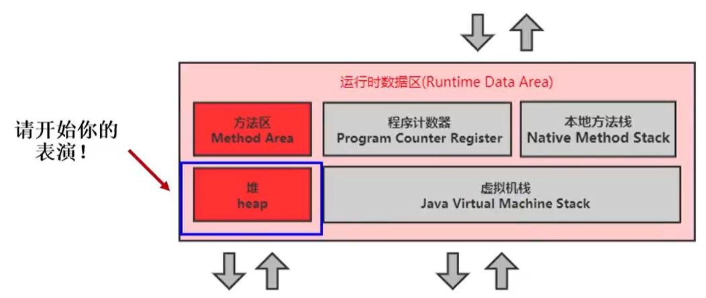
　　每个大标题之间空2行，每个小标题之间空1行

## 0.1 推荐书

　　《深入理解java虚拟机》

## 0.2 用到的工具

　　JClassLib：idea插件、查看编译后的class文件；view -> show bytecode with jclasslib；对应javap -v A.class命令；

## 0.3 JVM参数及Java命令
### 0.3.1 JVM参数

　　官网地址：https://docs.oracle.com/javase/8/docs/technotes/tools/windows/java.html
　　参数中非-(空或+)表示启用，-表示不启用。
　　[]表示可选参数，(a|b)表示写a或b都行。

#### 0.3.1.1 JVM相关属性设置

　　**查看所有的参数的默认初始值**
　　-XX:+PrintFlagsInitial

　　**查看所有的参数的最终值(可能会存在修改，不再是初始值)**
　　-XX:+PrintFlagsFinal

　　**显示垃圾回收细节**
　　-XX:+PrintGCDetails。

#### 0.3.1.2 heap相关参数值设置

　　**设置heap初始化大小**
　　-Xms600m：设置heap初始化大小为600m，不带单位则为byte，还可以是k、m、g；
　　-XX:InitialHeapSize=600m，同上。

　　**设置heap最大大小**
　　-Xmx600m：设置heap最大大小为600m，不带单位则为byte，还可以是k、m、g；
　　-XX:MaxHeapSize=600m，同上。

　　**设置新生代垃圾的最大年龄**
　　-XX:MaxTenuringThreshold=N

　　**设置新生代、老年代比例**
　　-XX:NewRatio=8：表示老年代的占比为8，新生代的占比为1。

　　**设置新生代的Eden、S0、S1的比例**
　　-XX:SurvivorRatio=3：表示Eden区占比为3，S0和S1的占比各为1。注意需要与 -XX:-UseAdaptiveSizePolicy联用。

　　**设置新生代的大小**
　　-Xmn100m：设置新生代的大小为100m，不带单位则为byte，还可以是k、m、g；这个参数的优先级高于"-XX:NewRatio"。

　　**设置TLAB占Eden区的比例**
　　-XX:TLABWasteTargetPercent=N

　　**OOM时打印堆dump文件**
　　-XX:+HeapDumpOnOutOfMemoryError

#### 0.3.1.3 heap相关属性设置

　　**设置是否采用自适应模式**
　　-XX:-UseAdaptiveSizePolicy 不采用；
　　-XX:+UseAdaptiveSizePolicy 采用，默认是采用。

　　**开启TLAB**
　　-XX:+UseTLAB，默认开启

　　**空间分配担保**
　　-XX:HandlePromotionFailure
　　在发生Minor GC之前，虚拟机会检查老年代最大可用的连续空间是否大于新生代所有对象的总空间。
<ul>
    <li>如果大于，则此次Minor GC是安全的</li>
    <li>
        如果小于，则虚拟机会查看-XX:HandlePromotionFailure设置值是否允担保失败。
        <ul>
            <li>
                如果HandlePromotionFailure=true，那么会继续检查老年代最大可用连续空间是否大于历次晋升到老年代的对象的平均大小。
                <ul>
                    <li>如果大于，则尝试进行一次Minor GC，但这次Minor GC依然是有风险的；</li>
                    <li>如果小于，则改为进行一次Full GC。</li>
                </ul> 
            </li>
            <li>如果HandlePromotionFailure=false，则改为进行一次Full Gc。</li>
        </ul>
    </li>
</ul>

　　在JDK6 Update24之后，HandlePromotionFailure参数不会再影响到虚拟机的空间分配担保策略，观察openJDK中的源码变化，虽然源码中还定义了HandlePromotionFailure参数，但是在代码中已经不会再使用它。JDK6 Update 24之后的规则变为只要老年代的连续空间大于新生代对象总大小或者历次晋升的平均大小就会进行Minor GC，否则将进行FullGC。

　　**显式开启逃逸分析(需要-server)**
　　-XX:+DoEscapeAnalysis

　　**查看逃逸分析结果**
　　-XX:+PrintEscapeAnalysis

　　**开启标量替换(默认开启)**
　　-XX:+EliminateAllocations

　　**将打印GC日志**
　　-XX:+PrintGC

#### 0.3.1.4 方法区相关参数值设置

<div>
    <h5>　　设置方法区大小</h5>
    <ul style="list-style-type: none;" >
        <li>-XX:Permsize=10m：设置JDK7及以前永久代的初始分配空间大小；</li>
        <li>-XX:MaxPermsize=10g：设置JDK7及以前永久代的最大可分配空间大小；</li>
        <li>-XX:MetaspaceSize=10k：设置JDK8及以后元数据区的初始分配空间大小；</li>
        <li>-XX:MaxMetaspaceSize=-1：设置JDK8及以后元数据区的最大可分配空间大小，值为-1表示没有限制；</li>
    </ul>
</div>

#### 0.3.1.5 直接内存相关参数设置

　　**设置元空间的大小**
　　-XX:MaxDirectMemorySize=10(G|M|K|空)，如果不设置，则与-Xmx一样大小。

#### 0.3.1.6 执行引擎相关参数设置

　　**设置代码变为热点代码前需要调用的次数**
　　-XX:CompileThreshold=10000

　　**是否启用热度衰减**
　　-XX:(+|-|空)UseCounterDecay

　　**热度衰减的半衰期**
　　-XX:CounterHalfLifeTime=10000，单位秒，如果在这个时间段时代码调用次数没达到变为热点代码所需次数，则次数减半。

　　**切换执行引擎的模式**
　　-(Xint|Xcomp|Xmixed)
　　Xint：完全采用解释器模式执行程序；
　　Xcomp：完全采用即时编译器模式执行程序，如果即时编码出现问题，解释器会介入执行；
　　Xmixed：采用即时编译器+解释器的混合模式共同执行程序。

　　**server模式**
　　-Server ： 64位只有server模式。

#### 0.3.1.7 String相关设置

　　**设置字符串常量池中可包含链表的个数**
　　-XX:StringTableSize=1009

　　**开启String去重，默认是不开启的，需要手动开启**
　　-XX:+UseStringDeduplication(bool)  

　　**打印详细的去重统计信息**
　　-XX:+PrintStringDeduplicationStatistics(bool)  

　　**达到这个年龄的String对象被认为是去重的候选对象**
　　-XX:+StringpeDuplicationAgeThreshold(uintx)

#### 0.3.1.8 GC相关设置

　　**查看命令行相关参数（包含使用的垃圾收集器）**
　　-XX:+PrintCommandLineFlags

　　**年轻代和老年代都使用串行收集器**
　　-XX:+UseSerialGC

　　**手动指定使用ParNew收集器执行内存回收任务。它表示年轻代使用并行收集器，不影响老年代**
　　-XX:+UseParNewGC

　　**限制线程数量，默认开启ParNew收集器和CPU数据相同的线程数**
　　-XX:ParallelGCThreads
　　。

### 0.3.2 JAVA命令

　　**查看jvm进程id**
　　jps

　　**查看参数的设置值**
　　jinfo -flag 需要查看的参数如(SurvivorRatio) 进程id；
　　注意查看方法区大小，jdk7、jdk8不一样。

　　**查看JVM参数**
　　jstat -gc 进程id

　　**查看是否启用了某参数**
　　jinfo -flag 参数(如UseTLAB) 进程id

　　**反编译class文件**
　　javap -(verbose|v) [-p] fileName [> fileName2]
　　-p：不加此参数，不能显示类private信息；
　　\> fileName2：表示将反编译后的cls文件写入到fileName2中。

　　**切换执行引擎的模式**
　　java -(Xint|Xcomp|Xmixed) -version
　　Xint：完全采用解释器模式执行程序；
　　Xcomp：完全采用即时编译器模式执行程序，如果即时编码出现问题，解释器会介入执行；
　　Xmixed：采用即时编译器+解释器的混合模式共同执行程序。

　　**使用命令行指令**
　　jinfo -flag 相关垃圾回收器参数 进程ID

# 1 JVM与Java体系结构
## 1.1 java及JVM简介

　　Java虚拟机根本不关心运行在其内部的程序到底是使用何种编程语言编写的，它只关心“字节码”文件。也就是说Java虚拟机拥有语言无关性，并不会单纯地与Java语言“终身绑定”，只要其他编程语言的编译结果满足并包含Java虚拟机的内部指令集、符号表以及其他的辅助信息，它就是一个有效的字节码文件，就能够被虚拟机所识别并装载运行。

<div>
    <div>
        <h5>　　字节码：</h5>
        <ol>
            <li>我们平时说的java字节码，指的是用java语言编译成的字节码。准确的说任何能在jvm平台上执行的字节码格式都是一样的。所以应该统称为：jvm字节码。</li>
            <li>不同的编译器，可以编译出相同的字节码文件，字节码文件也可以在不同的JVM上运行。</li>
            <li>Java虚拟机与Java语言并没有必然的联系，它只与特定的二进制文件格式—Class文件格式所关联，Class文件中包含了Java虚拟机指令集(或者称为字节码、Bytecodes)和符号表，还有一些其他辅助信息。</li>
        </ol>
    </div>
	<br/>
    <div>
        <h5>　　多语言混合编程：</h5>
        <ol>
            <li>Java平台上的多语言混合编程正成为主流，通过特定领域的语言去解决特定领域的问题是当前软件开发应对日趋复杂的项目需求的一个方向。</li>
            <li>试想一下，在一个项目之中，并行处理用Clojure语言编写，展示层使用JRuby/Rails，中间层则是Java，每个应用层都将使用不同的编程语言来完成，而且，接口对每一层的开发者都是透明的，各种语言之间的交互不存在任何困难，就像使用自己语言的原生API一样方便，因为它们最终都运行在一个虚拟机之上。</li>
            <li>对这些运行于Java虚拟机之上、Java之外的语言，来自系统级的、底层的支持正在迅速增强，以JSR-292为核心的一系列项目和功能改进(如Da Vinci Machine项目、Nashorn引擎、InvokeDynamic指令、java.lang.invoke包等)，推动Java虚拟机从“Java语言的虚拟机”向 “多语言虚拟机”的方向发展。</li>
        </ol>
    </div>
</div>

## 1.2 虚拟机与Java虚拟机

　　虚拟机：就是一台虚拟的计算机。它是一款软件，用来执行一系列虚拟计算机指令。大体上，虚拟机可以分为系统虚拟机和程序虚拟机。
　　大名鼎鼎的Visual Box，Mware就属于系统虚拟机，它们完全是对物理计算机的仿真，提供了一个可运行完整操作系统的软件平台。
　　程序虚拟机的典型代表就是Java虚拟机，它专门为执行单个计算机程序而设计，在Java虚拟机中执行的指令我们称为Java字节码指令。
　　无论是系统虚拟机还是程序虚拟机，在上面运行的软件都被限制于虚拟机提供的资源中。

<div>
    <h5>　　Java虚拟机：</h5>
    <ol>
        <li>Java虚拟机是一台执行Java字节码的虚拟计算机，它拥有独立的运行机制，其运行的Java字节码也未必由Java语言编译而成。</li>
        <li>JVM平台的各种语言可以共享Java虚拟机带来的跨平台性、优秀的垃圾回器，以及可靠的即时编译器。</li>
        <li>Java技术的核心就是Java虚拟机(JVM，Java Virtual Machine)，因为所有的Java程序都运行在Java虚拟机内部。</li>
    </ol>
</div>

　　**作用：**
　　Java虚拟机就是二进制字节码的运行环境，负责装载字节码到其内部，解释/编译为对应平台上的机器指令执行。每一条Java指令，Java虚拟机规范中都有详细定义，如怎么取操作数，怎么处理操作数，处理结果放在哪里。

<div>
    <h5>　　特点：</h5>
    <ol>
        <li>一次编译，到处运行；</li>
        <li>自动内存管理；</li>
        <li>自动垃圾回收功能。</li>
    </ol>
</div>

　　JVM的位置
　　

　　JVM是运行在操作系统之上的，它与硬件没有直接的交互
　　

## 1.3 JVM的整体结构

　　
　　HotSpot VM是目前市面上高性能虚拟机的代表作之一。它采用解释器与即时编译器并存的架构。
　　
## 1.4 Java代码执行流程

　　

## 1.5 JVM的架构模型

　　Java编译器输入的指令流基本上是一种基于栈的指令集架构，另外一种指令集架构则是基于寄存器的指令集架构。

<div>
    <h5>　　两种架构之间的区别：</h5>
    <ul>
        <li>
            基于栈式架构的特点：
            <ol>
                <li>设计和实现更简单，适用于资源受限的系统；</li>
                <li>避开了寄存器的分配难题：使用零地址指令方式分配；</li>
                <li>指令流中的指令大部分是零地址指令，其执行过程依赖于操作栈。指令集更小，编译器容易实现；</li>
                <li>不需要硬件支持，可移植性更好，更好实现跨平台。</li>
            </ol>
        </li>
        <li>
            基于寄存器架构的特点：
            <ol>
                <li>典型的应用是x86的二进制指令集：比如传统的PC以及Android的Davlik虚拟机；</li>
                <li>指令集架构则完全依赖硬件，可移植性差；</li>
                <li>性能优秀和执行更高效；</li>
                <li>花费更少的指令去完成一项操作；</li>
                <li>在大部分情况下，基于寄存器架构的指令集往往都以一地址指令、二地址指令和三地址指令为主，而基于栈式架构的指令集却是以零地址指令为主。</li>
            </ol>
        </li>
    </ul>
</div>


　　运行1条指令一般需要3个内容：数据源地址、进行的操作、数据目标地址，比如将ax寄存器的值放到bx中，对于寄存器架构，我们只用1条指令"mov bx, ax"就可以执行，但是我们需要知道3个内容；对于栈式架构，我们每次操作的源数据地址或目标数据地址必定有一个是栈顶元素，所以我们只用知道"操作+源地址"或"操作+目标地址"，所以指令集小，但是进行1个操作，需要多条指令才能实现，先把ax内容压栈，再弹出栈顶元素到bx。
　　
## 1.6 JVM的生命周期

　　虚拟机的启动：
　　Java虚拟机的启动是通过引导类加载器(bootstrap class loader)创建一个初始类(initial class)来完成的，这个类是由虚拟机的具体实现指定的。

<div>
    <div>
        <h5>　　虚拟机的执行：</h5>
        <ol>
            <li>一个运行中的Java虚拟机有着一个清晰的任务：执行Java程序；</li>
            <li>程序开始执行时他才运行，程序结束时他就停止；</li>
            <li>执行一个所谓的Java程序的时候，真真正正在执行的是一个叫做Java虚拟机的进程。</li>
        </ol>
    </div>
	<br/>
    <div>
        <h5>　　虚拟机的退出，有如下的几种情况：</h5>
        <ol>
            <li>程序正常执行结束；</li>
            <li>程序在执行过程中遇到了异常或错误而异常终止；</li>
            <li>由于操作系统用现错误而导致Java虚拟机进程终止；</li>
            <li>某线程调用Runtime类或system类的exit方法，或Runtime类的halt方法，并且Java安全管理器也允许这次exit或halt操作；</li>
            <li>除此之外，JNI(Java Native Interface)规范描述了用JNI Invocation API来加载或卸载 Java虚拟机时，Java虚拟机的退出情况。</li>
        </ol>
    </div>
</div>

## 1.7 JVM的发展历程
### 1.7.1 Sun Classic VM

<ol>
    <li>早在1996年Java1.0版本的时候，Sun公司发布了一款名为sun classic VM的Java虚拟机，它同时也是世界上第一款商用Java虚拟机，JDK1.4时完全被淘汰。</li>
    <li>这款虚拟机内部只提供解释器。现在还有及时编译器，因此效率比较低，而及时编译器会把热点代码缓存起来，那么以后使用热点代码的时候，效率就比较高。</li>
    <li>如果使用JIT编译器，就需要进行外挂。但是一旦使用了JIT编译器，JIT就会接管虚拟机的执行系统。解释器就不再工作。解释器和编译器不能配合工作。</li>
    <li>现在hotspot内置了此虚拟机。</li>
</ol>

### 1.7.2 Exact VM

<ol>
    <li>为了解决上一个虚拟机问题，jdk1.2时，Sun提供了此虚拟机。</li>
    <li>Exact Memory Management：准确式内存管理
        <ul>
            <li>也可以叫Non-Conservative/Accurate Memory Management</li>
            <li>虚拟机可以知道内存中某个位置的数据具体是什么类型。</li>
        </ul>
    </li>
    <li>具备现代高性能虚拟机的维形
        <ul>
            <li>热点探测；</li>
            <li>编译器与解释器混合工作模式。</li>
        </ul>
    </li>
    <li>只在solaris平台短暂使用，其他平台上还是classic vm，英雄气短，终被Hotspot虚拟机替换</li>
</ol>

### 1.7.3 HotSpot VM

<ol>
    <li>
        HotSpot历史
        <ul>
            <li>最初由一家名为“Longview Technologies”的小公司设计</li>
            <li>1997年，此公司被sun收购；2009年，Sun公司被甲骨文收购。</li>
            <li>JDK1.3时，HotSpot VM成为默认虚拟机</li>
        </ul>
    </li>
    <li>目前Hotspot占有绝对的市场地位，称霸武林。
        <ul>
            <li>不管是现在仍在广泛使用的JDK6，还是使用比例较多的JDK8中，默认的虚拟机都是HotSpot</li>
            <li>Sun / Oracle JDK 和 OpenJDK 的默认虚拟机</li>
            <li>因此本课程中默认介绍的虚拟机都是HotSpot，相关机制也主要是指HotSpot的Gc机制。(比如其他两个商用虚机都没有方法区的概念)</li>
        </ul>
    </li>
    <li>从服务器、桌面到移动端、嵌入式都有应用；</li>
    <li>名称中的HotSpot指的就是它的热点代码探测技术
        <ul>
            <li>通过计数器找到最具编译价值代码，触发即时编译或栈上替换</li>
            <li>通过编译器与解释器协同工作，在最优化的程序响应时间与最佳执行性能中取得平衡</li>
        </ul>
    </li>
</ol>

### 1.7.4 JRockit

<ol>
    <li>
        专注于服务器端应用
        <ul>
            <li>它可以不太关注程序启动速度，因此JRockit内部不包含解析器实现，全部代码都靠即时编译器编译后执行。</li>
        </ul>
    </li>
    <li>
        大量的行业基准测试显示，JRockit JVM是世界上最快的JVM
        <ul>
            <li>使用JRockit产品，客户已经体验到了显著的性能提高(一些超过了70%)和硬件成本的减少(达50%)</li>
        </ul>
    </li>
    <li>
        优势：全面的Java运行时解决方案组合
        <ul>
            <li>JRockit面向延迟敏感型应用的解决方案JRockit Real Time提供以毫秒或微秒级的JVM响应时间，适合财务、军事指挥、电信网络的需要</li>
            <li>MissionControl服务套件，它是一组以极低的开销来监控、管理和分析生产环境中的应用程序的工具。</li>
        </ul>
    </li>
    <li>2008年，JRockit被oracle收购；</li>
    <li>Oracle表达了整合两大优秀虚拟机的工作，大致在JDK8中完成。整合的方式是在HotSpot的基础上，移植JRockit的优秀特性；</li>
    <li>高斯林：目前就职于谷歌，研究人工智能和水下机器人</li>
</ol>

### 1.7.5 IBM的J9

<ol>
    <li>全称：IBM Technology for Java Virtual Machine，简称IT4J，内部代号：J9；</li>
    <li>市场定位与HotSpot接近，服务器端、桌面应用、嵌入式等多用途VM；</li>
    <li>广泛用于IBM的各种Java产品；</li>
    <li>目前，有影响力的三大商用虚拟机之一，也号称是世界上最快的Java虚拟机；</li>
    <li>2017年左右，IBM发布了开源J9VM，命名为openJ9，交给EClipse基金会管理，也称为Eclipse OpenJ9。</li>
</ol>

### 1.7.6 KVM和CDC / CLDC Hotspot

<ol>
    <li>Oracle在Java ME产品线上的两款虚拟机为：CDC/CLDC HotSpot Implementation VM；</li>
    <li>KVM(Kilobyte)是CLDC-HI早期产品；</li>
    <li>目前移动领域地位尴尬，智能机被Android和iOS二分天下；</li>
    <li>KVM简单、轻量、高度可移植，面向更低端的设备上还维持自己的一片市场
        <ul>
            <li>智能控制器、传感器；</li>
            <li>老人手机、经济欠发达地区的功能手机。</li>
        </ul>
    </li>
    <li>所有的虚拟机的原则：一次编译，到处运行。</li>
</ol>

### 1.7.7 Azul VM

<ol>
    <li>前面三大"高性能Java虚拟机"使用在通用硬件平台上这里Azul VW和BEA Liquid VM是与特定硬件平台绑定、软硬件配合的专有虚拟机；</li>
    <li>高性能Java虚拟机中的战斗机；</li>
    <li>Azul VM是Azul Systems公司在HotSpot基础上进行大量改进，运行于Azul Systems公司的专有硬件Vega系统上的Java虚拟机；</li>
    <li>每个Azul VM实例都可以管理至少数十个CPU和数百GB内存的硬件资源，并提供在巨大内存范围内实现可控的GC时间的垃圾收集器、专有硬件优化的线程调度等优秀特性；</li>
    <li>2010年，AzulSystems公司开始从硬件转向软件，发布了自己的Zing JVM，可以在通用x86平台上提供接近于Vega系统的特性。</li>
</ol>

### 1.7.8 Liquid VM

<ol>
    <li>高性能Java虚拟机中的战斗机；</li>
    <li>BEA公司开发的，直接运行在自家Hypervisor系统上；</li>
    <li>Liquid VM即是现在的JRockit VE(Virtual Edition)，Liquid VM不需要操作系统的支持，或者说它自己本身实现了一个专用操作系统的必要功能，如线程调度、文件系统、网络支持等；</li>
    <li>随着JRockit虚拟机终止开发，Liquid vM项目也停止了。</li>
</ol>

### 1.7.9 Apache Harmony

<ol>
    <li>Apache也曾经推出过与JDK1.5和JDK1.6兼容的Java运行平台Apache Harmony；</li>
    <li>它是IBM和Intel联合开发的开源JVM，受到同样开源的OpenJDK的压制，Sun坚决不让Harmony获得JCP认证，最终于2011年退役，IBM转而参与OpenJDK；</li>
    <li>虽然目前并没有Apache Harmony被大规模商用的案例，但是它的Java类库代码吸纳进了Android SDK。</li>
</ol>

### 1.7.10 Micorsoft JVM

<ol>
    <li>微软为了在IE3浏览器中支持Java Applets，开发了Microsoft JVM；</li>
    <li>只能在Windows平台下运行。但确是当时Windows下性能最好的Java VM；</li>
    <li>1997年，Sun以侵犯商标、不正当竞争罪名指控微软成功，赔了Sun很多钱。微软WindowsXP SP3中抹掉了其VM。现在Windows上安装的jdk都是HotSpot。</li>
</ol>

### 1.7.11 Taobao JVM

<ol>
    <li>由AliJVM团队发布。阿里，国内使用Java最强大的公司，覆盖云计算、金融、物流、电商等众多领域，需要解决高并发、高可用、分布式的复合问题。有大量的开源产品；</li>
    <li>基于OpenJDK 开发了自己的定制版本AlibabaJDK，简称AJDK。是整个阿里Java体系的基石；</li>
    <li>基于OpenJDK Hotspot VM发布的国内第一个优化、深度定制且开源的高性能服务器版Java虚拟机
        <ul>
            <li>创新的GCIH(GC invisible heap)技术实现了off-heap，即将生命周期较长的Java对象从heap中移到heap之外，并且GC不能管理GCIH内部的Java对象，以此达到降低GC的回收频率和提升GC的回收效率的目的；</li>
            <li>GCIH中的对象还能够在多个Java虚拟机进程中实现共享；</li>
            <li>使用crc32指令实现JVM intrinsic 降低JNI 的调用开销；</li>
            <li>PMU hardware 的Java profiling tool 和诊断协助功能；</li>
            <li>针对大数据场景的ZenGc；</li>
        </ul>
    </li>
    <li>taobao vm应用在阿里产品上性能高，硬件严重依赖intel的cpu，损失了兼容性，但提高了性能
        <ul>
            <li>目前已经在淘宝、天猫上线，把oracle官方JvM版本全部替换了。</li>
        </ul>
    </li>
</ol>

### 1.7.12 Dalvik VM

<ol>
    <li>谷歌开发的，应用于Android系统，并在Android2.2中提供了JIT，发展迅猛；</li>
    <li>Dalvik VM只能称作虚拟机，而不能称作“Java虚拟机”，它没有遵循 Java虚拟机规范，不能直接执行Java的Class文件；</li>
    <li>基于寄存器架构，不是jvm的栈架构；</li>
    <li>执行的是编译以后的dex(Dalvik Executable)文件。执行效率比较高
        <ul>
            <li>它执行的dex(Dalvik Executable)文件可以通过class文件转化而来，使用Java语法编写应用程序，可以直接使用大部分的Java API等；</li>
        </ul>
    </li>
    <li>Android 5.0使用支持提前编译(Ahead of Time Compilation，AoT)的ART VM替换Dalvik VM。</li>
</ol>

### 1.7.13 Graal VM
<ol>
    <li>2018年4月，oracle Labs公开了Graal VM，号称 "Run Programs Faster Anywhere"，野心勃勃。与1995年java的"write once，run anywhere"遥相呼应；</li>
    <li>Graal VM在HotSpot VM基础上增强而成的跨语言全栈虚拟机，可以作为"任何语言"的运行平台使用。语言包括：Java、Scala、Groovy、Kotlin；C、C++、Javascript、Ruby、Python、R等；</li>
    <li>支持不同语言中混用对方的接口和对象，支持这些语言使用已经编写好的本地库文件；</li>
    <li>工作原理是将这些语言的源代码或源代码编译后的中间格式，通过解释器转换为能被Graal VM接受的中间表示。Graal VM提供Truffle工具集快速构建面向一种新语言的解释器。在运行时还能进行即时编译优化，获得比原生编译器更优秀的执行效率；</li>
    <li>如果说HotSpot有一天真的被取代，Graal VM希望最大。但是Java的软件生态没有丝毫变化。</li>
</ol>


# 2 类加载子系统
## 2.1 内存结构概述

<ol>
    <li>Class文件</li>
    <li>类加载子系统</li>
    <li>运行时数据区
        <ul>
            <li>方法区</li>
            <li>堆</li>
            <li>程序计数器</li>
            <li>虚拟机栈</li>
            <li>本地方法栈</li>
        </ul>
    </li>
    <li>执行引擎</li>
    <li>本地方法接口</li>
    <li>本地方法库</li>
</ol>

　　简图
　　
　　
　　完整图
　　

## 2.2 类加载器与类的加载过程

<div>
    <h5>　　类加载器子系统作用</h5>
    <ol>
        <li>类加载器子系统负责从文件系统或者网络中加载Class文件，class文件在文件开头有特定的文件标识。</li>
        <li>ClassLoader只负责class文件的加载，至于它是否可以运行，则由Execution Engine决定。</li>
        <li>加载的类信息存放于一块称为方法区的内存空间。除了类的信息外，方法区中还会存放运行时常量池信息，可能还包括字符串字面量和数字常量(这部分常量信息是Class文件中常量池部分的内存映射)</li>
    </ol>
</div>

　　

<div>
    <h5>　　类加载器ClassLoader角色</h5>
    <ol>
        <li>class file存在于本地硬盘上，可以理解为设计师画在纸上的模板，而最终这个模板在执行的时候是要加载到JVM当中来根据这个文件实例化出n个一模一样的实例。</li>
        <li>class file加载到JVM中，被称为DNA元数据模板，放在方法区。</li>
        <li>在.class文件->JVM->最终成为元数据模板，此过程就要一个运输工具(类装载器Class Loader)，扮演一个快递员的角色。</li>
    </ol>
</div>

### 2.2.1 加载阶段(Loading)

<ol>
    <li>通过一个类的全限定名获取定义此类的二进制字节流；</li>
    <li>将这个字节流所代表的静态存储结构转化为方法区的运行时数据结构；</li>
    <li>在内存中生成一个代表这个类的java.lang.Class对象，作为方法区这个类的各种数据的访问入口。</li>
</ol>

<div>
    <h5>　　加载class文件的方式：</h5>
    <ol>
        <li>从本地系统中直接加载；</li>
        <li>通过网络获取，典型场景：Web Applet；</li>
        <li>从zip压缩包中读取，成为日后jar、war格式的基础；</li>
        <li>运行时计算生成，使用最多的是：动态代理技术；</li>
        <li>由其他文件生成，典型场景：JSP应用；</li>
        <li>从专有数据库中提取.class文件，比较少见；</li>
        <li>从加密文件中获取，典型的防Class文件被反编译的保护措施。</li>
    </ol>
</div>

### 2.2.2 链接阶段(Linking)

<div>
    <div>
        <h5>　　验证(Verify)：</h5>
        <ol>
            <li>目的在子确保Class文件的字节流中包含信息符合当前虚拟机要求，保证被加载类的正确性，不会危害虚拟机自身安全。</li>
            <li>主要包括四种验证，文件格式验证，元数据验证，字节码验证，符号引用验证。</li>
        </ol>
    </div>
	<br/>
    <div>
        <h5>　　准备(Prepare)：</h5>
        <ol>
            <li>为类变量分配内存并且设置该类变量的默认初始值，即零值；</li>
            <li>这里不包含用final修饰的static，因为final在编译的时候就会分配了，准备阶段会显式初始化；</li>
            <li>这里不会为实例变量分配初始化，类变量会分配在方法区(JDK8及以后会分配在堆中)中，而实例变量是会随着对象一起分配到Java堆中。</li>
        </ol>
    </div>
	<br/>
    <div>
        <h5>　　解析(Resolve)：</h5>
        <ol>
            <li>将常量池内的符号引用转换为直接引用的过程；</li>
            <li>事实上，解析操作往往会伴随着JVM在执行完初始化之后再执行；</li>
            <li>符号引用就是一组符号来描述所引用的目标。符号引用的字面量形式明确定义在《java虚拟机规范》的Class文件格式中。直接引用就是直接指向目标的指针、相对偏移量或一个间接定位到目标的句柄；</li>
            <li>解析动作主要针对类或接口、字段、类方法、接口方法、方法类型等。对应常量池中的CONSTANT_Class_info，CONSTANT_Fieldref_info、CONSTANT_Methodref_info等；</li>
            <li>JVM会在堆中创建对应这些 class 文件常量池中的字符串对象实例 ，并在字符串常量池中驻留其引用，这些常量全局共享。**JVM规范里明确指定resolve阶段可以是lazy的**，即对于字符串的加载只有在进行ldc指令的时候，才会将其转换为字符串，并放入字符串常量池。</li>
        </ol>
    </div>
</div>

### 2.2.3 初始化阶段

<ol>
    <li>初始化阶段就是执行类构造器方法&lt;clinit&gt;()的过程；</li>
    <li>此方法不需定义，是javac编译器自动收集类中的所有类变量的赋值动作和静态代码块中的语句合并而来；</li>
    <li>构造器方法中指令按语句在源文件中出现的顺序执行；</li>
    <li>&lt;clinit&gt;()不同于类的构造器。关联：构造器是虚拟机视角下的&lt;init&gt;()；</li>
    <li>若该类具有父类，JVM会保证子类的&lt;clinit&gt;()执行前，父类的&lt;clinit&gt;()已经执行完毕；</li>
    <li>虚拟机必须保证一个类的&lt;clinit&gt;()方法在多线程下被同步加锁。</li>
</ol>
　　注意：类变量的声明可以写在static代码块的下面，因为static代码块是在init阶段进行的，在Linking的prepare阶段，会给所有的类变量设置默认初始值，此时类变量已经存在，再在后面进行static代码时是不会报错的。
　　

## 2.3 类加载器分类

　　JVM支持两种类型的类加载器 。分别为引导类加载器(Bootstrap ClassLoader)和自定义类加载器(User-Defined ClassLoader)。
　　从概念上来讲，自定义类加载器一般指的是程序中由开发人员自定义的一类类加载器，但是Java虚拟机规范却没有这么定义，**而是将所有派生于抽象类ClassLoader的类加载器都划分为自定义类加载器**。
　　无论类加载器的类型如何划分，在程序中我们最常见的类加载器始终只有3个，这里的四者之间的关系是包含关系。不是上层下层，也不是子父类的继承关系。如下所示：
　　

### 2.3.1 虚拟机自带的加载器

<div>
    <div>
        <h5>　　启动类加载器(引导类加载器，Bootstrap ClassLoader)</h5>
        <ol>
            <li>这个类加载使用C/C++语言实现的，嵌套在JVM内部；</li>
            <li>它用来加载Java的核心库(JAVA_HOME/jre/lib/rt.jar、resources.jar或sun.boot.class.path路径下的内容)，用于提供JVM自身需要的类；</li>
            <li>并不继承自java.lang.ClassLoader，没有父加载器；</li>
            <li>加载扩展类和应用程序类加载器，并指定为他们的父类加载器；</li>
            <li>出于安全考虑，Bootstrap启动类加载器只加载包名为java、javax、sun等开头的类，即核心类库。</li>
        </ol>
    </div>
	<br/>
    <div>
        <h5>　　扩展类加载器(Extension ClassLoader)</h5>
        <ol>
            <li>Java语言编写，由sun.misc.Launcher\$ExtClassLoader实现，本质也是一个类，由引导类加载器加载；</li>
            <li>派生于ClassLoader类；</li>
            <li>父类加载器为启动类加载器；</li>
            <li>从java.ext.dirs系统属性所指定的目录中加载类库，或从JDK的安装目录的jre/1ib/ext子目录(扩展目录)下加载类库。如果用户创建的JAR放在此目录下，也会自动由扩展类加载器加载。</li>
        </ol>
    </div>
	<br/>
    <div>
        <h5>　　应用程序类加载器(系统类加载器，AppClassLoader)</h5>
        <ol>
            <li>java语言编写，由sun.misc.LaunchersAppClassLoader实现；</li>
            <li>派生于ClassLoader类；</li>
            <li>父类加载器为扩展类加载器，<strong>注意不是由扩展类加载器加载的，含义不同，其parent虽然是扩展类加载器，但是是由引导类加载器加载的，它和扩展类加载器不是继承关系，他们都继承了URLClassLoader</strong>；</li>
            <li>它负责加载环境变量classpath或系统属性java.class.path指定路径下的类库；</li>
            <li>该类加载是程序中默认的类加载器，一般来说，Java应用的类都是由它来完成加载；</li>
            <li>通过ClassLoader#getSystemclassLoader() 方法可以获取到该类加载器。</li>
        </ol>
    </div>
</div>

### 2.3.2 用户自定义类加载器

　　在Java的日常应用程序开发中，类的加载几乎是由上述3种类加载器相互配合执行的，在必要时，我们还可以自定义类加载器，来定制类的加载方式。 
<div>
    <div>
        <h5>　　为什么要自定义类加载器？</h5>
        <ol>
            <li>隔离加载类；</li>
            <li>修改类加载的方式；</li>
            <li>扩展加载源，比如从数据库、磁盘加载；</li>
            <li>防止源码泄漏，比如编译的时候对源码进行加密，在加载的时候先解密，再加载。</li>
        </ol>
    </div>
	<br/>
    <div>
        <h5>　　用户自定义类加载器实现步骤：</h5>
        <ol>
            <li>开发人员可以通过继承抽象类ava.lang.ClassLoader类的方式，实现自己的类加载器，以满足一些特殊的需求；</li>
            <li>在JDK1.2之前，在自定义类加载器时，总会去继承ClassLoader类并重写loadClass() 方法，从而实现自定义的类加载类，但是在JDK1.2之后已不再建议用户去覆盖loadclass() 方法，而是建议把自定义的类加载逻辑写在findClass()方法中；</li>
            <li>在编写自定义类加载器时，如果没有太过于复杂的需求，可以直接继承URLClassLoader类，这样就可以避免自己去编写findClass()  方法及其获取字节码流的方式，使自定义类加载器编写更加简洁；</li>
            <li>或者自定义的Cl直接重写loadClass()，或者重写findClass()并在其中调用defineClass()。</li>
        </ol>
    </div>
</div>


## 2.4 ClassLoader的使用说明

　　ClassLoader类是一个抽象类，其后所有的类加载器都继承自ClassLoader(不包括启动类加载器)。
|方法名称|描述|
|:---|:---|
|getParent()|返回该类加载器的超类加载器|
|loadClass(String name)|加载名称为name的类，返回结果为java.lang.Class类的实例|
|findClass(String name)|查找名称为name的类，返回结果为java.lang.Class类的实例|
|findLoadedClass(String name)|查找名称为name的已经被加载过的类，返回结果为java.lang.Class类的实例|
|defineClass(String name, byte[] b, int off, int len)|把字节数组b中的内容转换为1个java类，返回结果为java.lang.Class类的实例|
|resolveClass(Class<?> c)|录入指定的一个Java类|

　　sun.misc.Launcher 它是一个java虚拟机的入口应用
　　

　　获取ClassLoader的途径
|方法|描述|
|:---|:---|
|class.getClassLoader()|获取当前ClassLoader|
|Thread.currentThread().getContextClassLoader()|获取当前线程上下文的ClassLoader|
|ClassLoader.getSystemClassLoader()|获取系统的ClassLoader|
| |获取调用者的ClassLoader|

## 2.5 双亲委派机制

　　Java虚拟机对class文件采用的是按需加载的方式，也就是说当需要使用该类时才会将它的class文件加载到内存生成class对象。而且加载某个类的class文件时，Java虚拟机采用的是双亲委派模式，即把请求交由父类处理，它是一种任务委派模式。

<div>
    <h5>　　工作原理：</h5>
    <ol>
        <li>如果一个类加载器收到了类加载请求，它并不会自己先去加载，而是把这个请求委托给父类的加载器去执行；</li>
        <li>如果父类加载器还存在其父类加载器，则进一步向上委托，依次递归，请求最终将到达顶层的启动类加载器；</li>
        <li>如果父类加载器可以完成类加载任务，就成功返回，倘若父类加载器无法完成此加载任务，子加载器才会尝试自己去加载，这就是双亲委派模式。</li>
    </ol>
</div>

　　

<div>
    <h5>　　优势</h5>
    <ol>
        <li>避免类的重复加载；</li>
        <li>保护程序安全，防止核心API被随意篡改 ；
            <ul>
                <li>自定义类：java.lang.String；</li>
                <li>自定义类：java.lang.ShkStart(报错：阻止创建 java.lang开头的类)。</li>
            </ul>
        </li>
    </ol>
</div>

　　沙箱安全机制
　　自定义String类，但是在加载自定义String类的时候会率先使用引导类加载器加载，而引导类加载器在加载的过程中会先加载jdk自带的文件(rt.jar包中java\lang\String.class)，报错信息说没有main方法，就是因为加载的是rt.jar包中的string类。这样可以保证对java核心源代码的保护，这就是沙箱安全机制。
　　

## 2.6 其它

　　如何判断两个class对象是否相同？

<div>
    <h5>　　在JVM中表示两个class对象是否为同一个类存在两个必要条件：</h5>
    <ol>
        <li>类的完整类名必须一致，包括包名；</li>
        <li>加载这个类的ClassLoader(指ClassLoader实例对象)必须相同。</li>
        <li>换句话说，在JVM中，即使这两个类对象(class对象)来源同一个Class文件，被同一个虚拟机所加载，但只要加载它们的ClassLoader实例对象不同，那么这两个类对象也是不相等的。</li>
    </ol>
</div>

　　对类加载器的引用
　　JVM必须知道一个类型是由启动加载器加载的还是由用户类加载器加载的。如果一个类型是由用户类加载器加载的，那么JVM会将这个类加载器的一个引用作为类型信息的一部分保存在方法区中。当解析一个类型到另一个类型的引用的时候，JVM需要保证这两个类型的类加载器是相同的。

<div>
    <h5>　　类的主动使用和被动使用</h5>
    <ul>
        <li>
            主动使用，又分为七种情况：
            <ol>
                <li>创建类的实例；</li>
                <li>访问某个类或接口的静态变量，或者对该静态变量赋值；</li>
                <li>调用类的静态方法；</li>
                <li>反射(比如：Class.forName("com.atguigu.Test"))；</li>
                <li>初始化一个类的子类；</li>
                <li>Java虚拟机启动时被标明为启动类的类；</li>
                <li>JDK 7 开始提供的动态语言支持：java.lang.invoke.MethodHandle实例的解析结果；　　REF_getStatic、REF_putStatic、REF_invokeStatic句柄对应的类没有初始化，则初始化</li>
            </ol>
        </li>
        <li>
            被动使用：除了以上七种情况，其他使用Java类的方式都被看作是对类的被动使用，<strong>被动使用都不会导致类的初始化</strong>。
        </li>
    </ul>
</div>

# 3 运行时数据区及程序计数器
## 3.1 运行时数据区
### 3.1.1 概述

　　运行时数据区，也就是下图这部分，它是在类加载完成后的阶段。
　　当我们通过前面的：类的加载-> 验证 -> 准备 -> 解析 -> 初始化 这几个阶段完成后，就会用到执行引擎对我们的类进行使用，同时执行引擎将会使用到我们运行时数据区。
　　
　　
　　内存是非常重要的系统资源，是硬盘和CPU的中间仓库及桥梁，承载着操作系统和应用程序的实时运行JVM内存布局规定了Java在运行过程中内存申请、分配、管理的策略，保证了JVM的高效稳定运行。不同的JVM对于内存的划分方式和管理机制存在着部分差异。结合JVM虚拟机规范，来探讨一下经典的JVM内存布局。
　　
　　每个JVM只有一个Runtime实例。即为运行时环境，相当于内存结构的中间的那个框框：运行时环境，可以获取JVM的堆内存大小等参数。

<div>
    <h5>　　经典运行时内存区包含以下部分，其中heap、method Area是所有线程数据共享的，线程中的栈、本地方法栈、程序计数器是不共享的。</h5>
    <ol>
        <li>栈区
            <ul>
                <li>JVM Stacks(虚拟机栈)1
                    <ol>
                        <li>Stack Frame(栈帧1)
                            <ol>
                                <li>局部变量表</li>
                                <li>操作数栈</li>
                                <li>动态链接</li>
                                <li>方法返回地址</li>
                            </ol>
                        </li>
                        <li>栈帧2
                            <ol>
                                <li>局部变量表</li>
                                <li>操作数栈</li>
                                <li>动态链接</li>
                                <li>方法返回地址</li>
                            </ol>
                        </li>
                        <li>栈帧结构相同...</li>
                    </ol>
                </li>
                <li>JVM Stacks(虚拟机栈)2，结构同1</li>
            </ul>
        </li>
        <li>Heap(堆)
            <ul>
                <li>Young区(新生代)
                    <ul>
                       <li>Eden(伊甸区)</li>
                       <li>Survive0(生存0区)</li>
                       <li>Survive0(生存1区)</li>
                    </ul>
                </li>
                <li>Old区(老年代)</li>
            </ul>
        </li>
        <li>Method Area(方法区，是个规范，8及以上的实现是是Metaspace元数据区，7及以前叫永久代)
            <ul>
                <li>常量池</li>
                <li>方法元信息</li>
                <li>class类元信息</li>
            </ul>
        </li>
        <li>Native Method Stacks(本地方法栈)</li>
        <li>Program Counter Register(程序计数器)</li>
    </ol>
</div>
　　　　TODO：我们每次new一个线程，这会有一个单独的JVM Stacks，这个栈是被分配在什么位置？比如一main线程new了个线程，那么它的JVM Stacks分配在什么位置。

### 3.1.2 线程

　　线程是一个程序里的运行单元。JVM允许一个应用有多个线程并行的执行。 在Hotspot JVM里，每个线程都与操作系统的本地线程直接映射。
　　当一个Java线程准备好执行以后，此时一个操作系统的本地线程也同时创建。Java线程执行终止后，本地线程也会回收。
　　操作系统负责所有线程的安排调度到任何一个可用的CPU上。一旦本地线程初始化成功，它就会调用Java线程中的run()方法。

### 3.1.3 JVM系统线程

　　如果你使用console或者是任何一个调试工具，都能看到在后台有许多线程在运行。这些后台线程不包括调用public static void main(String[] args)的main线程以及所有这个main线程自己创建的线程。
<div>
    <h5>　　这些主要的后台系统线程在Hotspot JVM里主要是以下几个：</h5>
    <ol>
        <li>虚拟机线程：这种线程的操作是需要JVM达到安全点才会出现。这些操作必须在不同的线程中发生的原因是他们都需要JVM达到安全点，这样堆才不会变化。这种线程的执行类型包括"stop-the-world"的垃圾收集，线程栈收集，线程挂起以及偏向锁撤销；</li>
        <li>周期任务线程：这种线程是时间周期事件的体现(比如中断)，他们一般用于周期性操作的调度执行；</li>
        <li>GC线程：这种线程对在JVM里不同种类的垃圾收集行为提供了支持；</li>
        <li>编译线程：这种线程在运行时会将字节码编译成到本地代码；</li>
        <li>信号调度线程：这种线程接收信号并发送给JVM，在它内部通过调用适当的方法进行处理。</li>
    </ol>
</div>

## 3.2 程序计数器(PC寄存器)
　　JVM中的程序计数寄存器(Program Counter Register)中，Register的命名源于CPU的寄存器，寄存器存储指令相关的现场信息。CPU只有把数据装载到寄存器才能够运行。这里，并非是广义上所指的物理寄存器，或许将其翻译为PC计数器(或指令计数器)会更加贴切(也称为程序钩子)，并且也不容易引起一些不必要的误会。JVM中的PC寄存器是对物理PC寄存器的一种抽象模拟。
　　
　　
　　作用：PC寄存器用来存储指向下一条指令的地址，也即将要执行的指令代码。由执行引擎读取下一条指令。
　　它是一块很小的内存空间，几乎可以忽略不记。也是运行速度最快的存储区域。
　　在JVM规范中，每个线程都有它自己的程序计数器，是线程私有的，生命周期与线程的生命周期保持一致。
　　任何时间一个线程都只有一个方法在执行，也就是所谓的当前方法。程序计数器会存储当前线程正在执行的Java方法的JVM指令地址；或者，如果是在执行native方法，则是未指定值(undefined)。
　　它是程序控制流的指示器，分支、循环、跳转、异常处理、线程恢复等基础功能都需要依赖这个计数器来完成。
　　字节码解释器工作时就是通过改变这个计数器的值来选取下一条需要执行的字节码指令。
　　它是唯一一个在Java虚拟机规范中没有规定任何OutofMemoryError情况的区域。
　　
　　**使用PC寄存器存储字节码指令地址有什么用呢？为什么使用PC寄存器记录当前线程的执行地址呢？**
　　因为CPU需要不停的切换各个线程，这时候切换回来以后，就得知道接着从哪开始继续执行。
　　JVM的字节码解释器就需要通过改变PC寄存器的值来明确下一条应该执行什么样的字节码指令。
　　
　　**PC寄存器为什么被设定为私有的？**
　　我们都知道所谓的多线程在一个特定的时间段内只会执行其中某一个线程的方法，CPU会不停地做任务切换，这样必然导致经常中断或恢复，如何保证分毫无差呢？为了能够准确地记录各个线程正在执行的当前字节码指令地址，最好的办法自然是为每一个线程都分配一个PC寄存器，这样一来各个线程之间便可以进行独立计算，从而不会出现相互干扰的情况。
　　由于CPU时间片轮限制，众多线程在并发执行过程中，任何一个确定的时刻，一个处理器或者多核处理器中的一个内核，只会执行某个线程中的一条指令。
　　这样必然导致经常中断或恢复，如何保证分毫无差呢？每个线程在创建后，都会产生自己的程序计数器和栈帧，程序计数器在各个线程之间互不影响。
　　
　　**CPU时间片**
　　CPU时间片即CPU分配给各个程序的时间，每个线程被分配一个时间段，称作它的时间片。
　　在宏观上：俄们可以同时打开多个应用程序，每个程序并行不悖，同时运行。
　　但在微观上：由于只有一个CPU，一次只能处理程序要求的一部分，如何处理公平，一种方法就是引入时间片，每个程序轮流执行。


# 4 虚拟机栈
## 4.1 虚拟机栈概述
### 4.1.1 虚拟机栈出现的背景

　　由于跨平台性的设计，Java的指令都是根据栈来设计的。不同平台CPU架构不同，所以不能设计为基于寄存器的。
　　优点是跨平台，指令集小，编译器容易实现，缺点是性能下降，实现同样的功能需要更多的指令。

### 4.1.2 内存中的栈与堆

　　栈是运行时的单位，而堆是存储的单位
　　栈解决程序的运行问题，即程序如何执行，或者说如何处理数据；
　　堆解决的是数据存储的问题，即数据怎么放，放哪里。

### 4.1.3 javap命令解析后文件说明

　　
<div>
    <h5>　　LocalVariableTable是局部变量表：</h5>
    <ol>
        <li>Start：表示此变量从字节码指令的哪一行生效；</li>
        <li>Length：表示此变量的生效范围，即作用域范围；Length + Start就是方法的长度。</li>
        <li>对于非静态方法，第1个参数是this。</li>
    </ol>
</div>

　　
　　方法执行过程中，抛出异常时的异常处理，存储在一个异常处理表，方便在发生异常的时候找到处理异常的代码
　　Exception table:
　　from to target type
　　4	 16	  19   any
　　19	 21	  19   any
　　异常表：from to 表示当前异常是当字节码的from行到to行出现问题，则返回这个异常。

### 4.1.4 虚拟机栈基本内容

　　**Java虚拟机栈是什么？**
　　Java虚拟机栈(Java Virtual Machine Stack)，早期也叫Java栈。**每个线程在创建时都会创建一个虚拟机栈**，其内部保存一个个的栈帧(Stack Frame)，对应着一次次的Java方法调用，是线程私有的。
　　TODO 那如果创建很多个线程，会创建很多个vms，这个占用的是什么内存？

　　**生命周期**
　　生命周期和线程一致
　　
　　**作用**
　　主管Java程序的运行，它保存方法的局部变量、部分结果，并参与方法的调用和返回。
　　
　　**栈的特点**
　　栈是一种快速有效的分配存储方式，访问速度仅次于程序计数器。
　　JVM直接对Java栈的操作只有两个：①每个方法执行，伴随着进栈(入栈、压栈)；②执行结束后的出栈工作。
　　对于栈来说不存在垃圾回收问题(栈存在溢出的情况)
　　
　　**栈中可能出现的异常**
　　Java 虚拟机规范允许Java栈的大小是动态的或者是固定不变的？
　　如果采用固定大小的Java虚拟机栈，那每一个线程的Java虚拟机栈容量可以在线程创建的时候独立选定。如果线程请求分配的栈容量超过Java虚拟机栈允许的最大容量，Java虚拟机将会抛出一个StackOverflowError 异常。 
　　如果Java虚拟机栈可以动态扩展，并且在尝试扩展的时候无法申请到足够的内存，或者在创建新的线程时没有足够的内存去创建对应的虚拟机栈，那Java虚拟机将会抛出一个 OutOfMemoryError 异常。 
　　
　　**设置栈内存大小？**
　　我们可以使用参数 -Xss选项来设置线程的最大栈空间，栈的大小直接决定了函数调用的最大可达深度。**注意这个是设置一个虚拟机栈的大小，不是栈区的大小。** -Xss256k、-Xss256m。

## 4.2 栈的存储单位
### 4.2.1 栈中存储什么

　　每个线程都有自己的栈，栈中的数据都是以栈帧(Stack Frame)的格式存在。
　　在这个线程上正在执行的每个方法都各自对应一个栈帧(Stack Frame)。
　　栈帧是一个内存区块，是一个数据集，维系着方法执行过程中的各种数据信息。

### 4.2.2 栈运行原理　　

　　JVM直接对Java栈的操作只有两个，就是对栈帧的压栈和出栈，遵循"先进后出/后进先出"原则。
　　在一条活动线程中，一个时间点上，只会有一个活动的栈帧。即只有当前正在执行的方法的栈帧(栈顶栈帧)是有效的，这个栈帧被称为**当前栈帧(Current Frame)**，与当前栈帧相对应的方法就是**当前方法(Current Method)**，定义这个方法的类就是**当前类(Current Class)**。
　　执行引擎运行的所有字节码指令只针对当前栈帧进行操作。
　　如果在该方法中调用了其他方法，对应的新的栈帧会被创建出来，放在栈的顶端，成为新的当前帧。
　　不同线程中所包含的栈帧是不允许存在相互引用的，即不可能在一个栈帧之中引用另外一个线程的栈帧。
　　如果当前方法调用了其他方法，方法返回之际，当前栈帧会传回此方法的执行结果给前一个栈帧，接着，虚拟机会丢弃当前栈帧，使得前一个栈帧重新成为当前栈帧。
　　Java方法有两种返回函数的方式，一种是正常的函数返回，使用return指令；另外一种是抛出异常。不管使用哪种方式，都会导致栈帧被弹出。
　　
　　这张图是idea中多个方法调用的debug图，最上面是当前运行方法和运行到方法的哪行，下面一行表示method2是在哪行调用method3的，依次类推；方框内表示选取哪个线程来进行查看。

### 4.2.3 栈帧的内部结构

<div>
    <h5>　　每个栈帧中存储着：</h5>
    <ol>
        <li>局部变量表(Local Variables)</li>
        <li>操作数栈(operand Stack)(或表达式栈)</li>
        <li>动态链接(DynamicLinking)(或指向运行时常量池的方法引用)</li>
        <li>方法返回地址(Return Address)(或方法正常退出或者异常退出的定义)</li>
        <li>一些附加信息</li>
    </ol>
</div>

　　并行每个线程下的栈都是私有的，因此每个线程都有自己各自的栈，并且每个栈里面都有很多栈帧，栈帧的大小主要由"局部变量表"和"操作数栈"决定的。

## 4.3 局部变量表(Local Variables)

<div>
    <h5>　　局部变量表也被称之为局部变量数组或本地变量表</h5>
    <ol>
        <li>定义为一个数字数组，主要用于存储方法参数和定义在方法体内的局部变量，这些数据类型包括各类基本数据类型、对象引用(reference)，以及returnAddress类型； </li>
        <li>由于局部变量表是建立在线程的栈上，是线程的私有数据，因此不存在数据安全问题；</li>
        <li>局部变量表所需的容量大小是在编译期确定下来的，并保存在方法的Code属性的maximum local variables数据项中。在方法运行期间是不会改变局部变量表的大小的； </li>
        <li>方法嵌套调用的次数由栈的大小决定。一般来说，栈越大，方法嵌套调用次数越多。对一个函数而言，它的参数和局部变量越多，使得局部变量表膨胀，它的栈帧就越大，以满足方法调用所需传递的信息增大的需求。进而函数调用就会占用更多的栈空间，导致其嵌套调用次数就会减少；</li>
        <li>局部变量表中的变量只在当前方法调用中有效。在方法执行时，虚拟机通过使用局部变量表完成参数值到参数变量列表的传递过程。当方法调用结束后，随着方法栈帧的销毁，局部变量表也会随之销毁。</li>
    </ol>
</div>

### 4.3.1 关于Slot的理解　

<ol>
    <li>局部变量表，最基本的存储单元是Slot(变量槽)；</li>
    <li>参数值的存放总是在局部变量数组的index0开始，到数组长度-1的索引结束；</li>
    <li>局部变量表中存放编译期可知的各种基本数据类型(8种)，引用类型(reference)，returnAddress类型的变量；</li>
    <li>在局部变量表里，32位以内的类型只占用一个slot(包括returnAddress类型)，64位的类型(long和double)占用两个slot；</li>
    <li><strong>byte、short、char 在存储前被转换为int，boolean也被转换为int，0表示false，非0表示true；这就是将前3个当作int的根本原因。</strong></li>
    <li>JVM会为局部变量表中的每一个Slot都分配一个访问索引，通过这个索引即可成功访问到局部变量表中指定的局部变量值；</li>
    <li>当一个实例方法被调用的时候，它的方法参数和方法体内部定义的局部变量将会按照顺序被复制到局部变量表中的每一个slot上；</li>
    <li>如果需要访问局部变量表中一个64bit的局部变量值时，只需要使用前一个索引即可。(比如：访问long或doub1e类型变量)；</li>
    <li>如果当前帧是由构造方法或者实例方法创建的，那么该对象引用this将会存放在index为0的slot处，其余的参数按照参数表顺序继续排列。</li>
</ol>

　　

### 4.3.2 Slot的重复利用

　　栈帧中的局部变量表中的槽位是可以重用的，如果一个局部变量过了其作用域，那么在其作用域之后申明的新的局部变就很有可能会复用过期局部变量的槽位，从而达到节省资源的目的。
　　比如在代码中添加{}，则{}内声明的变量所占用的slot，在{}外可以重新使用，注意for循环不能这样。

### 4.3.3 静态变量与局部变量的对比

　　参数表分配完毕之后，再根据方法体内定义的变量的顺序和作用域分配。
　　我们知道类变量表有两次初始化的机会，第一次是在"准备阶段"，执行系统初始化，对类变量设置零值，另一次则是在"初始化"阶段，赋予程序员在代码中定义的初始值。
　　和类变量初始化不同的是，局部变量表不存在系统初始化的过程，这意味着一旦定义了局部变量则必须人为的初始化，否则无法使用。

### 4.3.4 补充说明

　　**在栈帧中，与性能调优关系最为密切的部分就是前面提到的局部变量表**。在方法执行时，虚拟机使用局部变量表完成方法的传递。
　　**局部变量表中的变量也是重要的垃圾回收根节点**，只要被局部变量表中直接或间接引用的对象都不会被回收。

## 4.4 操作数栈(Operand Stack)

　　每一个独立的栈帧除了包含局部变量表以外，还包含一个后进先出(Last-In-First-Out)的 操作数栈，也可以称之为表达式栈(Expression Stack)
　　操作数栈，在方法执行过程中，根据字节码指令，往栈中写入数据或提取数据，即入栈(push)和 出栈(pop)
　　某些字节码指令将值压入操作数栈，其余的字节码指令将操作数取出栈。使用它们后再把结果压入栈
　　比如：执行复制、交换、求和等操作

　　**操作数栈，主要用于保存计算过程的中间结果，同时作为计算过程中变量临时的存储空间。**
　　操作数栈就是JVM执行引擎的一个工作区，当一个方法刚开始执行的时候，一个新的栈帧也会随之被创建出来，这个方法的操作数栈是空的。
　　每一个操作数栈都会拥有一个明确的栈深度用于存储数值，其所需的最大深度在编译期就定义好了，保存在方法的Code属性中，为max_stack的值。
　　栈中的任何一个元素都是可以任意的Java数据类型
　　- 32bit的类型占用一个栈单位深度
　　- 64bit的类型占用两个栈单位深度

　　操作数栈并非采用访问索引的方式来进行数据访问的，而是只能通过标准的入栈和出栈操作来完成一次数据访问
　　如果被调用的方法带有返回值的话，其返回值将会被压入当前栈帧的操作数栈中，并更新PC寄存器中下一条需要执行的字节码指令。
　　操作数栈中元素的数据类型必须与字节码指令的序列严格匹配，这由编译器在编译器期间进行验证，同时在类加载过程中的类检验阶段的数据流分析阶段要再次验证。
　　另外，我们说Java虚拟机的解释引擎是基于栈的执行引擎，其中的栈指的就是操作数栈。

### 4.4.1 代码追踪

　　使用javap 命令反编译class文件：javap -v 类名.class
　　具体可写个类自己看下

### 4.4.2 栈顶缓存技术(Top Of Stack Cashing)技术

　　前面提过，基于栈式架构的虚拟机所使用的零地址指令更加紧凑，但完成一项操作的时候必然需要使用更多的入栈和出栈指令，这同时也就意味着将需要更多的指令分派(instruction dispatch)次数和内存读/写次数。
　　由于操作数是存储在内存中的，因此频繁地执行内存读/写操作必然会影响执行速度。为了解决这个问题，HotSpot JVM的设计者们提出了栈顶缓存(Tos，Top-of-Stack Cashing)技术，将栈顶元素全部缓存在物理CPU的寄存器中，以此降低对内存的读/写次数，提升执行引擎的执行效率。

## 4.5 动态链接(Dynamic Linking)

　　表示：将方法中符号引用指向运行时常量池的方法引用。
　　**动态链接、方法返回地址、附加信息：有些地方被称为帧数据区；**
　　每一个栈帧内部都包含一个指向$\color{blue}{运行时常量池}$中$\color{red}{该栈帧所属方法的引用}$。包含这个引用的目的就是为了支持当前方法的代码能够实现动态链接(Dynamic Linking)。比如：invokedynamic指令
　　在Java源文件被编译到字节码文件中时，所有的变量和方法引用都作为符号引用(Symbolic Reference)保存在class文件的常量池里。比如：描述一个方法调用了另外的其他方法时，就是通过常量池中指向方法的符号引用来表示的，那么动态链接的作用就是为了将这些符号引用转换为调用方法的直接引用(即由原来此变量保存#2，现在保存的是地址0xaadd)。
　　
　　
　　**为什么需要运行时常量池呢？**
　　常量池的作用：就是为了提供一些符号和常量，便于指令的识别。

## 4.6 方法的调用：解析与分配

　　在JVM中，将符号引用转换为调用方法的直接引用与方法的绑定机制相关
　　
### 4.6.1 静态链接

　　当一个字节码文件被装载进JVM内部时，如果被调用的目标方法在编译期可知，且运行期保持不变时，这种情况下降调用方法的符号引用转换为直接引用的过程称之为静态链接。

### 4.6.2 动态链接

　　如果被调用的方法在编译期无法被确定下来，只能够在程序运行期将调用的方法的符号转换为直接引用，由于这种引用转换过程具备动态性，因此也被称之为动态链接。
　　静态链接和动态链接不是名词，而是动词，这是理解的关键。
　　对应的方法的绑定机制为：早期绑定(Early Binding)和晚期绑定(Late Binding)。绑定是一个字段、方法或者类在符号引用被替换为直接引用的过程，这仅仅发生一次。

### 4.6.3 早期绑定

　　早期绑定就是指被调用的目标方法如果在**编译期可知，且运行期保持不变**时，即可将这个方法与所属的类型进行绑定，这样一来，由于明确了被调用的目标方法究竟是哪一个，因此也就可以使用静态链接的方式将符号引用转换为直接引用。

### 4.6.4 晚期绑定

　　如果被调用的方法在**编译期无法被确定下来，只能够在程序运行期根据实际的类型绑定相关的方法**，这种绑定方式也就被称之为晚期绑定。

### 4.6.5 虚方法和非虚方法

　　如果方法在编译期就确定了具体的调用版本，这个版本在运行时是不可变的。这样的方法称为非虚方法。
　　**静态方法、私有方法、final方法、实例构造器、父类方法**都是非虚方法，即不能**被重写的方法**和**子类调用的父类的方法(java单继承，只要调用父类的方法，只有确定的1个父类方法被调用)**。其他方法称为虚方法。

<div>
    <h5>　　虚拟机中提供了以下几条方法调用指令：</h5>
    <ol>
        <li>invokestatic：调用静态方法，解析阶段确定唯一方法版本；</li>
        <li>invokespecial：调用init方法(即构造器)、私有及父类方法，解析阶段确定唯一方法版本；</li>
        <li>invokevirtual：调用所有虚方法；</li>
        <li>invokeinterface：调用接口方法。</li>
    </ol>
    <h5>　　动态调用指令：</h5>
    <ol>
        <li>invokedynamic：动态解析出需要调用的方法，然后执行</li>
    </ol>
</div>

　　前四条指令固化在虚拟机内部，方法的调用执行不可人为干预，而invokedynamic指令则支持由用户确定方法版本。**其中invokestatic指令和invokespecial指令调用的方法称为非虚方法，其余的($\color{red}{fina1修饰的除外}$)称为虚方法。**
　　
　　**关于invokednamic指令：**
　　JVM字节码指令集一直比较稳定，一直到Java7中才增加了一个invokedynamic指令，**这是Java为了实现「动态类型语言」支持而做的一种改进**。 
　　但是在Java7中并没有提供直接生成invokedynamic指令的方法，需要借助ASM这种底层字节码工具来产生invokedynamic指令。**直到Java8的Lambda表达式的出现，invokedynamic指令的生成，在Java中才有了直接的生成方式。**
　　Java7中增加的动态语言类型支持的本质是对Java虚拟机规范的修改，而不是对Java语言规则的修改，这一块相对来讲比较复杂，增加了虚拟机中的方法调用，最直接的受益者就是运行在Java平台的动态语言的编译器。
　　
　　**动态类型语言和静态类型语言**
　　动态类型语言(类似js)和静态类型语言(类似java)两者的区别就在于对类型的检查是在编译期还是在运行期，满足前者就是静态类型语言，反之是动态类型语言。
　　**说的再直白一点就是，静态类型语言是判断变量自身的类型信息；动态类型语言是判断变量值的类型信息，变量没有类型信息，变量值才有类型信息，这是动态语言的一个重要特征。**

### 4.6.6 方法重写的本质(invokevirtual的执行逻辑)

<ol>
    <li>找到操作数栈顶的第一个元素所执行的对象的实际类型，记作C；</li>
    <li>如果在类型C中找到与常量池中的描述符合简单名称都相符的方法，则进行访问权限校验，如果通过则返回这个方法的直接引用，查找过程结束；如果不通过，则返回java.lang.IllegalAccessError异常；</li>
    <li>否则，按照继承关系从下往上依次对C的各个父类进行第2步的搜索和验证过程；</li>
    <li>如果始终没有找到合适的方法，则抛出java.1ang.AbstractMethodsrror异常。</li>
</ol>

　　IllegalAccessError介绍
　　程序试图访问或修改一个属性或调用一个方法，这个属性或方法，你没有权限访问。一般的，这个会引起编译器异常。这个错误如果发生在运行时，就说明一个类发生了不兼容的改变。

### 4.6.7 方法的调用：虚方法表

　　在面向对象的编程中，会很频繁的使用到动态分派，如果在每次动态分派的过程中都要重新在类的方法元数据中搜索合适的目标的话就可能影响到执行效率。因此，为了提高性能，JVM采用在类的方法区建立一个虚方法表 (virtual method table)(非虚方法不会出现在表中)来实现。使用索引表来代替查找。
　　每个类中都有一个虚方法表，表中存放着各个方法的实际入口。

　　**虚方法表是什么时候被创建的呢？**
　　虚方法表会在类加载的链接阶段被创建并开始初始化，类的变量初始值准备完成之后，JVM会把该类的方法表也初始化完毕，在调用虚方法时就不再查找，而是直接通过下标访问虚方法表的索引所示的方法。
　　
　　
　　比如Cat类的eat()，当发现类型是Cat，且调用方法是eat()时，直接去方法区的Cat的class对象，通过索引10去调用方法，而不是遍历所有方法去查找。

## 4.7 方法返回地址(return address)

　　存放调用该方法的pc寄存器的值(A在字节码第15行调用B，在B运行结束后，执行引擎查看B的方法返回地址为A的第15行，B出栈，接着执行A)。一个方法的结束，有两种方式：
<ol>
    <li>正常执行完成</li>
    <li>出现未处理的异常，非正常退出</li>
</ol>
　　无论通过哪种方式退出，在方法退出后都返回到该方法被调用的位置。方法正常退出时，调用者的pc计数器的值作为返回地址，即调用该方法的指令的下一条指令的地址。而通过异常退出的，返回地址是要通过异常表来确定，栈帧中一般不会保存这部分信息。

<div>
    <h5>　　当一个方法开始执行后，只有两种方式可以退出这个方法</h5>
    <ul>
        <li>执行引擎遇到任意一个方法返回的字节码指令(return)，会有返回值传递给上层的方法调用者，简称正常完成出口；一个方法在正常调用完成之后，究竟需要使用哪一个返回指令，还需要根据方法返回值的实际数据类型而定。在字节码指令中，返回指令包含ireturn(当返回值是boolean，byte，char，short和int类型时使用)，lreturn(Long类型)，freturn(Float类型)，dreturn(Double类型)，areturn。另外还有一个return指令声明为void的方法，实例初始化方法，类和接口的初始化方法使用。</li>
        <li>在方法执行过程中遇到异常(Exception)，并且这个异常没有在方法内进行处理，也就是只要在本方法的异常表中没有搜索到匹配的异常处理器，就会导致方法退出，简称异常完成出口。</li>
    </ul>
</div>

　　本质上，方法的退出就是当前栈帧出栈的过程。此时，需要恢复上层方法的局部变量表、操作数栈、将返回值压入调用者栈帧的操作数栈、设置PC寄存器值等，让调用者方法继续执行下去。
　　正常完成出口和异常完成出口的区别在于：通过异常完成出口退出的不会给他的上层调用者产生任何的返回值。

## 4.8 一些附加信息

　　栈帧中还允许携带与Java虚拟机实现相关的一些附加信息。例如：对程序调试提供支持的信息。

## 4.9 栈相关面试题

　　举例栈溢出的情况？(StackOverflowError) 
　　通过 -Xss设置栈的大小。
　　
　　调整栈大小，就能保证不出现溢出么？ 
　　不能保证不溢出。
　　
　　分配的栈内存越大越好么？ 
　　不是，一定时间内降低了OOM概率，但是会挤占其它的线程空间，因为整个空间是有限的。
　　
　　垃圾回收是否涉及到虚拟机栈？ 
　　不会
　　
　　方法中定义的局部变量是否线程安全？ 
　　具体问题具体分析。如果对象是在内部产生，并在内部消亡，没有返回到外部，那么它就是线程安全的，反之则是线程不安全的。
　　
|运行时数据区|是否存在Error|是否存在GC|
|:---|:---|:---|
|程序计数器|否|否|
|虚拟机栈|是(SOE)|否|
|本地方法栈|是|否|
|方法区|是(OOM)|是|
|堆|是|是|


# 5 本地方法接口和本地方法栈
## 5.1 什么是本地方法？

　　简单地讲，一个Native Method是一个Java调用非Java代码的接囗。一个Native Method是这样一个Java方法：该方法的实现由非Java语言实现，比如C。这个特征并非Java所特有，很多其它的编程语言都有这一机制，比如在C中，你可以用extern "c" 告知c编译器去调用一个c的函数。
　　A native method is a Java method whose implementation is provided by non-java code.
　　在定义一个native method时，并不提供实现体(有些像定义一个Java interface)，因为其实现体是由非java语言在外面实现的。
　　本地接口的作用是融合不同的编程语言为Java所用，它的初衷是融合C/C++程序。
　　标识符native可以与其它java标识符连用，但是abstract除外。
　　

## 5.2 为什么使用Native Method？

　　Java使用起来非常方便，然而有些层次的任务用Java实现起来不容易，或者我们对程序的效率很在意时，问题就来了。

　　**与Java环境的交互**
　　有时Java应用需要与Java外面的环境交互，这是本地方法存在的主要原因。你可以想想Java需要与一些底层系统，如操作系统或某些硬件交换信息时的情况。本地方法正是这样一种交流机制：它为我们提供了一个非常简洁的接口，而且我们无需去了解Java应用之外的繁琐的细节。

　　**与操作系统的交互**
　　JVM支持着Java语言本身和运行时库，它是Java程序赖以生存的平台，它由一个解释器(解释字节码)和一些连接到本地代码的库组成。然而不管怎样，它毕竟不是一个完整的系统，它经常依赖于一底层系统的支持。这些底层系统常常是强大的操作系统。通过使用本地方法，我们得以用Java实现了jre的与底层系统的交互，甚至JVM的一些部分就是用c写的。还有，如果我们要使用一些Java语言本身没有提供封装的操作系统的特性时，我们也需要使用本地方法。

　　**Sun's Java**
　　Sun的解释器是用C实现的，这使得它能像一些普通的C一样与外部交互。jre大部分是用Java实现的，它也通过一些本地方法与外界交互。例如：类java.lang.Thread的setPriority()方法是用Java实现的，但是它实现调用的是该类里的本地方法setPriority()。这个本地方法是用C实现的，并被植入JVM内部，在Windows 95的平台上，这个本地方法最终将调用Win32 setPriority() ApI。这是一个本地方法的具体实现由JVM直接提供，更多的情况是本地方法由外部的动态链接库(external dynamic link library)提供，然后被JVw调用。

　　**现状**
　　目前该方法使用的越来越少了，除非是与硬件有关的应用，比如通过Java程序驱动打印机或者Java系统管理生产设备，在企业级应用中已经比较少见。因为现在的异构领域间的通信很发达，比如可以使用Socket通信，也可以使用Web Service等等，不多做介绍。

## 5.3 本地方法栈

　　Java虚拟机栈于管理Java方法的调用，而本地方法栈用于管理本地方法的调用。
　　本地方法栈，也是线程私有的。
　　允许被实现成固定或者是可动态扩展的内存大小。(在内存溢出方面是相同的)
　　如果线程请求分配的栈容量超过本地方法栈允许的最大容量，Java虚拟机将会抛出一个StackOverflowError 异常。
　　如果本地方法栈可以动态扩展，并且在尝试扩展的时候无法申请到足够的内存，或者在创建新的线程时没有足够的内存去创建对应的本地方法栈，那么Java虚拟机将会抛出一个OutOfMemoryError异常。
　　本地方法是使用C语言实现的。
　　它的具体做法是Native Method Stack中登记native方法，在Execution Engine 执行时加载本地方法库。
　　

<div>
    <h5>　　当某个线程调用一个本地方法时，它就进入了一个全新的并且不再受虚拟机限制的世界。它和虚拟机拥有同样的权限。</h5>
    <ul>
        <li>本地方法可以通过本地方法接口来访问虚拟机内部的运行时数据区。</li>
        <li>它甚至可以直接使用本地处理器中的寄存器</li>
        <li>直接从本地内存的堆中分配任意数量的内存。</li>
    </ul>
</div>

　　并不是所有的JVM都支持本地方法。因为Java虚拟机规范并没有明确要求本地方法栈的使用语言、具体实现方式、数据结构等。如果JVM产品不打算支持native方法，也可以无需实现本地方法栈。
　　在Hotspot JVM中，直接将本地方法栈和虚拟机栈合二为一。


# 6 堆
## 6.1 堆(Heap)的核心概述

　　堆针对一个JVM进程来说是唯一的，也就是一个进程只有一个JVM，但是进程包含多个线程，他们是共享同一堆空间的。
　　
<div>
    <h5>　　堆的核心概述：</h5>
    <ol>
        <li>Java堆区在JVM启动的时候即被创建，其空间大小也就确定了(可以设置空间大小)。是JVM管理的最大一块内存空间；</li>
        <li>一个JVM实例只存在一个堆内存，堆也是Java内存管理的核心区域；</li>
        <li>堆可以处于物理上不连续的内存空间中，但在逻辑上它应该被视为连续的；</li>
        <li>所有的线程共享Java堆，在这里还可以划分线程私有的缓冲区(Thread Local Allocation Buffer，TLAB)；</li>
        <li>所有的对象实例以及数组都应当在运行时分配在堆上。(The heap is the run-time data area from which memory for all class instances and arrays is allocated)，数组和对象可能永远不会存储在栈上，因为栈帧中保存引用，这个引用指向对象或者数组在堆中的位置；</li>
        <li>在方法结束后，堆中的对象不会马上被移除，仅仅在垃圾收集的时候才会被移除；</li>
        <li>堆，是GC(Garbage Collection，垃圾收集器)执行垃圾回收的重点区域。</li>
    </ol>
</div>

### 6.1.1 堆内存细分

<div>
    <div>
        <h5>　　Java 7及之前堆内存逻辑上分为三部分：新生区+养老区+永久区</h5>
        <ol>
            <li>Young Generation Space 新生区 Young/New 又被划分为Eden区和Survivor区</li>
            <li>Tenure generation space 养老区 Old/Tenure</li>
            <li>Permanent Space 永久区 Perm</li>
        </ol>
    </div>
	<br/>
    <div>
        <h5>　　Java 8及之后堆内存逻辑上分为三部分：新生区+养老区+元空间</h5>
        <ol>
            <li>Young Generation Space 新生区 Young/New 又被划分为Eden区和Survivor区</li>
            <li>Tenure generation space 养老区 Old/Tenure</li>
            <li>Meta Space 元空间 Meta</li>
        </ol>
        <strong>约定：新生区(代)<=>年轻代 、 养老区<=>老年区(代)、 永久区<=>永久代</strong>
    </div>
</div>


### 6.1.2 堆空间内部结构

　　**JDK7**
　　

　　**JDK8**
　　

### 6.1.3 Java VisualVM的使用

　　jvvm可以监控正在运行的java程序，在%JAVA_HOME%/bin/jvisualvm.exe打开，安装Visual GC工具，双击正在运行的jvm就可以通过Visual GC查看heap内存情况。
　　添加Visual GC插件：
　　　　1.https://visualvm.github.io/index.html 》 plugins 》Plugins Centers 》找jdk对应的版本，如https://visualvm.github.io/uc/8u131/updates.html 》下载Visual GC插件；》在Jvisualvm中添加插件。
　　　　2、工具》插件》设置》编辑》更改url为https://visualvm.github.io/uc/8u131/updates.html》可用插件》重新装入目录》装需要的插件。
　　或直接在cmd中输入：jvisualvm
　　idea中安装jvvm插件：https://plugins.jetbrains.com/plugin/7115-visualvm-launcher/versions下载插件，安装，在idea运行的旁边就可以看到了。

## 6.2 设置堆内存大小与OOM
### 6.2.1 堆空间大小的设置

　　Java堆区用于存储Java对象实例，那么堆的大小在JVM启动时就已经设定好了，大家可以通过选项"-Xmx"和"-Xms"来进行设置。
　　1."-Xms"用于表示堆区的起始内存，等价于-XX:InitialHeapSize，大小不加单位，默认为byte，写了单位，则-Xms256m、-Xms256k；
　　2."-Xmx"则用于表示堆区的最大内存，等价于-XX:MaxHeapSize。
　　建议Xms、Xms设置为一样，减少因内容heap扩容带来的影响。

　　一旦堆区中的内存大小超过“-Xmx"所指定的最大内存时，将会抛出OutOfMemoryError异常。

　　通常会将-Xms和-Xmx两个参数配置相同的值，其目的是为了能够在java垃圾回收机制清理完堆区后不需要重新分隔计算堆区的大小，从而提高性能。

　　**默认情况下(使用Runtime查看)**
　　- "-Xms"初始内存大小：物理电脑内存大小 / 64，实际会小一点，因为系统会占用一部分内存，另一个原因是计算heap内存的时候新生代的2个生存区，只计算1个，因为除了在GC的时候，2个生存区会同时有数据，其它任何情况，只会有1个生存区有数据。
　　- "-Xmx"最大内存大小：物理电脑内存大小 / 4，实际会小一点，因为系统会占用一部分内存。

　　**如何查看运行时设置的参数**
　　1.jps获取jvm的进程id，jstat -gc 进程id：获取jvm堆内存空间大小；
　　2.使用参数： -XX:+PrintGCDetails，显示垃圾回收细节，其中PSYoungGen的total是"新生代 - 1个生存区"的大小。

## 6.3 年轻代与老年代

<div>
    <h5>　　存储在JVM中的Java对象可以被划分为两类：</h5>
    <ol>
        <li>一类是生命周期较短的瞬时对象，这类对象的创建和消亡都非常迅速；</li>
        <li>另外一类对象的生命周期却非常长，在某些极端的情况下还能够与JVM的生命周期保持一致。</li>
    </ol>
</div>

　　Java堆区进一步细分的话，可以划分为年轻代(YoungGen)和老年代(oldGen)，其中年轻代又可以划分为Eden空间、Survivor0空间和Survivor1空间(有时也叫做from区、to区)
　　

　　下面这参数开发中一般不会调：
　　
　　**配置新生代与老年代在堆结构的占比：**
　　1.默认-XX:NewRatio=2，设置老年代的比例(新生代永远占比1)，老年代占2，新生代占整个堆的1/3；
　　2.可以修改-XX:NewRatio=4，表示新生代占1，老年代占4，新生代占整个堆的1/5；

　　在HotSpot中，Eden空间和另外两个survivor空间缺省所占的比例是8：1：1
　　当然开发人员可以通过选项"-XX:SurvivorRatio"调整这个空间比例。比如-XX:SurvivorRatio=8，表示比例为8:1:1。
　　几乎所有的Java对象都是在Eden区被new出来的。绝大部分的Java对象的销毁都在新生代进行了。

　　IBM公司的专门研究表明，新生代中80%的对象都是“朝生夕死”的。

　　可以使用选项"-Xmn"设置新生代最大内存大小，这个参数一般使用默认值就可以了。

　　**命令行查看新生代、生存区所占比例：**
　　1.jinfo -flag SurvivorRatio 进程id：查看新生代Eden区所占比例；
　　2.jinfo -flag NewRatio 进程id：查看老年代所占比例。

## 6.4 图解对象分配过程

　　为新对象分配内存是一件非常严谨和复杂的任务，JVM的设计者们不仅需要考虑内存如何分配、在哪里分配等问题，并且由于内存分配算法与内存回收算法密切相关，所以还需要考虑GC执行完内存回收后是否会在内存空间中产生内存碎片。
<div>
    <h5>　　new对象过程</h5>
    <ol>
        <li>new的对象先放伊甸园区。此区有大小限制；</li>
        <li>当伊甸园的空间填满时，程序又需要创建对象，JVM的垃圾回收器将对伊甸园区进行垃圾回收(MinorGC)，将伊甸园区中的不再被其他对象所引用的对象进行销毁。再加载新的对象放到伊甸园区；</li>
        <li>然后将伊甸园中的剩余对象移动到幸存者0区；</li>
        <li>如果再次触发垃圾回收，此时上次幸存下来的放到幸存者0区的，如果没有回收，就会放到幸存者1区； </li>
        <li>如果再次经历垃圾回收，此时会重新放回幸存者0区，接着再去幸存者1区；</li>
        <li>啥时候能去养老区呢？可以设置次数。默认是15次。可以设置参数：进行设置-XX:MaxTenuringThreshold=N；</li>
        <li>在养老区，相对悠闲。当养老区内存不足时，再次触发GC：Major GC，进行养老区的内存清理；</li>
    </ol>
</div>

　　
<div>
    <div>
        <h5>　　一些特殊说明如下remain()表示剩余空间大小、size表示new对象的大小、max()表示这个区域的大小、into()表示进入到某个区的大小：</h5>
        <ol>
            <li>触发YGC的条件：此次new对象时，remain(Eden) < size(new) < max(S)；</li>
            <li>触发FGC的条件：remain(Old) < into(Old)；</li>
            <li>new对象直接存入Old的情况：remain(Eden) < size(new) && max(S) < size(new)；</li>
            <li>Eden直接晋升Old的情况：YGC后(注意是YGC后，不是YGC前) remain(S) < size(此对象)。</li>
        </ol>
    </div>
	<br/>
    <div>
        <h5>　　总结</h5>
        <ol>
            <li>针对幸存者s0，s1区的总结：复制之后有交换，谁空谁是to；</li>
            <li>关于垃圾回收：频繁在新生区收集，很少在老年代收集，几乎不再永久代和元空间进行收集；</li>
            <li>因为new 对象导致的GC，不会被这次GC收集，因为还没有给它分配空间；</li>
            <li>S区的数据不能主动进行GC，只有在进行YGC的时候会被动进行GC。</li>
        </ol>
    </div>
	<br/>
    <div>
        <h5>　　常用调优工具(在JVM下篇：性能监控与调优篇会详细介绍)</h5>
        <ul>
            <li>JDK命令行</li>
            <li>Eclipse:Memory Analyzer Tool</li>
            <li>Jconsole</li>
            <li>VisualVM</li>
            <li>Jprofiler</li>
            <li>Java Flight Recorder</li>
            <li>GCViewer</li>
            <li>GC Easy</li>
        </ul>
    </div>
</div>


## 6.5 Minor GC，MajorGC、Full GC

　　JVM在进行GC时，并非每次都对上面三个内存区域一起回收的，大部分时候回收的都是指新生代。
<div>
    <h5>　　针对Hotspot VM的实现，它里面的GC按照回收区域又分为两大种类型：一种是部分收集(Partial GC)，一种是整堆收集(FullGC):</h5>
    <ul>
        <li>
            部分收集：不是完整收集整个Java堆的垃圾收集。其中又分为：
            <ul>
                <li>新生代收集(Minor GC / Young GC)：只是新生代(Eden、S0、S1)的垃圾收集</li>
                <li>老年代收集(Major GC / Old GC)：只是老年代的圾收集。 
                    <ul>
                        <li>目前，只有CMSGC会有单独收集老年代的行为。</li>
                        <li>注意，很多时候Major GC会和Full GC混淆使用，需要具体分辨是老年代回收还是整堆回收。</li>
                    </ul>
                </li>
                <li>混合收集(MixedGC)：收集整个新生代以及部分老年代的垃圾收集。 目前，只有G1 GC会有这种行为</li>
            </ul>
        </li>
        <li>整堆收集(Full GC)：收集整个java堆和方法区的垃圾收集。</li>
    </ul>
</div>
　

### 6.5.1 最简单的分代式GC策略的触发条件

<div>
    <h5>　　年轻代GC(Minor GC)触发机制</h5>
    <ol>
        <li>当年轻代空间不足时，就会触发MinorGC，这里的年轻代满指的是Eden代满，Survivor满不会引发GC。(每次Minor GC会清理年轻代的内存。) </li>
        <li>因为Java对象大多都具备朝生夕灭的特性.，所以Minor GC非常频繁，一般回收速度也比较快。这一定义既清晰又易于理解。 </li>
        <li>Minor GC会引发STW，暂停其它用户的线程，等垃圾回收结束，用户线程才恢复运行 </li>
    </ol>
</div>

　　
<div>
    <div>
        <h5>　　老年代GC(Major GC / Full GC)触发机制</h5>
        <ol>
            <li>指发生在老年代的GC，对象从老年代消失时，我们说"Major GC"或"Full GC"发生了； </li>
            <li>出现了Major Gc，经常会伴随至少一次的Minor GC(但非绝对的，在Paralle1 Scavenge收集器的收集策略里就有直接进行MajorGC的策略选择过程)；也就是在老年代空间不足时，会先尝试触发Minor Gc。如果之后空间还不足，则触发Major GC；</li>
            <li>Major GC的速度一般会比Minor GC慢10倍以上，STW的时间更长；</li>
            <li>如果Major GC后，内存还不足，就报OOM了。</li>
        </ol>
    </div>
	<br/>
    <div>
        <h5>　　Full GC触发机制(后面细讲)：</h5>
        <ol>
            <li>调用System.gc()时，系统建议执行Full GC，但是不必然执行；</li>
            <li>老年代空间不足；</li>
            <li>方法区空间不足；</li>
            <li>通过Minor GC后进入老年代的平均大小大于老年代的可用内存；</li>
            <li>由Eden区、survivor space0(From Space)区向survivor space1(To Space)区复制时，对象大小大于To Space可用内存，则把该对象转存到老年代，且老年代的可用内存小于该对象大小。</li>
            <li>说明：Full GC 是开发或调优中尽量要避免的。这样暂时时间会短一些</li>
        </ol>
    </div>
</div>


## 6.6 堆空间分代思想

　　为什么要把Java堆分代？不分代就不能正常工作了吗？
　　经研究，不同对象的生命周期不同。70%-99%的对象是临时对象。
　　新生代：有Eden、两块大小相同的survivor(又称为from/to，s0/s1)构成，to总为空。
　　老年代：存放新生代中经历多次GC仍然存活的对象。

　　
　　

　　其实不分代完全可以，分代的唯一理由就是优化GC性能。如果没有分代，那所有的对象都在一块，就如同把一个学校的人都关在一个教室。GC的时候要找到哪些对象没用，这样就会对堆的所有区域进行扫描。而很多对象都是朝生夕死的，如果分代的话，把新创建的对象放到某一地方，当GC的时候先把这块存储“朝生夕死”对象的区域进行回收，这样就会腾出很大的空间出来。

## 6.7 内存分配策略

　　如果对象在Eden出生并经过第一次Minor GC后仍然存活，并且能被Survivor容纳的话，将被移动到survivor空间中，并将对象年龄设为1。对象在survivor区中每熬过一次MinorGC，年龄就增加1岁，当它的年龄增加到一定程度(默认为15岁，其实每个JVM、每个GC都有所不同)时，就会被晋升到老年代
　　对象晋升老年代的年龄阀值，可以通过选项-XX:MaxTenuringThreshold来设置
<div>
    <h5>　　针对不同年龄段的对象分配原则如下所示：</h5>
    <ul>
        <li>优先分配到Eden</li>
        <li>大对象直接分配到老年代(尽量避免程序中出现过多的大对象)</li>
        <li>长期存活的对象分配到老年代</li>
        <li>动态对象年龄判断：如果survivor区中相同年龄的所有对象大小的总和大于Survivor空间的一半，年龄大于或等于该年龄的对象可以直接进入老年代，无须等到MaxTenuringThreshold中要求的年龄。</li>
        <li>空间分配担保： -XX:HandlePromotionFailure</li>
        <li></li>
    </ul>
</div>

## 6.8 为对象分配内存：TLAB
### 6.8.1 为什么有TLAB(Thread Local Allocation Buffer)？

　　堆区是线程共享区域，任何线程都可以访问到堆区中的共享数据 
　　由于对象实例的创建在JVM中非常频繁，因此在并发环境下从堆区中划分内存空间是线程不安全的 
　　为避免多个线程操作同一地址，需要使用加锁等机制，进而影响分配速度。 

### 6.8.2 什么是TLAB？

　　从内存模型而不是垃圾收集的角度，对**Eden区域**继续进行划分，JVM为每个线程分配了一个私有缓存区域，它包含在Eden空间内。 
　　多线程同时分配内存时，使用TLAB可以避免一系列的非线程安全问题，同时还能够提升内存分配的吞吐量，因此我们可以将这种内存分配方式称之为快速分配策略。 
　　据我所知所有OpenJDK衍生出来的JVM都提供了TLAB的设计。
　　

### 6.8.3 TLAB的再说明

　　尽管不是所有的对象实例都能够在TLAB中成功分配内存，但JVM确实是将TLAB作为内存分配的首选。 
　　在程序中，开发人员可以通过选项"-XX:UseTLAB"设置是否开启TLAB空间。 
　　默认情况下，TLAB空间的内存非常小，仅占有整个Eden空间的1%，当然我们可以通过选项"-XX:TLABWasteTargetPercent"设置TLAB空间所占用Eden空间的百分比大小。 
　　一旦对象在TLAB空间分配内存失败时，JVM就会尝试着通过使用加锁机制确保数据操作的原子性，从而直接在Eden空间中分配内存。
　　
　　

## 6.9 堆是分配对象的唯一选择么？

　　在《深入理解Java虚拟机》中关于Java堆内存有这样一段描述：随着JIT编译期的发展与逃逸分析技术逐渐成熟，栈上分配、标量替换优化技术将会导致一些微妙的变化，所有的对象都分配到堆上也渐渐变得不那么"绝对"了。
　　在Java虚拟机中，对象是在Java堆中分配内存的，这是一个普遍的常识。但是，有一种特殊情况，那就是如果经过逃逸分析(Escape Analysis)后发现，一个对象并没有逃逸出方法的话，那么就可能被优化成栈上分配.。这样就无需在堆上分配内存，也无须进行垃圾回收了。这也是最常见的堆外存储技术。
　　此外，前面提到的基于OpenJDK深度定制的TaoBaoVM，其中创新的GCIH(GC invisible heap)技术实现off-heap，将生命周期较长的Java对象从heap中移至heap外，并且GC不能管理GCIH内部的Java对象，以此达到降低GC的回收频率和提升GC的回收效率的目的。

### 6.9.1 逃逸分析概述

　　如何将堆上的对象分配到栈，需要使用逃逸分析手段。
　　这是一种可以有效减少Java程序中同步负载和内存堆分配压力的跨函数全局数据流分析算法。
　　通过逃逸分析，Java Hotspot编译器能够分析出一个新的对象的引用的使用范围从而决定是否要将这个对象分配到堆上。

　　**逃逸分析的基本行为就是分析对象动态作用域：**
　　当一个对象在方法中被定义后，对象只在方法内部使用，则认为没有发生逃逸。
　　当一个对象在方法中被定义后，它被外部方法所引用，则认为发生逃逸。例如作为调用参数传递到其他地方中。

　　没有发生逃逸的对象，则可以分配到栈上，随着方法执行的结束，栈空间就被移除，每个栈里面包含了很多栈帧
　　
　　**参数设置**
　　在JDK 6u23 版本之后，HotSpot中默认就已经开启了逃逸分析
　　如果使用的是较早的版本，开发人员则可以通过：
　　- 选项"-XX:+DoEscapeAnalysis"显式开启逃逸分析；
　　- 通过选项"-XX:+PrintEscapeAnalysis"查看逃逸分析的筛选结果；
　　结论：开发中能使用局部变量的，就不要使用在方法外定义。

### 6.9.2 逃逸分析：代码优化

<div>
    <h5>　　使用逃逸分析，编译器可以对代码做如下优化：</h5>
    <ol>
        <li>栈上分配：将堆分配转化为栈分配。如果一个对象在子程序中被分配，要使指向该对象的指针永远不会发生逃逸，对象可能是栈上分配的候选，而不是堆上分配</li>
        <li>同步省略：如果一个对象被发现只有一个线程被访问到，那么对于这个对象的操作可以不考虑同步。</li>
        <li>分离对象或标量替换：有的对象可能不需要作为一个连续的内存结构存在也可以被访问到，那么对象的部分(或全部)可以不存储在内存，而是存储在CPU寄存器中。</li>
    </ol>
</div>

　　**栈上分配**
　　JIT编译器在编译期间根据逃逸分析的结果，发现如果一个对象并没有逃逸出方法的话，就可能被优化成栈上分配。分配完成后，继续在调用栈内执行，最后线程结束，栈空间被回收，局部变量对象也被回收。这样就无须进行垃圾回收了。常见的栈上分配的场景：给成员变量赋值、方法返回值、实例引用传递。

　　**同步省略**
　　线程同步的代价是相当高的，同步的后果是降低并发性和性能。
　　在动态编译同步块的时候，JIT编译器可以借助逃逸分析来判断同步块所使用的锁对象是否只能够被一个线程访问而没有被发布到其他线程。如果没有，那么JIT编译器在编译这个同步块的时候就会取消对这部分代码的同步。这样就能大大提高并发性和性能。这个取消同步的过程就叫同步省略，也叫锁消除。
　　进行了加锁的操作synchronized，如果检查可以进行同步省略，则编译后的class文件就不会有加锁的代码了。

　　**标量替换(和栈上分配是一起使用的，栈上分配的就是标量替换后的)**
　　标量(scalar)是指一个无法再分解成更小的数据的数据。Java中的原始数据类型就是标量。
　　相对的，那些还可以分解的数据叫做聚合量(Aggregate)，Java中的对象就是聚合量，因为他可以分解成其他聚合量和标量。
　　在JIT阶段，如果经过逃逸分析，发现一个对象不会被外界访问的话，那么经过JIT优化，就会把这个对象拆解成若干个其中包含的若干个成员变量来代替。这个过程就是标量替换。
　　标量替换可以大大减少堆内存的占用。因为一旦不需要创建对象了，那么就不再需要分配堆内存了。 标量替换为栈上分配提供了很好的基础。

　　**标量替换参数设置**
　　参数-XX:EliminateAllocations：开启了标量替换(默认打开)，允许将对象打散分配到栈上。

<div>
    <h5>　　-server -Xmx100m -Xms100m -XX:+DoEscapeAnalysis -XX:+PrintGC -XX:+EliminateAllocations</h5>
    <h5>　　这里设置参数如下：</h5>
    <ol>
        <li>参数-server：启动Server模式，因为在server模式下，才可以启用逃逸分析；</li>
        <li>参数-XX:+DoEscapeAnalysis：启用逃逸分析；</li>
        <li>参数-Xmx10m：指定了堆空间最大为10MB；</li>
        <li>参数-XX:+PrintGC：将打印Gc日志；</li>
        <li>参数-XX:+EliminateAllocations：开启了标量替换(默认打开)，允许将对象打散分配在栈上，比如对象拥有id和name两个字段，那么这两个字段将会被视为两个独立的局部变量进行分配。</li>
    </ol>
</div>

### 6.9.3 逃逸分析小结：逃逸分析并不成熟

　　关于逃逸分析的论文在1999年就已经发表了，但直到JDK1.6才有实现，而且这项技术到如今也并不是十分成熟。
　　其根本原因就是无法保证逃逸分析的性能消耗一定能高于他的消耗。虽然经过逃逸分析可以做标量替换、栈上分配、和锁消除。但是逃逸分析自身也是需要进行一系列复杂的分析的，这其实也是一个相对耗时的过程。 
　　一个极端的例子，就是经过逃逸分析之后，发现没有一个对象是不逃逸的。那这个逃逸分析的过程就白白浪费掉了。
　　虽然这项技术并不十分成熟，但是它也是即时编译器优化技术中一个十分重要的手段。
　　注意到有一些观点，认为通过逃逸分析，JVM会在栈上分配那些不会逃逸的对象，这在理论上是可行的，但是取决于JVM设计者的选择。据我所知，Oracle Hotspot JVM中并未这么做，这一点在逃逸分析相关的文档里已经说明，所以可以明确所有的对象实例都是创建在堆上。
　　目前很多书籍还是基于JDK7以前的版本，JDK已经发生了很大变化，intern字符串的缓存和静态变量曾经都被分配在永久代上，而永久代已经被元数据区取代。但是，intern字符串缓存和静态变量并不是被转移到元数据区，而是直接在堆上分配，所以这一点同样符合前面一点的结论：对象实例都是分配在堆上。

## 6.10 本章小结

　　年轻代是对象的诞生、成长、消亡的区域，一个对象在这里产生、应用，最后被垃圾回收器收集、结束生命。
　　老年代放置长生命周期的对象，通常都是从survivor区域筛选拷贝过来的Java对象。当然，也有特殊情况，我们知道普通的对象会被分配在TLAB上；如果对象较大，JVM会试图直接分配在Eden其他位置上；如果对象太大，完全无法在新生代找到足够长的连续空闲空间，JVM就会直接分配到老年代。当GC只发生在年轻代中，回收年轻代对象的行为被称为MinorGc。
　　当GC发生在老年代时则被称为MajorGc或者FullGC。一般的，MinorGc的发生频率要比MajorGC高很多，即老年代中垃圾回收发生的频率将大大低于年轻代。


# 7 方法区

　　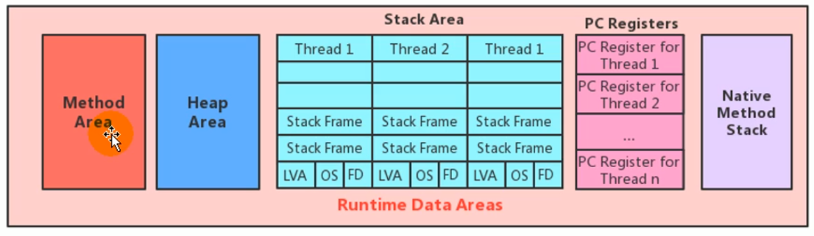
　　
　　从线程共享与否的角度来看
　　

## 7.1 栈、堆、方法区的交互关系

　　

## 7.2 方法区的理解
### 7.2.1 方法区的理解

　　《Java虚拟机规范》中明确说明：“尽管所有的方法区在逻辑上是属于堆的一部分，但一些简单的实现可能不会选择去进行垃圾收集或者进行压缩。”但对于HotSpotJVM而言，方法区还有一个别名叫做Non-Heap(非堆)，目的就是要和堆分开。
　　所以，方法区看作是一块独立于Java堆的内存空间。
　　

### 7.2.2 方法区的基本理解

<ul>
    <li>方法区(Method Area)与Java堆一样，是各个线程共享的内存区域。</li>
    <li>方法区在JVM启动的时候被创建，并且它的实际的物理内存空间中和Java堆区一样都可以是不连续的。</li>
    <li>方法区的大小，跟堆空间一样，可以选择固定大小或者可扩展。</li>
    <li>方法区的大小决定了系统可以保存多少个类，如果系统定义了太多的类，导致方法区溢出，虚拟机同样会抛出内存溢出错误：java.lang.OutOfMemoryError: PermGen space 或者java.lang.OutOfMemoryError: Metaspace。如：加载大量的第三方的jar包；Tomcat部署的工程过多(30~50个)；大量动态的生成反射类</li>
    <li>关闭JVM就会释放这个区域的内存。</li>
</ul>

### 7.2.3 HotSpot中方法区的演进

　　在jdk7及以前，习惯上把方法区，称为永久代。jdk8开始，使用元空间取代了永久代。
　　本质上，方法区和永久代并不等价。仅是对hotspot而言的。《Java虚拟机规范》对如何实现方法区，不做统一要求。例如：BEA JRockit / IBM J9 中不存在永久代的概念。
　　现在来看，当年使用永久代，不是好的idea。导致Java程序更容易OOM(超过-XX:MaxPermsize上限)
　　
　　而到了JDK8，终于完全废弃了永久代的概念，改用与JRockit、J9一样在本地内存中实现的元空间(Metaspace)来代替
　　元空间的本质和永久代类似，都是对JVM规范中方法区的实现。不过元空间与永久代最大的区别在于：**元空间不在虚拟机设置的内存中，而是使用本地内存**。
　　永久代、元空间二者并不只是名字变了，内部结构也调整了
　　根据《Java虚拟机规范》的规定，如果方法区无法满足新的内存分配需求时，将抛出OOM异常

## 7.3 设置方法区大小与OOM
### 7.3.1 设置方法区内存的大小

　　方法区的大小不必是固定的，JVM可以根据应用的需要动态调整。
<div>
    <div>
        <h5>　　jdk7及以前</h5>
        <ul>
            <li>通过来设置永久代初始分配空间。默认值是20.75M -XX:Permsize</li>
            <li>通过来设定永久代最大可分配空间。32位机器默认是64M，64位机器模式是82M -XX:MaxPermsize</li>
            <li>当JVM加载的类信息容量超过了这个值，会报异常OutOfMemoryError:PermGen space。</li>
        </ul>
    </div>
	<br/>
    <div>
        <h5>　　JDK8以后</h5>
        <ul>
            <li>元数据区大小可以使用参数 -XX:MetaspaceSize 和 -XX:MaxMetaspaceSize指定</li>
            <li>默认值依赖于平台。windows下，-XX:MetaspaceSize=21M -XX:MaxMetaspaceSize=-1//即没有限制。</li>
            <li>与永久代不同，如果不指定大小，默认情况下，虚拟机会耗尽所有的可用系统内存。如果元数据区发生溢出，虚拟机一样会抛出异常OutOfMemoryError:Metaspace</li>
            <li>-XX:MetaspaceSize：设置初始的元空间大小。对于一个64位的服务器端JVM来说，其默认的-XX:MetaspaceSize值为21MB。这就是初始的高水位线，一旦触及这个水位线，<strong>Full GC将会被触发并卸载没用的类(即这些类对应的类加载器不再存活)</strong>，然后这个高水位线将会重置。新的高水位线的值取决于GC后释放了多少元空间。如果释放的空间不足，那么在不超过MaxMetaspaceSize时，适当提高该值。如果释放空间过多，则适当降低该值。</li>
            <li>如果初始化的高水位线设置过低，上述高水位线调整情况会发生很多次。通过垃圾回收器的日志可以观察到Full GC多次调用。为了避免频繁地GC，建议将-XX:MetaspaceSize设置为一个相对较高的值。</li>
        </ul>
    </div>
</div>

### 7.3.2 如何解决这些OOM

<ol>
    <li>要解决OOM异常或heap space的异常，一般的手段是首先通过内存映像分析工具(如Eclipse Memory Analyzer)对dump出来的堆转储快照进行分析，重点是确认内存中的对象是否是必要的，也就是要先分清楚到底是出现了内存泄漏(Memory Leak)还是内存溢出(Memory Overflow)</li>
    <li>如果是内存泄漏，可进一步通过工具查看泄漏对象到GC Roots的引用链。于是就能找到泄漏对象是通过怎样的路径与GCRoots相关联并导致垃圾收集器无法自动回收它们的。掌握了泄漏对象的类型信息，以及GCRoots引用链的信息，就可以比较准确地定位出泄漏代码的位置。</li>
    <li>如果不存在内存泄漏，换句话说就是内存中的对象确实都还必须存活着，那就应当检查虚拟机的堆参数(-Xmx与-Xms)，与机器物理内存对比看是否还可以调大，从代码上检查是否存在某些对象生命周期过长、持有状态时间过长的情况，尝试减少程序运行期的内存消耗。</li>
</ol>

## 7.4 方法区的内部结构

　　

### 7.4.1 方法区(Method Area)存储什么？

　　《深入理解Java虚拟机》书中对方法区(Method Area)存储内容描述如下：**它用于存储已被虚拟机加载的类型信息、常量、静态变量、即时编译器编译后的代码缓存等**。
　　**注意，方法区仅会描述类的信息，Class对象是在堆中存入的。**
　　

### 7.4.2 方法区的内部结构

<div>
    <div>
        <h5>　　类型信息，对每个加载的类型(类class、接口interface、枚举enum、注解annotation)，JVM必须在方法区中存储以下类型信息：</h5>
        <ol>
            <li>这个类型的完整有效名称(全名=包名.类名)；</li>
            <li>这个类型直接父类的完整有效名(对于interface或是java.lang.object，这二者没有父类)；</li>
            <li>这个类型的修饰符(public，abstract，final的某个子集)；</li>
            <li>这个类型直接接口的一个有序列表。</li>
        </ol>
    </div>
	<br/>
    <div>
        <h5>　　域(Field)信息</h5>
        <ol>
            <li>JVM必须在方法区中保存类型的所有域的相关信息以及域的声明顺序。域的相关信息包括：域名称、域类型、域修饰符(public，private，protected，static，final，volatile，transient的某个子集)</li>
        </ol>
    </div>
	<br/>
    <div>
        <h5>　　方法(Method)信息，JVM必须保存所有方法的以下信息，同域信息一样包括声明顺序：</h5>
        <ol>
            <li>方法名称；</li>
            <li>方法的返回类型(或void)；</li>
            <li>方法参数的数量和类型(按顺序)；</li>
            <li>方法的修饰符(public，private，protected，static，final，synchronized，native，abstract的一个子集)；</li>
            <li>方法的字节码(bytecodes)、操作数栈、局部变量表及大小(abstract和native方法除外)；</li>
            <li>异常表(abstract和native方法除外)：每个异常处理的开始位置、结束位置、代码处理在程序计数器中的偏移地址、被捕获的异常类的常量池索引。</li>
        </ol>
    </div>
	<br/>
    <div>
        <h5>　　non-final的类变量</h5>
        <ol>
            <li>静态变量(类变量)和类关联在一起，随着类的加载而加载，他们成为类数据在逻辑上的一部分；</li>
            <li>类变量被类的所有实例共享，即使没有类实例时，你也可以访问它</li>
        </ol>
    </div>
	<br/>
    <div>
        <h5>　　补充说明：全局常量(static final)</h5>
        <ol>
            <li>被声明为final的类变量的处理方法则不同，每个全局常量在编译的时候就会被分配了。</li>
        </ol>
    </div>
</div>


### 7.4.3 运行时常量池 VS 常量池

　　
<ul>
    <li>方法区，内部包含了运行时常量池</li>
    <li>字节码文件，内部包含了常量池</li>
    <li>要弄清楚方法区，需要理解清楚ClassFile，因为加载类的信息都在方法区。</li>
    <li>要弄清楚方法区的运行时常量池，需要理解清楚ClassFile中的常量池。</li>
</ul>

　　官方文档：https://docs.oracle.com/javase/specs/jvms/se8/html/jvms-4.html
　　

　　一个有效的字节码文件中除了包含类的版本信息、字段、方法以及接口等描述符信息外，还包含一项信息就是常量池表(Constant Pool Table)，包括各种字面量和对类型、域和方法的符号引用。

　　**为什么需要常量池？**
　　一个java源文件中的类、接口，编译后产生一个字节码文件。而Java中的字节码需要数据支持，通常这种数据会很大以至于不能直接存到字节码里，换另一种方式，可以存到常量池，这个字节码包含了指向常量池的引用。在动态链接的时候会用到运行时常量池，之前有介绍。
　　比如System.out.println("hello");虽然所占字节很少，但是里面却使用了String、System、PrintStream及Object等结构。这里的代码量其实很少了，如果代码多的话，引用的结构将会更多，这里就需要用到常量池了。

　　**常量池中有什么?**
<div>
    <h5>　　常量池内存储的数据类型包括：</h5>
    <ul>
        <li>数量值</li>
        <li>字符串值</li>
        <li>类引用</li>
        <li>字段引用</li>
        <li>方法引用</li>
    </ul>
</div>

　　**小结**
　　常量池、可以看做是一张表，虚拟机指令根据这张常量表找到要执行的类名、方法名、参数类型、字面量等类型

### 7.4.4 运行时常量池

　　运行时常量池(Runtime Constant Pool)是方法区的一部分；
　　常量池表(Constant Pool Table)是Class文件的一部分，用于存放编译期生成的各种字面量与符号引用，这部分内容将在类加载后存放到方法区的运行时常量池中；
　　运行时常量池，在加载类和接口到虚拟机后，就会创建对应的运行时常量池；
　　JVM为每个已加载的类型(类或接口)都维护一个常量池。池中的数据项像数组项一样，是通过索引访问的；
　　运行时常量池中包含多种不同的常量，包括编译期就已经明确的数值字面量，也包括到运行期解析后才能够获得的方法或者字段引用。此时不再是常量池中的符号地址了，这里换为真实地址；
　　运行时常量池，相对于Class文件常量池的另一重要特征是：具备动态性；
　　运行时常量池类似于传统编程语言中的符号表(symboltable)，但是它所包含的数据却比符号表要更加丰富一些；
　　当创建类或接口的运行时常量池时，如果构造运行时常量池所需的内存空间超过了方法区所能提供的最大值，则JVM会抛OutOfMemoryError异常。

## 7.5 方法区使用举例

```
public class MethodAreaDemo {
    public static void main(String args[]) {
        int x = 500;
        int y = 100;
        int a = x / y;
        int b = 50;
        System.out.println(a+b);
    }
}
```
　　
　　
　　
　　
　　
　　
　　
　　
　　
　　
　　
　　
　　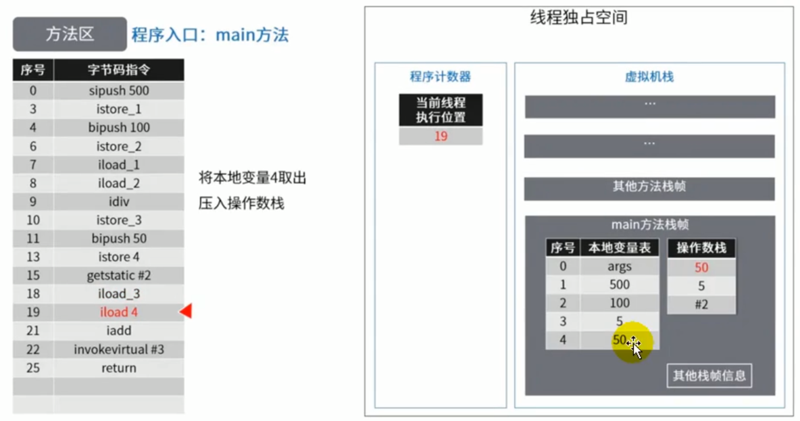
　　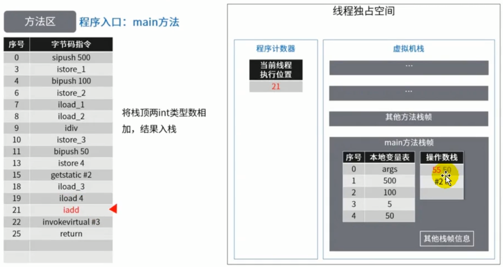
　　
　　
　　

## 7.6 方法区的演进细节

　　首先明确：只有Hotspot才有永久代。BEA JRockit、IBMJ9等来说，是不存在永久代的概念的。原则上如何实现方法区属于虚拟机实现细节，不受《Java虚拟机规范》管束，并不要求统一。

　　**Hotspot中方法区的变化：**
|:---|:---|
|JDK1.6之前|有永久代(permanet)，静态变量存储在永久代上|
|JDK1.7|有永久代，但已经逐步"去永久代"，字符串常量池，静态变量移除，保存在堆中|
|JDK1.8|无永久代，类型信息，字段，方法，常量保存在本地内存的元空间，但字符串常量池、静态变量仍然在堆中。|
　　
　　
　　

### 7.6.1 为什么永久代要被元空间替代？

　　官网地址：JEP 122: Remove the Permanent Generation (java.net)
　　JRockit是和HotSpot融合后的结果，因为JRockit没有永久代，所以他们不需要配置永久代
　　随着Java8的到来，HotSpot VM中再也见不到永久代了。但是这并不意味着类的元数据信息也消失了。这些数据被移到了一个与堆不相连的本地内存区域，这个区域叫做元空间(Metaspace)。
　　由于类的元数据分配在本地内存中，元空间的最大可分配空间就是系统可用内存空间。
　　**这项改动是很有必要的，原因有：**
　　为永久代设置空间大小是很难确定的。在某些场景下，如果动态加载类过多，容易产生Perm区的oom。比如某个实际Web工 程中，因为功能点比较多，在运行过程中，要不断动态加载很多类，经常出现致命错误。 
　　而元空间和永久代之间最大的区别在于：元空间并不在虚拟机中，而是使用本地内存。 因此，默认情况下，元空间的大小仅受本地内存限制。 
　　对永久代进行调优是很困难的。 

　　有些人认为方法区(如HotSpot虚拟机中的元空间或者永久代)是没有垃圾收集行为的，其实不然。《Java虚拟机规范》对方法区的约束是非常宽松的，提到过可以不要求虚拟机在方法区中实现垃圾收集。事实上也确实有未实现或未能完整实现方法区类型卸载的收集器存在(如JDK 11时期的ZGC收集器就不支持类卸载)。 一般来说这个区域的回收效果比较难令人满意，尤其是类型的卸载，条件相当苛刻。但是这部分区域的回收有时又确实是必要的。以前Sun公司的Bug列表中，曾出现过的若干个严重的Bug就是由于低版本的HotSpot虚拟机对此区域未完全回收而导致内存泄漏
　　**方法区的垃圾收集主要回收两部分内容：常量池中废弃的常量和不再使用的类型**。

### 7.6.2 StringTable为什么要调整位置？

　　jdk7中将StringTable放到了堆空间中。因为永久代的回收效率很低，在full gc的时候才会触发。而full gc是老年代的空间不足、永久代不足时才会触发。
　　这就导致StringTable回收效率不高。而我们开发中会有大量的字符串被创建，回收效率低，导致永久代内存不足。放到堆里，能及时回收内存。

### 7.6.3 静态变量存放在那里？

　　JDK8以前在方法区，JDK8及以后在堆中。
　　在HotSpot VM里，java.lang.Class的实例被称为"Java mirror"，意思是它是VM内部用的klass对象的"镜像"，把klass对象包装了一层来暴露给Java层使用。在InstanceKlass里有个_java_mirror字段引用着它对应的Java mirror，而mirror里也有个隐藏字段指向其对应的InstanceKlass。所以当我们写obj.getClass()，在HotSpot VM里实际上经过了两层间接引用才能找到最终的Class对象：obj->_klass->_java_mirror。
　　从《Java虚拟机规范》所定义的概念模型来看，所有Class相关的信息都应该存放在方法区之中，但方法区该如何实现，《Java虚拟机规范》并未做出规定，这就成了一件允许不同虚拟机自己灵活把握的事情。JDK7及其以后版本的HotSpot虚拟机选择把静态变量与类型在Java语言一端的映射class对象存放在一起，存储于Java堆之中，从我们的实验中也明确验证了这一点。

## 7.7 方法区的垃圾回收

　　有些人认为方法区(如Hotspot虚拟机中的元空间或者永久代)是没有垃圾收集行为的，其实不然。《Java虚拟机规范》对方法区的约束是非常宽松的，提到过可以不要求虚拟机在方法区中实现垃圾收集。事实上也确实有未实现或未能完整实现方法区类型卸载的收集器存在(如JDK11时期的zGC收集器就不支持类卸载)。

　　一般来说这个区域的回收效果比较难令人满意，尤其是类型的卸载，条件相当苛刻。但是这部分区域的回收有时又确实是必要的。以前sun公司的Bug列表中，曾出现过的若干个严重的Bug就是由于低版本的HotSpot虚拟机对此区域未完全回收而导致内存泄漏。

　　方法区的垃圾收集主要回收两部分内容：常量池中废弃的常量和不再使用的类型。

　　先来说说方法区内常量池之中主要存放的两大类常量：字面量和符号引用。字面量比较接近Java语言层次的常量概念，如文本字符串、被声明为final的常量值、8种基本类型等。
<div>
    <h5>　　符号引用则属于编译原理方面的概念，包括下面三类常量：</h5>
    <ul>
        <li>类和接口的全限定名</li>
        <li>字段的名称和描述符</li>
        <li>方法的名称和描述符</li>
    </ul>
</div>

　　HotSpot虚拟机对常量池的回收策略是很明确的，只要常量池中的常量没有被任何地方引用，就可以被回收。
　　回收废弃常量与回收Java堆中的对象非常类似。

<div>
    <h5>　　判定一个常量是否"废弃"还是相对简单，而要判定一个类型是否属于"不再被使用的类"的条件就比较苛刻了。需要同时满足下面三个条件：</h5>
    <ul>
        <li><strong>该类所有的实例都已经被回收</strong>，也就是Java堆中不存在该类及其任何派生子类的实例。 </li>
        <li><strong>加载该类的类加载器已经被回收</strong>，这个条件除非是经过精心设计的可替换类加载器的场景，如OSGi、JSP的重加载等，否则通常是很难达成的。 </li>
        <li><strong>该类对应的java.lang.Class对象没有在任何地方被引用</strong>，无法在任何地方通过反射访问该类的方法。</li>
    </ul>
</div>

　　Java虚拟机被允许对满足上述三个条件的无用类进行回收，这里说的仅仅是“被允许”，而并不是和对象一样，没有引用了就必然会回收。关于是否要对类型进行回收，HotSpot虚拟机提供了-Xnoclassgc参数进行控制，还可以使用-verbose:class 以及 -XX:+TraceClassLoading、-XX:+TraceClassUnLoading查看类加载和卸载信息

　　在大量使用反射、动态代理、CGLib等字节码框架，动态生成JSP以及OSGi这类频繁自定义类加载器的场景中，通常都需要Java虚拟机具备类型卸载的能力，以保证不会对方法区造成过大的内存压力。

## 7.8 总结

　　

## 7.10 常见面试题

　　说一下JVM内存模型吧，有哪些区？分别干什么的？

　　Java8的内存分代改进 JVM内存分哪几个区，每个区的作用是什么？
　　JVM内存分布/内存结构？栈和堆的区别？堆的结构？为什么两个survivor区？
　　Eden和survior的比例分配

　　jvm内存分区，为什么要有新生代和老年代

　　Java的内存分区
　　讲讲vm运行时数据库区，什么时候对象会进入老年代？

　　JVM的内存结构，Eden和Survivor比例。
　　JVM内存为什么要分成新生代，老年代，持久代。
　　新生代中为什么要分为Eden和survivor。

　　Jvm内存模型以及分区，需要详细到每个区放什么。
　　JVM的内存模型，Java8做了什么改。

　　java内存分配 jvm的永久代中会发生垃圾回收吗？
　　jvm内存分区，为什么要有新生代和老年代？


# 8 对象实例化及直接内存
## 8.1 对象实例化

　　

### 8.1.1 创建对象的方式

<ul>
    <li>new：最常见的方式、Xxx的静态方法，XxxBuilder/XxxFactory的静态方法；</li>
    <li>Class的newInstance方法：反射的方式，只能调用空参的构造器，权限必须是public；</li>
    <li>Constructor的newInstance(XXX)：反射的方式，可以调用空参、带参的构造器，权限没有要求；</li>
    <li>使用clone()：不调用任何的构造器，要求当前的类需要实现Cloneable接口，实现clone()；</li>
    <li>使用序列化：从文件中、从网络中获取一个对象的二进制流；</li>
    <li>第三方库 Objenesis。</li>
</ul>

### 8.1.2 创建对象的步骤

　　

<div>
    <ol>
        <li>
            <strong>判断对象对应的类是否加载、链接、初始化</strong><br/>
            　　虚拟机遇到一条new指令，首先去检查这个指令的参数能否在Metaspace的常量池中定位到一个类的符号引用，并且检查这个符号引用代表的类是否已经被加载，解析和初始化(即判断类元信息是否存在)。<br/>
            如果没有，那么在双亲委派模式下，使用当前类加载器以ClassLoader + 包名 + 类名为key进行查找对应的 .class文件；<br/>
            <ul>
                <li>如果没有找到文件，则抛出ClassNotFoundException异常；</li>
                <li>如果找到，则进行类加载，并生成对应的Class对象。</li>
            </ul>
        </li>
        <li>
            <strong>为对象分配内存</strong><br/>
            　　首先计算对象占用空间的大小，接着在堆中划分一块内存给新对象。如果实例成员变量是引用变量，仅分配引用变量空间即可，即4个字节大小
            <ul>
                <li>
                    <strong>如果内存规整：虚拟机将采用的是指针碰撞法(Bump The Point)来为对象分配内存：</strong><br/>
                    　　意思是所有用过的内存在一边，空闲的内存放另外一边，中间放着一个指针作为分界点的指示器，分配内存就仅仅是把指针指向空闲那边挪动一段与对象大小相等的距离罢了。如果垃圾收集器选择的是Serial ，ParNew这种基于压缩算法的，虚拟机采用这种分配方式。一般使用带Compact(整理)过程的收集器时，使用指针碰撞。
                </li>
                <li>
                    <strong>如果内存不规整：虚拟机需要维护一个空闲列表(Free List)来为对象分配内存：</strong><br/>
                    　　已使用的内存和未使用的内存相互交错，那么虚拟机将采用的是空闲列表来为对象分配内存。意思是虚拟机维护了一个列表，记录上那些内存块是可用的，再分配的时候从列表中找到一块足够大的空间划分给对象实例，并更新列表上的内容。
                </li>
            </ul>
            　　选择哪种分配方式由Java堆是否规整所决定，而Java堆是否规整又由所采用的垃圾收集器是否带有压缩整理功能决定。
        </li>
        <li>
            <strong>处理并发问题</strong><br/>
            　　采用CAS失败重试、区域加锁保证更新的原子性<br/>
            　　每个线程预先分配一块TLAB：通过设置 -XX:+UseTLAB参数来设定<br/>
        </li>
        <li>
            <strong>初始化分配到的内存</strong><br/>
            　　所有属性设置默认值，保证对象实例字段在不赋值时可以直接使用
        </li>
        <li>
            <strong>设置对象的对象头</strong><br/>
            　　将对象的所属类(即类的元数据信息)、对象的HashCode和对象的GC信息、锁信息等数据存储在对象的对象头中。这个过程的具体设置方式取决于JVM实现。
        </li>
        <li>
            <strong>执行init方法进行初始化</strong><br/>
            　　在Java程序的视角看来，初始化才正式开始。初始化成员变量，执行实例化代码块，调用类的构造方法，并把堆内对象的首地址赋值给引用变量。<br/>
            　　因此一般来说(由字节码中跟随invokespecial指令所决定)，new指令之后会接着就是执行方法，把对象按照程序员的意愿进行初始化，这样一个真正可用的对象才算完成创建出来。<br/>
            <h5>　　给对象属性赋值的操作</h5>
            <ul>
                <li>属性的默认初始化</li>
                <li>显式初始化</li>
                <li>代码块中初始化</li>
                <li>构造器中初始化</li>
            </ul>
            <h5>　　对象实例化的过程</h5>
            <ol>
                <li>加载类元信息；</li>
                <li>为对象分配内存；</li>
                <li>处理并发问题；</li>
                <li>属性的默认初始化(零值初始化)；</li>
                <li>设置对象头信息；</li>
                <li>属性的显式初始化、代码块中初始化、构造器中初始化。</li>
            </ol>
        </li>
    </ol>
</div>

## 8.2 对象内存布局

　　

### 8.2.1 对象头(Header)

　　对象头包含了两部分，分别是运行时元数据(Mark Word)和类型指针。如果是数组，还需要记录数组的长度。
<div>
    <div>
        <h5>　　运行时元数据</h5>
        <ol>
            <li>哈希值(HashCode)</li>
            <li>GC分代年龄</li>
            <li>锁状态标志</li>
            <li>线程持有的锁</li>
            <li>偏向线程ID</li>
            <li>偏向时间戳</li>
        </ol>
    </div>
	<br/>
    <div>
        <h5>　　类型指针</h5>
        <ul>
            <li>指向类元数据InstanceKlass，确定该对象所属的类型。</li>
        </ul>
    </div>
</div>

### 8.2.2 实例数据(Instance Data)

<div>
    <h5>　　它是对象真正存储的有效信息，包括程序代码中定义的各种类型的字段(包括从父类继承下来的和本身拥有的字段)：</h5>
    <ol>
        <li>相同宽度的字段总是被分配在一起；</li>
        <li>父类中定义的变量会出现在子类之前；</li>
        <li>如果CompactFields参数为true(默认为true)：子类的窄变量可能插入到父类变量的空隙。</li>
    </ol>
</div>

### 8.2.3 对齐填充(Padding)

　　不是必须的，也没有特别的含义，仅仅起到占位符的作用
```
public class Customer{
    int id = 1001;
    String name;
    Account acct;

    {
        name = "匿名客户";
    }

    public Customer() {
        acct = new Account();
    }
}

public class CustomerTest{
    public static void main(string[] args){
        Customer cust=new Customer();
    }
}
```
　　图示
　　

　　**小结**
　　

## 8.3 对象的访问定位

　　
　　JVM是如何通过栈帧中的对象引用访问到其内部的对象实例呢？
　　

### 8.3.1 句柄访问

　　
　　reference中存储稳定句柄地址，对象被移动(垃圾收集时移动对象很普遍)时只会改变句柄中实例数据指针即可，reference本身不需要被修改。

### 8.3.2 直接指针(HotSpot采用)

　　
　　直接指针是局部变量表中的引用，直接指向堆中的实例，在对象实例中有类型指针，指向的是方法区中的对象类型数据。

## 8.4 直接内存(Direct Memory)
### 8.4.1 直接内存概述

　　不是虚拟机运行时数据区的一部分，也不是《Java虚拟机规范》中定义的内存区域。直接内存是在Java堆外的、直接向系统申请的内存区间。来源于NIO，通过存在堆中的DirectByteBuffer操作Native内存。通常，访问直接内存的速度会优于Java堆，即读写性能高。
　　因此出于性能考虑，读写频繁的场合可能会考虑使用直接内存；
　　Java的NIO库允许Java程序使用直接内存，用于数据缓冲区。

### 8.4.2 非直接缓存区

　　使用IO读写文件，需要与磁盘交互，需要由用户态切换到内核态。在内核态时，需要两份内存存储重复数据，效率低。
　　

### 8.4.3 直接缓存区

　　使用NIO时，操作系统划出的直接缓存区可以被java代码直接访问，只有一份。NIO适合对大文件的读写操作。
　　
　　也可能导致OutOfMemoryError异常 java.lang.OutOfMemoryError: Direct buffer memory 

　　由于直接内存在Java堆外，因此它的大小不会直接受限于-Xmx指定的最大堆大小，但是系统内存是有限的，Java堆和直接内存的总和依然受限于操作系统能给出的最大内存。
　　分配回收成本较高；
　　不受JVM内存回收管理。
　　直接内存大小可以通过MaxDirectMemorySize设置。如果不指定，默认与堆的最大值-Xmx参数值一致
　　


# 9 执行引擎(Execution Engine)
## 9.1 执行引擎概述

　　执行引擎属于JVM的下层，里面包括解释器、及时编译器、垃圾回收器
　　

　　执行引擎是Java虚拟机核心的组成部分之一。
　　"虚拟机"是一个相对于“物理机”的概念，这两种机器都有代码执行能力，其区别是物理机的执行引擎是直接建立在处理器、缓存、指令集和操作系统层面上的，而虚拟机的执行引擎则是由软件自行实现的，因此可以不受物理条件制约地定制指令集与执行引擎的结构体系，能够执行那些不被硬件直接支持的指令集格式。

　　JVM的主要任务是负责装载字节码到其内部，但字节码并不能够直接运行在操作系统之上，因为字节码指令并非等价于本地机器指令，它内部包含的仅仅只是一些能够被JVM所识别的字节码指令、符号表，以及其他辅助信息。
　　
　　那么，如果想要让一个Java程序运行起来，执行引擎(Execution Engine)的任务就是将字节码指令解释/编译为对应平台上的本地机器指令.才可以。简单来说，JVM中的执行引擎充当了将高级语言翻译为机器语言的译者。

### 9.1.1 执行引擎的工作流程

<ol>
    <li>执行引擎在执行的过程中究竟需要执行什么样的字节码指令完全依赖于PC寄存器；</li>
    <li>每当执行完一项指令操作后，PC寄存器就会更新下一条需要被执行的指令地址；</li>
    <li>当然方法在执行的过程中，执行引擎有可能会通过存储在局部变量表中的对象引用准确定位到存储在Java堆区中的对象实例信息，以及通过对象头中的元数据指针定位到目标对象的类型信息。</li>
</ol>

　　
　　从外观上来看，所有的Java虚拟机的执行引擎输入，输出都是一致的：输入的是字节码二进制流，处理过程是字节码解析执行的等效过程，输出的是执行过程。

## 9.2 Java代码编译和执行过程

　　
　　大部分的程序代码转换成物理机的目标代码或虚拟机能执行的指令集之前，都需要经过上图中的各个步骤

　　Java代码编译是由Java源码编译器(前端编译器)来完成，流程图如下所示：
　　
　　Java字节码的执行是由JVM执行引擎(后端编译器)来完成，流程图 如下所示
　　

### 9.2.1 什么是解释器(Interpreter)？什么是JIT编译器？

　　解释器：当Java虚拟机启动时会根据预定义的规范对字节码采用逐行解释的方式执行，将每条字节码文件中的内容“翻译”为对应平台的本地机器指令执行。
　　JIT(Just In Time Compiler)编译器：就是虚拟机将源代码直接编译成和本地机器平台相关的机器语言。

### 9.2.2 为什么Java是半编译半解释型语言？

　　JDK1.0时代，将Java语言定位为“解释执行”还是比较准确的。再后来，Java也发展出可以直接生成本地代码的编译器。现在JVM在执行Java代码的时候，通常都会将解释执行与编译执行二者结合起来进行。
　　

## 9.3 机器码、指令、汇编语言
### 9.3.1 机器码

　　各种用二进制编码方式表示的指令，叫做机器指令码。开始，人们就用它采编写程序，这就是机器语言。
　　机器语言虽然能够被计算机理解和接受，但和人们的语言差别太大，不易被人们理解和记忆，并且用它编程容易出差错。
　　用它编写的程序一经输入计算机，CPU直接读取运行，因此和其他语言编的程序相比，执行速度最快。
　　机器指令与CPU紧密相关，所以不同种类的CPU所对应的机器指令也就不同。

### 9.3.2 指令

　　由于机器码是有0和1组成的二进制序列，可读性实在太差，于是人们发明了指令。
　　指令就是把机器码中特定的0和1序列，简化成对应的指令(一般为英文简写，如mov，inc等)，可读性稍好
　　由于不同的硬件平台，执行同一个操作，对应的机器码可能不同，所以不同的硬件平台的同一种指令(比如mov)，对应的机器码也可能不同。

### 9.3.3 指令集

　　不同的硬件平台，各自支持的指令，是有差别的。因此每个平台所支持的指令，称之为对应平台的指令集。 如常见的
　　x86指令集，对应的是x86架构的平台
　　ARM指令集，对应的是ARM架构的平台

### 9.3.4 汇编语言

　　由于指令的可读性还是太差，于是人们又发明了汇编语言。
　　在汇编语言中，用助记符(Mnemonics)代替机器指令的操作码，用<mark地址符号(Symbol)或标号(Label)代替指令或操作数的地址。在不同的硬件平台，汇编语言对应着不同的机器语言指令集，通过汇编过程转换成机器指令。
　　由于计算机只认识指令码，所以用汇编语言编写的程序还必须翻译成机器指令码，计算机才能识别和执行。

### 9.3.5 高级语言

　　为了使计算机用户编程序更容易些，后来就出现了各种高级计算机语言。高级语言比机器语言、汇编语言更接近人的语言
　　当计算机执行高级语言编写的程序时，仍然需要把程序解释和编译成机器的指令码。完成这个过程的程序就叫做解释程序或编译程序。
　　

　　高级语言也不是直接翻译成机器指令，而是翻译成汇编语言码，如下面说的C和C++
　　C、C++源程序执行过程
　　编译过程又可以分成两个阶段：编译和汇编。
　　编译过程：是读取源程序(字符流)，对之进行词法和语法的分析，将高级语言指令转换为功能等效的汇编代码
　　汇编过程：实际上指把汇编语言代码翻译成目标机器指令的过程
　　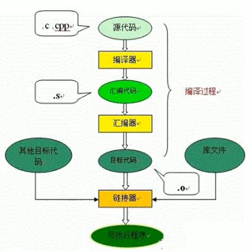

### 9.3.6 字节码

　　字节码是一种中间状态(中间码)的二进制代码(文件)，它比机器码更抽象，需要直译器转译后才能成为机器码
　　字节码主要为了实现特定软件运行和软件环境、与硬件环境无关。
　　字节码的实现方式是通过编译器和虚拟机器。编译器将源码编译成字节码，特定平台上的虚拟机器将字节码转译为可以直接执行的指令。字节码典型的应用为：Java bytecode
　　

## 9.4 解释器

　　JVM设计者们的初衷仅仅只是单纯地为了满足Java程序实现跨平台特性，因此避免采用静态编译的方式直接生成本地机器指令，从而诞生了实现解释器在运行时采用逐行解释字节码执行程序的想法。
　　
　　为什么Java源文件不直接翻译成JMV，而是翻译成字节码文件？可能是因为直接翻译的代价是比较大的。

### 9.4.1 解释器工作机制

　　解释器真正意义上所承担的角色就是一个运行时“翻译者”，将字节码文件中的内容“翻译”为对应平台的本地机器指令执行。
　　当一条字节码指令被解释执行完成后，接着再根据PC寄存器中记录的下一条需要被执行的字节码指令执行解释操作。

### 9.4.2 解释器分类

<div>
    <div>
        <h5>　　在Java的发展历史里，一共有两套解释执行器，即古老的字节码解释器、现在普遍使用的模板解释器：</h5>
        <ol>
            <li>字节码解释器在执行时通过纯软件代码模拟字节码的执行，效率非常低下。</li>
            <li>而模板解释器将每一条字节码和一个模板函数相关联，模板函数中直接产生这条字节码执行时的机器码，从而很大程度上提高了解释器的性能。</li>
        </ol>
    </div>
	<br/>
    <div>
        <h5>　　在HotSpot VM中，解释器主要由Interpreter模块和Code模块构成。</h5>
        <ol>
            <li>Interpreter模块：实现了解释器的核心功能；</li>
            <li>Code模块：用于管理HotSpot VM在运行时生成的本地机器指令。</li>
        </ol>
    </div>
</div>

### 9.4.3 现状

　　由于解释器在设计和实现上非常简单，因此除了Java语言之外，还有许多高级语言同样也是基于解释器执行的，比如Python、Perl、Ruby等。但是在今天，基于解释器执行已经沦落为低效的代名词，并且时常被一些C/C++程序员所调侃。
　　为了解决这个问题，JVM平台支持一种叫作即时编译的技术。即时编译的目的是避免函数被解释执行，而是将整个函数体编译成为机器码，每次函数执行时，只执行编译后的机器码即可，这种方式可以使执行效率大幅度提升。
　　不过无论如何，基于解释器的执行模式仍然为中间语言的发展做出了不可磨灭的贡献。

## 9.5 JIT编译器
### 9.5.1 Java代码的执行分类

<ol>
    <li>第一种是将源代码编译成字节码文件，然后在运行时通过解释器将字节码文件转为机器码执行 </li>
    <li>第二种是编译执行(直接编译成机器码，但是要知道不同机器上编译的机器码是不一样，而字节码是可以跨平台的)。现代虚拟机为了提高执行效率，会使用即时编译技术(JIT，Just In Time)将方法编译成机器码后再执行</li>
</ol> 

　　HotSpot VM是目前市面上高性能虚拟机的代表作之一。它采用解释器与即时编译器并存的架构。在Java虚拟机运行时，解释器和即时编译器能够相互协作，各自取长补短，尽力去选择最合适的方式来权衡编译本地代码的时间和直接解释执行代码的时间。
　　在今天，Java程序的运行性能早已脱胎换骨，已经达到了可以和C/C++ 程序一较高下的地步。

　　**问题来了**
　　有些开发人员会感觉到诧异，既然HotSpot VM中已经内置JIT编译器了，那么为什么还需要再使用解释器来“拖累”程序的执行性能呢？比如JRockit VM内部就不包含解释器，字节码全部都依靠即时编译器编译后执行。
　　首先明确： 当程序启动后，解释器可以马上发挥作用，省去编译的时间，立即执行。 编译器要想发挥作用，把代码编译成本地代码，需要一定的执行时间。但编译为本地代码后，执行效率高。
　　所以： 尽管JRockit VM中程序的执行性能会非常高效，但程序在启动时必然需要花费更长的时间来进行编译。对于服务端应用来说，启动时间并非是关注重点，但对于那些看中启动时间的应用场景而言，或许就需要采用解释器与即时编译器并存的架构来换取一个平衡点。在此模式下，当Java虚拟器启动时，解释器可以首先发挥作用，而不必等待即时编译器全部编译完成后再执行，这样可以省去许多不必要的编译时间。随着时间的推移，编译器发挥作用，把越来越多的代码编译成本地代码，获得更高的执行效率。
　　同时，解释执行在编译器进行激进优化不成立的时候，作为编译器的“逃生门”。

### 9.5.2 HotSpot JVM执行方式

　　当虚拟机启动的时候，解释器可以首先发挥作用，而不必等待即时编译器全部编译完成再执行，这样可以省去许多不必要的编译时间。并且随着程序运行时间的推移，即时编译器逐渐发挥作用，根据热点探测功能，将有价值的字节码编译为本地机器指令，以换取更高的程序执行效率。

　　**案例来了**
　　注意解释执行与编译执行在线上环境微妙的辩证关系。机器在热机状态可以承受的负载要大于冷机状态。如果以热机状态时的流量进行切流，可能使处于冷机状态的服务器因无法承载流量而假死。
　　在生产环境发布过程中，以分批的方式进行发布，根据机器数量划分成多个批次，每个批次的机器数至多占到整个集群的1/8。曾经有这样的故障案例：某程序员在发布平台进行分批发布，在输入发布总批数时，误填写成分为两批发布。如果是热机状态，在正常情况下一半的机器可以勉强承载流量，但由于刚启动的JVM均是解释执行，还没有进行热点代码统计和JIT动态编译，导致机器启动之后，当前1/2发布成功的服务器马上全部宕机，此故障说明了JIT的存在。—阿里团队
　　

### 9.5.3 概念解释

　　Java 语言的“编译期”其实是一段“不确定”的操作过程，因为它可能是指一个前端编译器(其实叫“编译器的前端”更准确一些)把.java文件转变成.class文件的过程；
　　也可能是指虚拟机的后端运行期编译器(JIT编译器，Just In Time Compiler)把字节码转变成机器码的过程。
　　还可能是指使用静态提前编译器(AOT编译器，Ahead of Time Compiler)直接把.java文件编译成本地机器代码的过程。
<ol>a
    <li>前端编译器：Sun的Javac、Eclipse JDT中的增量式编译器(ECJ)。 </li>
    <li>JIT编译器：HotSpot VM的C1、C2编译器。 </li>
    <li>AOT 编译器：GNU Compiler for the Java(GCJ)、Excelsior JET。 </li>
</ol>

### 9.5.4 热点代码及探测技术

　　当然是否需要启动JIT编译器将字节码直接编译为对应平台的本地机器指令，则需要根据代码被调用执行的频率而定。关于那些需要被编译为本地代码的字节码，也被称之为“热点代码”，JIT编译器在运行时会针对那些频繁被调用的“热点代码”做出深度优化，将其直接编译为对应平台的本地机器指令，以此提升Java程序的执行性能。
　　一个被多次调用的方法，或者是一个方法体内部循环次数较多的循环体都可以被称之为“热点代码”，因此都可以通过JIT编译器编译为本地机器指令。由于这种编译方式发生在方法的执行过程中，因此被称之为栈上替换，或简称为OSR(On Stack Replacement)编译。
　　一个方法究竟要被调用多少次，或者一个循环体究竟需要执行多少次循环才可以达到这个标准？必然需要一个明确的阈值，JIT编译器才会将这些“热点代码”编译为本地机器指令执行。这里主要依靠热点探测功能。
　　目前HotSpot VM所采用的热点探测方式是基于计数器的热点探测。
　　采用基于计数器的热点探测，HotSpot VM将会为每一个方法都建立2个不同类型的计数器，分别为方法调用计数器(Invocation Counter)和回边计数器(Back Edge Counter)。
<div>
    <h5>　　方法调用计数器(Invocation Counter)和回边计数器(Back Edge Counter)</h5>
    <ol>
        <li>方法调用计数器用于统计方法的调用次数</li>
        <li>回边计数器则用于统计循环体执行的循环次数</li>
    </ol>
</div>

　　**方法调用计数器**
　　这个计数器就用于统计方法被调用的次数，它的默认阀值在Client模式下是1500次，在Server模式下是10000次。超过这个阈值，就会触发JIT编译。
　　这个阀值可以通过虚拟机参数 -XX:CompileThreshold来人为设定。
　　当一个方法被调用时，会先检查该方法是否存在被JIT编译过的版本，如果存在，则优先使用编译后的本地代码来执行。如果不存在已被编译过的版本，则将此方法的调用计数器值加1，然后判断方法调用计数器与回边计数器值之和是否超过方法调用计数器的阀值。如果已超过阈值，那么将会向即时编译器提交一个该方法的代码编译请求。
　　

　　**热点衰减**
　　如果不做任何设置，方法调用计数器统计的并不是方法被调用的绝对次数，而是一个相对的执行频率，即一段时间之内方法被调用的次数。当超过一定的时间限度，如果方法的调用次数仍然不足以让它提交给即时编译器编译，那这个方法的调用计数器就会被减少一半，这个过程称为方法调用计数器热度的衰减(Counter Decay)，而这段时间就称为此方法统计的半衰周期(Counter Half Life Time)
　　进行热度衰减的动作是在虚拟机进行垃圾收集时顺便进行的，可以使用虚拟机参数 -XX:-UseCounterDecay 来关闭热度衰减，让方法计数器统计方法调用的绝对次数，这样，只要系统运行时间足够长，绝大部分方法都会被编译成本地代码。
　　另外，可以使用-XX:CounterHalfLifeTime参数设置半衰周期的时间，单位是秒。

　　**回边计数器**
　　它的作用是统计一个方法中循环体代码执行的次数，在字节码中遇到控制流向后跳转的指令称为“回边”(Back Edge)。显然，建立回边计数器统计的目的就是为了触发OSR编译。
　　

### 9.5.5 HotSpotVM 可以设置程序执行方法

　　缺省情况下HotSpot VM是采用解释器与即时编译器并存的架构，当然开发人员可以根据具体的应用场景，通过命令显式地为Java虚拟机指定在运行时到底是完全采用解释器执行，还是完全采用即时编译器执行。如下所示：
<div>
    <h5>　　执行方法设置</h5>
    <ol>
        <li>-Xint：完全采用解释器模式执行程序；</li>
        <li>-Xcomp：完全采用即时编译器模式执行程序。如果即时编译出现问题，解释器会介入执行；</li>
        <li>-Xmixed：采用解释器+即时编译器的混合模式共同执行程序。</li>
    </ol>
</div>

### 9.5.6 HotSpotVM中 JIT 分类
　　JIT的编译器还分为了两种，分别是C1和C2，在HotSpot VM中内嵌有两个JIT编译器，分别为Client Compiler和Server Compiler，但大多数情况下我们简称为C1编译器 和 C2编译器。开发人员可以通过如下命令显式指定Java虚拟机在运行时到底使用哪一种即时编译器，如下所示：
<div>
    <h5>　　指定Java虚拟机在运行时到底使用哪一种即时编译器</h5>
    <ol>
        <li>-client：指定Java虚拟机运行在Client模式下，并使用C1编译器；C1编译器会对字节码进行简单和可靠的优化，耗时短，以达到更快的编译速度。</li>
        <li>-server：指定Java虚拟机运行在server模式下，并使用C2编译器。C2进行耗时较长的优化，以及激进优化，但优化的代码执行效率更高。</li>
    </ol>
</div>

　　分层编译(Tiered Compilation)策略：程序解释执行(不开启性能监控)可以触发C1编译，将字节码编译成机器码，可以进行简单优化，也可以加上性能监控，C2编译会根据性能监控信息进行激进优化。
　　不过在Java7版本之后，一旦开发人员在程序中显式指定命令“-server"时，默认将会开启分层编译策略，由C1编译器和C2编译器相互协作共同来执行编译任务。

<div>
    <div>
        <h5>　　C1 和 C2编译器不同的优化策略</h5>
    </div>
	<br/>
    <div>
        <h5>　　在不同的编译器上有不同的优化策略，C1编译器上主要有方法内联、去虚拟化、冗余消除：</h5>
        <ol>
            <li>方法内联：将引用的函数代码编译到引用点处，这样可以减少栈帧的生成，减少参数传递以及跳转过程；</li>
            <li>去虚拟化：对唯一的实现类进行内联；</li>
            <li>冗余消除：在运行期间把一些不会执行的代码折叠掉。</li>
        </ol>
    </div>
	<br/>
    <div>
        <h5>　　C2的优化主要是在全局层面，逃逸分析(前面讲过，并不成熟)是优化的基础。基于逃逸分析在C2上有如下几种优化：</h5>
        <ol>
            <li>标量替换：用标量值代替聚合对象的属性值；</li>
            <li>栈上分配：对于未逃逸的对象分配对象在栈而不是堆；</li>
            <li>同步消除：清除同步操作，通常指synchronized。</li>
        </ol>
    </div>
	<br/>
    <div>
        <h5>　　总结</h5><br/>
        　　一般来讲，JIT编译出来的机器码性能比解释器高。C2编译器启动时长比C1慢，系统稳定执行以后，C2编译器执行速度远快于C1编译器
    </div>
</div>

<div>
    <div>
        <h5>　　写到最后1</h5>
        <ol>
            <li>自JDK10起，HotSpot又加入了一个全新的及时编译器：Graal编译器；</li>
            <li>编译效果短短几年时间就追评了C2编译器，未来可期；</li>
            <li>目前，带着实验状态标签，需要使用开关参数-XX:+UnlockExperimentalvMOptions -XX:+UseJVMCICompiler去激活才能使用。</li>
        </ol>
    </div>
	<br/>
    <div>
        <h5>　　写到最后2：AOT编译器</h5><br/>
        　　jdk9引入了AOT编译器(静态提前编译器，Ahead of Time Compiler)<br/>
        　　Java 9引入了实验性AOT编译工具jaotc。它借助了Graal编译器，将所输入的Java类文件转换为机器码，并存放至生成的动态共享库之中。<br/>
        　　所谓AOT编译，是与即时编译相对立的一个概念。我们知道，即时编译指的是在程序的运行过程中，将字节码转换为可在硬件上直接运行的机器码，并部署至托管环境中的过程。而AOT编译指的则是，在程序运行之前，便将字节码转换为机器码的过程。<br/>
        　　最大的好处：Java虚拟机加载已经预编译成二进制库，可以直接执行。不必等待及时编译器的预热，减少Java应用给人带来“第一次运行慢” 的不良体验<br/>
    </div>
	<br/>
    <div>
        <h5>　　缺点：</h5>
        <ol>
            <li>破坏了java"一次编译，到处运行"的理念，必须为每个不同的硬件，OS编译对应的发行包；</li>
            <li>降低了Java链接过程的动态性，加载的代码在编译器就必须全部已知。；</li>
            <li>还需要继续优化中，最初只支持Linux X64 java base。</li>
        </ol>
    </div>
</div>


# 10 StringTable字符串常量池
## 10.1 String的基本特性

　　String：字符串，使用一对""引起来表示；
　　String声明为final的，不可被继承；
　　String实现了Serializable接口：表示字符串是支持序列化的；
　　String实现了Comparable接口：表示string可以比较大小；
　　String在jdk8及以前内部定义了final char[] value用于存储字符串数据。JDK9时改为byte[]。

### 10.1.1 String在jdk9中存储结构变更

　　官网地址：JEP 254: Compact Strings (java.net)
　　**动机**
　　目前String类的实现将字符存储在一个char数组中，每个字符使用两个字节(16位)。从许多不同的应用中收集到的数据表明，字符串是堆使用的主要组成部分，此外，大多数字符串对象只包含Latin-1字符。这些字符只需要一个字节的存储空间，因此这些字符串对象的内部字符数组中有一半的空间没有被使用。

　　**说明**
　　我们建议将String类的内部表示方法从UTF-16字符数组改为字节数组加编码标志域。新的String类将根据字符串的内容，以ISO-8859-1/Latin-1(每个字符一个字节)或UTF-16(每个字符两个字节)的方式存储字符编码。编码标志将表明使用的是哪种编码。
　　与字符串相关的类，如AbstractStringBuilder、StringBuilder和StringBuffer将被更新以使用相同的表示方法，HotSpot VM的内在字符串操作也是如此。
　　这纯粹是一个实现上的变化，对现有的公共接口没有变化。目前没有计划增加任何新的公共API或其他接口。
　　迄今为止所做的原型设计工作证实了内存占用的预期减少，GC活动的大幅减少，以及在某些角落情况下的轻微性能倒退。
　　结论：String再也不用char[] 来存储了，改成了byte [] 加上编码标记，节约了一些空间

### 10.1.2 String的基本特性

<div>
    <h5>　　String：代表不可变的字符序列。简称：不可变性。</h5>
    <ul>
        <li>当对字符串重新赋值时，需要重写指定内存区域赋值，不能使用原有的value进行赋值；</li>
        <li>当对现有的字符串进行连接操作时，也需要重新指定内存区域赋值，不能使用原有的value进行赋值；</li>
        <li>当调用string的replace()方法修改指定字符或字符串时，也需要重新指定内存区域赋值，不能使用原有的value进行赋值。</li>
    </ul>
</div>

　　通过字面量的方式(区别于new)给一个字符串赋值，此时的字符串值声明在字符串常量池中。
　　字符串常量池是不会存储相同内容的字符串的
　　String的String Pool是一个固定大小的Hashtable，默认值大小长度是1009。如果放进String Pool的String非常多，就会造成Hash冲突严重，从而导致链表会很长，而链表长了后直接会造成的影响就是当调用String.intern时性能会大幅下降。

<div>
    <h5>　　使用-XX:StringTablesize可设置StringTable的长度</h5>
    <ul>
        <li>在jdk6中StringTable是固定的，就是1009的长度，所以如果常量池中的字符串过多就会导致效率下降很快。StringTablesize设置没有要求 </li>
        <li>在jdk7中，StringTable的长度默认值是60013，StringTablesize设置没有要求 </li>
        <li>在JDK8中，设置StringTable长度的话，1009是可以设置的最小值 </li>
    </ul>
</div>

## 10.2 String的内存分配

　　在Java语言中有8种基本数据类型和一种比较特殊的类型String。这些类型为了使它们在运行过程中速度更快、更节省内存，都提供了一种常量池的概念。
　　常量池就类似一个Java系统级别提供的缓存。8种基本数据类型的常量池都是系统协调的。

<div>
    <div>
        <h5>　　String类型的常量池比较特殊。它的主要使用方法有两种：</h5>
        <ul>
            <li>直接使用双引号声明出来的String对象会直接存储在常量池中；</li>
            <li>如果不是用双引号声明的String对象，可以使用String提供的intern()方法。</li>
        </ul>
    </div>
	<br/>
    <div>
        <h5>　　Java 6及以前，字符串常量池存放在永久代。</h5><br/>
    </div>
	<br/>
    <div>
        <h5>　　Java 7中 Oracle的工程师对字符串池的逻辑做了很大的改变，即将字符串常量池的位置调整到Java堆内：</h5>
        <ul>
            <li>所有的字符串都保存在堆(Heap)中，和其他普通对象一样，这样可以让你在进行调优应用时仅需要调整堆大小就可以了；</li>
            <li>字符串常量池概念原本使用得比较多，但是这个改动使得我们有足够的理由让我们重新考虑在Java 7中使用String.intern()。</li>
        </ul>
    </div>
	<br/>
    <div>
        <h5>　　Java8元空间，字符串常量在堆。</h5><br/>
    </div>
</div>


　　
　　

　　**StringTable为什么要调整？**
　　官网地址：Java SE 7 Features and Enhancements (oracle.com)
　　简介：在JDK 7中，内部字符串不再分配在Java堆的永久代中，而是分配在Java堆的主要部分(称为年轻代和老年代)，与应用程序创建的其他对象一起。这种变化将导致更多的数据驻留在主Java堆中，而更少的数据在永久代中，因此可能需要调整堆的大小。大多数应用程序将看到由于这一变化而导致的堆使用的相对较小的差异，但加载许多类或大量使用String.intern()方法的大型应用程序将看到更明显的差异。

## 10.3 String的基本操作

　　Java语言规范里要求完全相同的字符串字面量，应该包含同样的Unicode字符序列(包含同一份码点序列的常量)，并且必须是指向同一个String类实例。

## 10.4 字符串拼接操作

　　常量与常量的拼接结果在常量池，原理是编译期优化；
　　常量池中不会存在相同内容的变量；
　　只要其中有一个是变量，结果就在堆中。变量拼接的原理是StringBuilder；
　　如果拼接的结果调用intern()方法，则主动将常量池中还没有的字符串对象放入池中，并返回此对象地址；
　　使用final修饰，即为常量。会在编译器进行代码优化。在实际开发中，能够使用final的，尽量使用。

~~~
    String a = "a" + "b"; => String a = "ab"; 编译期优化
    String b = "a";
    String c = "c" + b; => String c = new StringBuilder("c").append(b).toString();
~~~

　　通过StringBuilder的append方式的速度，要比直接对String使用“+”拼接的方式快的不是一点半点，在实际开发中，对于需要多次或大量拼接的操作，在不考虑线程安全问题时，我们就应该尽可能使用StringBuilder进行append操作。
　　StringBuilder空参构造器的初始化大小为16。那么，如果提前知道需要拼接String的个数，就应该直接使用带参构造器指定capacity，以减少扩容的次数(扩容的逻辑可以自行查看源代码)。

## 10.5 intern()的使用

　　**注意，只有调用intern()或对字面量进行ldc操作，字符串都会进入字符串常量池。**
　　当调用intern方法时，如果池子里已经包含了一个与这个String对象相等的字符串，正如equals(Object)方法所确定的，那么池子里的字符串会被返回。否则，这个String对象被添加到池中，并返回这个String对象的引用。
　　由此可见，对于任何两个字符串s和t，当且仅当s.equals(t)为真时，s.intern() == t.intern()为真。
　　所有字面字符串和以字符串为值的常量表达式都是interned。
　　返回一个与此字符串内容相同的字符串，但保证是来自一个唯一的字符串池。
　　intern是一个native方法，调用的是底层C的方法
　　如果不是用双引号声明的String对象，可以使用String提供的intern方法，它会从字符串常量池中查询当前字符串是否存在，若不存在就会将当前字符串放入常量池中。
　　如果在任意字符串上调用String.intern方法，那么其返回结果所指向的那个类实例，必须和直接以常量形式出现的字符串实例完全相同。
　　Interned string就是确保字符串在内存里只有一份拷贝，这样可以节约内存空间，加快字符串操作任务的执行速度。注意，这个值会被存放在字符串内部池(String Intern Pool)。

### 10.5.1 intern的使用：JDK6 vs JDK7/8　　

<ol>
    <li>
        JDK1.6中，将这个字符串对象尝试放入串池：
        <ul>
            <li>如果串池中有，则并不会放入。返回已有的串池中的对象的地址；</li>
            <li>如果没有，会把此对象复制一份，放入串池，并返回串池中的对象地址。</li>
        </ul>
    </li>
    <li>
        JDK1.7起，将这个字符串对象尝试放入串池：
        <ul>
            <li>如果串池中有，则并不会放入。返回已有的串池中的对象的地址；</li>
            <li>如果没有，则会把对象的引用地址复制一份，放入串池，并返回串池中的引用地址。</li>
        </ul>
    </li>
</ol>

　　
　　
　　

### 10.5.2 intern的效率测试：空间角度

　　对于程序中大量使用存在的字符串时，尤其存在很多已经重复的字符串时，使用intern()方法能够节省内存空间。
　　大的网站平台，需要内存中存储大量的字符串。比如社交网站，很多人都存储：北京市、海淀区等信息。这时候如果字符串都调用intern()方法，就会很明显降低内存的大小。

## 10.6 StringTable的垃圾回收

~~~
public class StringGCTest {
    /**
     * -Xms15m -Xmx15m -XX:+PrintGCDetails
     */
    public static void main(String[] args) {
        
        for (int i = 0; i < 100000; i++) {
            String.valueOf(i).intern();
        }
    }
}
~~~

## 10.7 G1中的String去重操作

　　官网地址：JEP 192: String Deduplication in G1 (java.net)
　　目前，许多大规模的Java应用程序在内存上遇到了瓶颈。测量表明，在这些类型的应用程序中，大约25%的Java堆实时数据集被String'对象所消耗。此外，这些 "String "对象中大约有一半是重复的，其中重复意味着 "string1.equals(string2) "是真的。在堆上有重复的String'对象，从本质上讲，只是一种内存的浪费。这个项目将在G1垃圾收集器中实现自动和持续的`String'重复数据删除，以避免浪费内存，减少内存占用。
　　注意这里说的重复，指的是在堆中的数据，而不是常量池中的，因为常量池中的本身就不会重复

<div>
    <h5>　　对许多Java应用(有大的也有小的)做的测试得出以下结果：</h5>
    <ul>
        <li>堆存活数据集合里面string对象占了25%；</li>
        <li>堆存活数据集合里面重复的string对象有13.5%；</li>
        <li>string对象的平均长度是45。</li>
    </ul>
</div>

　　许多大规模的Java应用的瓶颈在于内存，测试表明，在这些类型的应用里面，Java堆中存活的数据集合差不多25%是String对象。更进一步，这里面差不多一半string对象是重复的，重复的意思是说： stringl.equals(string2)= true。堆上存在重复的String对象必然是一种内存的浪费。这个项目将在G1垃圾收集器中实现自动持续对重复的string对象进行去重，这样就能避免浪费内存。

　　**实现**
　　当垃圾收集器工作的时候，会访问堆上存活的对象。对每一个访问的对象都会检查是否是候选的要去重的String对象；
　　如果是，把这个对象的一个引用插入到队列中等待后续的处理。一个去重的线程在后台运行，处理这个队列。处理队列的一个元素意味着从队列删除这个元素，然后尝试去重它引用的string对象；
　　使用一个hashtable来记录所有的被String对象使用的不重复的char数组。当去重的时候，会查这个hashtable，来看堆上是否已经存在一个一模一样的char数组；
　　如果存在，String对象会被调整引用那个数组，释放对原来的数组的引用，最终会被垃圾收集器回收掉；
　　如果查找失败，char数组会被插入到hashtable，这样以后的时候就可以共享这个数组了。

　　**命令行选项**
　　开启String去重，默认是不开启的，需要手动开启。 
　　UseStringDeduplication(bool)  
　　打印详细的去重统计信息 
　　PrintStringDeduplicationStatistics(bool)  
　　达到这个年龄的String对象被认为是去重的候选对象
　　StringpeDuplicationAgeThreshold(uintx)


# 11 垃圾回收概述及算法
## 11.1 垃圾回收概述
### 11.1.1 什么是垃圾？

　　关于垃圾收集有三个经典问题：
　　1.哪些内存需要回收？
　　2.什么时候回收？
　　3.如何回收？

　　垃圾收集机制是Java的招牌能力，极大地提高了开发效率。如今，垃圾收集几乎成为现代语言的标配，即使经过如此长时间的发展，Java的垃圾收集机制仍然在不断的演进中，不同大小的设备、不同特征的应用场景，对垃圾收集提出了新的挑战，这当然也是面试的热点。

　　**什么是垃圾？**
　　垃圾是指在运行程序中没有任何指针指向的对象，这个对象就是需要被回收的垃圾。如果不及时对内存中的垃圾进行清理，那么，这些垃圾对象所占的内存空间会一直保留到应用程序的结束，被保留的空间无法被其它对象使用，甚至可能导致内存溢出。

### 11.1.2 为什么需要GC

　　对于高级语言来说，一个基本认知是如果不进行垃圾回收，内存迟早都会被消耗完，因为不断地分配内存空间而不进行回收，就好像不停地生产生活垃圾而从来不打扫一样。
　　除了释放没用的对象，垃圾回收也可以清除内存里的记录碎片。碎片整理将所占用的堆内存移到堆的一端，以便JVM将整理出的内存分配给新的对象。
　　随着应用程序所应付的业务越来越庞大、复杂，用户越来越多，没有GC就不能保证应用程序的正常进行。而经常造成STW的GC又跟不上实际的需求，所以才会不断地尝试对GC进行优化。

### 11.1.3 早期垃圾回收

　　在早期的C/C++时代，垃圾回收基本上是手工进行的。开发人员可以使用new关键字进行内存申请，并使用delete关键字进行内存释放。
　　这种方式可以灵活控制内存释放的时间，但是会给开发人员带来频繁申请和释放内存的管理负担。倘若有一处内存区间由于程序员编码的问题忘记被回收，那么就会产生内存泄漏，垃圾对象永远无法被清除，随着系统运行时间的不断增长，垃圾对象所耗内存可能持续上升，直到出现内存溢出并造成应用程序崩溃。

### 11.1.4 Java垃圾回收机制

　　自动内存管理，无需开发人员手动参与内存的分配与回收，这样降低内存泄漏和内存溢出的风险

　　**担忧**
　　对于Java开发人员而言，自动内存管理就像是一个黑匣子，如果过度依赖于“自动”，那么这将会是一场灾难，最严重的就会弱化Java开发人员在程序出现内存溢出时定位问题和解决问题的能力。
　　此时，了解JVM的自动内存分配和内存回收原理就显得非常重要，只有在真正了解JVM是如何管理内存后，我们才能够在遇见outofMemoryError时，快速地根据错误异常日志定位问题和解决问题。
　　当需要排查各种内存溢出、内存泄漏问题时，当垃圾收集成为系统达到更高并发量的瓶颈时，我们就必须对这些“自动化”的技术实施必要的监控和调节。

　　**GC主要关注的区域**
　　GC主要关注于"方法区"和"堆"中的垃圾收集

　　垃圾收集器可以对年轻代回收，也可以对老年代回收，甚至是全栈和方法区的回收。其中，Java堆是垃圾收集器的工作重点，从次数上讲：
　　频繁收集Young区；
　　较少收集Old区；
　　基本不收集Perm区(元空间)。

## 11.2 垃圾回收相关算法

　　**对象存活判断**
　　在堆里存放着几乎所有的Java对象实例，在GC执行垃圾回收之前，首先需要区分出内存中哪些是存活对象，哪些是已经死亡的对象。只有被标记为己经死亡的对象，GC才会在执行垃圾回收时，释放掉其所占用的内存空间，因此这个过程我们可以称为垃圾标记阶段。
　　那么在JVM中究竟是如何标记一个死亡对象呢？简单来说，当一个对象已经不再被任何的存活对象继续引用时，就可以宣判为已经死亡。
　　判断对象存活一般有两种方式：引用计数算法和可达性分析算法。

### 11.2.1 标记阶段：引用计数算法

　　**方式一：引用计数算法**
　　引用计数算法(Reference Counting)比较简单，对每个对象保存一个整型的引用计数器属性。用于记录对象被引用的情况。
　　对于一个对象A，只要有任何一个对象引用了A，则A的引用计数器就加1；当引用失效时，引用计数器就减1。只要对象A的引用计数器的值为0，即表示对象A不可能再被使用，可进行回收。
　　优点：实现简单，垃圾对象便于辨识；判定效率高，回收没有延迟性。

　　**缺点：**
　　它需要单独的字段存储计数器，这样的做法增加了存储空间的开销；
　　每次赋值都需要更新计数器，伴随着加法和减法操作，这增加了时间开销；
　　引用计数器有一个严重的问题，即无法处理循环引用的情况。这是一条致命缺陷，导致在Java的垃圾回收器中没有使用这类算法。

　　**循环引用**
　　

　　引用计数算法，是很多语言的资源回收选择，例如因人工智能而更加火热的Python，它更是同时支持引用计数和垃圾收集机制。
　　具体哪种最优是要看场景的，业界有大规模实践中仅保留引用计数机制，以提高吞吐量的尝试。
　　Java并没有选择引用计数，是因为其存在一个基本的难题，也就是很难处理循环引用关系。

　　Python如何解决循环引用？
　　手动解除：很好理解，就是在合适的时机，解除引用关系。 使用弱引用weakref，weakref是Python提供的标准库，旨在解决循环引用。

### 11.2.2 标记阶段：可达性分析算法

　　**可达性分析算法(根搜索算法、追踪性垃圾收集)**
　　相对于引用计数算法而言，可达性分析算法不仅同样具备实现简单和执行高效等特点，更重要的是该算法可以有效地解决在引用计数算法中循环引用的问题，防止内存泄漏的发生。
　　相较于引用计数算法，这里的可达性分析就是Java、C#选择的。这种类型的垃圾收集通常也叫作追踪性垃圾收集(Tracing Garbage Collection)
　　所谓"GCRoots”根集合就是一组必须活跃的引用。

　　**基本思路**
　　可达性分析算法是以根对象集合(GCRoots)为起始点，按照从上至下的方式搜索被根对象集合所连接的目标对象是否可达；
　　使用可达性分析算法后，内存中的存活对象都会被根对象集合直接或间接连接着，搜索所走过的路径称为引用链(Reference Chain)；
　　如果目标对象没有任何引用链相连，则是不可达的，就意味着该对象己经死亡，可以标记为垃圾对象；
　　在可达性分析算法中，只有能够被根对象集合直接或者间接连接的对象才是存活对象。
　　

<div>
    <h5>　　在Java语言中，GC Roots包括以下几类元素：</h5>
    <ol>
        <li>虚拟机栈中引用的对象：比如：各个线程被调用的方法中使用到的参数、局部变量等；</li>
        <li>本地方法栈内JNI(通常说的本地方法)引用的对象；</li>
        <li>方法区中类静态属性引用的对象，比如：Java类的引用类型静态变量；</li>
        <li>方法区中常量引用的对象，比如：字符串常量池(String Table)里的引用；</li>
        <li>所有被同步锁synchronized持有的对象；</li>
        <li>Java虚拟机内部的引用，如基本数据类型对应的Class对象，一些常驻的异常对象(如：NullPointerException、OutOfMemoryError)，系统类加载器；</li>
        <li>反映java虚拟机内部情况的JMXBean、JVMTI中注册的回调、本地代码缓存等；</li>
        <li>除了这些固定的GC Roots集合以外，根据用户所选用的垃圾收集器以及当前回收的内存区域不同，还可以有其他对象"临时性"地加入，共同构成完整GC Roots集合。比如：分代收集和局部回收(PartialGC)。</li>
    </ol>
</div>

　　如果只针对Java堆中的某一块区域进行垃圾回收(比如：典型的只针对新生代)，必须考虑到内存区域是虚拟机自己的实现细节，更不是孤立封闭的，这个区域的对象完全有可能被其他区域的对象所引用，这时候就需要一并将关联的区域对象也加入GCRoots集合中去考虑，才能保证可达性分析的准确性。
　　小技巧：由于Root采用栈方式存放变量和指针，所以如果一个指针，它保存了堆内存里面的对象，但是自己又不存放在堆内存里面，那它就是一个Root。

　　**注意**
　　如果要使用可达性分析算法来判断内存是否可回收，那么分析工作必须在一个能保障一致性的快照中进行。这点不满足的话分析结果的准确性就无法保证。
　　这点也是导致GC进行时必须“stop The World”的一个重要原因。
　　即使是号称(几乎)不会发生停顿的CMS收集器中，枚举根节点时也是必须要停顿的。

### 11.2.3 对象的finalization机制

　　Java语言提供了对象终止(finalization)机制来允许开发人员提供对象被销毁之前的自定义处理逻辑。
　　当垃圾回收器发现没有引用指向一个对象，即：垃圾回收此对象之前，总会先调用这个对象的finalize()方法。
　　finalize() 方法允许在子类中被重写，用于在对象被回收时进行资源释放。通常在这个方法中进行一些资源释放和清理的工作，比如关闭文件、套接字和数据库连接等。

<div>
    <h5>　　永远不要主动调用某个对象的finalize()方法，应该交给垃圾回收机制调用。理由包括下面三点：</h5>
    <ol>
        <li>在finalize()时可能会导致对象复活，例将此变量重新连接到一个GC ROOTS；</li>
        <li>finalize()方法的执行时间是没有保障的，它完全由GC线程决定，极端情况下，若不发生GC，则finalize()方法将没有执行机会。finalize()方法只会在Finalizer线程中被执行，此线程是在GC的时候会调用，所以执行时间没有保障。</li>
        <li>一个糟糕的finalize()会严重影响GC的性能。比如写个死循环。</li>
    </ol>
</div>

　　从功能上来说，finalize()方法与C中的析构函数比较相似，但是Java采用的是基于垃圾回收器的自动内存管理机制，所以finalize()方法在本质上不同于C中的析构函数。
　　由于finalize()方法的存在，虚拟机中的对象一般处于三种可能的状态。

　　**生存还是死亡？**
　　如果从所有的根节点都无法访问到某个对象，说明对象己经不再使用了。一般来说，此对象需要被回收。但事实上，也并非是“非死不可”的，这时候它们暂时处于“缓刑”阶段。一个无法触及的对象有可能在某一个条件下“复活”自己，如果这样，那么对它的回收就是不合理的。
<div>
    <div>
        <h5>　　为此，定义虚拟机中的对象可能的三种状态。如下：</h5>
        <ol>
            <li>可触及的：从根节点开始，可以到达这个对象；</li>
            <li>可复活的：对象的所有引用都被释放，但是对象有可能在finalize()中复活；</li>
            <li>不可触及的：对象的finalize()被调用，并且没有复活，那么就会进入不可触及状态。不可触及的对象不可能被复活，因为finalize()只会被调用一次。</li>
            <li>以上3种状态中，是由于finalize()方法的存在，进行的区分。只有在对象不可触及时才可以被回收。</li>
        </ol>
    </div>
	<br/>
    <div>
        <h5>　　具体过程</h5><br/>
        <h5>　　判定一个对象objA是否可回收，至少要经历两次标记过程：</h5><br/>
        <ol>
            <li>如果对象objA到GC Roots没有引用链，则进行第一次标记。</li>
            <li>进行筛选，判断此对象是否有必要执行finalize()方法</li>
            <li>如果对象objA没有重写finalize()方法，或者finalize()方法已经被虚拟机调用过，则虚拟机视为“没有必要执行”，objA被判定为不可触及的。</li>
            <li>如果对象objA重写了finalize()方法，且还未执行过，那么objA会被插入到F-Queue队列中，由一个虚拟机自动创建的、低优先级的Finalizer线程触发其finalize()方法执行。</li>
            <li>finalize()方法是对象逃脱死亡的最后机会，稍后GC会对F-Queue队列中的对象进行第二次标记。如果objA在finalize()方法中与引用链上的任何一个对象建立了联系，那么在第二次标记时，objA会被移出“即将回收”集合。之后，对象会再次出现没有引用存在的情况。在这个情况下，finalize方法不会被再次调用，对象会直接变成不可触及的状态，也就是说，一个对象的finalize方法只会被调用一次。</li>
            <li>在第一次GC时，执行了finalize方法，但finalize()方法只会被调用一次，所以第二次该对象被GC标记并清除了。</li>
        </ol>
    </div>
</div>


### 11.2.4 MAT与JProfiler的GC Roots溯源　　

　　**MAT是什么？**
　　MAT是Memory Analyzer的简称，它是一款功能强大的Java堆内存分析器。用于查找内存泄漏以及查看内存消耗情况。
　　MAT是基于Eclipse开发的，是一款免费的性能分析工具。
　　可以在 http://www.eclipse.org/mat/ 下载并使用MAT

　　**获取dump文件**
　　**方式一：命令行使用 jmap**
　　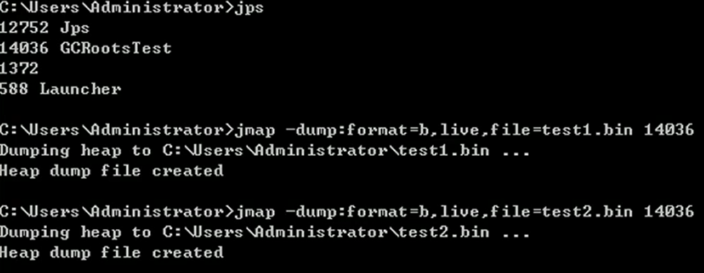

　　**方式二：使用JVisualVM导出**
　　捕获的heap dump文件是一个临时文件，关闭JVisualVM后自动删除，若要保留，需要将其另存为文件。
　　可通过以下方法捕获heap dump：
　　在左侧“Application"(应用程序)子窗口中右击相应的应用程序，选择Heap Dump(堆Dump)；
　　在Monitor(监视)子标签页中点击Heap Dump(堆Dump)按钮。 
　　本地应用程序的Heap dumps作为应用程序标签页的一个子标签页打开。同时，heap dump在左侧的Application(应用程序)栏中对应一个含有时间戳的节点。
　　右击这个节点选择save as(另存为)即可将heap dump保存到本地。

　　**方式三：使用JVisualVM导出**
　　

　　**JProfiler的GC Roots溯源**
　　我们在实际的开发中，一般不会查找全部的GC Roots，可能只是查找某个对象的整个链路，或者称为GC Roots溯源，这个时候，我们就可以使用JProfiler
　　

### 11.2.5 清除阶段：标记-清除算法　　

　　当成功区分出内存中存活对象和死亡对象后，GC接下来的任务就是执行垃圾回收，释放掉无用对象所占用的内存空间，以便有足够的可用内存空间为新对象分配内存。
　　目前在JVM中比较常见的三种垃圾收集算法是标记一清除算法(Mark-Sweep)、复制算法(copying)、标记-压缩算法(Mark-Compact)

<div>
    <h5>　　标记-清除算法(Mark-Sweep)</h5><br/>
    　　标记-清除算法(Mark-Sweep)是一种非常基础和常见的垃圾收集算法，该算法被J.McCarthy等人在1960年提出并并应用于Lisp语言。<br/>
    <ul style="list-style-type: none;">
        <li>
            执行过程：当堆中的有效内存空间(available memory)被耗尽的时候，就会停止整个程序(也被称为stop the world)，然后进行两项工作，第一项则是标记，第二项则是清除
            <ol>
                <li>标记：Collector从引用根节点开始遍历，**标记所有被引用的对象(标记的不是垃圾对象)**。一般是在对象的Header中记录为可达对象；</li>
                <li>清除：Collector对堆内存从头到尾进行线性的遍历，如果发现某个对象在其Header中没有标记为可达对象，则将其回收。 </li>
            </ol>
        </li>
        <li>
            缺点
            <ol>
                <li>标记清除算法的效率不算高；</li>
                <li>在进行GC的时候，需要停止整个应用程序，用户体验较差；</li>
                <li>这种方式清理出来的空闲内存是不连续的，产生内碎片，需要维护一个空闲列表。</li>
            </ol>
        </li>
    </ul>
</div>

　　
　　**何为清除？**
　　这里所谓的清除并不是真的置空，而是把需要清除的对象地址保存在空闲的地址列表里。下次有新对象需要加载时，判断垃圾的位置空间是否够，如果够，就存放覆盖原有的地址。

### 11.2.6 清除阶段：复制算法

　　**复制(Copying)算法**
　　为了解决标记-清除算法在垃圾收集效率方面的缺陷，M.L.Minsky于1963年发表了著名的论文，“使用双存储区的Lisp语言垃圾收集器CA LISP Garbage Collector Algorithm Using Serial Secondary Storage)”。M.L.Minsky在该论文中描述的算法被人们称为复制(Copying)算法，它也被M.L.Minsky本人成功地引入到了Lisp语言的一个实现版本中。

　　**核心思想**
　　将活着的内存空间分为两块，每次只使用其中一块，在垃圾回收时将正在使用的内存中的存活对象复制到未被使用的内存块中，之后清除正在使用的内存块中的所有对象，交换两个内存的角色，最后完成垃圾回收。
　　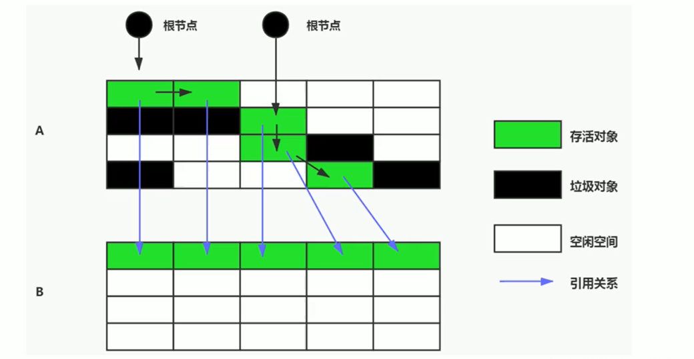

<div>
    <div>
        <h5>　　优点</h5>
        <ol>
            <li>没有标记和清除过程，实现简单，运行高效；</li>
            <li>复制过去以后保证空间的连续性，不会出现“碎片”问题。</li>
        </ol>
    </div>
	<br/>
    <div>
        <h5>　　缺点</h5>
        <ol>
            <li>此算法的缺点也是很明显的，就是需要两倍的内存空间；</li>
            <li>对于G1这种分拆成为大量region的GC，复制而不是移动，意味着GC需要维护region之间对象引用关系，不管是内存占用或者时间开销也不小。</li>
        </ol>
        <h5>　　特别的</h5><br/>
        　　如果系统中的非垃圾对象很多，复制就会很耗时。复制算法需要复制的存活对象数量不太大，或者说非常低才行。<br/>
        <h5>　　应用场景</h5><br/>
        　　在新生代，对常规应用的垃圾回收，一次通常可以回收70% - 99% 的内存空间。回收性价比很高。所以现在的商业虚拟机都是用这种收集算法回收新生代。<br/>
    </div>
</div>

　　

### 11.2.7 清除阶段：标记-压缩(整理)算法

　　**标记-压缩(或标记-整理、Mark-Compact)算法**
　　复制算法的高效性是建立在存活对象少、垃圾对象多的前提下的。这种情况在新生代经常发生，但是在老年代，更常见的情况是大部分对象都是存活对象。如果依然使用复制算法，由于存活对象较多，复制的成本也将很高。因此，**基于老年代垃圾回收的特性，需要使用其他的算法**。
　　标记一清除算法的确可以应用在老年代中，但是该算法不仅执行效率低下，而且在执行完内存回收后还会产生内存碎片，所以JVM的设计者需要在此基础之上进行改进。标记-压缩(Mark-Compact)算法由此诞生。
　　1970年前后，G.L.Steele、C.J.Chene和D.s.Wise等研究者发布标记-压缩算法。在许多现代的垃圾收集器中，人们都使用了标记-压缩算法或其改进版本。

<div>
    <h5>　　执行过程</h5>
    <ol>
        <li>第一阶段和标记清除算法一样，从根节点开始标记所有被引用对象 </li>
        <li>第二阶段将所有的存活对象压缩到内存的一端，按顺序排放。 </li>
        <li>之后，清理边界外所有的空间。</li>
    </ol>
</div>

　　

　　标记-压缩算法的最终效果等同于标记-清除算法执行完成后，再进行一次内存碎片整理，因此，也可以把它称为标记-清除-压缩(Mark-Sweep-Compact)算法。
　　二者的本质差异在于标记-清除算法是一种非移动式的回收算法，标记-压缩是移动式的。是否移动回收后的存活对象是一项优缺点并存的风险决策。可以看到，标记的存活对象将会被整理，按照内存地址依次排列，而未被标记的内存会被清理掉。如此一来，当我们需要给新对象分配内存时，JVM只需要持有一个内存的起始地址即可，这比维护一个空闲列表显然少了许多开销。

　　**指针碰撞(Bump the Pointer)**
　　如果内存空间以规整和有序的方式分布，即已用和未用的内存都各自一边，彼此之间维系着一个记录下一次分配起始点的标记指针，当为新对象分配内存时，只需要通过修改指针的偏移量将新对象分配在第一个空闲内存位置上，这种分配方式就叫做指针碰撞(Bump tHe Pointer)。

<div>
    <div>
        <h5>　　优点</h5>
        <ol>
            <li>消除了标记-清除算法当中，内存区域分散的缺点，我们需要给新对象分配内存时，JVM只需要持有一个内存的起始地址即可；</li>
            <li>消除了复制算法当中，内存减半的高额代价。</li>
        </ol>
    </div>
	<br/>
    <div>
        <h5>　　缺点</h5>
        <ol>
            <li>从效率上来说，标记-整理算法要低于复制算法；</li>
            <li>移动对象的同时，如果对象被其他对象引用，则还需要调整引用的地址；</li>
            <li>移动过程中，需要全程暂停用户应用程序。即：STW。</li>
        </ol>
    </div>
</div>


### 11.2.8 小结

||Mark-Sweep|Mark-Compact|Copying|
|:---:|:---:|:---:|:---:|
|**速率**|中等|最慢|最快|
|**空间开销**|少(但会堆积碎片)|少(不堆积碎片)|通常需要活对象的2倍空间(不堆积碎片)|
|**移动对象**|否|是|是|

　　效率上来说，复制算法是当之无愧的老大，但是却浪费了太多内存。
　　而为了尽量兼顾上面提到的三个指标，标记-整理算法相对来说更平滑一些，但是效率上不尽如人意，它比复制算法多了一个标记的阶段，比标记-清除多了一个整理内存的阶段
　　难道就没有一种最优算法吗？
　　回答：无，没有最好的算法，只有最合适的算法。

### 11.2.9 分代收集算法

　　前面所有这些算法中，并没有一种算法可以完全替代其他算法，它们都具有自己独特的优势和特点。分代收集算法应运而生。
　　分代收集算法，是基于这样一个事实：不同的对象的生命周期是不一样的。因此，不同生命周期的对象可以采取不同的收集方式，以便提高回收效率。一般是把Java堆分为新生代和老年代，这样就可以根据各个年代的特点使用不同的回收算法，以提高垃圾回收的效率。
　　在Java程序运行的过程中，会产生大量的对象，其中有些对象是与业务信息相关，比如Http请求中的Session对象、线程、Socket连接，这类对象跟业务直接挂钩，因此生命周期比较长。但是还有一些对象，主要是程序运行过程中生成的临时变量，这些对象生命周期会比较短，比如：String对象，由于其不变类的特性，系统会产生大量的这些对象，有些对象甚至只用一次即可回收。
　　目前几乎所有的GC都采用分代手机算法执行垃圾回收的。
　　在HotSpot中，基于分代的概念，GC所使用的内存回收算法必须结合年轻代和老年代各自的特点。

　　**年轻代(Young Gen)**
　　年轻代特点：区域相对老年代较小，对象生命周期短、存活率低，回收频繁。
　　这种情况复制算法的回收整理，速度是最快的。复制算法的效率只和当前存活对象大小有关，因此很适用于年轻代的回收。而复制算法内存利用率不高的问题，通过hotspot中的两个survivor的设计得到缓解。

　　**老年代(Tenured Gen)**
　　老年代特点：区域较大，对象生命周期长、存活率高，回收不及年轻代频繁。
　　这种情况存在大量存活率高的对象，复制算法明显变得不合适。一般是由标记-清除或者是标记-清除与标记-整理的混合实现。
<ol>
    <li>Mark阶段的开销与存活对象的数量成正比。</li>
    <li>Sweep阶段的开销与所管理区域的大小成正相关。</li>
    <li>Compact阶段的开销与存活对象的数据成正比。</li>
</ol>

　　以HotSpot中的CMS回收器为例，CMS是基于Mark-Sweep实现的，对于对象的回收效率很高。而对于碎片问题，CMS采用基于Mark-Compact算法的Serial Old回收器作为补偿措施：当内存回收不佳(碎片导致的Concurrent Mode Failure时)，将采用Serial Old执行Full GC以达到对老年代内存的整理。
　　分代的思想被现有的虚拟机广泛使用。几乎所有的垃圾回收器都区分新生代和老年代

### 11.2.10 增量收集算法、分区算法

　　**增量收集算法**
　　上述现有的算法，在垃圾回收过程中，应用软件将处于一种Stop the World的状态。在Stop the World状态下，应用程序所有的线程都会挂起，暂停一切正常的工作，等待垃圾回收的完成。如果垃圾回收时间过长，应用程序会被挂起很久，将严重影响用户体验或者系统的稳定性。为了解决这个问题，即对实时垃圾收集算法的研究直接导致了增量收集(Incremental Collecting)算法的诞生。

　　**基本思想**
　　如果一次性将所有的垃圾进行处理，需要造成系统长时间的停顿，那么就可以让垃圾收集线程和应用程序线程交替执行。每次，垃圾收集线程只收集一小片区域的内存空间，接着切换到应用程序线程。依次反复，直到垃圾收集完成。
　　总的来说，增量收集算法的基础仍是传统的标记-清除和复制算法。增量收集算法通过对线程间冲突的妥善处理，允许垃圾收集线程以分阶段的方式完成标记、清理或复制工作。

　　**缺点**
　　使用这种方式，由于在垃圾回收过程中，间断性地还执行了应用程序代码，所以能减少系统的停顿时间。但是，因为线程切换和上下文转换的消耗，会使得垃圾回收的总体成本上升，造成系统吞吐量的下降。

　　**分区算法**
　　一般来说，在相同条件下，堆空间越大，一次GC时所需要的时间就越长，有关GC产生的停顿也越长。为了更好地控制GC产生的停顿时间，将一块大的内存区域分割成多个小块region，根据目标的停顿时间，每次合理地回收若干个小区间，而不是整个堆空间，从而减少一次GC所产生的停顿。
　　分代算法将按照对象的生命周期长短划分成两个部分，分区算法将整个堆空间划分成连续的不同小区间。
　　每一个小区间都独立使用，独立回收。这种算法的好处是可以控制一次回收多少个小区间。
　　

　　**写到最后**
　　注意，这些只是基本的算法思路，实际GC实现过程要复杂的多，目前还在发展中的前沿GC都是复合算法，并且并行和并发兼备。


# 12 垃圾回收相关概念
## 12.1 System.gc()的理解

　　在默认情况下，通过system.gc()或者Runtime.getRuntime().gc() 的调用，会显式触发Full GC，同时对老年代和新生代进行回收，尝试释放被丢弃对象占用的内存。
　　然而System.gc() 调用附带一个免责声明，无法保证对垃圾收集器的调用。(不能确保立即生效)
　　JVM实现者可以通过System.gc() 调用来决定JVM的GC行为。而一般情况下，垃圾回收应该是自动进行的，无须手动触发，否则就太过于麻烦了。在一些特殊情况下，如我们正在编写一个性能基准，我们可以在运行之间调用System.gc()

## 12.2 内存溢出与内存泄露

　　**内存溢出(OOM)**
　　内存溢出相对于内存泄漏来说，尽管更容易被理解，但是同样的，内存溢出也是引发程序崩溃的罪魁祸首之一。
　　由于GC一直在发展，所有一般情况下，除非应用程序占用的内存增长速度非常快，造成垃圾回收已经跟不上内存消耗的速度，否则不太容易出现ooM的情况。
　　大多数情况下，GC会进行各种年龄段的垃圾回收，实在不行了就放大招，来一次独占式的Full GC操作，这时候会回收大量的内存，供应用程序继续使用。
　　javadoc中对OutOfMemoryError的解释是，没有空闲内存，并且垃圾收集器也无法提供更多内存。

　　**首先说没有空闲内存的情况：说明Java虚拟机的堆内存不够。原因有二：**
　　**1.Java虚拟机的堆内存设置不够**
　　比如：可能存在内存泄漏问题；也很有可能就是堆的大小不合理，比如我们要处理比较可观的数据量，但是没有显式指定JVM堆大小或者指定数值偏小。我们可以通过参数-Xms 、-Xmx来调整。
　　**2.代码中创建了大量大对象，并且长时间不能被垃圾收集器收集（存在被引用）**
　　对于老版本的Oracle JDK，因为永久代的大小是有限的，并且JVM对永久代垃圾回收（如，常量池回收、卸载不再需要的类型）非常不积极，所以当我们不断添加新类型的时候，永久代出现OutOfMemoryError也非常多见，尤其是在运行时存在大量动态类型生成的场合；类似intern字符串缓存占用太多空间，也会导致OOM问题。对应的异常信息，会标记出来和永久代相关：“java.lang.OutOfMemoryError: PermGen space"。
　　随着元数据区的引入，方法区内存已经不再那么窘迫，所以相应的ooM有所改观，出现OOM，异常信息则变成了：“java.lang.OutofMemoryError:Metaspace"。直接内存不足，也会导致OOM。 

　　这里面隐含着一层意思是，在抛出OutOfMemoryError之前，通常垃圾收集器会被触发，尽其所能去清理出空间：在引用机制分析中，涉及到JVM会去尝试回收软引用指向的对象等；在java.nio.BIts.reserveMemory()方法中，我们能清楚的看到，System.gc()会被调用，以清理空间。

　　当然，也不是在任何情况下垃圾收集器都会被触发的：比如，我们去分配一个超大对象，类似一个超大数组超过堆的最大值，JVM可以判断出垃圾收集并不能解决这个问题，所以直接抛出OutOfMemoryError。

　　**内存泄漏（Memory Leak）**
　　也称作“存储渗漏”。严格来说，只有对象不会再被程序用到了，但是GC又不能回收他们的情况，才叫内存泄漏。
　　但实际情况很多时候一些不太好的实践（或疏忽）会导致对象的生命周期变得很长甚至导致00M，也可以叫做宽泛意义上的“内存泄漏”。
　　尽管内存泄漏并不会立刻引起程序崩溃，但是一旦发生内存泄漏，程序中的可用内存就会被逐步蚕食，直至耗尽所有内存，最终出现OutOfMemory异常，导致程序崩溃。
　　注意，这里的存储空间并不是指物理内存，而是指虚拟内存大小，这个虚拟内存大小取决于磁盘交换区设定的大小。
　　

　　**举例**
　　**1.单例模式**
　　单例的生命周期和应用程序是一样长的，所以单例程序中，如果持有对外部对象的引用的话，那么这个外部对象是不能被回收的，则会导致内存泄漏的产生。 
　　**2.一些提供close的资源未关闭导致内存泄漏**
　　数据库连接（dataSourse.getConnection() ），网络连接（socket）和io连接必须手动close，否则是不能被回收的。 

## 12.3 Stop The World　　

　　Stop-the-World，简称STW，指的是GC事件发生过程中，会产生应用程序的停顿。停顿产生时整个应用程序线程都会被暂停，没有任何响应，有点像卡死的感觉，这个停顿称为STW。

<div>
    <h5>　　可达性分析算法中枚举根节点（GC Roots）会导致所有Java执行线程停顿：</h5>
    <ol>
        <li>分析工作必须在一个能确保一致性的快照中进行</li>
        <li>一致性指整个分析期间整个执行系统看起来像被冻结在某个时间点上</li>
        <li>如果出现分析过程中对象引用关系还在不断变化，则分析结果的准确性无法保证</li>
    </ol>
</div>

　　被STW中断的应用程序线程会在完成GC之后恢复，频繁中断会让用户感觉像是网速不快造成电影卡带一样，所以我们需要减少STW的发生。
　　STW事件和采用哪款GC无关，所有的GC都有这个事件。
　　哪怕是G1也不能完全避免Stop-the-World情况发生，只能说垃圾回收器越来越优秀，回收效率越来越高，尽可能地缩短了暂停时间。
　　STW是JVM在后台自动发起和自动完成的。在用户不可见的情况下，把用户正常的工作线程全部停掉。
　　开发中不要用System.gc() 会导致Stop-the-World的发生。

## 12.4 垃圾回收的并行与并发

　　**并发（Concurrent）**
　　在操作系统中，是指一个时间段中有几个程序都处于已启动运行到运行完毕之间，且这几个程序都是在同一个处理器上运行。
　　并发不是真正意义上的“同时进行”，只是CPU把一个时间段划分成几个时间片段（时间区间），然后在这几个时间区间之间来回切换，由于CPU处理的速度非常快，只要时间间隔处理得当，即可让用户感觉是多个应用程序同时在进行。
　　

　　**并行（Parallel）**
　　当系统有一个以上CPU时，当一个CPU执行一个进程时，另一个CPU可以执行另一个进程，两个进程互不抢占CPU资源，可以同时进行，我们称之为并行（Parallel）。
　　其实决定并行的因素不是CPU的数量，而是CPU的核心数量，比如一个CPU多个核也可以并行。
　　适合科学计算，后台处理等弱交互场景。
　　

　　**并发 vs 并行**
　　并发，指的是多个事情，在同一时间段内同时发生了；
   并行，指的是多个事情，在同一时间点上同时发生了； 
   并发的多个任务之间是互相抢占资源的；
   并行的多个任务之间是不互相抢占资源的；
   只有在多CPU或者一个CPU多核的情况中，才会发生并行； 
   否则，看似同时发生的事情，其实都是并发执行的。 

　　**垃圾回收的并发与并行**
　　并发和并行，在谈论垃圾收集器的上下文语境中，它们可以解释如下：
　　**并行（Parallel）**：指多条垃圾收集线程并行工作，但此时用户线程仍处于等待状态。如ParNew、Parallel Scavenge、Parallel Old；
　　**串行（Serial）**：相较于并行的概念，单线程执行。如果内存不够，则程序暂停，启动JM垃圾回收器进行垃圾回收。回收完，再启动程序的线程。
　　
　　**并发（Concurrent）**：指用户线程与垃圾收集线程同时执行（但不一定是并行的，可能会交替执行），垃圾回收线程在执行时不会停顿用户程序的运行。用户程序在继续运行，而垃圾收集程序线程运行于另一个CPU上；如：CMS、G1
　　

## 12.5 安全点与安全区域

　　**安全点**
　　程序执行时并非在所有地方都能停顿下来开始GC，只有在特定的位置才能停顿下来开始GC，这些位置称为“安全点（Safepoint）”。
　　Safe Point的选择很重要，如果太少可能导致GC等待的时间太长，如果太频繁可能导致运行时的性能问题。大部分指令的执行时间都非常短暂，通常会根据“是否具有让程序长时间执行的特征”为标准。比如：选择一些执行时间较长的指令作为Safe Point，如方法调用、循环跳转和异常跳转等。

　　如何在GC发生时，检查所有线程都跑到最近的安全点停顿下来呢？
　　抢先式中断：（目前没有虚拟机采用了）首先中断所有线程。如果还有线程不在安全点，就恢复线程，让线程跑到安全点。
　　主动式中断：设置一个中断标志，各个线程运行到Safe Point的时候主动轮询这个标志，如果中断标志为真，则将自己进行中断挂起。（有轮询的机制）。

　　**安全区域（Safe Resion）**
　　Safepoint 机制保证了程序执行时，在不太长的时间内就会遇到可进入GC的Safepoint。但是，程序“不执行”的时候呢？例如线程处于Sleep 状态或Blocked 状态，这时候线程无法响应JVM的中断请求，“走”到安全点去中断挂起，JVM也不太可能等待线程被唤醒。对于这种情况，就需要安全区域（Safe Region）来解决。
　　安全区域是指在一段代码片段中，对象的引用关系不会发生变化，在这个区域中的任何位置开始Gc都是安全的。我们也可以把Safe Region看做是被扩展了的Safepoint。

<div>
    <h5>　　实际执行时</h5>
    <ol>
        <li>当线程运行到Safe Region的代码时，首先标识已经进入了Safe Relgion，如果这段时间内发生GC，JVM会忽略标识为Safe Region状态的线程；</li>
        <li>当线程即将离开Safe Region时，会检查JVM是否已经完成GC，如果完成了，则继续运行，否则线程必须等待直到收到可以安全离开Safe Region的信号为止；</li>
    </ol>
</div>

## 12.6 再谈引用：强引用 

　　我们希望能描述这样一类对象：当内存空间还足够时，则能保留在内存中；如果内存空间在进行垃圾收集后还是很紧张，则可以抛弃这些对象。
　　【既偏门又非常高频的面试题】强引用、软引用、弱引用、虚引用有什么区别？具体使用场景是什么？
　　在JDK1.2版之后，Java对引用的概念进行了扩充，将引用分为：强引用（Strong Reference）、软引用（Soft Reference）、弱引用（Weak Reference）、虚引用（Phantom Reference）这4种引用强度依次逐渐减弱。
　　除强引用外，其他3种引用均可以在java.lang.ref包中找到它们的身影。如下图，显示了这3种引用类型对应的类，开发人员可以在应用程序中直接使用它们。
　　

<div>
    <h5>　　Reference子类中只有终结器引用是包内可见的，其他3种引用类型均为public，可以在应用程序中直接使用:</h5>
    <ol>
        <li>
            <strong>强引用（StrongReference）</strong>：最传统的“引用”的定义，是指在程序代码之中普遍存在的引用赋值，即类似“Object obj = new Object()”这种引用关系。无论任何情况下，只要强引用关系还存在，垃圾收集器就永远不会回收掉被引用的对象。
        </li>
        <li>
            <strong>软引用（SoftReference）</strong>：在系统将要发生内存溢出之前，将会把这些对象列入回收范围之中进行第二次回收。如果这次回收后还没有足够的内存，才会抛出内存流出异常。
        </li>
        <li>
            <strong>弱引用（WeakReference）</strong>：被弱引用关联的对象只能生存到下一次垃圾收集之前。当垃圾收集器工作时，无论内存空间是否足够，都会回收掉被弱引用关联的对象。
        </li>
        <li>
            <strong>虚引用（PhantomReference）</strong>：一个对象是否有虚引用的存在，完全不会对其生存时间构成影响，也无法通过虚引用来获得一个对象的实例。为一个对象设置虚引用关联的唯一目的就是能在这个对象被收集器回收时收到一个系统通知。
        </li>
    </ol>
</div>

　　**强引用（Strong Reference）——不回收**
　　在Java程序中，最常见的引用类型是强引用（普通系统99%以上都是强引用），也就是我们最常见的普通对象引用，也是默认的引用类型。
　　当在Java语言中使用new操作符创建一个新的对象，并将其赋值给一个变量的时候，这个变量就成为指向该对象的一个强引用。
　　强引用的对象是可触及的，垃圾收集器就永远不会回收掉被引用的对象。
　　对于一个普通的对象，如果没有其他的引用关系，只要超过了引用的作用域或者显式地将相应（强）引用赋值为nu11，就是可以当做垃圾被收集了，当然具体回收时机还是要看垃圾收集策略。
　　相对的，软引用、弱引用和虚引用的对象是软可触及、弱可触及和虚可触及的，在一定条件下，都是可以被回收的。所以，强引用是造成Java内存泄漏的主要原因之一。

<div>
    <h5>　　强引用具备以下特点：</h5>
    <ol>
        <li>强引用可以直接访问目标对象；</li>
        <li>强引用所指向的对象在任何时候都不会被系统回收，虚拟机宁愿抛出OOM异常，也不会回收强引用所指向对象；</li>
        <li>强引用可能导致内存泄漏。</li>
    </ol>
</div>

## 12.8 再谈引用： 软引用

　　**软引用（Soft Reference）——内存不足即回收**
　　软引用是用来描述一些还有用，但非必需的对象。只被软引用关联着的对象，在系统将要发生内存溢出异常前，会把这些对象列进回收范围之中进行第二次回收，如果这次回收还没有足够的内存，才会抛出内存溢出异常。
　　软引用通常用来实现内存敏感的缓存。比如：高速缓存就有用到软引用。如果还有空闲内存，就可以暂时保留缓存，当内存不足时清理掉，这样就保证了使用缓存的同时，不会耗尽内存。
　　垃圾回收器在某个时刻决定回收软可达的对象的时候，会清理软引用，并可选地把引用存放到一个引用队列（Reference Queue）。
　　类似弱引用，只不过Java虚拟机会尽量让软引用的存活时间长一些，迫不得已才清理。
　　在JDK1.2版之后提供了java.lang.ref.SoftReference类来实现软引用
~~~
Object obj = new Object(); // 声明强引用
SoftReference<Object> sf = new SoftReference<>(obj);
obj = null; //销毁强引用
~~~

## 12.9 再谈引用：弱引用

　　**弱引用（Weak Reference）——发现即回收**
　　弱引用也是用来描述那些非必需对象，只被弱引用关联的对象只能生存到下一次垃圾收集发生为止。在系统GC时，只要发现弱引用，不管系统堆空间使用是否充足，都会回收掉只被弱引用关联的对象。
　　但是，由于垃圾回收器的线程通常优先级很低，因此，并不一定能很快地发现持有弱引用的对象。在这种情况下，弱引用对象可以存在较长的时间。
　　弱引用和软引用一样，在构造弱引用时，也可以指定一个引用队列，当弱引用对象被回收时，就会加入指定的引用队列，通过这个队列可以跟踪对象的回收情况。
　　软引用、弱引用都非常适合来保存那些可有可无的缓存数据。如果这么做，当系统内存不足时，这些缓存数据会被回收，不会导致内存溢出。而当内存资源充足时，这些缓存数据又可以存在相当长的时间，从而起到加速系统的作用。
　　在JDK1.2版之后提供了WeakReference类来实现弱引用
~~~
Object obj = new Object(); // 声明强引用
WeakReference<Object> sf = new WeakReference<>(obj);
obj = null; //销毁强引用
~~~

　　弱引用对象与软引用对象的最大不同就在于，当GC在进行回收时，需要通过算法检查是否回收软引用对象，而对于弱引用对象，GC总是进行回收。弱引用对象更容易、更快被GC回收。

　　**面试题：你开发中使用过WeakHashMap吗？**
    WeakHashMap用来存储图片信息，可以在内存不足的时候，及时回收，避免了OOM

## 12.10 再谈引用：虚引用

　　**虚引用（Phantom Reference）——对象回收跟踪**
　　也称为“幽灵引用”或者“幻影引用”，是所有引用类型中最弱的一个。
　　一个对象是否有虚引用的存在，完全不会决定对象的生命周期。如果一个对象仅持有虚引用，那么它和没有引用几乎是一样的，随时都可能被垃圾回收器回收。
　　它不能单独使用，也无法通过虚引用来获取被引用的对象。当试图通过虚引用的get()方法取得对象时，总是null
　　为一个对象设置虚引用关联的唯一目的在于跟踪垃圾回收过程。比如：能在这个对象被收集器回收时收到一个系统通知。
　　虚引用必须和引用队列一起使用。虚引用在创建时必须提供一个引用队列作为参数。当垃圾回收器准备回收一个对象时，如果发现它还有虚引用，就会在回收对象后，将这个虚引用加入引用队列，以通知应用程序对象的回收情况。
　　由于虚引用可以跟踪对象的回收时间，因此，也可以将一些资源释放操作放置在虚引用中执行和记录。
　　在JDK1.2版之后提供了PhantomReference类来实现虚引用。
~~~
Object obj = new Object(); // 声明强引用
ReferenceQueue phantomQueue = new ReferenceQueue();
PhantomReference<Object> sf = new PhantomReference<>(obj, phantomQueue);
obj = null;
~~~

## 12.11 终结器引用

　　它用于实现对象的finalize() 方法，也可以称为终结器引用。无需手动编码，其内部配合引用队列使用。
　　在GC时，终结器引用入队。由Finalizer线程通过终结器引用找到被引用对象调用它的finalize()方法，第二次GC时才回收被引用的对象


# 13 GCRealization(具体GC实现)
## 13.1 GC分类与性能指标
### 13.1.1 垃圾回收器概述

　　垃圾收集器没有在规范中进行过多的规定，可以由不同的厂商、不同版本的JVM来实现。
　　由于JDK的版本处于高速迭代过程中，因此Java发展至今已经衍生了众多的GC版本。
　　从不同角度分析垃圾收集器，可以将GC分为不同的类型。

### 13.1.2 垃圾收集器分类

　　按**GC线程数**分，可以分为串行垃圾回收器和并行垃圾回收器。
　　串行回收：指的是在同一时间段内只允许有一个CPU用于执行垃圾回收操作，此时工作线程被暂停，直至垃圾收集工作结束；
　　并行回收：和串行回收相反，**并行收集可以运用多个CPU同时执行垃圾回收**，因此提升了应用的吞吐量，不过并行回收仍然与串行回收一样，采用独占式，使用了“Stop-the-World”机制；
　　在诸如单CPU处理器或者较小的应用内存等硬件平台不是特别优越的场合，串行回收器的性能表现可以超过并行回收器和并发回收器。所以，串行回收默认被应用在客户端的Client模式下的JVM中；
　　在并发能力比较强的CPU上，并行回收器产生的停顿时间要短于串行回收器。
　　

　　按照**工作模式**分，可以分为并发式垃圾回收器和独占式垃圾回收器：
　　**并发式垃圾回收器与应用程序线程交替工作**，以尽可能减少应用程序的停顿时间；
　　独占式垃圾回收器（Stop the world）一旦运行，就停止应用程序中的所有用户线程，直到垃圾回收过程完全结束。
　　

　　按**碎片处理方式**分，可分为压缩式垃圾回收器和非压缩式垃圾回收器：
　　压缩式垃圾回收器会在回收完成后，对存活对象进行压缩整理，消除回收后的碎片；(指针碰撞)
　　非压缩式的垃圾回收器不进行这步操作。(空闲列表)

　　按**工作的内存区间**分，又可分为年轻代垃圾回收器和老年代垃圾回收器。

### 13.1.3 评估GC的性能指标　　

<ol>
    <li>吞吐量：运行用户代码的时间占总运行时间的比例（总运行时间 = 程序的运行时间 + 内存回收的时间）</li>
    <li>垃圾收集开销：吞吐量的补数，垃圾收集所用时间与总运行时间的比例。</li>
    <li>暂停时间：执行垃圾收集时，程序的工作线程被暂停的时间。</li>
    <li>收集频率：相对于应用程序的执行，收集操作发生的频率。</li>
    <li>内存占用：Java堆区所占的内存大小。</li>
    <li>快速：一个对象从诞生到被回收所经历的时间。</li>
</ol>

　　吞吐量、暂停时间、内存占用 这三者共同构成一个“不可能三角”。三者总体的表现会随着技术进步而越来越好。一款优秀的收集器通常最多同时满足其中的两项。
　　这三项里，暂停时间的重要性日益凸显。因为随着硬件发展，内存占用多些越来越能容忍，硬件性能的提升也有助于降低收集器运行时对应用程序的影响，即提高了吞吐量。而内存的扩大，对延迟反而带来负面效果。
　　简单来说，主要抓住两点：吞吐量、暂停时间。

　　**吞吐量**
　　吞吐量就是CPU用于运行用户代码的时间与CPU总消耗时间的比值，即吞吐量 = 运行用户代码时间 /（运行用户代码时间+垃圾收集时间）。比如：虚拟机总共运行了100分钟，其中垃圾收集花掉1分钟，那吞吐量就是99%。
　　这种情况下，应用程序能容忍较高的暂停时间，因此，高吞吐量的应用程序有更长的时间基准，快速响应是不必考虑的。
　　吞吐量优先，意味着在单位时间内，STW的时间最短：0.2 + 0.2 = 0.4
　　

　　**暂停时间**
　　“暂停时间”是指一个时间段内应用程序线程暂停，让GC线程执行的状态。
　　例如，GC期间100毫秒的暂停时间意味着在这100毫秒期间内没有应用程序线程是活动的。
　　暂停时间优先，意味着尽可能让单次STW的时间最短：0.1 + 0.1 + 0.1 + 0.1 + 0.1 = 0.5
　　

　　**吞吐量 vs 暂停时间**
　　高吞吐量较好因为这会让应用程序的最终用户感觉只有应用程序线程在做“生产性”工作。直觉上，吞吐量越高程序运行越快。
　　低暂停时间（低延迟）较好因为从最终用户的角度来看不管是GC还是其他原因导致一个应用被挂起始终是不好的。这取决于应用程序的类型，有时候甚至短暂的200毫秒暂停都可能打断终端用户体验。因此，具有低的较大暂停时间是非常重要的，特别是对于一个交互式应用程序。

　　不幸的是”高吞吐量”和”低暂停时间”是一对相互竞争的目标（矛盾）：
<ol>
    <li>因为如果选择以吞吐量优先，那么必然需要降低内存回收的执行频率，但是这样会导致GC需要更长的暂停时间来执行内存回收。</li>
    <li>相反的，如果选择以低延迟优先为原则，那么为了降低每次执行内存回收时的暂停时间，也只能频繁地执行内存回收，但这又引起了年轻代内存的缩减和导致程序吞吐量的下降。</li>
</ol>

　　在设计（或使用）GC算法时，我们必须确定我们的目标：一个GC算法只可能针对两个目标之一（即只专注于较大吞吐量或最小暂停时间），或尝试找到一个二者的折衷。
　　现在标准：在最大吞吐量优先的情况下，降低停顿时间。即在某个确定的暂停时间内，尽量提高吞吐量。

　　举例：
　　领导让A去干个活，对A来说，希望把活干完了，再写文档给领导汇报工作情况；对领导来说，希望A每隔一段时间，写个文档汇报工作情况。如果按照A的做法，就是高吞吐量，可以把活很快干完，如果按照领导的做法，就是低暂停时间，虽然总时间长了，但是可以更好交互，得到工作进度。

## 13.2 不同的垃圾回收器概述

　　垃圾收集机制是Java的招牌能力，极大地提高了开发效率。这当然也是面试的热点。

### 13.2.1. 垃圾回收器发展史

　　有了虚拟机，就一定需要收集垃圾的机制，这就是Garbage Collection，对应的产品我们称为Garbage Collector。
　　1999年随JDK1.3.1一起来的是串行方式的serialGc，它是第一款GC。ParNew垃圾收集器是Serial收集器的多线程版本；
　　2002年2月26日，Parallel GC和Concurrent Mark Sweep GC跟随JDK1.4.2一起发布；
　　Parallel GC在JDK6之后成为HotSpot默认GC；
　　2012年，在JDK1.7u4版本中，G1可用；
　　2017年，JDK9中G1变成默认的垃圾收集器，以替代CMS；
　　2018年3月，JDK10中G1垃圾回收器的并行完整垃圾回收，实现并行性来改善最坏情况下的延迟；
　　2018年9月，JDK11发布。引入Epsilon 垃圾回收器，又被称为 "No-Op(无操作)“ 回收器。同时，引入ZGC：可伸缩的低延迟垃圾回收器（Experimental）；
　　2019年3月，JDK12发布。增强G1，自动返回未用堆内存给操作系统。同时，引入Shenandoah GC：低停顿时间的GC（Experimental）；
　　2019年9月，JDK13发布。增强ZGC，自动返回未用堆内存给操作系统；
　　2020年3月，JDK14发布。删除CMS垃圾回收器。扩展ZGC在macos和Windows上的应用。

### 13.2.2 7种经典的垃圾收集器

　　串行回收器：Serial、Serial Old；
　　并行回收器：ParNew、Parallel Scavenge、Parallel old；
　　并发回收器：CMS、G1。
　　
　　官方手册：https://www.oracle.com/technetwork/java/javase/tech/memorymanagement-whitepaper-1-150020.pdf

### 13.2.3 7款经典收集器与垃圾分代之间的关系　　

　　
　　新生代收集器：Serial、ParNew、Parallel Scavenge；
　　老年代收集器：Serial Old、Parallel Old、CMS；
　　整堆收集器：G1。

### 13.2.4 垃圾收集器的组合关系

　　
　　两个收集器间有连线，表明它们可以搭配使用：Serial/Serial Old、Serial/CMS、ParNew/Serial Old、ParNew/CMS、Parallel Scavenge/Serial Old、Parallel Scavenge/Parallel Old、G1；
　　其中Serial Old作为CMS出现"Concurrent Mode Failure"失败的后备预案；
　　(红色虚线)由于维护和兼容性测试的成本，在JDK 8时将Serial+CMS、ParNew+Serial Old这两个组合声明为废弃（JEP173），并在JDK9中完全取消了这些组合的支持（JEP214），即：移除；
　　(绿色虚线)JDK14中：弃用Parallel Scavenge和Serialold GC组合（JEP366）；
　　(绿色虚框)JDK14中：删除CMS垃圾回收器（JEP363）。

### 13.2.5 不同的垃圾收集器概述

　　为什么要有很多收集器，一个不够吗？因为Java的使用场景很多，移动端，服务器等。所以就需要针对不同的场景，提供不同的垃圾收集器，提高垃圾收集的性能。
　　虽然我们会对各个收集器进行比较，但并非为了挑选一个最好的收集器出来。没有一种放之四海皆准、任何场景下都适用的完美收集器存在，更加没有万能的收集器。所以我们选择的只是对具体应用最合适的收集器。

### 13.2.6 如何查看默认垃圾收集器

　　-XX:+PrintCommandLineFlags：查看命令行相关参数（包含使用的垃圾收集器）
　　使用命令行指令：jinfo -flag 相关垃圾回收器参数 进程ID，如查看是否使用ParallelGC，jinfo -flag UseParallelGC 进程id，查看是否用使用ParallelOldGC同理

## 13.3 Serial回收器：串行回收　　

　　Serial收集器是最基本、历史最悠久的垃圾收集器了。JDK1.3之前回收新生代唯一的选择。
　　Serial收集器作为HotSpot中client模式下的默认新生代垃圾收集器。
　　**Serial收集器采用复制算法、串行回收和"stop-the-World"机制的方式执行内存回收。**
　　除了年轻代之外，Serial收集器还提供用于执行老年代垃圾收集的Serial Old收集器。**Serial Old收集器同样也采用了串行回收和"Stop the World"机制，只不过内存回收算法使用的是标记-压缩算法。**

　　Serial old是运行在Client模式下默认的老年代的垃圾回收器；
　　Serial old在Server模式下主要有两个用途：① 与新生代的Parallel scavenge配合使用 ② 作为老年代CMS收集器的后备垃圾收集方案。
　　

　　这个收集器是一个单线程的收集器，但它的“单线程”的意义并不仅仅说明它只会使用一个CPU或一条收集线程去完成垃圾收集工作，更重要的是在它进行垃圾收集时，必须暂停其他所有的工作线程，直到它收集结束（Stop The World）
　　优势：简单而高效（与其他收集器的单线程比），对于限定单个CPU的环境来说，Serial收集器由于没有线程交互的开销，专心做垃圾收集自然可以获得最高的单线程收集效率。运行在Client模式下的虚拟机是个不错的选择。
　　在用户的桌面应用场景中，可用内存一般不大（几十MB至一两百MB），可以在较短时间内完成垃圾收集（几十ms至一百多ms），只要不频繁发生，使用串行回收器是可以接受的。
　　在HotSpot虚拟机中，使用-XX:+UseSerialGC参数可以指定年轻代和老年代都使用串行收集器。等价于新生代用Serial GC，且老年代用Serial Old GC。注意，没有SerialOldGC参数。

　　**总结**
　　这种垃圾收集器大家了解，现在已经不用串行的了。而且在限定单核cpu才可以用。现在都不是单核的了。
　　对于交互较强的应用而言，这种垃圾收集器是不能接受的。一般在Java web应用程序中是不会采用串行垃圾收集器的。

## 13.4 ParNew回收器：并行回收

　　如果说Serial GC是年轻代中的单线程垃圾收集器，那么ParNew收集器则是Serial收集器的多线程版本。Par是Parallel的缩写，New：只能处理的是新生代
　　ParNew 收集器除了采用并行回收的方式执行内存回收外，两款垃圾收集器之间几乎没有任何区别。ParNew收集器在年轻代中同样也是采用复制算法、"Stop-the-World"机制。
　　ParNew 是很多JVM运行在Server模式下新生代的默认垃圾收集器。
　　

<ul>
    <li>对于新生代，回收次数频繁，使用并行方式高效；</li>
    <li>对于老年代，回收次数少，使用串行方式节省资源。（CPU并行需要切换线程，串行可以省去切换线程的资源）</li>
</ul>

　　由于ParNew收集器是基于并行回收，那么是否可以断定ParNew收集器的回收效率在任何场景下都会比serial收集器更高效？
<ul>
    <li>ParNew 收集器运行在多CPU的环境下，由于可以充分利用多CPU、多核心等物理硬件资源优势，可以更快速地完成垃圾收集，提升程序的吞吐量；</li>
    <li>但是在单个CPU的环境下，ParNew收集器不比Serial 收集器更高效。虽然Serial收集器是基于串行回收，但是由于CPU不需要频繁地做任务切换，因此可以有效避免多线程交互过程中产生的一些额外开销。</li>
</ul>

　　因为除Serial外，目前只有ParNew GC能与CMS收集器配合工作
　　在程序中，开发人员可以通过选项"-XX:+UseParNewGC"手动指定使用ParNew收集器执行内存回收任务。它表示年轻代使用并行收集器，不影响老年代；
　　-XX:ParallelGCThreads限制线程数量，默认开启和CPU数据相同的线程数。

## 13.5 Parallel回收器：吞吐量优先

　　HotSpot的年轻代中除了拥有ParNew收集器是基于并行回收的以外，Parallel Scavenge收集器同样也采用了复制算法、并行回收和"Stop the World"机制。

　　那么Parallel 收集器的出现是否多此一举？
<ul>
    <li>和ParNew收集器不同，ParallelScavenge收集器的目标则是达到一个可控制的吞吐量（Throughput），它也被称为吞吐量优先的垃圾收集器；</li>
    <li>自适应调节策略也是Parallel Scavenge与ParNew一个重要区别。</li>
</ul>

　　高吞吐量则可以高效率地利用CPU时间，尽快完成程序的运算任务，主要适合在后台运算而不需要太多交互的任务。因此，常见在服务器环境中使用。例如，那些执行批量处理、订单处理、工资支付、科学计算的应用程序。
　　Parallel 收集器在JDK1.6时提供了用于执行老年代垃圾收集的Parallel Old收集器，用来代替老年代的Serial Old收集器。
　　Parallel Old收集器采用了标记-压缩算法，但同样也是基于并行回收和"Stop-the-World"机制。
　　

　　在程序吞吐量优先的应用场景中，Parallel 收集器和Parallel Old收集器的组合，在Server模式下的内存回收性能很不错。在Java8中，默认是此垃圾收集器。

<div>
    <h5>　　参数配置</h5>
    <ul>
        <li>-XX:+UseParallelGC 手动指定年轻代使用Parallel并行收集器执行内存回收任务。 </li>
        <li>
            -XX:+UseParallelOldGC 手动指定老年代都是使用并行回收收集器。 
            <ul>
                <li>分别适用于新生代和老年代。默认jdk8是开启的；</li>
                <li>上面两个参数，默认开启一个，另一个也会被开启。（互相激活）</li>
            </ul>
        </li>
        <li>
            -XX:ParallelGCThreads 设置年轻代并行收集器的线程数。一般地，最好与CPU数量相等，以避免过多的线程数影响垃圾收集性能。 
            <ul>
                <li>线程数量m设置建议：当cpu核心n，当n <= 8时，m = n；当n > 8时，m = 3 + (5 * n / 8)。</li>
            </ul>
        </li>
        <li>
            -XX:MaxGCPauseMillis 设置垃圾收集器最大停顿时间（即STw的时间）。单位是毫秒：
            <ul>
                <li>为了尽可能地把停顿时间控制在MaxGCPauseMills以内，收集器在工作时会调整Java堆大小或者其他一些参数。</li>
                <li>对于用户来讲，停顿时间越短体验越好。但是在服务器端，我们注重高并发，整体的吞吐量。所以服务器端适合Parallel，进行控制。</li>
                <li>该参数使用需谨慎。</li>
            </ul>
        </li>
        <li>
            -XX:GCTimeRatio 垃圾收集时间占总时间的比例（=1/（N+1））。用于衡量吞吐量的大小： 
            <ul>
                <li>取值范围（0, 100）。默认值99，也就是垃圾回收时间不超过1%；</li>
                <li>与前一个-XX:MaxGCPauseMillis参数有一定矛盾性。暂停时间越长，Radio参数就容易超过设定的比例。</li>
            </ul>
        </li>
        <li>
            -XX:+UseAdaptivesizePolicy 设置Parallel Scavenge收集器具有自适应调节策略：
            <ul>
                <li>在这种模式下，年轻代的大小、Eden和Survivor的比例、晋升老年代的对象年龄等参数会被自动调整，已达到在堆大小、吞吐量和停顿时间之间的平衡点；</li>
                <li>在手动调优比较困难的场合，可以直接使用这种自适应的方式，仅指定虚拟机的最大堆、目标的吞吐量（GCTimeRatio）和停顿时间（MaxGCPauseMills），让虚拟机自己完成调优工作。</li>
            </ul>
        </li>
    </ul>
</div>

## 13.6 CMS回收器：低延迟

　　在JDK1.5时期，Hotspot推出了一款在强交互应用中几乎可认为有划时代意义的垃圾收集器：CMS（Concurrent-Mark-Sweep）收集器，这款收集器是HotSpot虚拟机中第一款真正意义上的并发收集器，它第一次实现了让垃圾收集线程与用户线程同时工作。
　　CMS收集器的关注点是尽可能缩短垃圾收集时用户线程的停顿时间。停顿时间越短（低延迟）就越适合与用户交互的程序，良好的响应速度能提升用户体验。
　　目前很大一部分的Java应用集中在互联网站或者B/S系统的服务端上，这类应用尤其重视服务的响应速度，希望系统停顿时间最短，以给用户带来较好的体验。CMS收集器就非常符合这类应用的需求。
　　CMS的垃圾收集算法采用标记-清除算法，并且也会"Stop-the-World"
　　不幸的是，CMS作为老年代的收集器，却无法与JDK1.4.0中已经存在的新生代收集器Parallel Scavenge配合工作，所以在JDK1.5中使用CMS来收集老年代的时候，新生代只能选择ParNew或者Serial收集器中的一个。
　　在G1出现之前，CMS使用还是非常广泛的。一直到今天，仍然有很多系统使用CMS GC。
　　

<div>
    <h5>　　CMS整个过程比之前的收集器要复杂，整个过程分为4个主要阶段，即初始标记阶段、并发标记阶段、重新标记阶段和并发清除阶段</h5>
    <ul>
        <li>初始标记（Initial-Mark）阶段：在这个阶段中，程序中所有的工作线程都将会因为“Stop-the-World”机制而出现短暂的暂停，这个阶段的主要任务仅仅只是标记出GCRoots能直接关联到的对象。一旦标记完成之后就会恢复之前被暂停的所有应用线程。由于直接关联对象比较小，所以这里的速度非常快。</li>
        <li>并发标记（Concurrent-Mark）阶段：从GC Roots的直接关联对象开始遍历整个对象图的过程，这个过程耗时较长但是不需要停顿用户线程，可以与垃圾收集线程一起并发运行。</li>
        <li>重新标记（Remark）阶段：由于在并发标记阶段中，程序的工作线程会和垃圾收集线程同时运行或者交叉运行，因此为了修正并发标记期间，因用户程序继续运作而导致标记产生变动的那一部分对象的标记记录，这个阶段的停顿时间通常会比初始标记阶段稍长一些，但也远比并发标记阶段的时间短。</li>
        <li>并发清除（Concurrent-Sweep）阶段：此阶段清理删除掉标记阶段判断的已经死亡的对象，释放内存空间。由于不需要移动存活对象，所以这个阶段也是可以与用户线程同时并发的</li>
    </ul>
</div>

　　尽管CMS收集器采用的是并发回收（非独占式），但是在其初始化标记和再次标记这两个阶段中仍然需要执行“Stop-the-World”机制暂停程序中的工作线程，不过暂停时间并不会太长，因此可以说明目前所有的垃圾收集器都做不到完全不需要“stop-the-World”，只是尽可能地缩短暂停时间。
　　由于最耗费时间的并发标记与并发清除阶段都不需要暂停工作，所以整体的回收是低停顿的。
　　另外，由于在垃圾收集阶段用户线程没有中断，所以在CMS回收过程中，还应该确保应用程序用户线程有足够的内存可用。因此，CMS收集器不能像其他收集器那样等到老年代几乎完全被填满了再进行收集，而是当堆内存使用率达到某一阈值时，便开始进行回收，以确保应用程序在CMS工作过程中依然有足够的空间支持应用程序运行。要是CMS运行期间预留的内存无法满足程序需要，就会出现一次“Concurrent Mode Failure” 失败，这时虚拟机将启动后备预案：临时启用Serial Old收集器来重新进行老年代的垃圾收集，这样停顿时间就很长了。
　　CMS收集器的垃圾收集算法采用的是标记清除算法，这意味着每次执行完内存回收后，由于被执行内存回收的无用对象所占用的内存空间极有可能是不连续的一些内存块，不可避免地将会产生一些内存碎片。那么CMS在为新对象分配内存空间时，将无法使用指针碰撞（Bump the Pointer）技术，而只能够选择空闲列表（Free List）执行内存分配。
　　

　　**有人会觉得既然Mark Sweep会造成内存碎片，那么为什么不把算法换成Mark Compact？**
　　答案其实很简单，因为当并发清除的时候，用Compact整理内存的话，原来的用户线程使用的内存还怎么用呢？要保证用户线程能继续执行，前提的它运行的资源不受影响嘛。Mark Compact更适合“Stop the World” 这种场景下使用

### 13.6.1 CMS的优点

　　并发收集、低延迟。

### 13.6.2 CMS的弊端

　　会产生内存碎片，导致并发清除后，用户线程可用的空间不足。在无法分配大对象的情况下，不得不提前触发FullGC。
　　CMS收集器对CPU资源非常敏感。在并发阶段，它虽然不会导致用户停顿，但是会因为占用了一部分线程而导致应用程序变慢，总吞吐量会降低。
　　CMS收集器无法处理浮动垃圾。可能出现“Concurrent Mode Failure"失败而导致另一次Full GC的产生。在并发标记阶段由于程序的工作线程和垃圾收集线程是同时运行或者交叉运行的，那么在并发标记阶段如果产生新的垃圾对象，CMS将无法对这些垃圾对象进行标记，最终会导致这些新产生的垃圾对象没有被及时回收，从而只能在下一次执行GC时释放这些之前未被回收的内存空间。

### 13.6.3 设置的参数

<ul>
    <li>
        -XX:+UseConcMarkSweepGC手动指定使用CMS收集器执行内存回收任务。
        <ul>
            <li>开启该参数后会自动将-xx:+UseParNewGC打开。即：ParNew（Young区用）+CMS（Old区用）+ Serial Old的组合。 </li>
        </ul>
    </li>
    <li>
        -XX:CMSInitiatingOccupanyFraction 设置堆内存使用率的阈值，一旦达到该阈值，便开始进行回收。 
        <ul>
            <li>JDK5及以前版本的默认值为68，即当老年代的空间使用率达到68%时，会执行一次CMS回收。JDK6及以上版本默认值为92%</li>
            <li>如果内存增长缓慢，则可以设置一个稍大的值，大的阀值可以有效降低CMS的触发频率，减少老年代回收的次数可以较为明显地改善应用程序性能。反之，如果应用程序内存使用率增长很快，则应该降低这个阈值，以避免频繁触发老年代串行收集器。因此通过该选项便可以有效降低Ful1Gc的执行次数。</li>
        </ul>
    </li>
    <li>-XX:+UseCMSCompactAtFullCollection 用于指定在执行完Full GC后对内存空间进行压缩整理，以此避免内存碎片的产生。不过由于内存压缩整理过程无法并发执行，所带来的问题就是停顿时间变得更长了。</li>
    <li>-XX:CMSFullGCsBeforeCompaction 设置在执行多少次Full GC后对内存空间进行压缩整理。</li>
    <li>
        -XX:ParallelcMSThreads 设置CMS的线程数量。
        <ul>
            <li>CMS默认启动的线程数是（ParallelGCThreads+3）/4，ParallelGCThreads是年轻代并行收集器的线程数。当CPU资源比较紧张时，受到CMS收集器线程的影响，应用程序的性能在垃圾回收阶段可能会非常糟糕。</li>
        </ul>
    </li>
</ul>

　　**小结**
　　HotSpot有这么多的垃圾回收器，那么如果有人问，Serial GC、Parallel GC、Concurrent Mark Sweep GC这三个Gc有什么不同呢？

<div>
    <h5>　　请记住以下口令：</h5>
    <ul>
        <li>如果你想要最小化地使用内存和并行开销，请选Serial GC；</li>
        <li>如果你想要最大化应用程序的吞吐量，请选Parallel GC；</li>
        <li>如果你想要最小化GC的中断或停顿时间，请选CMS GC。</li>
    </ul>
</div>

### 13.6.4 JDK后续版本中CMS的变化

　　JDK9新特性：CMS被标记为Deprecate了（JEP291）
　　如果对JDK9及以上版本的HotSpot虚拟机使用参数-XX: +UseConcMarkSweepGC来开启CMS收集器的话，用户会收到一个警告信息，提示CMS未来将会被废弃。

　　JDK14新特性：删除CMS垃圾回收器（JEP363）
　　移除了CMS垃圾收集器，如果在JDK14中使用 -XX:+UseConcMarkSweepGC的话，JVM不会报错，只是给出一个warning信息，但是不会exit。JVM会自动回退以默认GC方式启动JVM

## 13.7 G1回收器：区域化分代式

　　**既然我们已经有了前面几个强大的GC，为什么还要发布Garbage First（G1）？**
　　原因就在于应用程序所应对的业务越来越庞大、复杂，用户越来越多，没有GC就不能保证应用程序正常进行，而经常造成STW的GC又跟不上实际的需求，所以才会不断地尝试对GC进行优化。G1（Garbage-First）垃圾回收器是在Java7 update4之后引入的一个新的垃圾回收器，是当今收集器技术发展的最前沿成果之一。
　　与此同时，为了适应现在不断扩大的内存和不断增加的处理器数量，进一步降低暂停时间（pause time），同时兼顾良好的吞吐量。
　　官方给G1设定的目标是在延迟可控的情况下获得尽可能高的吞吐量，所以才担当起“全功能收集器”的重任与期望。

　　**为什么名字叫 Garbage First(G1)呢？**
　　因为G1是一个并行回收器，它把堆内存分割为很多不相关的区域（Region）（物理上不连续的）。使用不同的Region来表示Eden、幸存者0区，幸存者1区，老年代等。
　　G1 GC有计划地避免在整个Java堆中进行全区域的垃圾收集。G1跟踪各个Region里面的垃圾堆积的价值大小（回收所获得的空间大小以及回收所需时间的经验值），在后台维护一个优先列表，每次根据允许的收集时间，优先回收价值最大的Region。
　　由于这种方式的侧重点在于回收垃圾最大量的区间（Region），所以我们给G1一个名字：垃圾优先（Garbage First）。
　　G1（Garbage-First）是一款面向服务端应用的垃圾收集器，主要针对配备多核CPU及大容量内存的机器，以极高概率满足GC停顿时间的同时，还兼具高吞吐量的性能特征。
　　在JDK1.7版本正式启用，移除了Experimenta1的标识，是JDK9以后的默认垃圾回收器，取代了CMS回收器以及Parallel+Parallel Old组合。被Oracle官方称为“全功能的垃圾收集器”。
　　与此同时，CMS已经在JDK9中被标记为废弃（deprecated）。在jdk8中还不是默认的垃圾回收器，需要使用-XX:+UseG1GC来启用。

### 13.7.1 G1回收器的特点（优势）

<div>
    <h5>　　与其他GC收集器相比，G1使用了全新的分区算法，其特点如下所示：</h5>
    <ul>
        <li>
            并行与并发
            <ul>
                <li>并行性：G1在回收期间，可以有多个GC线程同时工作，有效利用多核计算能力。此时用户线程STW；</li>
                <li>并发性：G1拥有与应用程序交替执行的能力，部分工作可以和应用程序同时执行，因此，一般来说，不会在整个回收阶段发生完全阻塞应用程序的情况</li>
            </ul>
        </li>
        <li>
            分代收集
            <ul>
                <li>从分代上看，G1依然属于分代型垃圾回收器，它会区分年轻代和老年代，年轻代依然有Eden区和Survivor区。但从堆的结构上看，它不要求整个Eden区、年轻代或者老年代都是连续的，也不再坚持固定大小和固定数量。</li>
                <li>将堆空间分为若干个区域（Region），这些区域中包含了逻辑上的年轻代和老年代。</li>
                <li>和之前的各类回收器不同，它同时兼顾年轻代和老年代。对比其他回收器，或者工作在年轻代，或者工作在老年代；</li>
            </ul>
        </li>
    </ul>
</div>

　　
　　

　　**空间整合**
　　CMS：“标记-清除”算法、内存碎片、若干次Gc后进行一次碎片整理
　　G1将内存划分为一个个的region。内存的回收是以region作为基本单位的。Region之间是复制算法，但整体上实际可看作是标记-压缩（Mark-Compact）算法，两种算法都可以避免内存碎片。这种特性有利于程序长时间运行，分配大对象时不会因为无法找到连续内存空间而提前触发下一次GC。尤其是当Java堆非常大的时候，G1的优势更加明显。

<div>
    <h5>　　可预测的停顿时间模型（即：软实时soft real-time）</h5><br/>
    　　这是G1相对于CMS的另一大优势，G1除了追求低停顿外，还能建立可预测的停顿时间模型，能让使用者明确指定在一个长度为M毫秒的时间片段内，消耗在垃圾收集上的时间不得超过N毫秒：<br/>
    <ul>
        <li>由于分区的原因，G1可以只选取部分区域进行内存回收，这样缩小了回收的范围，因此对于全局停顿情况的发生也能得到较好的控制。</li>
        <li>G1跟踪各个Region里面的垃圾堆积的价值大小（回收所获得的空间大小以及回收所需时间的经验值），在后台维护一个优先列表，每次根据允许的收集时间，优先回收价值最大的Region。保证了G1收集器在有限的时间内可以获取尽可能高的收集效率。</li>
        <li>相比于CMSGC，G1未必能做到CMS在最好情况下的延时停顿，但是最差情况要好很多。</li>
    </ul>
</div>

### 13.7.2 G1垃圾收集器的缺点

　　相较于CMS，G1还不具备全方位、压倒性优势。比如在用户程序运行过程中，G1无论是为了垃圾收集产生的内存占用（Footprint）还是程序运行时的额外执行负载（Overload）都要比CMS要高。
　　从经验上来说，在小内存应用上CMS的表现大概率会优于G1，而G1在大内存应用上则发挥其优势。平衡点在6-8GB之间。

### 13.7.3 G1回收器的参数设置

　　-XX:+UseG1GC：手动指定使用G1垃圾收集器执行内存回收任务
　　-XX:G1HeapRegionSize 设置每个Region的大小。值是2的幂，范围是1MB到32MB之间，目标是根据最小的Java堆大小划分出约2048个区域。默认是堆内存的1/2000。
　　-XX:MaxGCPauseMillis 设置期望达到的最大GC停顿时间指标（JVM会尽力实现，但不保证达到）。默认值是200ms（人的平均反应速度）
　　-XX:+ParallelGCThread 设置STW工作线程数的值。最多设置为8（上面说过Parallel回收器的线程计算公式，当CPU_Count > 8时，ParallelGCThreads 也会大于8）
　　-XX:ConcGCThreads 设置并发标记的线程数。将n设置为并行垃圾回收线程数（ParallelGCThreads）的1/4左右。
　　-XX:InitiatingHeapOccupancyPercent 设置触发并发GC周期的Java堆占用率阈值。超过此值，就触发GC。默认值是45。

### 13.7.4 G1收集器的常见操作步骤

<div>
    <h5>　　G1的设计原则就是简化JVM性能调优，开发人员只需要简单的三步即可完成调优：</h5>
    <ol>
        <li>第一步：开启G1垃圾收集器；</li>
        <li>第二步：设置堆的最大内存；</li>
        <li>第三步：设置最大的停顿时间。</li>
    </ol>
</div>

　　G1中提供了三种垃圾回收模式：Young GC、Mixed GC和Full GC，在不同的条件下被触发

### 13.7.5 G1收集器的适用场景

　　面向服务端应用，针对具有大内存、多处理器的机器。（在普通大小的堆里表现并不惊喜）
　　最主要的应用是需要低GC延迟，并具有大堆的应用程序提供解决方案；如：在堆大小约6GB或更大时，可预测的暂停时间可以低于0.5秒；（G1通过每次只清理一部分而不是全部的Region的增量式清理来保证每次GC停顿时间不会过长）。

<div>
    <h5>　　用来替换掉JDK1.5中的CMS收集器；在下面的情况时，使用G1可能比CMS好：</h5>
    <ul>
        <li>超过50%的Java堆被活动数据占用；</li>
        <li>对象分配频率或年代提升频率变化很大；</li>
        <li>GC停顿时间过长（长于0.5至1秒）。</li>
    </ul>
</div>

　　HotSpot垃圾收集器里，除了G1以外，其他的垃圾收集器使用内置的JVM线程执行GC的多线程操作，而G1 GC可以采用应用线程承担后台运行的GC工作，即当JVM的GC线程处理速度慢时，系统会调用应用程序线程帮助加速垃圾回收过程。

### 13.7.6 分区Region：化整为零

　　使用G1收集器时，它将整个Java堆划分成约2048个大小相同的独立Region块，每个Region块大小根据堆空间的实际大小而定，整体被控制在1MB到32MB之间，且为2的N次幂，即1MB，2MB，4MB，8MB，16MB，32MB。可以通过-XX:G1HeapRegionSize设定。所有的Region大小相同，且在JVM生命周期内不会被改变。
　　虽然还保留有新生代和老年代的概念，但新生代和老年代不再是物理隔离的了，它们都是一部分Region（不需要连续）的集合。通过Region的动态分配方式实现逻辑上的连续。
　　

　　一个region有可能属于Eden，Survivor或者Old/Tenured内存区域。但是一个region只可能属于一个角色。图中的E表示该region属于Eden内存区域，S表示属于survivor内存区域，O表示属于Old内存区域。图中空白的表示未使用的内存空间。
　　G1垃圾收集器还增加了一种新的内存区域，叫做Humongous内存区域，如图中的H块。主要用于存储大对象，如果超过1.5个region，就放到H。
　　设置H的原因：对于堆中的对象，默认直接会被分配到老年代，但是如果它是一个短期存在的大对象就会对垃圾收集器造成负面影响。为了解决这个问题，G1划分了一个Humongous区，它用来专门存放大对象。如果一个H区装不下一个大对象，那么G1会寻找连续的H区来存储。为了能找到连续的H区，有时候不得不启动Full GC。G1的大多数行为都把H区作为老年代的一部分来看待。
　　每个Region都是通过指针碰撞来分配空间
　　

### 13.7.7 G1垃圾回收器的回收过程

<div>
    <h5>　　G1GC的垃圾回收过程主要包括如下三个环节：</h5>
    <ul>
        <li>年轻代GC（Young GC） </li>
        <li>老年代并发标记过程（Concurrent Marking） </li>
        <li>混合回收（Mixed GC）</li>
        <li>（如果需要，单线程、独占式、高强度的Full GC还是继续存在的。它针对GC的评估失败提供了一种失败保护机制，即强力回收。） </li>
    </ul>
</div>

　　
　　顺时针，Young gc -> Young gc + Concurrent mark->Mixed GC顺序，进行垃圾回收。
　　应用程序分配内存，当年轻代的Eden区用尽时开始年轻代回收过程；G1的年轻代收集阶段是一个并行的独占式收集器。在年轻代回收期，G1GC暂停所有应用程序线程，启动多线程执行年轻代回收。然后从年轻代区间移动存活对象到Survivor区间或者老年区间，也有可能是两个区间都会涉及。
　　当堆内存使用达到一定值（默认45%）时，开始老年代并发标记过程。
　　标记完成马上开始混合回收过程。对于一个混合回收期，G1 GC从老年区间移动存活对象到空闲区间，这些空闲区间也就成为了老年代的一部分。和年轻代不同，老年代的G1回收器和其他GC不同，G1的老年代回收器不需要整个老年代被回收，一次只需要扫描/回收一小部分老年代的Region就可以了。同时，这个老年代Region是和年轻代一起被回收的。
　　举个例子：一个Web服务器，Java进程最大堆内存为4G，每分钟响应1500个请求，每45秒钟会新分配大约2G的内存。G1会每45秒钟进行一次年轻代回收，每31个小时整个堆的使用率会达到45%，会开始老年代并发标记过程，标记完成后开始四到五次的混合回收。

### 13.7.8 Remembered Set

   一个对象被不同区域引用的问题 
   一个Region不可能是孤立的，一个Region中的对象可能被其他任意Region中对象引用，判断对象存活时，是否需要扫描整个Java堆才能保证准确？ 
   在其他的分代收集器，也存在这样的问题（而G1更突出）回收新生代也不得不同时扫描老年代？ 
   这样的话会降低MinorGC的效率； 

　　**解决方法：**
　　无论G1还是其他分代收集器，JVM都是使用Remembered Set来避免全局扫描：
　　每个Region都有一个对应的Remembered Set；
　　每次Reference类型数据写操作时，都会产生一个Write Barrier暂时中断操作；
　　然后检查将要写入的引用指向的对象是否和该Reference类型数据在不同的Region（其他收集器：检查老年代对象是否引用了新生代对象）；
　　如果不同，通过CardTable把相关引用信息记录到引用指向对象的所在Region对应的Remembered Set中；
　　当进行垃圾收集时，在GC根节点的枚举范围加入Remembered Set；就可以保证不进行全局扫描，也不会有遗漏。
　　

### 13.7.9 G1回收过程一：年轻代GC

　　JVM启动时，G1先准备好Eden区，程序在运行过程中不断创建对象到Eden区，当Eden空间耗尽时，G1会启动一次年轻代垃圾回收过程。
　　年轻代垃圾回收只会回收Eden区和Survivor区。
　　首先G1停止应用程序的执行（Stop-The-World），G1创建回收集（Collection Set），回收集是指需要被回收的内存分段的集合，年轻代回收过程的回收集包含年轻代Eden区和Survivor区所有的内存分段。
　　

<div>
    <h5>　　然后开始如下回收过程</h5>
    <ol>
        <li>第一阶段，扫描根。根是指static变量指向的对象，正在执行的方法调用链条上的局部变量等。根引用连同RSet记录的外部引用作为扫描存活对象的入口。</li>
        <li>第二阶段，更新RSet。处理dirty card queue（见备注）中的card，更新RSet。此阶段完成后，RSet可以准确的反映老年代对所在的内存分段中对象的引用。</li>
        <li>第三阶段，处理RSet。识别被老年代对象指向的Eden中的对象，这些被指向的Eden中的对象被认为是存活的对象。</li>
        <li>第四阶段，复制对象。此阶段，对象树被遍历，Eden区内存段中存活的对象会被复制到Survivor区中空的内存分段，Survivor区内存段中存活的对象如果年龄未达阈值，年龄会加1，达到阀值会被会被复制到Old区中空的内存分段。如果Survivor空间不够，Eden空间的部分数据会直接晋升到老年代空间。</li>
        <li>第五阶段，处理引用。处理Soft，Weak，Phantom，Final，JNI Weak 等引用。最终Eden空间的数据为空，GC停止工作，而目标内存中的对象都是连续存储的，没有碎片，所以复制过程可以达到内存整理的效果，减少碎片。</li>
    </ol>
</div>

### 13.7.10 G1回收过程二：并发标记过程

<ol>
    <li>初始标记阶段：标记从根节点直接可达的对象。这个阶段是STW的，并且会触发一次年轻代GC。</li>
    <li>根区域扫描（Root Region Scanning）：G1 GC扫描Survivor区直接可达的老年代区域对象，并标记被引用的对象。这一过程必须在YoungGC之前完成。</li>
    <li>并发标记（Concurrent Marking）：在整个堆中进行并发标记（和应用程序并发执行），此过程可能被YoungGC中断。在并发标记阶段，若发现区域对象中的所有对象都是垃圾，那这个区域会被立即回收。同时，并发标记过程中，会计算每个区域的对象活性（区域中存活对象的比例）。</li>
    <li>再次标记（Remark）：由于应用程序持续进行，需要修正上一次的标记结果。是STW的。G1中采用了比CMS更快的初始快照算法：snapshot-at-the-beginning（SATB）。</li>
    <li>独占清理（cleanup，STW）：计算各个区域的存活对象和GC回收比例，并进行排序，识别可以混合回收的区域。为下阶段做铺垫。是STW的。这个阶段并不会实际上去做垃圾的收集</li>
    <li>并发清理阶段：识别并清理完全空闲的区域。</li>
</ol>

### 13.7.11 G1回收过程三：混合回收

　　当越来越多的对象晋升到老年代o1d region时，为了避免堆内存被耗尽，虚拟机会触发一个混合的垃圾收集器，即Mixed GC，该算法并不是一个Old GC，除了回收整个Young Region，还会回收一部分的Old Region。这里需要注意：是一部分老年代，而不是全部老年代。可以选择哪些Old Region进行收集，从而可以对垃圾回收的耗时时间进行控制。也要注意的是Mixed GC并不是Full GC。
　　

　　并发标记结束以后，老年代中百分百为垃圾的内存分段被回收了，部分为垃圾的内存分段被计算了出来。默认情况下，这些老年代的内存分段会分8次（可以通过-XX:G1MixedGCCountTarget设置）被回收
　　混合回收的回收集（Collection Set）包括八分之一的老年代内存分段，Eden区内存分段，Survivor区内存分段。混合回收的算法和年轻代回收的算法完全一样，只是回收集多了老年代的内存分段。具体过程请参考上面的年轻代回收过程。
　　由于老年代中的内存分段默认分8次回收，G1会优先回收垃圾多的内存分段。垃圾占内存分段比例越高的，越会被先回收。并且有一个阈值会决定内存分段是否被回收，-XX:G1MixedGCLiveThresholdPercent，默认为65%，意思是垃圾占内存分段比例要达到65%才会被回收。如果垃圾占比太低，意味着存活的对象占比高，在复制的时候会花费更多的时间。
　　混合回收并不一定要进行8次。有一个阈值-XX:G1HeapWastePercent，默认值为10%，意思是允许整个堆内存中有10%的空间被浪费，意味着如果发现可以回收的垃圾占堆内存的比例低于10%，则不再进行混合回收。因为GC会花费很多的时间但是回收到的内存却很少。

### 13.7.12 G1回收可选的过程四：Full GC

　　G1的初衷就是要避免Full GC的出现。但是如果上述方式不能正常工作，G1会停止应用程序的执行（Stop-The-World），使用单线程的内存回收算法进行垃圾回收，性能会非常差，应用程序停顿时间会很长。
　　要避免Full GC的发生，一旦发生需要进行调整。什么时候会发生Full GC呢？比如堆内存太小，当G1在复制存活对象的时候没有空的内存分段可用，则会回退到Full GC，这种情况可以通过增大内存解决。

<div>
    <h5>　　导致G1 Full GC的原因可能有两个：</h5>
    <ul>
        <li>Evacuation的时候没有足够的to-space来存放晋升的对象；</li>
        <li>并发处理过程完成之前空间耗尽。</li>
    </ul>
</div>

### 13.7.13 补充

　　从Oracle官方透露出来的信息可获知，回收阶段（Evacuation）其实本也有想过设计成与用户程序一起并发执行，但这件事情做起来比较复杂，考虑到G1只是回一部分Region，停顿时间是用户可控制的，所以并不迫切去实现，而选择把这个特性放到了G1之后出现的低延迟垃圾收集器（即ZGC）中。另外，还考虑到G1不是仅仅面向低延迟，停顿用户线程能够最大幅度提高垃圾收集效率，为了保证吞吐量所以才选择了完全暂停用户线程的实现方案。

### 13.7.14 G1回收器优化建议

<ul>
    <li>
        年轻代大小
        <ul>
            <li>避免使用-Xmn或-XX:NewRatio等相关选项显式设置年轻代大小</li>
            <li>固定年轻代的大小会覆盖暂停时间目标</li>
        </ul>
    </li>
    <li>
        暂停时间目标不要太过严苛
        <ul>
            <li>G1 GC的吞吐量目标是90%的应用程序时间和10%的垃圾回收时间</li>
            <li>评估G1 GC的吞吐量时，暂停时间目标不要太严苛。目标太过严苛表示你愿意承受更多的垃圾回收开销，而这些会直接影响到吞吐量。</li>
        </ul>
    </li>
</ul>

## 13.8 垃圾回收器总结
### 13.8.1 7种经典垃圾回收器总结

　　截止JDK1.8，一共有7款不同的垃圾收集器。每一款的垃圾收集器都有不同的特点，在具体使用的时候，需要根据具体的情况选用不同的垃圾收集器。

|垃圾收集器|分类|作用位置|使用算法|特点|适用场景|
|:---|:---|:---|:---|:---|:---|
|Serial|串行运行|作用于新生代|复制算法|响应速度优先|适用于单CPU环境下的client模式|
|ParNew|并行运行|作用于新生代|复制算法|响应速度优先|多CPU环境Server模式下与CMS配合使用|
|Parallel|并行运行|作用于新生代|复制算法|吞吐量优先|适用于后台运算而不需要太多交互的场景|
|Serial Old|串行运行|作用于老年代|标记-压缩算法|响应速度优先|适用于单CPU环境下的Client模式|
|Parallel Old|并行运行|作用于老年代|标记-压缩算法|吞吐量优先|适用于后台运算而不需要太多交互的场景|
|CMS|并发运行|作用于老年代|标记-清除算法|响应速度优先|适用于互联网或B／S业务|
|G1|并发、并行运行|作用于新生代、老年代|作用于新生代、老年代|标记-压缩算法、复制算法|响应速度优先|面向服务端应用|

　　GC发展阶段：Serial => Parallel（并行）=> CMS（并发）=> G1 => ZGC

### 13.8.2 垃圾回收器组合

　　不同厂商、不同版本的虚拟机实现差距比较大。HotSpot虚拟机在JDK7/8后所有收集器及组合如下图
　　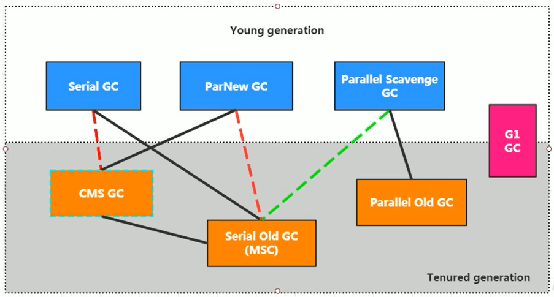

<ol>
    <li>两个收集器间有连线，表明它们可以搭配使用：Serial/Serial Old、Serial/CMS、ParNew/Serial Old、ParNew/CMS、Parallel Scavenge/Serial Old、Parallel Scavenge/Parallel Old、G1; </li>
    <li>其中Serial Old作为CMS出现＂Concurrent Mode Failure＂失败的后备预案。 </li>
    <li>（红色虚线）由于维护和兼容性测试的成本，在JDK 8时将Serial＋CMS、ParNew＋Serial old这两个组合声明为Deprecated（JEP 173），并在JDK 9中 </li>
</ol>

　　完全取消了这些组合的支持（JEP214），即：移除。
　　绿色虚线）JDK 14中：弃用ParallelScavenge和SeriaOold GC组合(JEP 366) 
　　（绿色虚框）JDK 14中：删除CMS垃圾回收器（JEP 363） 

### 13.8.3 怎么选择垃圾回收器

　　Java垃圾收集器的配置对于JVM优化来说是一个很重要的选择，选择合适的垃圾收集器可以让JVM的性能有一个很大的提升。

<div>
    <div>
        <h5>　　怎么选择垃圾收集器？</h5>
        <ol>
            <li>优先调整堆的大小让JVM自适应完成。 </li>
            <li>如果内存小于100M，使用串行收集器 </li>
            <li>如果是单核、单机程序，并且没有停顿时间的要求，串行收集器 </li>
            <li>如果是多CPU、需要高吞吐量、允许停顿时间超过1秒，选择并行或者JVM自己选择 </li>
            <li>如果是多CPU、追求低停顿时间，需快速响应（比如延迟不能超过1秒，如互联网应用），使用并发收集器，官方推荐G1，性能高。现在互联网的项目，基本都是使用G1。</li>
        </ol>
    </div>
	<br/>
    <div>
        <h5>　　最后需要明确一个观点：</h5>
        <ol>
            <li>没有最好的收集器，更没有万能的收集</li>
            <li>调优永远是针对特定场景、特定需求，不存在一劳永逸的收集器</li>
        </ol>
    </div>
</div>

   **面试**   
　　对于垃圾收集，面试官可以循序渐进从理论、实践各种角度深入，也未必是要求面试者什么都懂。但如果你懂得原理，一定会成为面试中的加分项。 这里较通用、基础性的部分如下：
　　- 垃圾收集的算法有哪些？如何判断一个对象是否可以回收？ 
　　- 垃圾收集器工作的基本流程。 
　　另外，大家需要多关注垃圾回收器这一章的各种常用的参数

## 13.9 GC日志分析

<div>
    <h5>　　通过阅读Gc日志，我们可以了解Java虚拟机内存分配与回收策略。 内存分配与垃圾回收的参数列表</h5>
    <ul>
        <li>-XX:+PrintGC 输出GC日志。类似：-verbose:gc</li>
        <li>-XX:+PrintGCDetails 输出GC的详细日志</li>
        <li>-XX:+PrintGCTimestamps 输出GC的时间戳（以基准时间的形式）</li>
        <li>-XX:+PrintGCDatestamps 输出GcC的时间戳（以日期的形式，如2013-05-04T21：53：59.234+0800）</li>
        <li>-XX:+PrintHeapAtGC 在进行GC的前后打印出堆的信息</li>
        <li>-Xloggc:../logs/gc.log 日志文件的输出路径</li>
    </ul>
</div>

　　打开GC日志：-verbose:gc
　　这个只会显示总的GC堆的变化，如下：
~~~
[GC (Allocation Failure) 80832K->19298K(227840K),0.0084018 secs]
[GC (Metadata GC Threshold) 109499K->21465K(228352K),0.0184066 secs]
[Full GC (Metadata GC Threshold) 21465K->16716K(201728K),0.0619261 secs]
~~~

<div>
    <h5>　　参数解析</h5>
    <ol>
        <li>GC、Full GC：GC的类型，GC只在新生代上进行，Full GC包括永生代，新生代，老年代。</li>
        <li>Allocation Failure：GC发生的原因。</li>
        <li>80832K->19298K：堆在GC前的大小和GC后的大小。</li>
        <li>228840k：现在的堆大小。</li>
        <li>0.0084018 secs：GC持续的时间</li>
    </ol>
</div>

　　打开GC日志：-verbose:gc -XX:+PrintGCDetails
　　输入信息如下：
~~~
[GC (Allocation Failure) [PSYoungGen:70640K->10116K(141312K)] 80541K->20017K(227328K),0.0172573 secs] [Times:user=0.03 sys=0.00,real=0.02 secs]
[GC (Metadata GC Threshold) [PSYoungGen:98859K->8154K(142336K)] 108760K->21261K(228352K),0.0151573 secs] [Times:user=0.00 sys=0.01,real=0.02 secs]
[Full GC (Metadata GC Threshold)[PSYoungGen:8154K->0K(142336K)]
[ParOldGen:13107K->16809K(62464K)] 21261K->16809K(204800K),[Metaspace:20599K->20599K(1067008K)],0.0639732 secs]
[Times:user=0.14 sys=0.00,real=0.06 secs]
~~~

<div>
    <h5>　　参数解析</h5>
    <ol>
        <li>GC，Full FC：同样是GC的类型</li>
        <li>Allocation Failure：GC原因</li>
        <li>PSYoungGen：使用了Parallel Scavenge并行垃圾收集器的新生代GC前后大小的变化</li>
        <li>ParOldGen：使用了Parallel Old并行垃圾收集器的老年代GC前后大小的变化</li>
        <li>Metaspace： 元数据区GC前后大小的变化，JDK1.8中引入了元数据区以替代永久代</li>
        <li>xxx secs：指GC花费的时间</li>
        <li>Times：user：指的是垃圾收集器花费的所有CPU时间，sys：花费在等待系统调用或系统事件的时间，real：GC从开始到结束的时间，包括其他进程占用时间片的实际时间。</li>
    </ol>
</div>

　　打开GC日志：-verbose:gc -XX:+PrintGCDetails -XX:+PrintGCTimestamps -XX:+PrintGCDatestamps
　　输入信息如下：
~~~
2019-09-24T22:15:24.518+0800: 3.287: [GC (Allocation Failure) [PSYoungGen:136162K->5113K(136192K)] 141425K->17632K(222208K),0.0248249 secs] [Times:user=0.05 sys=0.00,real=0.03 secs]
2019-09-24T22:15:25.559+0800: 4.329: [GC (Metadata GC Threshold) [PSYoungGen:97578K->10068K(274944K)] 110096K->22658K(360960K),0.0094071 secs] [Times: user=0.00 sys=0.00,real=0.01 secs]
2019-09-24T22:15:25.569+0800: 4.338: [Full GC (Metadata GC Threshold) [PSYoungGen:10068K->0K(274944K)][ParoldGen:12590K->13564K(56320K)] 22658K->13564K(331264K),[Metaspace:20590K->20590K(1067008K)],0.0494875 secs] [Times: user=0.17 sys=0.02,real=0.05 secs]
~~~

　　说明：带上了日期和时间
　　如果想把GC日志存到文件的话，是下面的参数：-Xloggc:/path/to/gc.log

<div>
    <h5>　　日志补充说明</h5>
    <ul>
        <li>"[GC"和"[Full GC"说明了这次垃圾收集的停顿类型，如果有"Full"则说明GC发生了"Stop The World" </li>
        <li>使用Serial收集器在新生代的名字是Default New Generation，因此显示的是"[DefNew" </li>
        <li>使用ParNew收集器在新生代的名字会变成"[ParNew"，意思是"Parallel New Generation" </li>
        <li>使用Parallel scavenge收集器在新生代的名字是”[PSYoungGen" </li>
        <li>老年代的收集和新生代道理一样，名字也是收集器决定的 </li>
        <li>使用G1收集器的话，会显示为"garbage-first heap" </li>
        <li>Allocation Failure：表明本次引起GC的原因是因为在年轻代中没有足够的空间能够存储新的数据了。 </li>
        <li>[PSYoungGen：5986K->696K(8704K) ]  5986K->704K(9216K)，中括号内：GC回收前年轻代大小，回收后大小，（年轻代总大小）；括号外：GC回收前年轻代和老年代大小，回收后大小，（年轻代和老年代总大小） </li>
        <li>user代表用户态回收耗时，sys内核态回收耗时，rea实际耗时。由于多核的原因，时间总和可能会超过real时间 </li>
    </ul>
</div>

~~~
Heap（堆）
PSYoungGen（Parallel Scavenge收集器新生代）total 9216K，used 6234K [0x00000000ff600000,0x0000000100000000,0x0000000100000000)
eden space（堆中的Eden区默认占比是8）8192K，768 used [0x00000000ff600000,0x00000000ffc16b08,0x00000000ffe00000)
from space（堆中的Survivor，这里是From Survivor区默认占比是1）1024K， 0% used [0x00000000fff00000,0x00000000fff00000,0x0000000100000000)
to space（堆中的Survivor，这里是to Survivor区默认占比是1，需要先了解一下堆的分配策略）1024K, 0% used [0x00000000ffe00000,0x00000000ffe00000,0x00000000fff00000)
                                                                         
ParOldGen（老年代总大小和使用大小）total 10240K， used 7001K ［0x00000000fec00000,0x00000000ff600000,0x00000000ff600000)
object space（显示个使用百分比）10240K，688 used [0x00000000fec00000,0x00000000ff2d6630,0x00000000ff600000)

PSPermGen（永久代总大小和使用大小）total 21504K， used 4949K [0x00000000f9a00000,0x00000000faf00000,0x00000000fec00000)
object space（显示个使用百分比，自己能算出来）21504K， 238 used [0x00000000f9a00000,0x00000000f9ed55e0,0x00000000faf00000)
~~~

　　**Minor GC日志**
　　

　　**Full GC日志**
　　

　　**举例**
~~~
private static final int _1MB = 1024 * 1024;

public static void testAllocation() {
    byte [] allocation1, allocation2, allocation3, allocation4;
    allocation1 = new byte[2 *_1MB];
    allocation2 = new byte[2 *_1MB];
    allocation3 = new byte[2 *_1MB];
    allocation4 = new byte[4 *_1MB];
}

public static void main(String[] args) {
    testAllocation();
}
~~~

　　设置JVM参数：-Xms10m -Xmx10m -XX:+PrintGCDetails
　　**图示**
　　
　　

　　可以用一些工具去分析这些GC日志
　　常用的日志分析工具有：GCViewer、GCEasy、GCHisto、GCLogViewer、Hpjmeter、garbagecat等。

## 13.10 垃圾回收器的新发展

　　GC仍然处于飞速发展之中，目前的默认选项G1 GC在不断的进行改进，很多我们原来认为的缺点，例如串行的Fu11GC、Card Table扫描的低效等，都已经被大幅改进，例如，JDK10以后，Fu11GC已经是并行运行，在很多场景下，其表现还略优于ParallelGC的并行Ful1GC实现。
　　即使是Serial GC，虽然比较古老，但是简单的设计和实现未必就是过时的，它本身的开销，不管是GC相关数据结构的开销，还是线程的开销，都是非常小的，所以随着云计算的兴起，在Serverless等新的应用场景下，Serial GC找到了新的舞台。
　　比较不幸的是CMSGC，因为其算法的理论缺陷等原因，虽然现在还有非常大的用户群体，但在JDK9中已经被标记为废弃，并在JDK14版本中移除

### 13.10.1 JDK11新特性

　　Epsilon:A No-Op GarbageCollector（Epsilon垃圾回收器，"No-Op（无操作）"回收器）http://openidk.iava.net/jeps/318
　　ZGC:A Scalable Low-Latency Garbage Collector（Experimental）（ZGC：可伸缩的低延迟垃圾回收器，处于实验性阶段）http://openidk.iava.net/jeps/333
　　

　　现在G1回收器已成为默认回收器好几年了。
　　我们还看到了引入了两个新的收集器：ZGC（JDK11出现）和Shenandoah（Open JDK12）。主打特点：低停顿时间

### 13.10.2 Open JDK12的Shenandoash GC

　　Open JDK12的Shenandoash GC：低停顿时间的GC（实验性）
　　Shenandoah，无疑是众多GC中最孤独的一个。是第一款不由oracle公司团队领导开发的Hotspot垃圾收集器。不可避免的受到官方的排挤。比如号称OpenJDK和OracleJDK没有区别的Oracle公司仍拒绝在OracleJDK12中支持Shenandoah。
　　Shenandoah垃圾回收器最初由RedHat进行的一项垃圾收集器研究项目Pauseless GC的实现，旨在针对JVM上的内存回收实现低停顿的需求.。在2014年贡献给OpenJDK。
　　Red Hat研发Shenandoah团队对外宣称，Shenandoah垃圾回收器的暂停时间与堆大小无关，这意味着无论将堆设置为200MB还是200GB，99.9%的目标都可以把垃圾收集的停顿时间限制在十毫秒以内。不过实际使用性能将取决于实际工作堆的大小和工作负载。
　　
　　这是RedHat在2016年发表的论文数据，测试内容是使用Es对200GB的维基百科数据进行索引。从结果看：
　　- 停顿时间比其他几款收集器确实有了质的飞跃，但也未实现最大停顿时间控制在十毫秒以内的目标。
　　- 而吞吐量方面出现了明显的下降，总运行时间是所有测试收集器里最长的。

<div>
    <h5>　　总结</h5>
    <ul>
        <li>Shenandoah GC的弱项：高运行负担下的吞吐量下降。</li>
        <li>Shenandoah GC的强项：低延迟时间。</li>
        <li>Shenandoah GC的工作过程大致分为九个阶段，这里就不再赘述。在之前Java12新特性视频里有过介绍。</li>
    </ul>
</div>

　　【Java12新特性地址】
　　http://www.atguigu.com/download_detail.shtml?v=222
　　或
　　https://www.bilibili.com/video/BV1jJ411M7kQ?from=search&seid=12339069673726242866

### 13.10.3 令人震惊、革命性的ZGC

　　官方地址：https://docs.oracle.com/en/java/javase/12/gctuning/
　　

　　ZGC与Shenandoah目标高度相似，在尽可能对吞吐量影响不大的前提下，实现在任意堆内存大小下都可以把垃圾收集的停颇时间限制在十毫秒以内的低延迟。
　　《深入理解Java虚拟机》一书中这样定义ZGC：ZGC收集器是一款基于Region内存布局的，（暂时）不设分代的，使用了读屏障、染色指针和内存多重映射等技术来实现可并发的标记-压缩算法的，以低延迟为首要目标的一款垃圾收集器。
　　ZGC的工作过程可以分为4个阶段：并发标记 - 并发预备重分配 - 并发重分配 - 并发重映射 等。
　　ZGC几乎在所有地方并发执行的，除了初始标记的是STw的。所以停顿时间几乎就耗费在初始标记上，这部分的实际时间是非常少的。
　　
　　

　　在ZGC的强项停顿时间测试上，它毫不留情的将Parallel、G1拉开了两个数量级的差距。无论平均停顿、95％停顿、99％停顿、99.9％停顿，还是最大停顿时间，ZGC都能毫不费劲控制在10毫秒以内。
　　虽然ZGC还在试验状态，没有完成所有特性，但此时性能已经相当亮眼，用“令人震惊、革命性”来形容，不为过。 未来将在服务端、大内存、低延迟应用的首选垃圾收集器。
　　JEP 364：ZGC应用在macos上
　　JEP 365：ZGC应用在Windows上
　　JDK14之前，ZGC仅Linux才支持。
　　尽管许多使用zGc的用户都使用类Linux的环境，但在Windows和macos上，人们也需要ZGC进行开发部署和测试。许多桌面应用也可以从ZGC中受益。因此，ZGC特性被移植到了Windows和macos上。
　　现在mac或Windows上也能使用zGC了，示例如下：-XX:+UnlockExperimentalVMOptions -XX:+UseZGC。

### 13.10.4 其他垃圾回收器：AliGC

　　AliGC是阿里巴巴JVM团队基于G1算法，面向大堆（LargeHeap）应用场景。指定场景下的对比：
　　
　　当然，其它厂商也提供了各种别具一格的GC实现，例如比较有名的低延迟GC：Zing，有兴趣可以参考提供的链接 https://www.infoq.com/articles/azul_gc_in_detail。


# 14 Class文件结构
## 14.1 概述
### 14.1.1 字节码文件的跨平台性

<div>
    <h5>　　Java语言：跨平台的语言</h5>
    <ul>
        <li>当Java源代码成功编译成字节码后，如果想在不同的平台上面运行，则无须再次编译</li>
        <li>这个优势不再吸引人了。Python、PHP、Perl、Ruby、Lisp等都有强大的解释器；</li>
        <li>跨平台似乎已经快成为一门语言必选的特性。</li>
    </ul>
</div>

　　Java虚拟机：跨语言的平台
　　Java虚拟机不和包括Java在内的任何语言绑定，它只与"class文件"这种特定的二进制文件格式所关联。无论使用何种语言进行软件开发，只要能将源文件编译为正确的Class文件，那么这种语言就可以在Java虚拟机上执行。可以说，统一而强大的Class文件结构就是Java虚拟机的基石。

<div>
    <h5>　　想要让一个Java程序正确地运行在JVM中，Java源码就必须要被编译为符合JVM规范的字节码</h5>
    <ul>
        <li>前端编译器的主要任务就是负责将符合Java语法规范的Java代码转换为符合JVM规范的字节码文件；</li>
        <li>javac是一种能够将Java源码编译为字节码的前端编译器</li>
        <li>javac编译器在将Java源码编译为一个有效的字节码文件过程中经历了4个步骤，分别是词法解析、语法解析、语义解析及生成字节码。</li>
    </ul>
    <h5>　　Oracle的JDK软件包括2部分内容：</h5>
    <ul>
        <li>一部分是将Java源代码编译成J萧萧虚拟机的指令的编译器；</li>
        <li>另一部分是用于实现Java虚拟机的运行时环境。</li>
    </ul>
</div>

### 14.1.2 Java的前端编译器 

　　前端编译器 vs 后端编译器
　　Java源代码的编译结果是字节码，那么肯定需要有一种编译器能够将Java源码编译为字节码，承担这个重要责任的就是配置在path环境变量中的javac编译器。javac是一种能够将Java源码编译为字节码的前端编译器。
　　HotSpot VM并没有强制要求前端编译器只能使用javac来编译字节吗，其实只要编译结果符合JVM规范都可以被JVM所识别即可。在Java的前端编译器领域，除了javac之外，还有一种被大家经常用到的前端编译器，那就是内置在Eclipse的ECJ(Eclipse Compiler for Java)编译器。和Javac的全量式编译不同，ECJ是一种增量式编译器。

<div>
    <ul>
        <li>在Eclipse中，当开发人员编写完代码后，使用"Ctrl + s"时，ECJ所采集的编译方案是把未编译部分的源码逐行进行编译，而不是每次都全量编译。因此ECJ的编译效率会比javac更加迅速和高效，当然编译质量和javac相比大致还是一样的；</li>
        <li>ECJ是Eclipse的默认内置前端编译器，在Tomcat中同样也是使用ECJ编译器来编译jsp文件。由于ECJ编译器是采用GPLv2的开源协议进行源代码公布，所以，可以登陆eclipse官网下载ECJ编译器的源码进行二次开发；</li>
        <li>默认情况下，idea使用javac编译器(还可以自定义为Aspectj编译器ajc)</li>
    </ul>
</div>

　　前端编译器并不会直接涉及编译优化等方面的技术，而是将这些具体优化细节移交给HotSpot的JIT编译器负责。

### 14.1.3 虚拟机的基石：Class文件

　　字节码文件里是什么？
　　源代码经过编译器编译之后便会生成一个字节码文件，字节码是一种二进制的类文件，它的内容是JVM指令，而不像C、C++经由编译器直接生成机器码。

　　什么是字节码指令(byte code)？
　　Java虚拟机的指令由一个字节长度的、代表着某种特定操作含义的操作码(opcode)以及跟随其后的0至多个代码此操作所需参数的操作数(operand)所构成。虚拟机中许多指令并不包含操作数，只有一个操作码。
　　如aload_0

<div>
    <h5>如何解读供虚拟机解释执行的二进制字节码？</h5>
    <ol>
        <li>一个一个二进制看。这里用到的是Notepad++，需要安装一个HEX-Editor插件，或者使用Binary Viewer</li>
        <li>使用javap指令：javap -v A.class > A.txt，将class文件解析后输出到A.txt中；</li>
        <li>使用idea插件：jclasslib或jclasslib bytecode viewer客户端工具(可视化程序更好)。</li>
    </ol>
</div>

### 14.1.4 Class字节码文件结构

　　官方文档位置：https://docs.oracle.com/javase/specs/jvms/se8/html/jvms-4.html

<div>
    <div>
        <p>　　Class类的本质：任何一个Class文件都对应着一唯一一个类或接口的定义信息，但反过来说，Class文件实际上它并不一定以磁盘的形式存在。Class文件是一组以8位字节为基础单位的二进制流。</p>
        <p>　　Class文件格式：Class的结构不像XML等描述语言，由于它没有任何分隔符号。所以在其中的数据项，无论是字节顺序还是数量，都是被严格限定的，哪个字节代表什么含义，长度是多少，先后顺序如何，都不允许改变。</p>
    </div>
    <div>
        <h5>　　Class文件格式采用一种类似于C语言结构休的方式进行数据存储，这种结构中只有2种数据类型：无符号数和表</h5>
        <ol>
            <li>无符号数属于基本的数据类型，以u1、u2、u4、u8来分别代表1 - 8个字节的无符号数，可以用来描述数字、索引引用、数量值或者按照UTF-8编译构成字符串值；</li>
            <li>表是由多个无符号数或者其它表作为数据项构成的复合数据类型，所有的表都习惯性地以"_info"结尾。表用于描述有层次关系的复合结构的数据，整个Class文件本质上就是一张表。由于表没有固定长度，所以通常会在其前面加上个数说明。</li>
        </ol>
    </div>
    <div>
        <p>　　class文件结构概述：不是一成不变的，随着虚拟机制发展，不可避免会对class文件进行一些改造，但其基本的结构和框架是稳定的，总体结构如下</p>
        <ol>
            <li>魔数</li>
            <li>class文件版本</li>
            <li>常量池</li>
            <li>访问标志</li>
            <li>类索引、父类索引、接口索引</li>
            <li>字段表集合</li>
            <li>方法表集合</li>
            <li>属性表集合</li>
        </ol>
    </div>
</div>

<table>
    <thead>
        <tr>
            <th></th>
            <th>类型</th>
            <th>名称</th>
            <th>说明</th>
            <th>长度(byte)</th>
            <th>数量</th>
        </tr>
    </thead>
    <tbody>
        <tr>
            <td>魔数</td>
            <td>u4</td>
            <td>magic</td>
            <td>魔数，识别Class文件格式</td>
            <td>4</td>
            <td>1</td>
        </tr>
        <tr>
            <td rowspan="2">版本号</td>
            <td>u2</td>
            <td>minor_version</td>
            <td>副版本号(小版本)</td>
            <td>2</td>
            <td>1</td>
        </tr>
        <tr>
            <td>u2</td>
            <td>major_version</td>
            <td>主版本号(大版本)</td>
            <td>2</td>
            <td>1</td>
        </tr>
        <tr>
            <td rowspan="2">常量池集合</td>
            <td>u2</td>
            <td>constant_pool_count</td>
            <td>常量池计数器</td>
            <td>2</td>
            <td>1</td>
        </tr>
        <tr>
            <td>cp_info</td>
            <td>constant_pool</td>
            <td>常量池表</td>
            <td>n</td>
            <td>constant_pool_count - 1</td>
        </tr>
        <tr>
            <td>访问标识</td>
            <td>u2</td>
            <td>access_flags</td>
            <td>访问标识</td>
            <td>2</td>
            <td>1</td>
        </tr>
        <tr>
            <td rowspan="4">索引集合</td>
            <td>u2</td>
            <td>this_class</td>
            <td>类索引</td>
            <td>2</td>
            <td>1</td>
        </tr>
        <tr>
            <td>u2</td>
            <td>super_class</td>
            <td>父类索引</td>
            <td>2</td>
            <td>1</td>
        </tr>
        <tr>
            <td>u2</td>
            <td>interfaces_count</td>
            <td>接口计数器</td>
            <td>2</td>
            <td>1</td>
        </tr>
        <tr>	
            <td>u2</td>
            <td>interfaces</td>
            <td>接口索引集合</td>
            <td>2</td>
            <td>interfaces_count</td>
        </tr>
        <tr>
            <td rowspan="2">字段表集合</td>
            <td>u2</td>
            <td>fields_count</td>
            <td>字段计数器</td>
            <td>2</td>
            <td>1</td>
        </tr>
        <tr>
            <td>field_info</td>
            <td>fields</td>
            <td>字段表</td>
            <td>n</td>
            <td>fields_count</td>
        </tr>
        <tr>
            <td rowspan="2">方法表集合</td>
            <td>u2</td>
            <td>methods_count</td>
            <td>方法计数器</td>
            <td>2</td>
            <td>1</td>
        </tr>
        <tr>
            <td>method_info</td>
            <td>methods</td>
            <td>方法表</td>
            <td>n</td>
            <td>methods_count</td>
        </tr>
        <tr>
            <td rowspan="2">属性表集合</td>
            <td>u2</td>
            <td>attributes_count</td>
            <td>属性计数器</td>
            <td>2</td>
            <td>1</td>
        </tr>
        <tr>
            <td>attribute_info</td>
            <td>attributes</td>
            <td>属性表</td>
            <td>n</td>
            <td>attributes_count</td>
        </tr>
    </tbody>
</table>

## 14.2 Class文件数据类型

|数据类型|定义|说明|
|:---:|:---:|:---:|
|无符号数|无符号数可以用来描述数字、索引引用、数量值或按照utf-8编码构成的字符串值。|其中无符号数属于基本的数据类型。 以u1、u2、u4、u8来分别代表1个字节、2个字节、4个字节和8个字节|
|表|表是由多个无符号数或其他表构成的复合数据结构。|所有的表都以“_info”结尾。 由于表没有固定长度，所以通常会在其前面加上个数说明。|

　　以下用如下代码的class文件讲解：
~~~
public class Demo {
    private int num = 1;
    
    public int add(){
        num = num + 2;
        return num;
    }
}
~~~

## 14.3 魔数

<div>
    <h5>　　Magic Number（魔数）</h5>
    <ul>
        <li>每个Class文件开头的4个字节的无符号整数称为魔数（Magic Number）</li>
        <li>它的唯一作用是确定这个文件是否为一个能被虚拟机接受的有效合法的Class文件。即：魔数是Class文件的标识符。</li>
        <li>魔数值固定为0xCAFEBABE。不会改变。</li>
        <li>使用魔数而不是扩展名来进行识别主要是基于安全方面的考虑，因为文件扩展名可以随意地改动。</li>
        <li>如果一个Class文件不以0xCAFEBABE开头，虚拟机在进行文件校验的时候就会直接抛出以下错误：</li>
    </ul>
</div>

~~~
Error: A JNI error has occurred, please check your installation and try again
Exception in thread "main" java.lang.ClassFormatError: Incompatible magic value 1885430635 in class file StringTest
~~~

## 14.4 文件版本号

　　紧接着魔数的4个字节存储的是Class文件的版本号。同样也是4个字节。第5个和第6个字节所代表的含义就是编译的副版本号minor_version，而第7个和第8个字节就是编译的主版本号major_version。
　　它们共同构成了class文件的格式版本号。譬如某个Class文件的主版本号为M，副版本号为m，那么这个Class文件的格式版本号就确定为M.m。
　　版本号和Java编译器的对应关系如下表：

|主版本（十进制）|副版本（十进制）|编译器版本|
|:---|:---|:---|
|45|3|1.1|
|46|0|1.2|
|47|0|1.3|
|48|0|1.4|
|49|0|1.5|
|50|0|1.6|
|51|0|1.7|
|52|0|1.8|
|53|0|1.9|
|54|0|1.10|
|55|0|1.11|

　　Java的版本号是从45开始的，JDK1.1之后的每个JDK大版本发布主版本号向上加1。
　　不同版本的Java编译器编译的Class文件对应的版本是不一样的。目前，高版本的Java虚拟机可以执行由低版本编译器生成的Class文件，但是低版本的Java虚拟机不能执行由高版本编译器生成的Class文件。否则JVM会抛出java.lang.UnsupportedClassVersionError异常。（向下兼容）
　　在实际应用中，由于开发环境和生产环境的不同，可能会导致该问题的发生。因此，需要我们在开发时，特别注意开发编译的JDK版本和生产环境中的JDK版本是否一致。
　　虚拟机JDK版本为1.k（k>=2）时，对应的class文件格式版本号的范围为45.0 - 44+k.0（含两端）。

## 14.5 常量池集合

　　常量池是Class文件中内容最为丰富的区域之一。常量池对于Class文件中的字段和方法解析也有着至关重要的作用。
　　随着Java虚拟机的不断发展，常量池的内容也日渐丰富。可以说，常量池是整个Class文件的基石。
　　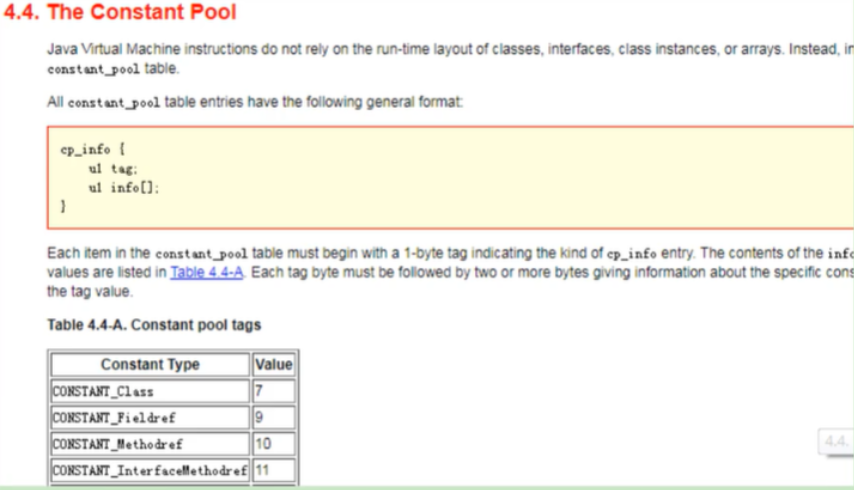

　　在版本号之后，紧跟着的是常量池的数量，以及若干个常量池表项。
　　常量池中常量的数量是不固定的，所以在常量池的入口需要放置一项u2类型的无符号数，代表常量池容量计数值（constant_pool_count）。与Java中语言习惯不一样的是，这个容量计数是从1而不是0开始的。

|类型|名称|数量|
|:---|:---|:---|
|u2(无符号数)|constant_pool_count|1|
|cp_info(表)|constant_pool|constant_pool_count - 1|

　　由上表可见，Class文件使用了一个前置的容量计数器（constant_pool_count）加若干个连续的数据项（constant_pool）的形式来描述常量池内容。我们把这一系列连续常量池数据称为常量池集合。
　　常量池表项中，用于存放编译时期生成的各种字面量和符号引用，这部分内容将在类加载后进入方法区的运行时常量池中存放

### 14.5.1 常量池计数器

<div>
    <h5>　　constant_pool_count（常量池计数器）</h5>
    <ul>
        <li>由于常量池的数量不固定，时长时短，所以需要放置两个字节来表示常量池容量计数值。</li>
        <li>常量池容量计数值（u2类型）：从1开始，表示常量池中有多少项常量。即constant_pool_count=1表示常量池中有0个常量项。</li>
        <li>Demo的值为：</li>
    </ul>
</div>

　　
　　其值为0x0016，掐指一算，也就是22。需要注意的是，这实际上只有21项常量。索引为范围是1-21。为什么呢？
　　通常我们写代码时都是从0开始的，但是这里的常量池却是从1开始，因为它把第0项常量空出来了。这是为了满足后面某些指向常量池的索引值的数据在特定情况下需要表达“不引用任何一个常量池项目”的含义，这种情况可用索引值0来表示。

### 14.5.2 常量池表

　　constant_pool是一种表结构，以1 ~ constant_pool_count - 1为索引。表明了后面有多少个常量项。
　　常量池主要存放两大类常量：字面量（Literal）和符号引用（Symbolic References）
　　它包含了class文件结构及其子结构中引用的所有字符串常量、类或接口名、字段名和其他常量。常量池中的每一项都具备相同的特征。第1个字节作为类型标记，用于确定该项的格式，这个字节称为tag byte（标记字节、标签字节）。

|类型|标志(或标识)|描述|
|:---|:---|:---|
|CONSTANT_Utf8_info|1|UTF-8编码的字符串|
|CONSTANT_Integer_info|3|整型字面量|
|CONSTANT_Float_info|4|浮点型字面量|
|CONSTANT_Long_info|5|长整型字面量|
|CONSTANT_Double_info|6|双精度浮点型字面量|
|CONSTANT_Class_info|7|类或接口的符号引用|
|CONSTANT_String_info|8|字符串类型字面量|
|CONSTANT_Fieldref_info|9|字段的符号引用|
|CONSTANT_Methodref_info|10|类中方法的符号引用|
|CONSTANT_InterfaceMethodref_info|11|接口中方法的符号引用|
|CONSTANT_NameAndType_info|12|字段或方法的符号引用|
|CONSTANT_MethodHandle_info|15|表示方法句柄|
|CONSTANT_MethodType_info|16|标志方法类型|
|CONSTANT_InvokeDynamic_info|18|表示一个动态方法调用点|

#### 14.5.2.1 字面量和符号引用

　　在对这些常量解读前，我们需要搞清楚几个概念。
　　常量池主要存放两大类常量：字面量（Literal）和符号引用（Symbolic References）。如下表：

<table>
    <tr>
        <td>常量</td>
        <td>常量	具体的常量</td>
    </tr>
    <tr>
        <td rowspan="2">字面量</td>
        <td>文本字符串</td>
    </tr>
    <tr>
        <td>声明为final的常量值</td>
    </tr>
    <tr>
        <td rowspan="3">符号引用</td>
        <td>类和接口的全限定名</td>
    </tr>
    <tr>
        <td>字段的名称和描述符</td>
    </tr>
    <tr>
        <td>方法的名称和描述符</td>
    </tr>
</table>　　

　　**全限定名**
　　com/atguigu/test/Demo这个就是类的全限定名，仅仅是把包名的“.“替换成”/”，为了使连续的多个全限定名之间不产生混淆，在使用时最后一般会加入一个“;”表示全限定名结束。

　　**简单名称**
　　简单名称是指没有类型和参数修饰的方法或者字段名称，上面例子中的类的add()方法和num字段的简单名称分别是add和num。

　　**描述符**
　　描述符的作用是用来描述字段的数据类型、方法的参数列表（包括数量、类型以及顺序）和返回值。根据描述符规则，基本数据类型（byte、char、double、float、int、long、short、boolean）以及代表无返回值的void类型都用一个大写字符来表示，而对象类型则用字符L加对象的全限定名来表示，详见下表：

|标志符|含义|
|:---|:---|
|B|基本数据类型byte|
|C|基本数据类型char|
|D|基本数据类型double|
|F|基本数据类型float|
|I|基本数据类型int|
|J|基本数据类型long|
|S|基本数据类型short|
|Z|基本数据类型boolean|
|V|代表void类型|
|L|对象类型，比如：Ljava/lang/Object;|
|[|数组类型，代表一维数组。比如：double[]is[D|

　　用描述符来描述方法时，按照先参数列表，后返回值的顺序描述，参数列表按照参数的严格顺序放在一组小括号“()”之内。如方法java.lang.String tostring()的描述符为()Ljava/lang/String; ，方法int abc(int[]x, int y)的描述符为([II)I。

　　**补充说明：**
　　虚拟机在加载Class文件时才会进行动态链接，也就是说，Class文件中不会保存各个方法和字段的最终内存布局信息。因此，这些字段和方法的符号引用不经过转换是无法直接被虚拟机使用的。当虚拟机运行时，需要从常量池中获得对应的符号引用，再在类加载过程中的解析阶段将其替换为直接引用，并翻译到具体的内存地址中。

<div>
    <h5>　　符号引用和直接引用的区别与关联：</h5>
    <ul>
        <li>符号引用：符号引用以一组符号来描述所引用的目标，符号可以是任何形式的字面量，只要使用时能无歧义地定位到目标即可。符号引用与虚拟机实现的内存布局无关，引用的目标并不一定已经加载到了内存中。</li>
        <li>直接引用：直接引用可以是直接指向目标的指针、相对偏移量或是一个能间接定位到目标的句柄。直接引用是与虚拟机实现的内存布局相关的，同一个符号引用在不同虚拟机实例上翻译出来的直接引用一般不会相同。如果有了直接引用，那说明引用的目标必定已经存在于内存之中了。</li>
    </ul>
</div>

#### 14.5.2.2 常量类型和结构

　　常量池中每一项常量都是一个表，J0K1.7之后共有14种不同的表结构数据。如下表格所示：
　　

　　根据上图每个类型的描述我们也可以知道每个类型是用来描述常量池中哪些内容（主要是字面量、符号引用）的。比如:
　　CONSTANT_Integer_info是用来描述常量池中字面量信息的，而且只是整型字面量信息。
　　标志为15、16、18的常量项类型是用来支持动态语言调用的（jdk1.7时才加入的）。

<div>
    <h5>　　细节说明:</h5>
    <ul>
        <li>CONSTANT_Class_info结构用于表示类或接口</li>
        <li>CONSTAT_Fieldref_info、CONSTAHT_Methodref_infoF和lCONSTANIT_InterfaceMethodref_info结构表示字段、方法和接口方法</li>
        <li>CONSTANT_String_info结构用于表示String类型的常量对象</li>
        <li>CONSTANT_Integer_info和CONSTANT_Float_info表示4字节（int和float）的数值常量</li>
        <li>
            CONSTANT_Long_info和CONSTAT_Double_info结构表示8字作（long和double）的数值常量 
            <ul>
                <li>在class文件的常最池表中，所有的8字节常量均占两个表成员（项）的空间。如果一个CONSTANT_Long_info和CONSTANT_Double_info结构的项在常量池中的索引位n，则常量池中一个可用的索引位n+2，此时常量池表长中索引为n+1的项仍然有效但必须视为不可用的。</li>
            </ul>
        </li>
        <li>CONSTANT_NameAndType_info结构用于表示字段或方法，但是和之前的3个结构不同，CONSTANT_NameAndType_info结构没有指明该字段或方法所属的类或接口。</li>
        <li>CONSTANT_Utf8_info用于表示字符常量的值</li>
        <li>CONSTANT_MethodHandle_info结构用于表示方法句柄</li>
        <li>CONSTANT_MethodType_info结构表示方法类型</li>
        <li>CONSTANT_InvokeDynamic_info结构表示invokedynamic指令所用到的引导方法(bootstrap method)、引导方法所用到的动态调用名称(dynamic invocation name)、参数和返回类型，并可以给引导方法传入一系列称为静态参数（static argument）的常量。</li>
    </ul>
</div>

　　解析方法：使用javap命令解析：javap-verbose Demo.class或jclasslib工具会更方便。

<div>
    <div>
    <h5>　　总结1：</h5>
        <ul>
            <li>这14种表（或者常量项结构）的共同点是：表开始的第一位是一个u1类型的标志位（tag），代表当前这个常量项使用的是哪种表结构，即哪种常量类型。</li>
            <li>在常量池列表中，CONSTANT_Utf8_info常量项是一种使用改进过的UTF-8编码格式来存储诸如文字字符串、类或者接口的全限定名、字段或者方法的简单名称以及描述符等常量字符串信息。</li>
            <li>这14种常量项结构还有一个特点是，其中13个常量项占用的字节固定，只有CONSTANT_Utf8_info占用字节不固定，其大小由length决定。为什么呢？因为从常量池存放的内容可知，其存放的是字面量和符号引用，最终这些内容都会是一个字符串，这些字符串的大小是在编写程序时才确定，比如你定义一个类，类名可以取长取短，所以在没编译前，大小不固定，编译后，通过utf-8编码，就可以知道其长度。</li>
        </ul>
    </div>
    <hr/>
    <div>
    <h5>　　总结2：</h5>
        <ul>
            <li>常量池：可以理解为Class文件之中的资源仓库，它是Class文件结构中与其他项目关联最多的数据类型（后面的很多数据类型都会指向此处），也是占用Class文件空间最大的数据项目之一。</li>
            <li>常量池中为什么要包含这些内容？Java代码在进行Javac编译的时候，并不像C和C++那样有“连接”这一步骤，而是在虚拟机加载C1ass文件的时候进行动态链接。也就是说，在Class文件中不会保存各个方法、字段的最终内存布局信息，因此这些字段、方法的符号引用不经过运行期转换的话无法得到真正的内存入口地址，也就无法直接被虚拟机使用。当虚拟机运行时，需要从常量池获得对应的符号引用，再在类创建时或运行时解析、翻译到具体的内存地址之中。关于类的创建和动态链接的内容，在虚拟机类加载过程时再进行详细讲解</li>
        </ul>
    </div>
</div>

## 14.6 访问标志

　　**访问标识（access_flag、访问标志、访问标记）**
　　在常量池后，紧跟着访问标记。该标记使用两个字节表示，用于识别一些类或者接口层次的访问信息，包括：这个Class是类还是接口；是否定义为public类型；是否定义为abstract类型；如果是类的话，是否被声明为final等。各种访问标记如下所示：

|标志名称|标志值|含义|
|:---|:---|:---|
|ACC_PUBLIC|0x0001|标志为public类型|
|ACC_FINAL|0x0010|标志被声明为final，只有类可以设置|
|ACC_SUPER|0x0020|标志允许使用invokespecial字节码指令的新语义，JDK1.0.2之后编译出来的类的这个标志默认为真。（使用增强的方法调用父类方法）|
|ACC_INTERFACE|0x0200|标志这是一个接口|
|ACC_ABSTRACT|0x0400|是否为abstract类型，对于接口或者抽象类来说，次标志值为真，其他类型为假|
|ACC_SYNTHETIC|0x1000|标志此类并非由用户代码产生（即：由编译器产生的类，没有源码对应）|
|ACC_ANNOTATION|0x2000|标志这是一个注解|
|ACC_ENUM|0x4000|标志这是一个枚举|

　　类的访问权限通常为ACC_开头的常量。
　　每一种类型的表示都是通过设置访问标记的32位中的特定位来实现的。比如，若是public final的类，则该标记为ACC_PUBLIC | ACC_FINAL。
　　使用ACC_SUPER可以让类更准确地定位到父类的方法super.method()，现代编译器都会设置并且使用这个标记。

<div>
    <h5>　　补充说明：</h5>
    <ul>
        <li>
            带有ACC_INTERFACE标志的class文件表示的是接口而不是类，反之则表示的是类而不是接口。
            <ul>
                <li>如果一个class文件被设置了ACC_INTERFACE标志，那么同时也得设置ACC_ABSTRACT标志。同时它不能再设置ACC_FINAL、ACC_SUPER 或ACC_ENUM标志。</li>
                <li>如果没有设置ACC_INTERFACE标志，那么这个class文件可以具有上表中除ACC_ANNOTATION外的其他所有标志。当然，ACC_FINAL和ACC_ABSTRACT这类互斥的标志除外。这两个标志不得同时设置。</li>
            </ul>
        </li>
        <li>
            ACC_SUPER标志用于确定类或接口里面的invokespecial指令使用的是哪一种执行语义。针对Java虚拟机指令集的编译器都应当设置这个标志。对于Java SE 8及后续版本来说，无论class文件中这个标志的实际值是什么，也不管class文件的版本号是多少，Java虚拟机都认为每个class文件均设置了ACC_SUPER标志。
            <ul>
                <li>ACC_SUPER标志是为了向后兼容由旧Java编译器所编译的代码而设计的。目前的ACC_SUPER标志在由JDK1.0.2之前的编译器所生成的access_flags中是没有确定含义的，如果设置了该标志，那么0racle的Java虚拟机实现会将其忽略。</li>
            </ul>
        </li>
        <li>ACC_SYNTHETIC标志意味着该类或接口是由编译器生成的，而不是由源代码生成的。 </li>
        <li>注解类型必须设置ACC_ANNOTATION标志。如果设置了ACC_ANNOTATION标志，那么也必须设置ACC_INTERFACE标志。 </li>
        <li>ACC_ENUM标志表明该类或其父类为枚举类型。 </li>
    </ul>
</div>

## 14.7 类索引、父类索引、接口索引

　　在访问标记后，会指定该类的类别、父类类别以及实现的接口，格式如下：

|长度|含义|
|:---|:---|
|u2|this_class|
|u2|super_class|
|u2|interfaces_count|
|u2|interfaces[interfaces_count]|

<div>
    <h5>这三项数据来确定这个类的继承关系：</h5>
    <ul style="list-style-type: none;">
        <li>类索引用于确定这个类的全限定名</li>
        <li>父类索引用于确定这个类的父类的全限定名。由于Java语言不允许多重继承，所以父类索引只有一个，除了java.1ang.Object之外，所有的Java类都有父类，因此除了java.lang.Object外，所有Java类的父类索引都不为e。</li>
        <li>接口索引集合就用来描述这个类实现了哪些接口，这些被实现的接口将按implements语句（如果这个类本身是一个接口，则应当是extends语句）后的接口顺序从左到右排列在接口索引集合中。</li>
    </ul>
</div>

### 14.7.1 this_class（类索引）

　　2字节无符号整数，指向常量池的索引。它提供了类的全限定名，如com/atguigu/java1/Demo。this_class的值必须是对常量池表中某项的一个有效索引值。常量池在这个索引处的成员必须为CONSTANT_Class_info类型结构体，该结构体表示这个class文件所定义的类或接口。

### 14.7.2 super_class（父类索引）

　　2字节无符号整数，指向常量池的索引。它提供了当前类的父类的全限定名。如果我们没有继承任何类，其默认继承的是java/lang/object类。同时，由于Java不支持多继承，所以其父类只有一个。
　　super_class指向的父类不能是final。

### 14.7.3 interfaces

　　指向常量池索引集合，它提供了一个符号引用到所有已实现的接口
　　由于一个类可以实现多个接口，因此需要以数组形式保存多个接口的索引，表示接口的每个索引也是一个指向常量池的CONSTANT_Class（当然这里就必须是接口，而不是类）。

#### 14.7.3.1 interfaces_count（接口计数器）

　　interfaces_count项的值表示当前类或接口的直接超接口数量。

#### 14.7.3.2 interfaces[]（接口索引集合）

　　interfaces[]中每个成员的值必须是对常量池表中某项的有效索引值，它的长度为interfaces_count。每个成员interfaces[i]必须为CONSTANT_Class_info结构，其中0 <= i < interfaces_count。在interfaces[]中，各成员所表示的接口顺序和对应的源代码中给定的接口顺序（从左至右）一样，即interfaces[0]对应的是源代码中最左边的接口。

## 14.8 字段表集合

<div>
    <div>
        <h5>field</h5>
        <ul>
            <li>用于描述接口或类中声明的变量。字段（field）包括类级变量以及实例级变量，但是不包括方法内部、代码块内部声明的局部变量。</li>
            <li>字段叫什么名字、字段被定义为什么数据类型，这些都是无法固定的，只能引用常量池中的常量来描述。</li>
            <li>它指向常量池索引集合，它描述了每个字段的完整信息。比如字段的标识符、访问修饰符（public、private或protected）、是类变量还是实例变量（static修饰符）、是否是常量（final修饰符）等。</li>
        </ul>
    </div>
    <hr/>
    <div>
        <h5>注意事项：</h5>
        <ol>
            <li>字段表集合中不会列出从父类或者实现的接口中继承而来的字段，但有可能列出原本Java代码之中不存在的字段。譬如在内部类中为了保持对外部类的访问性，会自动添加指向外部类实例的字段。</li>
            <li>在Java语言中字段是无法重载的，两个字段的数据类型、修饰符不管是否相同，都必须使用不一样的名称，但是对于字节码来讲，如果两个字段的描述符不一致，那字段重名就是合法的。</li>
        </ol>
    </div>
</div>

### 14.8.1 字段计数器

　　**fields_count（字段计数器）**
　　fields_count的值表示当前class文件fields表的成员个数。使用两个字节来表示。
　　fields表中每个成员都是一个field_info结构，用于表示该类或接口所声明的所有类字段或者实例字段，不包括方法内部声明的变量，也不包括从父类或父接口继承的那些字段。

|标志名称|标志值|含义|数量|
|:---|:---|:---|:---|
|u2|access_flags|访问标志|1|
|u2|name_index|字段名索引|1|
|u2|descriptor_index|描述符索引|1|
|u2|attributes_count|属性计数器|1|
|attribute_info|attribute|属性集合|attributes_count|

### 14.8.2 字段表
#### 14.8.2.1 字段表访问标识

　　我们知道，一个字段可以被各种关键字去修饰，比如：作用域修饰符（public、private、protected）、static修饰符、final修饰符、volatile修饰符等等。因此，其可像类的访问标志那样，使用一些标志来标记字段。字段的访问标志有如下这些：

|标志名称|标志值|含义|
|:---|:---|:---|
|ACC_PUBLIC|0x0001|字段是否为public|
|ACC_PRIVATE|0x0002|字段是否为private|
|ACC_PROTECTED|0x0004|字段是否为protected|
|ACC_STATIC|0x0008|字段是否为static|
|ACC_FINAL|0x0010|字段是否为final|
|ACC_VOLATILE|0x0040|字段是否为volatile|
|ACC_TRANSTENT|0x0080|字段是否为transient|
|ACC_SYNCHETIC|0x1000|字段是否为由编译器自动产生|
|ACC_ENUM|0x4000|字段是否为enum|

#### 14.8.2.2 描述符索引

　　描述符的作用是用来描述字段的数据类型、方法的参数列表（包括数量、类型以及顺序）和返回值。根据描述符规则，基本数据类型（byte，char，double，float，int，long，short，boolean）及代表无返回值的void类型都用一个大写字符来表示，而对象则用字符L加对象的全限定名来表示，如下所示：

|标志符|含义|
|:---|:---a|
|B|基本数据类型byte|
|C|基本数据类型char|
|D|基本数据类型double|
|F|基本数据类型float|
|I|基本数据类型int|
|J|基本数据类型long|
|S|基本数据类型short|
|Z|基本数据类型boolean|
|V|代表void类型|
|L|对象类型，比如：Ljava/lang/Object;|
|[|数组类型，代表一维数组。比如：`double[][][]is[[[D|　　

#### 14.8.2.3 属性表集合

　　一个字段还可能拥有一些属性，用于存储更多的额外信息。比如初始化值、一些注释信息等。属性个数存放在attribute_count中，属性具体内容存放在attributes数组中。

~~~
// 以常量属性为例，结构为：
ConstantValue_attribute{
	u2 attribute_name_index; // 根据这个值可以从常量池获取，这是这个字段的什么属性
	u4 attribute_length; // 对于常量属性而言，attribute_length值恒为2
    u2 constantvalue_index; // 根据这个值可以从常量池获取，这个字段的属性值
}
~~~


## 14.9 方法表集合

<div>
    <div>
        <h5>methods：指向常量池索引集合，它完整描述了每个方法的签名。</h5>
        <ol>
            <li>在字节码文件中，每一个method_info项都对应着一个类或者接口中的方法信息。比如方法的访问修饰符（public、private或protected），方法的返回值类型以及方法的参数信息等。</li>
            <li>如果这个方法不是抽象的或者不是native的，那么字节码中会体现出来。</li>
            <li>一方面，methods表只描述当前类或接口中声明的方法，不包括从父类或父接口继承的方法。另一方面，methods表有可能会出现由编译器自动添加的方法，最典型的便是编译器产生的方法信息（比如：类（接口）初始化方法&lt;clinit&gt;()和实例初始化方法&lt;init&gt;()）。</li>
        </ol>
    </div>
    <div>
        <h5>使用注意事项：</h5>
        <p>　　在Java语言中，要重载（Overload）一个方法，除了要与原方法具有相同的简单名称之外，还要求必须拥有一个与原方法不同的特征签名，特征签名就是一个方法中各个参数在常量池中的字段符号引用的集合，也就是因为返回值不会包含在特征签名之中，因此Java语言里无法仅仅依靠返回值的不同来对一个已有方法进行重载。但在Class文件格式中，特征签名的范围更大一些，只要描述符不是完全一致的两个方法就可以共存。也就是说，如果两个方法有相同的名称和特征签名，但返回值不同，那么也是可以合法共存于同一个class文件中。</p>
        <p>　　也就是说，尽管Java语法规范并不允许在一个类或者接口中声明多个方法签名相同的方法，但是和Java语法规范相反，字节码文件中却恰恰允许存放多个方法签名相同的方法，唯一的条件就是这些方法之间的返回值不能相同。</p>
    </div>
</div>

### 14.9.1 方法计数器

　　**methods_count（方法计数器）**
　　methods_count的值表示当前class文件methods表的成员个数。使用两个字节来表示。
　　methods表中每个成员都是一个method_info结构。

### 14.9.2 方法表

　　**methods[]（方法表）**
　　methods表中的每个成员都必须是一个method_info结构，用于表示当前类或接口中某个方法的完整描述。如果某个method_info结构的access_flags项既没有设置ACC_NATIVE标志也没有设置ACC_ABSTRACT标志，那么该结构中也应包含实现这个方法所用的Java虚拟机指令。
　　method_info结构可以表示类和接口中定义的所有方法，包括实例方法、类方法、实例初始化方法和类或接口初始化方法。

　　**方法表的结构实际跟字段表是一样的，方法表结构如下：**
|标志名称|标志值|含义|数量|
|:---|:---|:---|:---|
|u2|access_flags|访问标志|1|
|u2|name_index|方法名索引|1|
|u2|descriptor_index|描述符索引|1|
|u2|attributes_count|属性计数器|1|
|attribute_info|attributes|属性集合|attributes_count|

　　**方法表访问标志**
　　跟字段表一样，方法表也有访问标志，而且他们的标志有部分相同，部分则不同，方法表的具体访问标志如下：
|标志名称|标志值|含义|
|:---|:---|:---|
|ACC_PUBLIC|0x0001|public，方法可以从包外访问|
|ACC_PRIVATE|0x0002|private，方法只能本类访问|
|ACC_PROTECTED|0x0004|protected，方法在自身和子类可以访问|
|ACC_STATIC|0x0008|static，静态方法|
|ACC_FINAL|0x0010|final，方法不能被重写(覆盖)|
|ACC_SYNCHRONIZED|0x0020|synchronized，方法由管程同步|
|ACC_BRIDGE|0x0040|bridge，方法由编译器产生|
|ACC_VARARGS|0x0080|表示方法带有变长参数|
|ACC_NATIVE|0x0100|native，表示引用非java语言的本地方法|
|ACC_ABSTRACT|0x0400|abstract，方法没有具体实现|
|ACC_STRICT|0x0800|strictfp，方法使用FP-strict浮点格式|
|ACC_SYNTHETIC|0x1000|方法在源文件中不出现，由编译器产生|


## 14.10 属性表集合

　　方法表集合之后的属性表集合，指的是class文件所携带的辅助信息，比如该class文件的源文件的名称。以及任何带有RetentionPolicy.CLASS 或者RetentionPolicy.RUNTIME的注解。这类信息通常被用于Java虚拟机的验证和运行，以及Java程序的调试，一般无须深入了解。
　　此外，字段表、方法表都可以有自己的属性表。用于描述某些场景专有的信息。
　　属性表集合的限制没有那么严格，不再要求各个属性表具有严格的顺序，并且只要不与已有的属性名重复，任何人实现的编译器都可以向属性表中写入自己定义的属性信息，但Java虚拟机运行时会忽略掉它不认识的属性。

### 14.10.1 属性计数器

　　**attributes_count（属性计数器）**
　　attributes_count的值表示当前class文件属性表的成员个数。属性表中每一项都是一个attribute_info结构。

### 14.10.2 属性表

　　**attributes[]（属性表）**
　　属性表的每个项的值必须是attribute_info结构。属性表的结构比较灵活，各种不同的属性只要满足以下结构即可。

　　**属性的通用格式**
|类型|名称|数量|含义|
|:---|:---|:---|:---|
|u2|attribute_name_index|1|属性名索引|
|u4|attribute_length|1|属性长度|
|u1|info|attribute_length|属性表|

　　**属性类型**
　　属性表实际上可以有很多类型，上面看到的Code属性只是其中一种，Java8里面定义了23种属性。下面这些是虚拟机中预定义的属性：
|属性名称|使用位置|含义|
|:---|:---|:---|
|Code|方法表|Java代码编译成的字节码指令|
|ConstantValue|字段表|final关键字定义的常量池|
|Deprecated|类，方法，字段表|被声明为deprecated的方法和字段|
|Exceptions|方法表|方法抛出的异常|
|EnclosingMethod|类文件|仅当一个类为局部类或者匿名类时才能拥有这个属性，这个属性用于标识这个类所在的外围方法|
|InnerClass|类文件|内部类列表|
|LineNumberTable|Code属性|Java源码的行号与字节码指令的对应关系|
|LocalVariableTable|Code属性|方法的局部变量描述|
|StackMapTable|Code属性|JDK1.6中新增的属性，供新的类型检查检验器和处理目标方法的局部变量和操作数有所需要的类是否匹配|
|Signature|类，方法表，字段表|用于支持泛型情况下的方法签名|
|SourceFile|类文件|记录源文件名称|
|SourceDebugExtension|类文件|用于存储额外的调试信息|
|Synthetic|类，方法表，字段表|标志方法或字段为编译器自动生成的|
|LocalVariableTypeTable|类|是哟很难过特征签名代替描述符，是为了引入泛型语法之后能描述泛型参数化类型而添加|
|RuntimeVisibleAnnotations|类，方法表，字段表|为动态注解提供支持|
|RuntimeInvisibleAnnotations|类，方法表，字段表|用于指明哪些注解是运行时不可见的|
|RuntimeVisibleParameterAnnotation|方法表|作用与RuntimeVisibleAnnotations属性类似，只不过作用对象或方法|
|RuntimeInvisibleParameterAnnotation|方法表|作用与RuntimeInvisibleAnnotations属性类似，只不过作用对象或方法|
|AnnotationDefault|方法表|用于记录注解类元素的默认值|
|BootstrapMethods|类文件|用于保存invokeddynamic指令引用的引导方法限定符|

　　或者（查看官网）
　　

　　**部分属性详解**
　　**① ConstantValue属性**
~~~
ConstantValue_attribute{
	u2 attribute_name_index;
	u4 attribute_length;
	u2 constantvalue_index;//字段值在常量池中的索引，常量池在该索引处的项给出该属性表示的常量值。（例如，值是1ong型的，在常量池中便是CONSTANT_Long）
}
~~~

　　**② Deprecated 属性**
　　Deprecated 属性是在JDK1.1为了支持注释中的关键词@deprecated而引入的。
~~~
Deprecated_attribute{
	u2 attribute_name_index;
	u4 attribute_length;
}
~~~

　　**③ Code属性**
　　Code属性就是存放方法体里面的代码。但是，并非所有方法表都有Code属性。像接口或者抽象方法，他们没有具体的方法体，因此也就不会有Code属性了。Code属性表的结构，如下图：
|类型|名称|数量|含义|
|:---|:---|:---|:---|
|u2|attribute_name_index|1|属性名索引|
|u4|attribute_length|1|属性长度|
|u2|max_stack|1|操作数栈深度的最大值|
|u2|max_locals|1|局部变量表所需的存续空间|
|u4|code_length|1|字节码指令的长度|
|u1|code|code_lenth|存储字节码指令|
|u2|exception_table_length|1|异常表长度|
|exception_info|exception_table|exception_length|异常表|
|u2|attributes_count|1|属性集合计数器|
|attribute_info|attributes|attributes_count|属性集合|

　　可以看到：Code属性表的前两项跟属性表是一致的，即Code属性表遵循属性表的结构，后面那些则是他自定义的结构。

　　**④ InnerClasses 属性**
　　为了方便说明特别定义一个表示类或接口的Class格式为C。如果C的常量池中包含某个CONSTANT_Class_info成员，且这个成员所表示的类或接口不属于任何一个包，那么C的ClassFile结构的属性表中就必须含有对应的InnerClasses属性。InnerClasses属性是在JDK1.1中为了支持内部类和内部接口而引入的，位于ClassFile结构的属性表。

　　**⑤ LineNumberTable属性**
　　LineNumberTable属性是可选变长属性，位于Code结构的属性表。
　　LineNumberTable属性是用来描述Java源码行号与字节码行号之间的对应关系。这个属性可以用来在调试的时候定位代码执行的行数。
　　start_pc，即字节码行号；1ine_number，即Java源代码行号。
　　在Code属性的属性表中，LineNumberTable属性可以按照任意顺序出现，此外，多个LineNumberTable属性可以共同表示一个行号在源文件中表示的内容，即LineNumberTable属性不需要与源文件的行一一对应。
~~~
// LineNumberTable属性表结构：
LineNumberTable_attribute{
    u2 attribute_name_index;
    u4 attribute_length;
    u2 line_number_table_length;
    {
        u2 start_pc;
        u2 line_number;
    } line_number_table[line_number_table_length];
}
~~~

　　**⑥ LocalVariableTable属性**
<div>
    <p>　　LocalVariableTable是可选变长属性，位于Code属性的属性表中。它被调试器用于确定方法在执行过程中局部变量的信息。在Code属性的属性表中，LocalVariableTable属性可以按照任意顺序出现。Code属性中的每个局部变量最多只能有一个LocalVariableTable属性。</p>
    <ul>
        <li>start pc + length表示这个变量在字节码中的生命周期起始和结束的偏移位置（this生命周期从头e到结尾10）</li>
        <li>index就是这个变量在局部变量表中的槽位（槽位可复用）</li>
        <li>name就是变量名</li>
        <li>Descriptor表示局部变量类型描述</li>
    </ul>
</div>
~~~
// LocalVariableTable属性表结构：
LocalVariableTable_attribute{
    u2 attribute_name_index;
    u4 attribute_length;
    u2 local_variable_table_length;
    {
        u2 start_pc;
        u2 length;
        u2 name_index;
        u2 descriptor_index;
        u2 index;
    } local_variable_table[local_variable_table_length];
}
~~~

　　**⑦ Signature属性**
　　Signature属性是可选的定长属性，位于ClassFile，field_info或method_info结构的属性表中。在Java语言中，任何类、接口、初始化方法或成员的泛型签名如果包含了类型变量（Type Variables）或参数化类型（Parameterized Types），则Signature属性会为它记录泛型签名信息。

　　**⑧ SourceFile属性**
　　SourceFile属性结构
|类型|名称|数量|含义|
|:---|:---|:---|:---|
|u2|attribute_name_index|1|属性名索引|
|u4|attribute_length|1|属性长度|
|u2|sourcefileindex|1|源码文件素引|

　　可以看到，其长度总是固定的8个字节。

　　**⑨ 其他属性**
　　Java虚拟机中预定义的属性有20多个，这里就不一一介绍了，通过上面几个属性的介绍，只要领会其精髓，其他属性的解读也是易如反掌。

## 14.11 使用javap指令解析Class文件
### 14.11.1 解析字节码的作用

　　javap是jdk自带的反解析工具。它的作用就是根据class字节码文件，反解析出当前类对应的code区(汇编指令)、本地变量表、异常表和代码行偏移量映射表、常量池信息等。

　　通过反编译生成的汇编代码，我们可以深入地了解java代码的工作机制。比如我们可以查看i++这等代码实际运行时是先获取变量i的值，然后将这个值加1，最后再将加1后的值赋值给变量i。
　　通过局部变量表，我们可以查看局部变量表的作用域范围、所在槽位等信息，甚至可以看到槽位复用等信息。

### 14.11.2 javac -g操作

　　当然这些信息中，有些信息(如本地变量表、指令和代码行偏移量映射表、常量池中方法的参数名称等)需要在使用javac编译成class文件时，指定参数才能输出，比如，直接javac xx.java，就不会在生成对应的局部变量表等信息，如果使用**javac -g xx.java**就可以生成所有相关信息了。如果使用的是eclipse，则默认情况下，eclipse在编译时会生成局部变量表、指令和代码行偏移量映射表等信息的。

### 14.11.3 javap的用法

　　javap的用法格式：javap <options> <classes>，
　　其中，classes就是需要反编译的class文件，可以在命令行直接输入javap或javap -help查看可选参数
　　一般常用的是-v、-l、-c三个选项：
　　javap -l：会输出行号和本地变量表信息；
　　javap -c：会对当前class字节码进行反编译生成汇编代码；
　　javap -v classxx：除了包含-c内容外，还会输行号、局部变量表信息、常量池等信息。
　　注意：-v相当于-c -l，-v也不会输出私有的字段、方法等信息，所以如果想输出私有的信息，需要在-v后面加-p。

### 14.11.4 使用举例

~~~
public class JavapTest {
    private int num;
    boolean flag;
    protected char gender;
    public String info;

    public static final int COUNTS = 1;
    static {
        String url = "www.atguigu.com";
    }
    {
        info = "java";
    }
    public JavapTest() {

    }
    private JavapTest(boolean falg) {
        this.flag = flag;
    }
    private void methodPrivate() {

    }
    int getNum(int i) {
        return num + i;
    }
    protected char showGender() {
        return gender;
    }
    public void showInfo() {
        int i = 100;
        System.out.println(info + i);
    }
}
~~~
　　字节码文件分析：
~~~
Classfile /C:/Users/mingming/Desktop/JavapTest.class   // 字节码文件所属的路径
  Last modified 2021-2-24; size 1393 bytes   // 最后修改时间，字节码文件的大小
  MD5 checksum 2c764244fa3a95bfb346c9e416a7a3f6   // MD5散列值
  Compiled from "JavapTest.java"   // 源文件的名称
public class io.renren.JavapTest
  minor version: 0   // 副版本
  major version: 52   // 主版本
  flags: ACC_PUBLIC, ACC_SUPER   // 访问标识
*************************** 常量池********************************
Constant pool:
   #1 = Methodref          #16.#48        // java/lang/Object."<init>":()V
   #2 = String             #49            // java
   #3 = Fieldref           #15.#50        // io/renren/JavapTest.info:Ljava/lang/String;
   #4 = Fieldref           #15.#51        // io/renren/JavapTest.flag:Z
   #5 = Fieldref           #15.#52        // io/renren/JavapTest.num:I
   #6 = Fieldref           #15.#53        // io/renren/JavapTest.gender:C
   #7 = Fieldref           #54.#55        // java/lang/System.out:Ljava/io/PrintStream;
   #8 = Class              #56            // java/lang/StringBuilder
   #9 = Methodref          #8.#48         // java/lang/StringBuilder."<init>":()V
  #10 = Methodref          #8.#57         // java/lang/StringBuilder.append:(Ljava/lang/String;)Ljava/lang/StringBuilder;
  #11 = Methodref          #8.#58         // java/lang/StringBuilder.append:(I)Ljava/lang/StringBuilder;
  #12 = Methodref          #8.#59         // java/lang/StringBuilder.toString:()Ljava/lang/String;
  #13 = Methodref          #60.#61        // java/io/PrintStream.println:(Ljava/lang/String;)V
  #14 = String             #62            // www.atguigu.com
  #15 = Class              #63            // io/renren/JavapTest
  #16 = Class              #64            // java/lang/Object
  #17 = Utf8               num
  #18 = Utf8               I
  #19 = Utf8               flag
  #20 = Utf8               Z
  #21 = Utf8               gender
  #22 = Utf8               C
  #23 = Utf8               info
  #24 = Utf8               Ljava/lang/String;
  #25 = Utf8               COUNTS
  #26 = Utf8               ConstantValue
  #27 = Integer            1
  #28 = Utf8               <init>
  #29 = Utf8               ()V
  #30 = Utf8               Code
  #31 = Utf8               LineNumberTable
  #32 = Utf8               LocalVariableTable
  #33 = Utf8               this
  #34 = Utf8               Lio/renren/JavapTest;
  #35 = Utf8               (Z)V
  #36 = Utf8               falg
  #37 = Utf8               MethodParameters
  #38 = Utf8               methodPrivate
  #39 = Utf8               getNum
  #40 = Utf8               (I)I
  #41 = Utf8               i
  #42 = Utf8               showGender
  #43 = Utf8               ()C
  #44 = Utf8               showInfo
  #45 = Utf8               <clinit>
  #46 = Utf8               SourceFile
  #47 = Utf8               JavapTest.java
  #48 = NameAndType        #28:#29        // "<init>":()V
  #49 = Utf8               java
  #50 = NameAndType        #23:#24        // info:Ljava/lang/String;
  #51 = NameAndType        #19:#20        // flag:Z
  #52 = NameAndType        #17:#18        // num:I
  #53 = NameAndType        #21:#22        // gender:C
  #54 = Class              #65            // java/lang/System
  #55 = NameAndType        #66:#67        // out:Ljava/io/PrintStream;
  #56 = Utf8               java/lang/StringBuilder
  #57 = NameAndType        #68:#69        // append:(Ljava/lang/String;)Ljava/lang/StringBuilder;
  #58 = NameAndType        #68:#70        // append:(I)Ljava/lang/StringBuilder;
  #59 = NameAndType        #71:#72        // toString:()Ljava/lang/String;
  #60 = Class              #73            // java/io/PrintStream
  #61 = NameAndType        #74:#75        // println:(Ljava/lang/String;)V
  #62 = Utf8               www.atguigu.com
  #63 = Utf8               io/renren/JavapTest
  #64 = Utf8               java/lang/Object
  #65 = Utf8               java/lang/System
  #66 = Utf8               out
  #67 = Utf8               Ljava/io/PrintStream;
  #68 = Utf8               append
  #69 = Utf8               (Ljava/lang/String;)Ljava/lang/StringBuilder;
  #70 = Utf8               (I)Ljava/lang/StringBuilder;
  #71 = Utf8               toString
  #72 = Utf8               ()Ljava/lang/String;
  #73 = Utf8               java/io/PrintStream
  #74 = Utf8               println
  #75 = Utf8               (Ljava/lang/String;)V
******************************字段表集合的信息**************************************
{
  private int num;   // 字段名
    descriptor: I   // 字段表集合的信息
    flags: ACC_PRIVATE   // 字段的访问标识
 
  boolean flag;
    descriptor: Z
    flags:
 
  protected char gender;
    descriptor: C
    flags: ACC_PROTECTED
 
  public java.lang.String info;
    descriptor: Ljava/lang/String;
    flags: ACC_PUBLIC
 
  public static final int COUNTS;
    descriptor: I
    flags: ACC_PUBLIC, ACC_STATIC, ACC_FINAL
    ConstantValue: int 1   // 常量字段的属性：ConstantValue
******************************方法表集合的信息**************************************
  public io.renren.JavapTest();   // 无参构造器方法信息
    descriptor: ()V
    flags: ACC_PUBLIC
    Code:
      stack=2, locals=1, args_size=1
         0: aload_0
         1: invokespecial #1                  // Method java/lang/Object."<init>":()V
         4: aload_0
         5: ldc           #2                  // String java
         7: putfield      #3                  // Field info:Ljava/lang/String;
        10: return
      LineNumberTable:
        line 16: 0
        line 14: 4
        line 18: 10
      LocalVariableTable:
        Start  Length  Slot  Name   Signature
            0      11     0  this   Lio/renren/JavapTest;
 
  private io.renren.JavapTest(boolean);   // 单个参数构造器方法信息
    descriptor: (Z)V
    flags: ACC_PRIVATE
    Code:
      stack=2, locals=2, args_size=2
         0: aload_0
         1: invokespecial #1                  // Method java/lang/Object."<init>":()V
         4: aload_0
         5: ldc           #2                  // String java
         7: putfield      #3                  // Field info:Ljava/lang/String;
        10: aload_0
        11: aload_0
        12: getfield      #4                  // Field flag:Z
        15: putfield      #4                  // Field flag:Z
        18: return
      LineNumberTable:
        line 19: 0
        line 14: 4
        line 20: 10
        line 21: 18
      LocalVariableTable:
        Start  Length  Slot  Name   Signature
            0      19     0  this   Lio/renren/JavapTest;
            0      19     1  falg   Z
    MethodParameters:
      Name                           Flags
      falg
 
  private void methodPrivate();
    descriptor: ()V
    flags: ACC_PRIVATE
    Code:
      stack=0, locals=1, args_size=1
         0: return
      LineNumberTable:
        line 24: 0
      LocalVariableTable:
        Start  Length  Slot  Name   Signature
            0       1     0  this   Lio/renren/JavapTest;
 
  int getNum(int);
    descriptor: (I)I
    flags:
    Code:
      stack=2, locals=2, args_size=2
         0: aload_0
         1: getfield      #5                  // Field num:I
         4: iload_1
         5: iadd
         6: ireturn
      LineNumberTable:
        line 26: 0
      LocalVariableTable:
        Start  Length  Slot  Name   Signature
            0       7     0  this   Lio/renren/JavapTest;
            0       7     1     i   I
    MethodParameters:
      Name                           Flags
      i
 
  protected char showGender();
    descriptor: ()C
    flags: ACC_PROTECTED
    Code:
      stack=1, locals=1, args_size=1
         0: aload_0
         1: getfield      #6                  // Field gender:C
         4: ireturn
      LineNumberTable:
        line 29: 0
      LocalVariableTable:
        Start  Length  Slot  Name   Signature
            0       5     0  this   Lio/renren/JavapTest;
 
  public void showInfo();
    descriptor: ()V   // 方法的描述符：方法的形参列表、返回值类型
    flags: ACC_PUBLIC   // 方法的访问标识
    Code:   // 方法的Code属性
      stack=3, locals=2, args_size=1   // stack：操作数栈的最大深度   locals：局部变量表的长度   args_size：方法接受参数的个数
// 偏移量  操作码   操作数
         0: bipush        100
         2: istore_1
         3: getstatic     #7                  // Field java/lang/System.out:Ljava/io/PrintStream;
         6: new           #8                  // class java/lang/StringBuilder
         9: dup
        10: invokespecial #9                  // Method java/lang/StringBuilder."<init>":()V
        13: aload_0
        14: getfield      #3                  // Field info:Ljava/lang/String;
        17: invokevirtual #10                 // Method java/lang/StringBuilder.append:(Ljava/lang/String;)Ljava/lang/StringBuilder;
        20: iload_1
        21: invokevirtual #11                 // Method java/lang/StringBuilder.append:(I)Ljava/lang/StringBuilder;
        24: invokevirtual #12                 // Method java/lang/StringBuilder.toString:()Ljava/lang/String;
        27: invokevirtual #13                 // Method java/io/PrintStream.println:(Ljava/lang/String;)V
        30: return
     // 行号表：指明字节码指令的偏移量与java源代码中代码的行号的一一对应关系
      LineNumberTable:
        line 32: 0
        line 33: 3
        line 34: 30
     // 局部变量表：描述内部局部变量的相关信息
      LocalVariableTable:
        Start  Length  Slot  Name   Signature
            0      31     0  this   Lio/renren/JavapTest;
            3      28     1     i   I
 
  static {};
    descriptor: ()V
    flags: ACC_STATIC
    Code:
      stack=1, locals=1, args_size=0
         0: ldc           #14                 // String www.atguigu.com
         2: astore_0
         3: return
      LineNumberTable:
        line 11: 0
        line 12: 3
      LocalVariableTable:
        Start  Length  Slot  Name   Signature
}
SourceFile: "JavapTest.java"   // 附加属性：指明当前字节码文件对应的源程序文件名
~~~

### 14.11.5 总结

　　通过javap命令可以查看一个java类反射汇编得到的Class文件版本号、常量池、访问标识、变量表、指令代码行号表等信息。不显示类索引、父类索引、接口索引集合、<clinit>()、<init>()等结构。

<div>
    <h5>通过对前面例子代码反汇编文件的简单解析，可以发现，一个方法的执行通常会涉及下面几块内存的操作</h5>
    <ol>
        <li>java栈中：局部变量表、操作数栈</li>
        <li>java堆，通过对象的地址引用去操作</li>
        <li>常量池</li>
        <li>其他如帧数据区、方法区的剩余部分等情况，测试中没有显示出来，这里说明一下。</li>
    </ol>
</div>

　　平常，我们比较关注的是java类中每个方法的反汇编中的指令操作过程，这些指令都是顺序执行的，可以参考官方文查看每个指令的含义，很简单：
　　https://docs.oracle.com/javase/specs/jvms/se7/html/jvms-6.html


# 15 字节码指令集
## 15.1 概述

<ul>
    <li>Java字节码对于虚拟机，就好像汇编语言对于计算机，属性基本执行指令。</li>
    <li>Java虚拟机的指令由一个<b>字节长度</b>的、代表着某种特定操作含义的数字(称为操作码，Opcode)以及跟随其后的0至多个代表此操作所需参数(称为操作数，Operands)而构成。由于Java虚拟机采用面向操作数栈而不是寄存器的结构，所以大多数的指令都不包含操作数，只有1个操作码。</li>
    <li>由于限制了Java虚拟机操作码的长度为1个字节(即0 - 255)，这意味着指令集的操作码总数不可能超过256条。</li>
    <li>官方文档：https://docs.oracle.com/javase/specs/jvms/se8/html/jvms-6.html</li>
    <li>熟悉虚拟机的指令对于动态字节码生成、反编译Class文件、Class文件修补都有着非常重要的价值。因此，阅读字节码作为了解Java虚拟机的基础技能，需要熟练掌握常见指令。</li>
</ul>

### 15.1.1 执行模型

　　如果不考虑异常处理的话，那么Java虚拟机的解释器可以使用下面这个伪代码当做最基本的执行模型来理解
~~~
do{
    自动计算PC寄存器的值加1;
    根据PC寄存器的指示位置，从字节码流中取出操作码;
    if(字节码存在操作数) 从字节码流中取出操作数;
    执行操作码所定义的操作;
}while(字节码长度>0)；
~~~

## 15.1.2 字节码与数据类型

　　在Java虚拟机的指令集中，大多数的指令都包含了其操作所对应的数据类型信息。例如，iload指令用于从局部变量表中加载int型的数据到操作数栈中，而fload指令加载的则是float类型的数据。
<div>
    <p>　　对于大部分与数据类型相关的字节码指令，它们的操作码助记符中都有特殊的字符来表明专门为哪种数据类型服务：</p>
    <ul>
        <li>i代表对int类型的数据操作</li>
        <li>l代表long</li>
        <li>s代表short</li>
        <li>b代表byte</li>
        <li>c代表char</li>
        <li>f代表float</li>
        <li>d代表double</li>
    </ul>
</div>

　　也有一些指令的助记符中没有明确地指明操作类型的字母，如arraylength指令，它没有代表数据类型的特殊字符，但操作数永远只能是一个数组类型的对象。
　　还有另外一些指令，如无条件跳转指令goto则是与数据类型无关的。
　　大部分的指令都没有支持整数类型byte、char和short，甚至没有任何指令支持boolean类型。编译器会在编译期或运行期将byte和short类型的数据带符号扩展（Sign-Extend）为相应的int类型数据，将boolean和char类型数据零位扩展（Zero-Extend）为相应的int类型数据。与之类似，在处理boolean、byte、short和char类型的数组时，也会转换为使用对应的int类型的字节码指令来处理。因此，大多数对于boolean、byte、short和char类型数据的操作，实际上都是使用相应的int类型作为运算类型。

### 15.1.3 指令分析

<div>
    <div>
        <p>　　由于完全介绍和学习这些指令需要花费大量时间。为了让大家能够更快地熟悉和了解这些基本指令，这里将JVM中的字节码指令集按用途大致分成9类。</p>
        <ul>
            <li>加载与存储指令</li>
            <li>算术指令</li>
            <li>类型转换指令</li>
            <li>对象的创建与访问指令</li>
            <li>方法调用与返回指令</li>
            <li>操作数栈管理指令</li>
            <li>比较控制指令</li>
            <li>异常处理指令</li>
            <li>同步控制指令</li>
        </ul>
    </div>
    <div>
        <p>　　（说在前面）在做值相关操作时：</p>
        <ul>
            <li>一个指令，可以从局部变量表、常量池、堆中对象、方法调用、系统调用中等取得数据，这些数据（可能是值，可能是对象的引用）被压入操作数栈。</li>
            <li>一个指令，也可以从操作数栈中取出一到多个值（pop多次），完成赋值、加减乘除、方法传参、系统调用等等操作。</li>
        </ul>
    </div>
</div>

## 15.2 加载与存储指令
### 15.2.1 作用

　　加载和存储指令用于将数据从栈帧的局部变量表和操作数栈之间来回传递。

### 15.2.2 常用指令

<ol>
    <li>【局部变量压栈指令】将一个局部变量加载到操作数栈：xload、xload_&lt;n&gt;（其中x为i、l、f、d、a，n为0到3）</li>
    <li>【常量入栈指令】将一个常量加载到操作数栈：bipush、sipush、ldc、ldc_w、ldc2_w、aconst_null、iconst_m1、iconst_&lt;i&gt;、lconst_&lt;l&gt;）、fconst_&lt;f&gt;、dconst_&lt;d&gt;</li>
    <li>【出栈装入局部变量表指令】将一个数值从操作数栈存储到局部变量表：xstore、xstore_&lt;n&gt;（其中x为i、l、f、d、a，n为0到3）；xastore（其中x为i、l、f、d、a、b、c、s）</li>
    <li>扩充局部变量表的访问索引的指令：wide。</li>
</ol>

　　上面所列举的指令助记符中，有一部分是以尖括号结尾的（例如iload_<n>）。这些指令助记符实际上代表了一组指令（例如iload_<n>代表了iload_0、iload_1、iload_2和iload_3这几个指令）。这几组指令都是某个带有一个操作数的通用指令（例如iload）的特殊形式，对于这若干组特殊指令来说，它们表面上没有操作数，不需要进行取操作数的动作，但操作数都隐含在指令中。
　　除此之外，它们的语义与原生的通用指令完全一致（例如iload_0的语义与操作数为0时的iload指令语义完全一致）。在尖括号之间的字母指定了指令隐含操作数的数据类型，<n>代表非负的整数，<i>代表是int类型数据，<l>代表long类型，<f>代表float类型，<d>代表double类型。
　　操作byte、char、short和boolean类型数据时，经常用int类型的指令来表示。

### 15.2.3 再谈操作数栈与局部变量表

　　**操作数栈（Operand Stacks）**
　　我们知道，Java字节码是Java虚拟机所使用的指令集。因此，它与Java虚拟机基于栈的计算模型是密不可分的。在解释执行过程中，每当为Java方法分配栈桢时，Java虚拟机往往需要开辟一块额外的空间作为操作数栈，来存放计算的操作数以及返回结果。
　　具体来说便是：**执行每一条指令之前，Java虚拟机要求该指令的操作数已被压入操作数栈中。在执行指令时，Java虚拟机会将该指令所需的操作数弹出，并且将指令的结果重新压入栈中。**
　　

　　以加法指令iadd为例。假设在执行该指令前，栈顶的两个元素分别为int值1和int值2，那么iadd指令将弹出这两个int，并将求得的和int值3压入栈中。
　　

　　由于iadd指令只消耗栈顶的两个元素，因此，对于离栈顶距离为2的元素，即图中的问号，iadd 指令并不关心它是否存在，更加不会对其进行修改。

　　**局部变量表（Local Variables）**
　　Java方法栈桢的另外一个重要组成部分则是局部变量区，字节码程序可以将计算的结果缓存在局部变量区之中。
　　实际上，Java虚拟机将局部变量区当成一个数组，依次存放this指针（仅非静态方法），所传入的参数，以及字节码中的局部变量。
　　和操作数栈一样，long类型以及double类型的值将占据两个单元，其余类型仅占据一个单元。
　　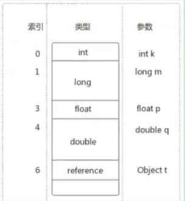
　　
　　举例：
~~~
public void foo(long l, float f) {
    {
        int i = 0;
    }
    {
        String s = "Hello, World";
    }
}
~~~
　　对应的图示：
　　
　　this表示当前类的引用，l和f的类型的值占两个槽位，i和s变量由于分别在各自代码块中，没有共同的生命周期，所以占同一个槽位（即槽位复用）
　　在栈帧中，与性能调优关系最为密切的部分就是局部变量表。局部变量表中的变量也是重要的垃圾回收根节点，只要被局部变量表中直接或间接引用的对象都不会被回收。

### 15.2.4 局部变量压栈指令

<ul>
    <li>iload：从局部变量中装载int类型值</li>
    <li>lload：从局部变量中装载long类型值</li>
    <li>fload：从局部变量中装载float类型值</li>
    <li>dload：从局部变量中装载double类型值</li>
    <li>aload：从局部变量中装载引用类型值（refernce）</li>
    <li>iload_0：从局部变量0中装载int类型值</li>
    <li>iload_1：从局部变量1中装载int类型值</li>
    <li>iload_2：从局部变量2中装载int类型值</li>
    <li>iload_3：从局部变量3中装载int类型值</li>
    <li>lload_0：从局部变量0中装载long类型值</li>
    <li>lload_1：从局部变量1中装载long类型值</li>
    <li>lload_2：从局部变量2中装载long类型值</li>
    <li>lload_3：从局部变量3中装载long类型值</li>
    <li>fload_0：从局部变量0中装载float类型值</li>
    <li>fload_1：从局部变量1中装载float类型值</li>
    <li>fload_2：从局部变量2中装载float类型值</li>
    <li>fload_3：从局部变量3中装载float类型值</li>
    <li>dload_0：从局部变量0中装载double类型值</li>
    <li>dload_1：从局部变量1中装载double类型值</li>
    <li>dload_2：从局部变量2中装载double类型值</li>
    <li>dload_3：从局部变量3中装载double类型值</li>
    <li>aload_0：从局部变量0中装载引用类型值</li>
    <li>aload_1：从局部变量1中装载引用类型值</li>
    <li>aload_2：从局部变量2中装载引用类型值</li>
    <li>aload_3：从局部变量3中装载引用类型值</li>
    <li>iaload：从数组中装载int类型值</li>
    <li>laload：从数组中装载long类型值</li>
    <li>faload：从数组中装载float类型值</li>
    <li>daload：从数组中装载double类型值</li>
    <li>aaload：从数组中装载引用类型值</li>
    <li>baload：从数组中装载byte类型或boolean类型值</li>
    <li>caload：从数组中装载char类型值</li>
    <li>saload：从数组中装载short类型值</li>
</ul>

　　**局部变量压栈常用指令集**
|-|-|-|-|-|
|:---|:---|:---|:---|:---|
|xload_n|xload_0|xload_1|xload_2|xload_3|
|iload_n|iload_0|iload_1|iload_2|iload_3|
|lload_n|lload_0|lload_1|lload_2|lload_3|
|fload_n|fload_0|fload_1|fload_2|fload_3|
|dload_n|dload_0|dload_1|dload_2|dload_3|
|aload_n|aload_0|aload_1|aload_2|aload_3|

　　**局部变量压栈指令剖析**
　　局部变量压栈指令将给定的局部变量表中的数据压入操作数栈。
<div>
    <p>　　这类指令大体可以分为：</p>
    <ul>
        <li>xload_&lt;n&gt;（x为i、l、f、d、a，n为0到3）</li>
        <li>xload（x为i、l、f、d、a）</li>
    </ul>
    <p>　　说明：在这里，x的取值表示数据类型。</p>
</div>

　　指令xload_n表示将第n个局部变量压入操作数栈，比如iload_1、fload_0、aload_0等指令。其中aload_n表示将一个对象引用压栈。
　　指令xload通过指定参数的形式，把局部变量压入操作数栈，当使用这个命令时，表示局部变量的数量可能超过了4个，比如指令iload、fload等。

　　举例：
~~~
public void load(int num, Object obj, long count, boolean flag, short[] arr) {
    System.out.println(num);
    System.out.println(obj);
    System.out.println(count);
    System.out.println(flag);
    System.out.println(arr);
}
~~~
　　字节码执行过程
　　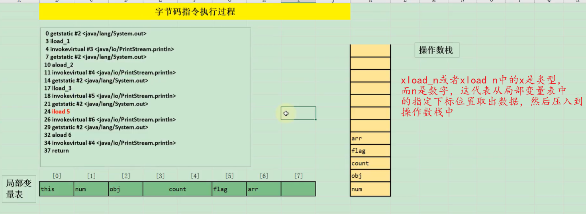

### 15.2.2 常量入栈指令

　　**load指令和const指令都是压栈指令，不同的是const是从常量池读取数据压栈，load是从局部变量表读取数据压栈**
<ul>
    <li>aconst_null：将null对象引用压入栈</li>
    <li>iconst_m1：将int类型常量-1压入栈</li>
    <li>iconst_0：将int类型常量0压入栈</li>
    <li>iconst_1：将int类型常量1压入栈</li>
    <li>iconst_2：将int类型常量2压入栈</li>
    <li>iconst_3：将int类型常量3压入栈</li>
    <li>iconst_4：将int类型常量4压入栈</li>
    <li>iconst_5：将int类型常量5压入栈</li>
    <li>lconst_0：将long类型常量0压入栈</li>
    <li>lconst_1：将long类型常量1压入栈</li>
    <li>fconst_0：将float类型常量0压入栈</li>
    <li>fconst_1：将float类型常量1压入栈</li>
    <li>dconst_0：将double类型常量0压入栈</li>
    <li>dconst_1：将double类型常量1压入栈</li>
    <li>bipush：将一个8位带符号整数压入栈</li>
    <li>sipush：将16位带符号整数压入栈</li>
    <li>ldc：把常量池中的项压入栈</li>
    <li>ldc_w：把常量池中的项压入栈（使用宽索引）</li>
    <li>ldc2_w：把常量池中long类型或者double类型的项压入栈（使用宽索引）</li>
</ul>

　　**常量入栈常用指令集**
|xconst_n|范围|xconst_null|xconst_m1|xconst_0|xconst_1|xconst_2|xconst_3|xconst_4|
|:---|:---|:---|:---|:---|:---|:---|:---|:---|
|iconst_n|[-1, 5]||iconst_m1|iconst_0|iconst_1|iconst_2|iconst_3|iconst_4|
|lconst_n|0, 1|||lconst_0|lconst_1||||
|fconst_n|0, 1, 2|||fconst_0|fconst_1|fconst_2|||
|dconst_n|0, 1|||dconst_0|dconst_1||||
|aconst_n|null, String, literal, Class literal|aconst_null|||||||
|bipush|一个字节，2^8，[-2^7, 2^7 - 1]，即[-128, 127]||||||||
|sipush|两个字节，2^16，[-2^15, 2^15 - 1]，即[-32768, 32767]||||||||
|ldc|四个字节，2^32，[-2^31, 2^31 - 1]||||||||
|ldc_w|宽索引||||||||
|ldc2_w|宽索引，long或double||||||||

<div>
    <h5>常量入栈指令剖析</h5>
    <p>　　常量入栈指令的功能是将常数压入操作数栈，根据数据类型和入栈内容的不同，又可以分为const系列、push系列和ldc指令。</p>
    <div>
        <h6>指令const系列</h6>
        <p>　　用于对特定的常量入栈，入栈的常量隐含在指令本身里。指令有：iconst_&lt;i&gt;（i从-1到5）、lconst_&lt;l&gt;（1从0到1）、fconst_&lt;f&gt;（f从0到2）、dconst_&lt;d&gt;（d从0到1）、aconst_null。比如：</p>
        <ul>
            <li>iconst_m1将-1压入操作数栈；</li>
            <li>iconst_x（x为0到5）将x压入栈；</li>
            <li>lconst_0、lconst_1分别将长整数0和1压入栈；</li>
            <li>fconst_0、fconst_1、fconst_2分别将浮点数0、1、2压入栈；</li>
            <li>dconst_0和dconst_1分别将double型0和1压入栈；</li>
            <li>aconst_null将null压入操作数栈；</li>
        </ul>
        <p>　　从指令的命名上不难找出规律，指令助记符的第一个字符总是喜欢表示数据类型，i表示整数，l表示长整数，f表示浮点数，d表示双精度浮点，习惯上用a表示对象引用。如果指令隐含操作的参数，会以下划线形式给出。</p>
    </div>
    <div>
        <h6>指令push系列</h6>
        <p>　　主要包括bipush和sipush。它们的区别在于接收数据类型的不同，bipush接收8位整数作为参数，sipush接收16位整数，它们都将参数压入栈。</p>
    </div>
    <div>
        <h6>指令ldc系列</h6>
        <p>　　如果以上指令都不能满足需求，那么可以使用万能的</p>
        <ul>
            <li>ldc指令，它可以接收一个8位的参数，该参数指向常量池中的int、float或者String的索引，将指定的内容压入堆栈。</li>
            <li>类似的还有ldc_w，它接收两个8位参数，能支持的索引范围大于ldc。</li>
            <li>如果要压入的元素是long或者double类型的，则使用ldc2_w指令，使用方式都是类似的</li>
        </ul>
    </div>
    <div>
        <h5>总结如下</h5>
        <table>
            <thead>
                <tr>
                    <th>类型</th>
                    <th>常数指令</th>
                    <th>范围</th>
                </tr>
            </thead>
            <tbody>
                <tr>
                    <td rowspan="4">int(boolean,byte,char,short)</td>
                    <td>iconst</td>
                    <td>[-1, 5]</td>
                </tr>
                <tr>
                    <td>bipush</td>
                    <td>[-128, 127]</td>
                </tr>
                <tr>
                    <td>sipush</td>
                    <td>[-32768, 32767]</td>
                </tr>
                <tr>
                    <td>ldc</td>
                    <td>any int value</td>
                </tr>
                <tr>
                    <td rowspan="2">long</td>
                    <td>lconst</td>
                    <td>0, 1</td>
                </tr>
                <tr>
                    <td>ldc</td>
                    <td>any long value</td>
                </tr>
                <tr>
                    <td rowspan="2">float</td>
                    <td>fconst</td>
                    <td>0, 1, 2</td>
                </tr>
                <tr>
                    <td>ldc</td>
                    <td>any float value</td>
                </tr>
                <tr>
                    <td rowspan="2">double</td>
                    <td>dconst</td>
                    <td>0, 1</td>
                </tr>
                <tr>
                    <td>ldc</td>
                    <td>any double value</td>
                </tr>
                <tr>
                    <td rowspan="2">reference</td>
                    <td>aconst</td>
                    <td>null</td>
                </tr>
                <tr>
                    <td>ldc</td>
                    <td>String literal, Class literal</td>
                </tr>
            </tbody>
        </table>
    </div>
</div>
　　
　　

### 15.2.3 出栈装入局部变量表指令

<ul>
    <li>istore：将int类型值存入局部变量</li>
    <li>lstore：将long类型值存入局部变量</li>
    <li>fstore：将float类型值存入局部变量</li>
    <li>dstore：将double类型值存入局部变量</li>
    <li>astore：将将引用类型或returnAddress类型值存入局部变量</li>
    <li>istore_0：将int类型值存入局部变量0</li>
    <li>istore_1：将int类型值存入局部变量1</li>
    <li>istore_2：将int类型值存入局部变量2</li>
    <li>istore_3：将int类型值存入局部变量3</li>
    <li>lstore_0：将long类型值存入局部变量0</li>
    <li>lstore_1：将long类型值存入局部变量1</li>
    <li>lstore_2：将long类型值存入局部变量2</li>
    <li>lstore_3：将long类型值存入局部变量3</li>
    <li>fstore_0：将float类型值存入局部变量0</li>
    <li>fstore_1：将float类型值存入局部变量1</li>
    <li>fstore_2：将float类型值存入局部变量2</li>
    <li>fstore_3：将float类型值存入局部变量3</li>
    <li>dstore_0：将double类型值存入局部变量0</li>
    <li>dstore_1：将double类型值存入局部变量1</li>
    <li>dstore_2：将double类型值存入局部变量2</li>
    <li>dstore_3：将double类型值存入局部变量3</li>
    <li>astore_0：将引用类型或returnAddress类型值存入局部变量0</li>
    <li>astore_1：将引用类型或returnAddress类型值存入局部变量1</li>
    <li>astore_2：将引用类型或returnAddress类型值存入局部变量2</li>
    <li>astore_3：将引用类型或returnAddress类型值存入局部变量3</li>
    <li>iastore：将int类型值存入数组中</li>
    <li>lastore：将long类型值存入数组中</li>
    <li>fastore：将float类型值存入数组中</li>
    <li>dastore：将double类型值存入数组中</li>
    <li>aastore：将引用类型值存入数组中</li>
    <li>bastore：将byte类型或者boolean类型值存入数组中</li>
    <li>castore：将char类型值存入数组中</li>
    <li>sastore：将short类型值存入数组中</li>
    <li>wide指令</li>
    <li>wide：使用附加字节扩展局部变量索引</li>
</ul>

　　**出栈装入局部变量表常用指令集**
|xstore_n|xstore_0|xstore_1|xstore_2|xstore_3|
|:---|:---|:---|:---|:---|
|istore_n|istore_0|istore_1|istore_2|istore_3|
|lstore_n|lstore_0|lstore_1|lstore_2|lstore_3|
|fstore_n|fstore_0|fstore_1|fstore_2|fstore_3|
|dstore_n|dstore_0|dstore_1|dstore_2|dstore_3|
|astore_n|astore_0|astore_1|astore_2|astore_3|

　　**出栈装入局部变量表指令剖析**
　　出栈装入局部变量表指令用于将操作数栈中栈顶元素弹出后，装入局部变量表的指定位置，用于给局部变量赋值。这类指令主要以store的形式存在，比如xstore（x为i、l、f、d、a）、xstore_n（x为i、l、f、d、a，n为0至3）。
　　其中，指令istore_n将从操作数栈中弹出一个整数，并把它值给局部变量索引n位置。
　　指令xstore由于没有隐含参数信息，故需要提供一个byte类型的参数类指定目标局部变量表的位置。
　　说明：一般说来，类似像store这样的命令需要带一个参数，用来指明将弹出的元素放在局部变量表的第几个位置。但是，为了尽可能压缩指令大小，使用专门的istore_1指令表示将弹出的元素放置在局部变量表第1个位置。类似的还有istore_0、istore_2、istore_3，它们分别表示从操作数栈顶弹出一个元素，存放在局部变量表第0、2、3个位置。由于局部变量表前几个位置总是非常常用，因此这种做法虽然增加了指令数量，但是可以大大压缩生成的字节码的体积。如果局部变量表很大，需要存储的槽位大于3，那么可以使用istore指令，外加一个参数，用来表示需要存放的槽位位置。

　　举例：
　　

## 15.3 算术指令
### 15.3.1 作用

　　算术指令用于对两个操作数栈上的值进行某种特定运算，并把结果重新压入操作数栈。

### 15.3.2 分类

　　大体上算术指令可以分为两种：对整型数据进行运算的指令与对浮点类型数据进行运算的指令。

### 15.3.3 byte、short、char和boolean类型说明

　　在每一大类中，都有针对Java虚拟机具体数据类型的专用算术指令。但没有直接支持byte、short、char和boolean类型的算术指令，对于这些数据的运算，都使用int类型的指令来处理。此外，在处理boolean、byte、short和char类型的数组时，也会转换为使用对应的int类型的字节码指令来处理。
　　

### 15.3.4 运算时的溢出

　　数据运算可能会导致溢出，例如两个很大的正整数相加，结果可能是一个负数。其实Java虚拟机规范并无明确规定过整型数据溢出的具体结果，仅规定了在处理整型数据时，只有除法指令以及求余指令中当出现除数为0时会导致虚拟机抛出异常ArithmeticException。

### 15.3.5 运算模式

　　**向最接近数舍入模式**：JVM要求在进行浮点数计算时，所有的运算结果都必须舍入到适当的精度，非精确结果必须舍入为可被表示的最接近的精确值，如果有两种可表示的形式与该值一样接近，将优先选择最低有效位为零的；
　　**向零舍入模式**：将浮点数转换为整数时，采用该模式，该模式将在目标数值类型中选择一个最接近但是不大于原值的数字作为最精确的舍入结果；

### 15.3.6 NaN值使用

　　当一个操作产生溢出时，将会使用有符号的无穷大表示，如果某个操作结果没有明确的数学定义的话，将会使用NaN值来表示。而且所有使用NaN值作为操作数的算术操作，结果都会返回NaN；
　　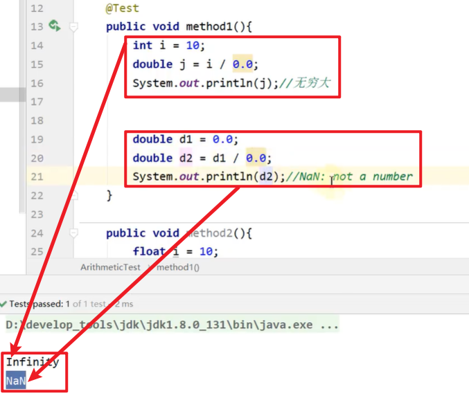

### 15.3.7 所有算术指令

<div>
    <div>
        <h5>整数运算</h5>
        <ul>
            <li>iadd：执行int类型的加法</li>
            <li>ladd：执行long类型的加法</li>
            <li>isub：执行int类型的减法</li>
            <li>lsub：执行long类型的减法</li>
            <li>imul：执行int类型的乘法</li>
            <li>lmul：执行long类型的乘法</li>
            <li>idiv：执行int类型的除法</li>
            <li>ldiv：执行long类型的除法</li>
            <li>irem：计算int类型除法的余数</li>
            <li>lrem：计算long类型除法的余数</li>
            <li>ineg：对一个int类型值进行取反操作</li>
            <li>lneg：对一个long类型值进行取反操作</li>
            <li>iinc：把一个常量值加到一个int类型的局部变量上(不用和操作数栈交互，直接在局部变量表操作)，例iinc 1 by 1，将局部变量表下标为1的元素加1</li>
        </ul>
    </div>
    <div>
        <h5>逻辑运算</h5>
        <ul>
            <li>
                <div>
                    <h6>移位运算</h6>
                    <ul>
                        <li>ishl：执行int类型的向左移位操作</li>
                        <li>lshl：执行long类型的向左移位操作</li>
                        <li>ishr：执行int类型的向右移位操作</li>
                        <li>lshr：执行long类型的向右移位操作</li>
                        <li>iushr：执行int类型的向右逻辑移位操作</li>
                        <li>lushr：执行long类型的向右逻辑移位操作</li>
                    </ul>
                </div>
            </li>
            <li>
                <div>
                    <h6>按位布尔运算</h6>
                    <ul>
                        <li>iand：对int类型值进行“逻辑与”操作</li>
                        <li>land：对long类型值进行“逻辑与”操作</li>
                        <li>ior：对int类型值进行“逻辑或”操作</li>
                        <li>lor：对long类型值进行“逻辑或”操作</li>
                        <li>ixor：对int类型值进行“逻辑异或”操作</li>
                        <li>lxor：对long类型值进行“逻辑异或”操作</li>
                    </ul>
                </div>
            </li>
            <li>
                <div>
                    <h6>浮点运算</h6>
                    <ul>
                        <li>fadd：执行float类型的加法</li>
                        <li>dadd：执行double类型的加法</li>
                        <li>fsub：执行float类型的减法</li>
                        <li>dsub：执行double类型的减法</li>
                        <li>fmul：执行float类型的乘法</li>
                        <li>dmul：执行double类型的乘法</li>
                        <li>fdiv：执行float类型的除法</li>
                        <li>ddiv：执行double类型的除法</li>
                        <li>frem：计算float类型除法的余数</li>
                        <li>drem：计算double类型除法的余数</li>
                        <li>fneg：将一个float类型的数值取反</li>
                        <li>dneg：将一个double类型的数值取反</li>  
                    </ul>
                </div>
            </li>
        </ul>
    </div>
    <div>
        <h5>算术指令集</h5>
        <table>
            <thead>
                <tr>
                    <th colspan="2">算数指令</th>
                    <th>int(boolean,byte,char,short)</th>
                    <th>long</th>
                    <th>float</th>
                    <th>double</th>
                </tr>
            </thead>
            <tbody>
                <tr>
                    <td colspan="2">加法指令</td>
                    <td>iadd</td>
                    <td>ladd</td>
                    <td>fadd</td>
                    <td>dadd</td>
                </tr>
                <tr>
                    <td colspan="2">减法指令</td>
                    <td>isub</td>
                    <td>lsub</td>
                    <td>fsub</td>
                    <td>dsub</td>
                </tr>
                <tr>
                    <td colspan="2">乘法指令</td>
                    <td>imul</td>
                    <td>lmul</td>
                    <td>fmul</td>
                    <td>dmul</td>
                </tr>
                <tr>
                    <td colspan="2">除法指令</td>
                    <td>idiv</td>
                    <td>ldiv</td>
                    <td>fdiv</td>
                    <td>ddiv</td>
                </tr>
                <tr>
                    <td colspan="2">求余指令</td>
                    <td>irem</td>
                    <td>lrem</td>
                    <td>frem</td>
                    <td>drem</td>
                </tr>
                <tr>
                    <td colspan="2">取反指令</td>
                    <td>ineg</td>
                    <td>lneg</td>
                    <td>fneg</td>
                    <td>dneg</td>
                </tr>
                <tr>
                    <td colspan="2">自增指令</td>
                    <td>自增指令	iinc</td>
                    <td></td>
                    <td></td>
                    <td></td>
                </tr>
                <tr>
                    <td rowspan="3">位运算指令</td>
                    <td>按位或指令</td>
                    <td>ior</td>
                    <td>lor</td>
                    <td></td>
                    <td></td>
                </tr>
                <tr>
                    <td>按位与指令</td>
                    <td>iand</td>
                    <td>land</td>
                    <td></td>
                    <td></td>
                </tr>
                <tr>
                    <td>按位异或指令</td>
                    <td>ixor</td>
                    <td>lxor</td>
                    <td></td>
                    <td></td>
                </tr>
                <tr>
                    <td colspan="2">比较指令</td>
                    <td></td>
                    <td>lcmp</td>
                    <td>fcmpg / fcmpl</td>
                    <td>dcmpg / dcmp</td>
                </tr>
            </tbody>
        </table>
    </div>
</div>　　

~~~
public static int bar(int i) {
	return ((i + 1) - 2) * 3 / 4;
}
~~~
　　

　　**举例2**
~~~
public void add() {
	byte i = 15;
	int j = 8;
	int k = i + j;
}
~~~
　　
　　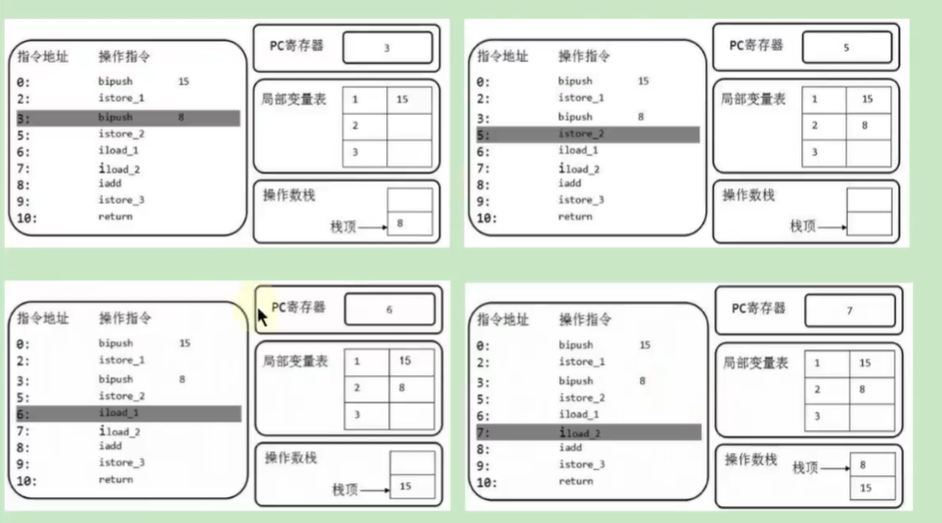
　　
　　

　　**举例3**
~~~
public static void main(String[] args) {
	int x = 500;
	int y = 100;
	int a = x / y;
	int b = 50;
	System.out.println(a + b);
}
~~~
　　
　　

## 15.4 类型转换指令

　　类型转换指令可以将两种不同的数值类型进行相互转换。
　　这些转换操作一般用于实现用户代码中的显式类型转换操作，或者用来处理字节码指令集中数据类型相关指令无法与数据类型一一对应的问题。

<div>
    <div>
        <h5>宽化类型转换</h5>
        <ul>
            <li>i2l：把int类型的数据转化为long类型</li>
            <li>i2f：把int类型的数据转化为float类型</li>
            <li>i2d：把int类型的数据转化为double类型</li>
            <li>l2f：把long类型的数据转化为float类型</li>
            <li>l2d：把long类型的数据转化为double类型</li>
            <li>f2d：把float类型的数据转化为double类型</li>
        </ul>
    </div>
    <div>
        <h5>窄化类型转换</h5>
        <ul>
            <li>i2b：把int类型的数据转化为byte类型</li>
            <li>i2c：把int类型的数据转化为char类型</li>
            <li>i2s：把int类型的数据转化为short类型</li>
            <li>l2i：把long类型的数据转化为int类型</li>
            <li>f2i：把float类型的数据转化为int类型</li>
            <li>f2l：把float类型的数据转化为long类型</li>
            <li>d2i：把double类型的数据转化为int类型</li>
            <li>d2l：把double类型的数据转化为long类型</li>
            <li>d2f：把double类型的数据转化为float类型</li>
        </ul>
    </div>
    <div>
        <h5>类型转换指令集</h5>
        <table>
            <thead>
                <tr>
                    <th></th>
                    <th>byte</th>
                    <th>char</th>
                    <th>short</th>
                    <th>int</th>
                    <th>long</th>
                    <th>float</th>
                    <th>double</th>
                </tr>
            </thead>
            <tbody>
                <tr>
                    <td><b>int</b></td>
                    <td>i2b</td>
                    <td>i2c</td>
                    <td>i2s</td>
                    <td>-</td>
                    <td>i2l</td>
                    <td>i2f</td>
                    <td>i2d</td>
                </tr>
                <tr>
                    <td><b>long</b></td>
                    <td>l2i i2b</td>
                    <td>l2i i2c</td>
                    <td>l2i i2s</td>
                    <td>l2i</td>
                    <td>-</td>
                    <td>l2f</td>
                    <td>l2d</td>
                </tr>
                <tr>
                    <td><b>float</b></td>
                    <td>f2i i2b</td>
                    <td>f2i i2c</td>
                    <td>f2i i2s</td>
                    <td>f2i</td>
                    <td>f2l</td>
                    <td>-</td>
                    <td>f2d</td>
                </tr>
                <tr>
                    <td><b>double</b></td>
                    <td>d2i i2b</td>
                    <td>d2i i2c</td>
                    <td>d2i i2s</td>
                    <td>d2i</td>
                    <td>d2l</td>
                    <td>d2f</td>
                    <td>-</td>
                </tr>
            </tbody>
        </table>
    </div>
</div>

### 15.4.1 宽化类型转换指令

<div>
    <h5>宽化类型转换( Widening Numeric Conversions)</h5>
    <ol>
        <li>
            <div>
                <h6>转换规则</h6>
                <p>　　Java虚拟机直接支持以下数值的宽化类型转换（ widening numeric conversion,小范围类型向大范围类型的安全转换）。也就是说，并不需要指令执行，包括</p>
                <ul>
                    <li>从int类型到long、float或者 double类型。对应的指令为：i21、i2f、i2d </li>
                    <li>从long类型到float、 double类型。对应的指令为：i2f、i2d </li>
                    <li>从float类型到double类型。对应的指令为：f2d </li>
                </ul>
                <p>　　简化为：int-->long-->float-> double</p>
            </div>
        </li>
        <li>
            <div>
                <h6>精度损失问题</h6>
                <ul>
                    <li>宽化类型转换是不会因为超过目标类型最大值而丢失信息的，例如，从int转换到long,或者从int转换到double,都不会丢失任何信息，转换前后的值是精确相等的。 </li>
                    <li>从int、long类型数值转换到float，或者long类型数值转换到double时，将可能发生精度丢失一一可能丢失掉几个最低有效位上的值，转换后的浮点数值是根据IEEE754最接近含入模式所得到的正确整数值。 </li>
                </ul>
                <p>　　尽管宽化类型转换实际上是可能发生精度丢失的，但是这种转换永远不会导致Java虚拟机抛出运行时异常</p>
            </div>
        </li>
        <li>
            <div>
                <h6>补充说明</h6>
                <p>　　从byte、char和short类型到int类型的宽化类型转换实际上是不存在的。对于byte类型转为int，虚拟机并没有做实质性的转化处理，只是简单地通过操作数栈交换了两个数据。而将byte转为long时，使用的是i2l,可以看到在内部，byte在这里已经等同于int类型处理，类似的还有 short类型，这种处理方式有两个特点：</p>
                <ul>
                    <li>一方面可以减少实际的数据类型，如果为 short和byte都准备一套指令，那么指令的数量就会大増，而虚拟机目前的设计上，只愿意使用一个字节表示指令，因此指令总数不能超过256个，为了节省指令资源，将 short和byte当做int处理也在情理之中。</li>
                    <li>另一方面，由于局部变量表中的槽位固定为32位，无论是byte或者 short存入局部变量表，都会占用32位空间。从这个角度说，也没有必要特意区分这几种数据类型。</li>
                </ul>
            </div>
        </li>
    </ol>
</div>

### 15.4.2 窄化类型转换指令

<div>
    <h5>窄化类型转换( Narrowing Numeric Conversion)</h5>
    <ol>
        <li>
            <div>
                <h6>转换规则</h6>
                <p>　　Java虚拟机也直接支持以下窄化类型转换：</p>
                <ul>
                    <li>从主int类型至byte、 short或者char类型。对应的指令有：i2b、i2c、i2s </li>
                    <li>从long类型到int类型。对应的指令有：l2i </li>
                    <li>从float类型到int或者long类型。对应的指令有：f2i、f2l </li>
                    <li>从double类型到int、long或者float类型。对应的指令有：d2i、d2l、d2f </li>
                </ul>
            </div>
        </li>
        <li>
            <div>
                <h6>精度损失问题</h6>
                <p>　　窄化类型转换可能会导致转换结果具备不同的正负号、不同的数量级，因此，转换过程很可能会导致数值丢失精度。</p>
                <p>　　尽管数据类型窄化转换可能会发生上限溢出、下限溢出和精度丢失等情况，但是Java虚拟机规范中明确规定数值类型的窄化转换指令永远不可能导致虚拟机抛出运行时异常</p>
            </div>
        </li>
        <li>
            <div>
                <h6>补充说明</h6>
                <p>　　当将一个浮点值窄化转换为整数类型T(T限于int或long类型之一)的时候，将遵循以下转换规则：</p>
                <ul>
                    <li>如果浮点值是NaN,那转换结果就是int或long类型的0. </li>
                    <li>如果浮点值不是无穷大的话，浮点值使用IEEE754的向零含入模式取整，获得整数值v。如果v在目标类型T(int或long)的表示范围之内，那转换结果就是v。否则，将根据v的符号，转换为T所能表示的最大或者最小正数 </li>
                </ul>
                <p>　　当将一个double类型窄化转换为float类型时，将遵循以下转换规则，通过向最接近数舍入模式舍入一个可以使用float类型表示的数字。最后结果根据下面这3条规则判断：</p>
                <ul>
                    <li>如果转换结果的绝对值太小而无法使用float来表示，将返回float类型的正负零</li>
                    <li>如果转换结果的绝对值太大而无法使用float来表示，将返回float类型的正负无穷大 </li>
                    <li>对于double类型的NaN值将按规定转换为float类型的NaN值。</li>
                </ul>
            </div>
        </li>
    </ol>
</div>

## 15.5 对象的创建与访问指令

　　Java是面向对象的程序设计语言，虚拟机平台从字节码层面就对面向对象做了深层次的支持。有一系列指令专门用于对象操作，可进一步细分为创建指令、字段访问指令、数组操作指令、类型检查指令。

<div>
    <div>
        <h5>对象操作指令</h5>
        <ul>
            <li>new：创建一个新对象</li>
            <li>getfield：从对象中获取字段</li>
            <li>putfield：设置对象中字段的值</li>
            <li>getstatic：从类中获取静态字段</li>
            <li>putstatic：设置类中静态字段的值</li>
            <li>checkcast：确定对象为所给定的类型。后跟目标类，判断栈顶元素是否为目标类 / 接口的实例。如果不是便抛出异常</li>
            <li>instanceof：判断对象是否为给定的类型。后跟目标类，判断栈顶元素是否为目标类 / 接口的实例。是则压入 1，否则压入 0</li>
        </ul>
    </div>
    <div>
        <h5>数组操作指令</h5>
        <ul>
            <li>newarray：分配数据成员类型为基本上数据类型的新数组</li>
            <li>ganewarray：分配数据成员类型为引用类型的新数组</li>
            <li>arraylength：获取数组长度</li>
            <li>multianewarray：分配新的多维数组</li>
        </ul>
    </div>
</div>

　　为什么new对象指令后面，都会添加一个dup指令？
　　new会在堆中开辟空间，并将地址压栈，开辟空间后，还要执行构造方法，会消耗一个栈顶对象，所以需要进行一次dup操作。

### 15.5.1 创建指令

|创建指令|含义|
|:---|:---|
|new|创建类实例|
|newarray|创建基本类型数组|
|anewarray|创建引用类型数组|
|multilanewarra|创建多维数组|

<div>
    <p>虽然类实例和数组都是对象，但Java虚拟机对类实例和数组的创建与操作使用了不同的字节码指令：</p>
    <ol>
        <li>
            创建类实例的指令：
            <ul>
                <li>创建类实例的指令：new</li>
                <li>它接收一个操作数，为指向常量池的索引，表示要创建的类型，执行完成后，将对象的引用压入栈。</li>
            </ul>
        </li>
        <li>
            创建数组的指令： 
            <ul>
                <li>创建数组的指令：newarray、anewarray、multianewarray</li>
                <li>上述创建指令可以用于创建对象或者数组，由于对象和数组在Java中的广泛使用，这些指令的使用频率也非常高。</li>
            </ul>
        </li>
    </ol>
</div>

### 15.5.2 字段访问指令

|字段访问指令|含义|
|:---|:---|
|getstatic、putstatic|访问类字段（static字段，或者称为类变量）的指令|
|getfield、 putfield|访问类实例字段（非static字段，或者称为实例变量）的指令|

<div>
    <p>对象创建后，就可以通过对象访问指令获取对象实例或数组实例中的字段或者数组元素。</p>
    <ul>
        <li>访问类字段（static字段，或者称为类变量）的指令：getstatic、putstatic</li>
        <li>访问类实例字段（非static字段，或者称为实例变量）的指令：getfield、putfield</li>
    </ul>
</div>

　　举例：以getstatic指令为例，它含有一个操作数，为指向常量池的Fieldref索引，它的作用就是获取Fieldref指定的对象或者值，并将其压入操作数栈。
~~~
public void sayHello() {
    System.out.println("hel1o"); 
}
~~~
　　对应的字节码指令：
~~~
0 getstatic #8 <java/lang/System.out>
3 ldc #9 <hello>
5 invokevirtual #10 <java/io/PrintStream.println>
8 return
~~~
　　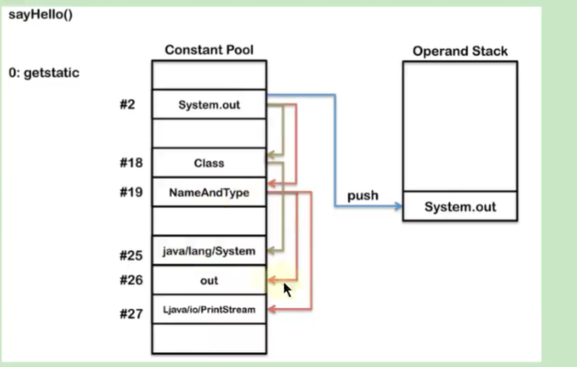

### 15.5.3 数组操作指令

<div>
    <p>数组操作指令主要有：xastore和xaload指令。具体为：</p>
    <ul>
        <li>把一个数组元素加载到操作数栈的指令：baload、caload、saload、iaload、laload、faload、daload、aaload</li>
        <li>将一个操作数栈的值存储到数组元素中的指令：bastore、castore、sastore、iastore、lastore、fastore、dastore、aastore</li>
    </ul>
</div>

|数组指令|byte(boolean)|char|short|int|long|float|double|reference|
|:---|:---|:---|:---|:---|:---|:---|:---|:---|
|xaload|baload|caload|saload|iaload|laload|faload|daload|aaload|
|xastore|bastore|castore|sastore|iastore|lastore|fastore|dastore|aastore|

　　取数组长度的指令：arraylength。该指令弹出栈顶的数组元素，获取数组的长度，将长度压入栈。
　　指令xaload表示将数组的元素压栈，比如saload、caload分别表示压入short数组和char数组。指令xaload在执行时，要求操作数中栈顶元素为数组索引i，栈顶顺位第2个元素为数组引用a，该指令会弹出栈顶这两个元素，并将a[i]重新压入栈。
　　xastore则专门针对数组操作，以iastore为例，它用于给一个int数组的给定索引赋值。在iastore执行前，操作数栈顶需要以此准备3个元素：值、索引、数组引用，iastore会弹出这3个值，并将值赋给数组中指定索引的位置。

### 15.5.4 类型检查指令

<div>
    <p>检查类实例或数组类型的指令：instanceof、checkcast。</p>
    <ul>
        <li>指令checkcast用于检查类型强制转换是否可以进行。如果可以进行，那么checkcast指令不会改变操作数栈，否则它会抛出ClassCastException异常</li>
        <li>指令instanceof用来判断给定对象是否是某一个类的实例，它会将判断结果压入操作数栈。</li>
    </ul>
</div>

|类型检查指令|含义|
|:---|:---|
|instanceof|检查类型强制转换是否可以进行|
|checkcast|判断给定对象是否是某一个类的实例|

## 15.6 方法调用与返回指令

<div>
    <div>
        <h5>方法调用指令</h5>
        <ul>
            <li>invokevirtual：运行时按照对象的类来调用实例方法</li>
            <li>invokespecial：根据编译时类型来调用实例方法</li>
            <li>invokestatic：调用类（静态）方法</li>
            <li>invokcinterface：调用接口方法</li>
        </ul>
    </div>
    <div>
        <h5>方法返回指令</h5>
        <ul>
            <li>ireturn：从方法中返回int类型的数据</li>
            <li>lreturn：从方法中返回long类型的数据</li>
            <li>freturn：从方法中返回float类型的数据</li>
            <li>dreturn：从方法中返回double类型的数据</li>
            <li>areturn：从方法中返回引用类型的数据</li>
            <li>return：从方法中返回，返回值为void</li>
        </ul>
    </div>
</div>

### 15.6.1 方法调用指令

<div>
    <p>方法调用指令：invokevirtual、invokeinterface、invokespecial、invokestatic、invokedynamic，以下5条指令用于方法调用：</p>
    <ul>
        <li>invokevirtual：指令用于调用对象的实例方法，根据对象的实际类型进行分派（虚方法分派），支持多态。这也是Java语言中最常见的方法分派方式。</li>
        <li>invokeinterface：指令用于调用接口方法，它会在运行时搜索由特定对象所实现的这个接口方法，并找出适合的方法进行调用。</li>
        <li>invokespecial：指令用于调用一些需要特殊处理的实例方法，包括实例初始化方法（构造器）、私有方法和父类方法(super.method)。这些方法都是静态类型绑定的，不会在调用时进行动态派发。即通过这次调用只会调用到独一无二的方法。</li>
        <li>invokestatic：指令用于调用命名类中的类方法（static方法）。这是静态绑定的。</li>
        <li>invokedynamic：指令用于调用动态绑定的方法，这个是JDK1.7后新加入的指令。用于在运行时动态解析出调用点限定符所引用的方法，并执行该方法。</li>
    </ul>
    <p>　　指令的分派逻辑是由用户所设定的引导方法决定的，而前面4条调用指令的分派逻辑都固化在java虚拟机内部。</p>
</div>

|方法调用指令|含义|
|:---|:---|
|invokevirtual|调用对象的实例方法|
|invokeinterface|调用接口方法|
|invokespecial|调用一些需要特殊处理的实例方法，包括实例初始化方法（构造器）、私有方法和父类方法|
|invokestatic|调用命名类中的类方法（static方法）|
|invokedynamic|调用动态绑定的方法|

### 15.6.2 方法返回指令

<div>
    <p>方法调用结束前，需要进行返回。方法返回指令是根据返回值的类型区分的。</p>
    <ul>
        <li>包括ireturn（当返回值是boolean、byte、char、short和int 类型时使用）、lreturn、freturn、dreturn和areturn</li>
        <li>另外还有一条return 指令供声明为void的方法、实例初始化方法以及类和接口的类初始化方法使用。</li>
    </ul> 
</div>

|方法返回指令|void|int|long|float|
|:---|:---|:---|:---|:---|
|xreturn|return|ireturn|lreturn|freutrn|

　　通过ireturn指令，将当前函数操作数栈的顶层元素弹出，并将这个元素压入调用者函数的操作数栈中（因为调用者非常关心函数的返回值），所有在当前函数操作数栈中的其他元素都会被丢弃。
　　如果当前返回的是synchronized方法，那么还会执行一个隐含的monitorexit指令，退出临界区。
　　最后，会丢弃当前方法的整个帧，恢复调用者的帧，并将控制权转交给调用者。
　　举例：
~~~
public int methodReturn() {
    int i = 500;
    int j = 200;
    int k = 50;
    
    return (i + j) / k;
}
~~~
　　图示：
　　

## 15.7 操作数栈管理指令

<div>
    <p>　　如同操作一个普通数据结构中的堆栈那样，JVM提供的操作数栈管理指令，可以用于直接操作操作数栈的指令。</p>
    <div>
        <h5>这类指令包括如下内容：</h5>
        <ul>
            <li>将一个或两个元素从栈顶弹出，并且直接废弃：pop，pop2</li>
            <li>复制栈顶一个或两个数值并将复制值或双份的复制值重新压入栈顶：dup，dup2，dup_x1，dup2_×1，dup_×2，dup2_×2</li>
            <li>将栈最顶端的两个Slot数值位置交换：swap。Java虚拟机没有提供交换两个64位数据类型（long、double）数值的指令。</li>
            <li>指令nop，是一个非常特殊的指令，它的字节码为0x00。和汇编语言中的nop一样，它表示什么都不做。这条指令一般可用于调试、占位等。</li>
        </ul>
    </div>
    <div>
        <h5>这些指令属于通用型，对栈的压入或者弹出无需指明数据类型：</h5>
        <ul>
            <li>不带_x的指令是复制栈顶数据并压入栈顶。包括两个指令，dup，dup2。dup的系数代表要复制的Slot个数。dup开头的指令用于复制1个Slot的数据。例如1个int或1个reference类型数据dup2开头的指令用于复制2个Slot的数据。例如1个long，或2个int，或1个int+1个float类型数据</li>
            <li>带_x的指令是复制栈顶数据并插入栈顶以下的某个位置。共有4个指令，dup_×1，dup2_×1，dup_×2，dup2×2。对于带x的复制插入指令，只要将指令的dup和x的系数相加，结果即为需要插入的位置。因此dup×1插入位置：1+1=2，即栈顶2个slot下面dup_×2插入位置：1+2=3，即栈顶3个slot下面；dup2×1插入位置：2+1=3，即栈顶3个Slot下面</li>
            <li>pop：将栈顶的1个Slot数值出栈。例如1个short类型数值</li>
            <li>pop2：将栈顶的2个slot数值出栈。例如1个double类型数值，或者2个int类型数值</li>
        </ul>
    </div>
    <div>
        <h5>通用(无类型）栈操作</h5>
        <ul>
            <li>nop：不做任何操作</li>
            <li>pop：弹出栈顶端一个字长的内容</li>
            <li>pop2：弹出栈顶端两个字长的内容</li>
            <li>dup：复制栈顶部一个字长内容</li>
            <li>dup_x1：复制栈顶部一个字长的内容，然后将复制内容及原来弹出的两个字长的内容压入栈</li>
            <li>dup_x2：复制栈顶部一个字长的内容，然后将复制内容及原来弹出的三个字长的内容压入栈</li>
            <li>dup2：复制栈顶部两个字长内容</li>
            <li>dup2_x1：复制栈顶部两个字长的内容，然后将复制内容及原来弹出的三个字长的内容压入栈</li>
            <li>dup2_x2：复制栈顶部两个字长的内容，然后将复制内容及原来弹出的四个字长的内容压入栈</li>
            <li>swap：交换栈顶部两个字长内容</li>
        </ul>
    </div>
</div>

## 15.8 控制转移指令

<div>
    <div>
        <p>程序流程离不开条件控制，为了支持条件跳转，虚拟机提供了大量字节码指令，大体上可以分为</p>
        <ol>
            <li>比较指令</li>
            <li>条件跳转指令</li>
            <li>比较条件跳转指令</li>
            <li>多条件分支跳转指令</li>
            <li>无条件跳转指令等</li>
        </ol>
    </div>
    <div>
        <h5>比较指令</h5>
        <ul>
            <li>lcmp：比较long类型值</li>
            <li>fcmpl：比较float类型值（当遇到NaN时，返回-1）</li>
            <li>fcmpg：比较float类型值（当遇到NaN时，返回1）</li>
            <li>dcmpl：比较double类型值（当遇到NaN时，返回-1）</li>
            <li>dcmpg：比较double类型值（当遇到NaN时，返回1）</li>
        </ul>
    </div>
    <div>
        <h5>条件跳转指令</h5>
        <ul>
            <li>ifeq：如果等于0，则跳转</li>
            <li>ifne：如果不等于0，则跳转</li>
            <li>iflt：如果小于0，则跳转</li>
            <li>ifge：如果大于等于0，则跳转</li>
            <li>ifgt：如果大于0，则跳转</li>
            <li>ifle：如果小于等于0，则跳转</li>
        </ul>
    </div>
    <div>
        <h5>比较条件跳转指令</h5>
        <ul>
            <li>if_icmpeq：如果两个int值相等，则跳转</li>
            <li>if_icmpne：如果两个int类型值不相等，则跳转</li>
            <li>if_icmplt：如果一个int类型值小于另外一个int类型值，则跳转</li>
            <li>if_icmpge：如果一个int类型值大于或者等于另外一个int类型值，则跳转</li>
            <li>if_icmpgt：如果一个int类型值大于另外一个int类型值，则跳转</li>
            <li>if_icmple：如果一个int类型值小于或者等于另外一个int类型值，则跳转</li>
            <li>ifnull：如果等于null，则跳转</li>
            <li>ifnonnull：如果不等于null，则跳转</li>
            <li>if_acmpeq：如果两个对象引用相等，则跳转</li>
            <li>if_acmpne：如果两个对象引用不相等，则跳转</li>
        </ul>
    </div>
    <div>
        <h5>多条件分支跳转指令</h5>
        <ul>
            <li>tableswitch：通过索引访问跳转表，并跳转</li>
            <li>lookupswitch：通过键值匹配访问跳转表，并执行跳转操作</li>
        </ul>
    </div>
    <div>
        <h5>无条件跳转指令</h5>
        <ul>
            <li>goto：无条件跳转</li>
            <li>goto_w：无条件跳转（宽索引）</li>
        </ul>
    </div>
</div>

### 15.8.1 比较指令

　　比较指令的作用是比较占栈顶两个元素的大小，并将比较结果入栈。比较指令有： dcmpg,dcmpl、 fcmpg、fcmpl、lcmp。与前面讲解的指令类似，首字符d表示double类型，f表示float,l表示long。
　　对于double和float类型的数字，由于NaN的存在，各有两个版本的比较指令。以float为例，有fcmpg和fcmpl两个指令，它们的区别在于在数字比较时，若遇到NaN值，处理结果不同。
　　指令dcmpl和 dcmpg也是类似的，根据其命名可以推测其含义，在此不再赘述。
　　数值类型的数据，才可以谈大小！boolean、引用数据类型不能比较大小。

　　举例
　　指令 fcmp和fcmpl都从中弹出两个操作数，并将它们做比较，设栈顶的元素为v2，顶顺位第2位的元素为v1：若v1=v2，则压入0；若v1>v2，则压入1；若v1<v2，则压入-1。
　　两个指令的不同之处在于，如果遇到NaN值， fcmpg会压入1,而fcmpl会压入-1

### 15.8.2 条件跳转指令

　　条件跳转指令通常和比较指令结合使用。在条件跳转指令执行前，一般可以先用比较指令进行栈顶元素的准备，然后进行条件跳转。
　　条件跳转指令有：ifeq，iflt，ifle，ifne，ifgt，ifge，ifnull，ifnonnull。这些指令都接收两个字节的操作数，用于计算跳转的位置（16位符号整数作为当前位置的offset）。
　　它们的统一含义为：弹出栈顶元素，测试它是否满足某一条件，如果满足条件，则跳转到给定位置。
|<|<=|==|!=|>=|>|null|not null|
|:---|:---|:---|:---|:---|:---|:---|:---|
|iflt|ifle|ifeq|ifng|ifge|ifgt|ifnull|ifnonnull|

　　

<div>
    <p>与前面运算规则一致：</p>
    <ul>
        <li>对于boolean、byte、char、short类型的条件分支比较操作，都是使用int类型的比较指令完成</li>
        <li>对于long、float、double类型的条件分支比较操作，则会先执行相应类型的比较运算指令，运算指令会返回一个整型值到操作数栈中，随后再执行int类型的条件分支比较操作来完成整个分支跳转</li>
    </ul>
</div>

　　由于各类型的比较最终都会转为int类型的比较操作，所以Java虚拟机提供的int类型的条件分支指令是最为丰富和强大的。

### 15.8.3 比较条件跳转指令

　　比较条件跳转指令类似于比较指令和条件跳转指令的结合体，它将比较和跳转两个步骤合二为一。
　　这类指令有：if_icmpeq、if_icmpne、if_icmplt、if_icmpgt、if_icmple、if_icmpge、if_acmpeq和if_acmpne。其中指令助记符加上“if_”后，以字符“i”开头的指令针对it型整数操作（也包括short和byte类型），以字符“a”开头的指令表示对象引用的比较。

|<|<=|==|!=|>=|
|:---|:---|:---|:---|:---|
|if_icmplt|if_icmple|if_icmpeq、if_acmpeq|if_icmpne、if_acmpne|if_icmpge|

　　
　　这些指令都接收两个字节的操作数作为参数，用于计算跳转的位置。同时在执行指令时，栈顶需要准备两个元素进行比较。指令执行完成后，栈顶的这两个元素被清空，且没有任何数据入栈。如果预设条件成立，则执行跳转，否则，继续执行下一条语句。

### 15.8.4 多条件分支跳转指令

　　多条件分支跳转指令是专为switch-case语句设计的，主要有tableswitch和lookupswitch。

|指令名称|描述|
|:---|:---|
|tableswitch|用于switch条件跳转，case值连续|
|lookupswitch|用于switch条件跳转，case值不连续|

<div>
    <p>从助记符上看，两者都是switch语句的实现，它们的区别：</p>
    <ul>
        <li>tableswitch要求多个条件分支值是连续的，它内部只存放起始值和终止值，以及若干个跳转偏移量，通过给定的操作数index，可以立即定位到跳转偏移量位置，因此效率比较高。</li>
        <li>lookupswitch内部存放着各个离散的case-offset对，每次执行都要搜索全部的case-offset对，找到匹配的case值，并根据对应的offset计算跳转地址(或者有优化的情况，使用二分法查找)，因此效率较低。</li>
    </ul>
</div>

　　指令tableswitch的示意图如下图所示。由于tableswitch的case值是连续的，因此只需要记录最低值和最高值，以及每一项对应的offset偏移量，根据给定的index值通过简单的计算即可直接定位到offset。
　　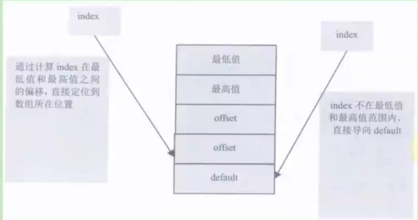

　　指令lookupswitch处理的是离散的case值，但是出于效率考虑，将case-offset对按照case值大小排序，给定index时，需要查找与index相等的case，获得其offset，如果找不到则跳转到default。指令lookupswitch如下图所示。
　　

　　java7中case可以是字符串，本质是在编译时，获取其字符串的hashcode，将参数的hashcode和case相对比。

### 15.8.5 无条件跳转指令

　　目前主要的无条件跳转指令为goto。指令goto接收两个字节的操作数，共同组成一个带符号的整数，用于指定指令的偏移量，指令执行的目的就是跳转到偏移量给定的位置处。
　　如果指令偏移量太大，超过双字节的带符号整数的范围，则可以使用指令goto_w，它和goto有相同的作用，但是它接收4个字节的操作数，可以表示更大的地址范围。
　　指令jsr、jsr_w、ret虽然也是无条件跳转的，但主要用于try-finally语句，且已经被虚拟机逐渐废弃，故不在这里介绍这两个指令。

|指令名称|描述|
|:---|:---|
|goto|无条件跳转|
|goto_w|无条件跳转（宽索引）|
|jsr|跳转至指定16位offset位置，并将jsr下一条指令地址压入栈顶|
|jsr_w|跳转至指定32位offer位置，并将jsr_w下一条指令地址压入栈顶|
|ret|返回至由指定的局部变量所给出的指令位置（一般与jsr、jsr_w联合使用）|

## 15.9 异常处理指令

<div>
    <h5>异常处理指令</h5>
    <ul>
        <li>athrow 抛出异常或错误。将栈顶异常抛出</li>
        <li>jsr 跳转到子例程</li>
        <li>jsr_w 跳转到子例程（宽索引）</li>
        <li>ret 从子例程返回</li>
    </ul>
</div>

　　**athrow指令**
　　在Java程序中显示抛出异常的操作（throw语句）都是由athrow指令来实现。
　　除了使用throw语句显示抛出异常情况之外，JVM规范还规定了许多运行时异常会在其他Java虚拟机指令检测到异常状况时自动抛出。例如，在之前介绍的整数运算时，当除数为零时，虚拟机会在idiv或1div指令中抛出ArithmeticException异常。
　　正常情况下，操作数栈的压入弹出都是一条条指令完成的。唯一的例外情况是在抛异常时，Java虚拟机会清除操作数栈上的所有内容，而后将异常实例压入调用者操作数栈上。

　　**处理异常**
　　在Java虚拟机中，处理异常（catch语句）不是由字节码指令来实现的（早期使用jsr、ret指令），而是采用异常表来完成的。

<div>
    <h5>　　异常表</h5>
    <p>　　如果一个方法定义了一个try-catch 或者try-finally的异常处理，就会创建一个异常表。它包含了每个异常处理或者finally块的信息。异常表保存了每个异常处理信息。比如：</p>
    <ul>
        <li>起始位置</li>
        <li>结束位置</li>
        <li>程序计数器记录的代码处理的偏移地址</li>
        <li>被捕获的异常类在常量池中的索引</li>
    </ul>
    <p>　　当一个异常被抛出时，JVM会在当前的方法里寻找一个匹配的处理，如果没有找到，这个方法会强制结束并弹出当前栈帧，并且异常会重新抛给上层调用的方法（在调用方法栈帧）。如果在所有栈帧弹出前仍然没有找到合适的异常处理，这个线程将终止。如果这个异常在最后一个非守护线程里抛出，将会导致JVM自己终止，比如这个线程是个main线程。</p>
    <p>　　不管什么时候抛出异常，如果异常处理最终匹配了所有异常类型，代码就会继续执行。在这种情况下，如果方法结束后没有抛出异常，仍然执行finally块，在return前，它直接跳到finally块来完成目标</p>       
</div>

## 15.10 同步控制指令

　　java虚拟机支持2种同步结构："方法级的同步"和"方法内部一级指令序列的同步"，这2种同步都是使用monitor来支持的。

### 15.10.1 方法级的同步

　　方法级的同步：是隐式的，即无须通过字节码指令来控制，它实现在方法调用和返回操作之中。虚拟机可以从方法常量池的方法表结构中的ACC_SYNCHRONIZED访问标志得知一个方法是否声明为同步方法；

<div>
    <h5>　　当调用方法时，调用指令将会检查方法的ACC_SYNCHRONIZED访问标志是否设置？</h5>
    <ul>
        <li>如果设置了，执行线程将先持有同步锁，然后执行方法。最后在方法完成（无论是正常完成还是非正常完成）时释放同步锁。</li>
        <li>在方法执行期间，执行线程持有了同步锁，其他任何线程都无法再获得同一个锁。</li>
        <li>如果一个同步方法执行期间抛出了异常，并且在方法内部无法处理此异常，那这个同步方法所持有的锁将在异常抛到同步方法之外时自动释放。</li>
    </ul>
</div>

　　举例：
~~~
private int i = 0;
public synchronized void add() {
	i++;
}
~~~

　　对应的字节码：
~~~
0  aload_0
1  dup
2  getfield #2 <com/atguigu/java1/SynchronizedTest.i>
5  iconst_1 
6  iadd
7  putfield #2 <com/atguigu/java1/SynchronizedTest.i>
10 return
~~~

　　**说明**
　　这段代码和普通的无同步操作的代码没有什么不同，没有使用monitorenter和monitorexit进行同步区控制。
　　这是因为，对于同步方法而言，当虚拟机通过方法的访问标示符判断是一个同步方法时，会自动在方法调用前进行加锁，当同步方法执行完毕后，不管方法是正常结束还是有异常抛出，均会由虚拟机释放这个锁。
　　因此，对于同步方法而言，monitorenter和monitorexit指令是隐式存在的，并未直接出现在字节码中。

### 15.10.2 方法内指令指令序列的同步

　　同步一段指令集序列：通常是由java中的synchronized语句块来表示的。jvm的指令集有monitorenter和monitorexit 两条指令来支持synchronized关键字的语义。
　　当一个线程进入同步代码块时，它使用monitorenter指令请求进入。如果当前对象的监视器计数器为0，则它会被准许进入，若为1，则判断持有当前监视器的线程是否为自己，如果是，则进入，否则进行等待，直到对象的监视器计数器为0，才会被允许进入同步块。
　　当线程退出同步块时，需要使用monitorexit声明退出。在Java虚拟机中，任何对象都有一个监视器与之相关联，用来判断对象是否被锁定，当监视器被持有后，对象处于锁定状态。
　　指令monitorenter和monitorexit在执行时，都需要在操作数栈顶压入对象($\color{#FF0000}{因为这2个指令改变的是对象的对象头信息中的锁标志，所以要压入对象，同时也会在对象头中记录是哪个线程持有锁}$)，之后monitorenter和monitorexit的锁定和释放都是针对这个对象的监视器进行的。
　　下图展示了监视器如何保护临界区代码不同时被多个线程访问，只有当线程4离开临界区后，线程1、2、3才有可能进入。
　　对应的字节码：
~~~
 0: aloade
 1: dup
 2: astore_1
 3: monitorenter
 4: aload_0
 5: dup
 6: getfield #2 //Field i:I
 9: iconst_1
10: isub
11: putfield #2 //Field i:I
14: aload_1
15: monitorexit
16: goto 24
19: astore_2
26: aload_1
21: monitorexit
22: aload_2
23: athrow
24: return

Exception table:
	from to target type
	4	 16	   19  any
	19	 22    19  any
~~~

　　编译器必须确保无论方法通过何种方式完成，方法中调用过的每条monitorenter指令都必须执行其对应的monitorexit指令，而无论这个方法是正常结束还是异常结束。
　　**为了保证在方法异常完成时monitorenter和monitorexit指令依然可以正确配对执行，编译器会自动产生一个异常处理器，这个异常处理器声明可处理所有的异常，它的目的就是用来执行monitorexit指令。要是没有这个操作，出现异常这个对象就锁死了。**


# 16 类的加载过程（类的生命周期）详解
## 16.1 概述

　　在Java中数据类型分为基本数据类型和引用数据类型。基本数据类型由虚拟机预先定义，引用数据类型则需要进行类的加载。
　　按照Java虚拟机规范，从class文件到加载到内存中的类，到类卸载出内存为止，它的整个生命周期包括如下7个阶段：
　　

　　其中，验证、准备、解析3个部分统称为链接（Linking）
　　从程序中类的使用过程看
　　

## 16.2 过程一：Loading（加载）阶段
### 16.2.1 加载完成的操作

　　**加载的理解**
　　$\color{#FF0000}{所谓加载，简单来说就是将Java类的字节码文件加载到机器内存中，并在内存中构建出Java类的原型——类模板对象}$所谓类模板对象，其实就是Java类在]VM内存中的一个快照，JVM将从字节码文件中解析出的常量池、类字段、类方法等信息存储到类模板中，这样]VM在运行期便能通过类模板而获取Java类中的任意信息，能够对Java类的成员变量进行遍历，也能进行Java方法的调用。
　　反射的机制即基于这一基础。如果JVM没有将Java类的声明信息存储起来，则JVM在运行期也无法反射。

　　**加载完成的操作**
　　**加载阶段，简言之，查找并加载类的二进制数据，生成Class实例。**
<div>
    <h5>　　在加载类时，Java虚拟机必须完成以下3件事情：</h5>
    <ul>
        <li>通过类的全名，获取类的二进制数据流。</li>
        <li>解析类的二进制数据流为方法区内的数据结构（Java类模型）</li>
        <li>创建java.lang.Class类的实例，表示该类型。作为方法区这个类的各种数据的访问入口</li>
    </ul>
</div>


### 16.2.2 二进制流的获取方式

<div>
    <h5>　　对于类的二进制数据流，虚拟机可以通过多种途径产生或获得。（只要所读取的字节码符合JVM规范即可）</h5>
    <ul>
        <li>虚拟机可能通过文件系统读入一个class后缀的文件</li>
        <li>读入jar、zip等归档数据包，提取类文件。</li>
        <li>事先存放在数据库中的类的二进制数据</li>
        <li>使用类似于HTTP之类的协议通过网络进行加载</li>
        <li>在运行时生成一段class的二进制信息等</li>
        <li>在获取到类的二进制信息后，Java虚拟机就会处理这些数据，并最终转为一个java.lang.Class的实例。</li>
    </ul>
    <p>　　如果输入数据不是ClassFile的结构，则会抛出ClassFormatError。</p>
</div>

### 16.2.3 类模型与Class实例的位置

　　**类模型的位置**
　　加载的类在JVM中创建相应的类结构，类结构会存储在方法区（JDKl.8之前：永久代；J0Kl.8及之后：元空间）。

　　**Class实例的位置**
　　类将.class文件加载至元空间后，会在堆中创建一个Java.lang.Class对象，用来封装类位于方法区内的数据结构，该Class对象是在加载类的过程中创建的，每个类都对应有一个Class类型的对象(在方法区的是instanceKlass，它的镜像是堆区的Class实例)。
　　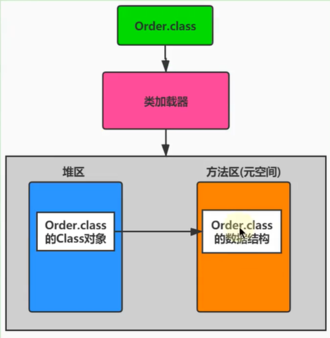
　　外部可以通过访问Order类的Class对象来获取Order的类数据结构。

　　**再说明**
　　Class类的构造方法是私有的，只有JVM能够创建
　　java.lang.Class实例是访问类型元数据的接口，也是实现反射的关键数据、入口。通过Class类提供的接口，可以获取目标类所关联的.class文件中具体的数据结构：方法、字段等信息。

### 16.2.4 数组类的加载

　　创建数组类的情况稍微有些特殊，因为数组类本身并不是由类加载器负责创建，而是由JVM在运行时根据需要而直接创建的，但数组的元素类型仍然需要依靠类加载器去创建。

<div>
    <h5>　　创建数组类（下述简称A）的过程：</h5>
    <ul>
        <li>如果数组的元素类型是引用类型，那么就遵循定义的加载过程递归加载和创建数组A的元素类型；</li>
        <li>JVM使用指定的元素类型和数组维度来创建新的数组类。</li>
    </ul>
</div>

　　如果数组的元素类型是引用类型，数组类的可访问性就由元素类型的可访问性决定。否则数组类的可访问性将被缺省定义为public。

## 16.3 过程二：Linking（链接）阶段
### 16.3.1 环节1：链接阶段之Verification（验证）

　　当类加载到系统后，就开始链接操作，验证是链接操作的第一步。
　　它的目的是保证加载的字节码是合法、合理并符合规范的。
　　验证的步骤比较复杂，实际要验证的项目也很繁多，大体上Java虚拟机需要做以下检查，如图所示。
　　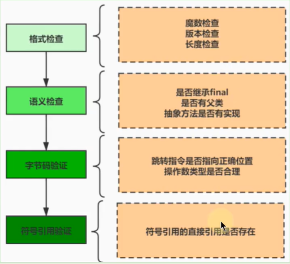

<div>
    <h5>　　整体说明：</h5>
    <p>　　验证的内容则涵盖了类数据信息的格式验证、语义检查、字节码验证，以及符号引用验证等。</p>
    <ul>
        <li>其中格式验证会和加载阶段一起执行。验证通过之后，类加载器才会成功将类的二进制数据信息加载到方法区中。</li>
        <li>格式验证之外的验证操作会在方法区中进行。</li>
    </ul>
</div>

　　链接阶段的验证虽然拖慢了加载速度，但是它避免了在字节码运行时还需要进行各种检查。（磨刀不误砍柴工）

<div>
    <h5>　　具体说明：</h5>
    <ol>
        <li>格式验证：是否以魔数0XCAFEBABE开头，主版本和副版本号是否在当前Java虚拟机的支持范围内，数据中每一个项是否都拥有正确的长度等。</li>
        <li>
            语义检查：Java虚拟机会进行字节码的语义检查，但凡在语义上不符合规范的，虚拟机也不会给予验证通过。比如： 
            <ul>
                <li>是否所有的类都有父类的存在（在Java里，除了object外，其他类都应该有父类）</li>
                <li>是否一些被定义为final的方法或者类被重写或继承了</li>
                <li>非抽象类是否实现了所有抽象方法或者接口方法</li>
            </ul>
        </li>
        <li>
            字节码验证：Java虚拟机还会进行字节码验证，<b>字节码验证也是验证过程中最为复杂的一个过程</b>。它试图通过对字节码流的分析，判断字节码是否可以被正确地执行。比如：
            <ul>
                <li>在字节码的执行过程中，是否会跳转到一条不存在的指令</li>
                <li>函数的调用是否传递了正确类型的参数</li>
                <li>变量的赋值是不是给了正确的数据类型等</li>
            </ul>
            栈映射帧（StackMapTable）就是在这个阶段，用于检测在特定的字节码处，其局部变量表和操作数栈是否有着正确的数据类型。但遗憾的是，100%准确地判断一段字节码是否可以被安全执行是无法实现的，因此，该过程只是尽可能地检查出可以预知的明显的问题。如果在这个阶段无法通过检查，虚拟机也不会正确装载这个类。但是，如果通过了这个阶段的检查，也不能说明这个类是完全没有问题的。
            在前面3次检查中，已经排除了文件格式错误、语义错误以及字节码的不正确性，但是依然不能确保类是没有问题的。
        </li>
        <li>
            符号引用的验证：校验器还将进符号引用的验证。Class文件在其常量池会通过字符串记录自己将要使用的其他类或者方法。因此，在验证阶段，虚拟机就会检查这些类或者方法确实是存在的，并且当前类有权限访问这些数据，如果一个需要使用类无法在系统中找到，则会抛出NoClassDefFoundError，如果一个方法无法被找到，则会抛出NoSuchMethodError。此阶段在解析环节才会执行。 
        </li>
    </ol>
</div>

### 16.3.2 环节2：链接阶段之Preparation（准备）

　　**准备阶段(Preparation)，简言之，为类的静态变量分配内存，并将其初始化为默认值。**
　　当一个类验证通过时，虚拟机就会进入准备阶段。在这个阶段，虚拟机就会为这个类分配相应的内存空间，并设置默认初始值。Java虚拟机为各类型变量默认的初始值如表所示。

|类型|默认初始值|
|:---|:---|
|byte|(byte)0|
|short|(short)0|
|int|0|
|long|0L|
|float|0.0f|
|double|0.0|
|char|\u0000|
|boolean|false|
|reference|null|

　　Java并不支持boolean类型，对于boolean类型，内部实现是int，由于int的默认值是0，故对应的，boolean的默认值就是false。

<div>
    <h5>　　注意</h5>
    <ul>
        <li>
            这里不包含用static final修饰的基本数据类型字段，因为final在编译的时候就会分配，准备阶段会显式赋值
            // 一般情况：static final修饰的基本数据类型、字符串类型字面量会在准备阶段赋值
            private static final String str = "Hello world";
            // 特殊情况：static final修饰的引用类型不会在准备阶段赋值，而是在初始化阶段赋值
            private static final String str = new String("Hello world");
        </li>
        <li>注意这里不会为实例变量分配初始化，类变量会分配在方法区中，而实例变量是会随着对象一起分配到Java堆中。</li>
        <li>在这个阶段并不会像初始化阶段中那样会有初始化或者代码被执行。 </li>
    </ul>
</div>

### 16.3.3 环节3：链接阶段之Resolution（解析）

　　在准备阶段完成后，就进入了解析阶段。解析阶段（Resolution），简言之，将类、接口、字段和方法的符号引用转为直接引用(即找到真实的内存地址)。

　　**具体描述：**
　　符号引用就是一些字面量的引用，和虚拟机的内部数据结构和和内存布局无关。比较容易理解的就是在Class类文件中，通过常量池进行了大量的符号引用。但是在程序实际运行时，只有符号引用是不够的，比如当如下println()方法被调用时，系统需要明确知道该方法的位置。

　　举例：
　　输出操作System.out.println()对应的字节码：
　　invokevirtual #24 <java/io/PrintStream.println>
　　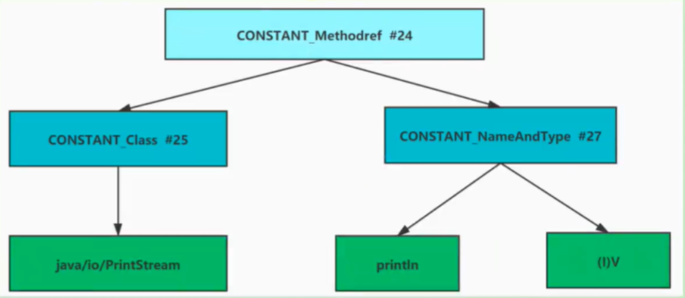
　　以方法为例，Java虚拟机为每个类都准备了一张方法表，将其所有的方法都列在表中，当需要调用一个类的方法的时候，只要知道这个方法在方法表中的偏移量就可以直接调用该方法。
　　**通过解析操作，符号引用可以转变目标方法在类中方法表的位置，从而使得方法被成功调用。**

　　**小结**
　　所谓解析就是将符号引用转为直接引用，也就是得到类、字段、方法在内存中的指针或偏移量。因此，可以说，如果直接引用存在，那么可以肯定系统中存在该类、方法或字段。但只存在符号引用，不能确定系统中一定存在该结构。
　　不过Java虚拟机规范并没有明确要求解析阶段一定要按照顺序执行。在HotSpot VM中，加载、验证、准备和初始化会按照顺序有条不紊地执行，但链接阶段中的解析操作往往会伴随着JVM在执行完初始化后再执行。

　　**字符串的复习**
　　最后，再来看一下CONSTANT_String的解析。由于字符串在程序开发过程中有着重要的作用，因此，读者有必要了解下String在Java虚拟机中的处理。**当在Java代码中直接使用字符串常量时，就会在类中出现CONSTANT_String**，它表示字符串常量，并且会引用一个CONSTANT_UTF8的常量项。在Java虚拟机内部运行的常量池中，会维护一张字符串拘留表(intern)，它会保存所有出现过的字符串常量，并且没有重复项。只要以CONSTANT_String形式出现的字符串也都会在这张表中。使用String.intern()方法可以得到一个字符串在拘留表中的引用，因为该表中没有重复项，所以任何字面相同的字符串的String.intern()方法返回总是相等的。

## 16.4 过程三：Initialization（初始化）阶段

　　初始化阶段，简言之，为类的静态变量赋予正确的初始值。威

<div>
    <div>
        <h5>　　具体描述</h5>
        <p>　　类的初始化是类装载的最后一个阶段。如果前面的步骤都没有问题，那么表示类可以顺利装载到系统中。<span style="color: red;">此时，类都会开始执行Java字节码。(即：到了初始化阶段，才真正开始执行类中定义的Java程序代码。)</span></p>
        <p>　　初始化阶段的重要工作是执行的初始化方法：&lt;clinit&gt;()方法</p>
        <ul>
            <li>该方法仅能由Java编译器生成并由JVM调用，程序开发都无法自定义一个同名的方法，更无法直接在Java程序中调用该方法，虽然该方法也是由字节码指令所组成。</li>
            <li>它是由类静态成员的赋值语句以及static语句块合并产生的。</li>
        </ul>        
    </div>
    <div>
        <h5>　　说明</h5>
        <p>　　在加载一个类之前，虚拟机总是会试图加载该类的父类，因此父类的&lt;clinit&gt;()总是在子类的此方法之前被调用。也就是说父类的static块优先级高于子类。</p>
        <p>　　Java编译器并不会为所有的类都产生&lt;clinit&gt;()初始化方法。哪些类在编译为字节码后，字节码文件中将不会包含&lt;clinit&gt;()方法？</p>
        <ul>
            <li>一个类中并没有声明任何的类变量，也没有静态代码块时；</li>
            <li>一个类中声明类变量，但是没有明确使用类变量的初始化语句以及静态代码块来执行初始化操作时；</li>
            <li>一个类中包含static final修饰的基本数据类型的字段，这些类字段初始化语句采用编译时常量表达式。</li>
        </ul>
    </div>
</div>　　
　　
　　
　　

### 16.4.1 static与final的搭配问题

<div>
    <div>
        <p>　　说明：使用static + final修饰的字段的显式赋值的操作，到底是在哪个阶段进行的赋值？</p>
        <ol>
            <li>在链接阶段的准备环节赋值，要求=右边是基本类型或"str"</li>
            <li>在初始化阶段&lt;clinit&gt;()中赋值，如= 引用类型(除了"str"这种字符串)</li>
        </ol>
    </div>
    <div>
        <p>　　结论：在链接阶段的准备环节赋值的情况：</p>
        <ol>
            <li>对于基本数据类型的字段来说，如果使用static final修饰，则显式赋值(直接赋值常量，而非调用方法通常是在链接阶段的准备环节进行)</li>
            <li>对于String来说，如果使用字面量的方式赋值，使用static final修饰的话，则显式赋值通常是在链接阶段的准备环节进行 </li>
            <li>在初始化阶段&lt;clinit&gt;()中赋值的情况：排除上述的在准备环节赋值的情况之外的情况。</li>
        </ol>
    </div>
    <div>
        <p style="color: red;">　　最终结论：使用static + final修饰，且显示赋值中不涉及到方法或构造器调用的基本数据类到或String类型的显式赋值，是在链接阶段的准备环节进行。</p>
    </div>
</div>

### 16.4.2 &lt;clinit&gt;()的线程安全性

　　对于&lt;clinit&gt;()方法的调用，也就是类的初始化，虚拟机会在内部确保其多线程环境中的安全性。
　　虚拟机会保证一个类的()方法在多线程环境中被正确地加锁、同步，如果多个线程同时去初始化一个类，那么只会有一个线程去执行这个类的&lt;clinit&gt;()方法，其他线程都需要阻塞等待，直到活动线程执行&lt;clinit&gt;()方法完毕。
　　正是因为<span style="color: red;">函数&lt;clinit&gt;()带锁线程安全的</span>，因此，如果在一个类的&lt;clinit&gt;()方法中有耗时很长的操作，就可能造成多个线程阻塞，引发死锁。并且这种死锁是很难发现的，因为看起来它们并没有可用的锁信息。
　　如果之前的线程成功加载了类，则等在队列中的线程就没有机会再执行&lt;clinit&gt;()方法了。那么，当需要使用这个类时，虚拟机会直接返回给它已经准备好的信息。
　　如果在2个类的&lt;clinit&gt;()中各自调用了对方类的构造方法，即也会执行&lt;clinit&gt;()方法，就会造成死锁。

### 16.4.3 类的初始化情况：主动使用vs被动使用

　　Java程序对类的使用分为两种：主动使用(会调用&lt;clinit&gt;()方法)和被动使用(不会调用&lt;clinit&gt;()方法)。
<div>
    <h5>　　个人理解：主动使用代表我要让这个类做好我设定好的准备，即为静态变量赋好值，即所有可能涉及到使用静态变量的地方都叫主动使用</h5>
    <ol>
        <li>new对象：new好的对象中可能会使用到静态变量；</li>
        <li>静态变量获取和设置：涉及到静态变量的使用；</li>
        <li>反射：反射后，就可以获取类的所有变量值了，涉及到静态变量的使用；</li>
        <li>main方法：可以调用类的静态变量，涉及到静态变量的使用；</li>
        <li>调用类的静态方法：静态方法中可能调用静态变量，涉及到静态变量的使用；</li>
        <li>初始化子类：子类初始化可能会用到父类的静态变量，涉及到静态变量的使用；</li>
    </ol>
</div>
　　

<div>
    <div>
        <h5>　　主动使用</h5>
        <p>　　Class只有在必须要首次使用的时候才会被装载，Java虚拟机不会无条件地装载Class类型。Java虚拟机规定，一个类或接口在初次使用前，必须要进行初始化。这里指的“使用”，是指主动使用，主动使用只有下列几种情况：（即：如果出现如下的情况，则会对类进行初始化操作。而初始化操作之前的加载、验证、准备已经完成。</p>
        <ol>
            <li>实例化：当创建一个类的实例时，比如使用new关键字，或者通过反射、克隆、反序列化。</li>
            <li>静态方法：当调用类的静态方法时，即当使用了字节码invokestatic指令。</li>
            <li>静态字段：当使用类、接口的静态字段时（final修饰特殊考虑），比如，使用getstatic或者putstatic指令。（对应访问变量、赋值变量操作）</li>
            <li>反射：当使用java.lang.reflect包中的方法反射类的方法时。比如：Class.forName("com.atguigu.java.Test")</li>
            <li>
                <p>继承：当初始化子类时，如果发现其父类还没有进行过初始化，则需要先触发其父类的初始化。</p>
                <p>当Java虚拟机初始化一个类时，要求它的所有父类都已经被初始化，但是这条规则并不适用于接口。</p>
                <ul>
                    <li>在初始化一个类时，并不会先初始化它所实现的接口</li>
                    <li>在初始化一个接口时，并不会先初始化它的父接口</li>
                    <li>因此，一个父接口并不会因为它的子接口或者实现类的初始化而初始化。只有当程序首次使用特定接口的静态字段时，才会导致该接口的初始化。</li>
                </ul>
            </li>
            <li>default方法：如果一个接口定义了default方法，那么直接实现或者间接实现该接口的类的初始化，该接口要在其之前被初始化。</li>
            <li>
                main方法：当虚拟机启动时，用户需要指定一个要执行的主类（包含main()方法的那个类），虚拟机会先初始化这个主类。<br/>
                VM启动的时候通过引导类加载器加载一个初始类。这个类在调用public static void main(String[])方法之前被链接和初始化。这个方法的执行将依次导致所需的类的加载，链接和初始化。
            </li>
            <li>MethodHandle：当初次调用MethodHandle实例时，初始化该MethodHandle指向的方法所在的类。（涉及解析REF getStatic、REF_putStatic、REF invokeStatic方法句柄对应的类） </li>
        </ol>
    </div>
    <div>
        <h5>　　被动使用</h5>
        <p>　　除了以上的情况属于主动使用，其他的情况均属于被动使用。被动使用不会引起类的初始化。也就是说：并不是在代码中出现的类，就一定会被加载或者初始化。如果不符合主动使用的条件，类就不会初始化。</p>
        <ol>
            <li>静态字段：当通过子类引用父类的静态变量，不会导致子类初始化，只有真正声明这个字段的类才会被初始化。</li>
            <li>数组定义：通过数组定义类引用，不会触发此类的初始化</li>
            <li>引用常量：引用常量不会触发此类或接口的初始化。因为常量在链接阶段就已经被显式赋值了。</li>
            <li>loadClass方法：调用ClassLoader类的loadClass()方法加载一个类，并不是对类的主动使用，不会导致类的初始化。</li>
        </ol>
    </div>
    <div>
        <h5>扩展</h5>
        <p>-XX:+TraceClassLoading：追踪打印类的加载信息</p>
    </div>
</div>

## 16.5 过程四：类的Using（使用）

　　任何一个类型在使用之前都必须经历过完整的加载、链接和初始化3个类加载步骤。一旦一个类型成功经历过这3个步骤之后，便“厉事俱备只欠东风”，就等着开发者使用了。
　　开发人员可以在程序中访问和调用它的静态类成员信息（比如：静态字段、静态方法），或者使用new关键字为其创建对象实例。

## 16.6 过程五：类的Unloading（卸载）
### 16.6.1. 类、类的加载器、类的实例之间的引用关系

　　在类加载器的内部实现中，用一个Java集合来存放所加载类的引用。另一方面，一个Class对象总是会引用它的类加载器，调用Class对象的getClassLoader()方法，就能获得它的类加载器。由此可见，代表某个类的Class实例与其类的加载器之间为双向关联关系。
　　一个类的实例总是引用代表这个类的Class对象。在Object类中定义了getClass()方法，这个方法返回代表对象所属类的Class对象的引用。此外，所有的java类都有一个静态属性class，它引用代表这个类的Class对象。

### 16.6.2 类的生命周期

　　当Sample类被加载、链接和初始化后，它的生命周期就开始了。当代表Sample类的Class对象不再被引用，即不可触及时，Class对象就会结束生命周期，Sample类在方法区内的数据也会被卸载，从而结束Sample类的生命周期。
　　一个类何时结束生命周期，取决于代表它的Class对象何时结束生命周期。

### 16.6.3 具体例子

　　

　　loader1变量和obj变量间接应用代表Sample类的Class对象，而objClass变量则直接引用它。
　　如果程序运行过程中，将上图左侧三个引用变量都置为null，此时Sample对象结束生命周期，MyClassLoader对象结束生命周期，代表Sample类的Class对象也结束生命周期，Sample类在方法区内的二进制数据被卸载。
　　当再次有需要时，会检查Sample类的Class对象是否存在，如果存在会直接使用，不再重新加载；如果不存在Sample类会被重新加载，在Java虚拟机的堆区会生成一个新的代表Sample类的Class实例（可以通过哈希码查看是否是同一个实例）

### 16.6.4 类的卸载

<ol>
    <li>启动类加载器加载的类型在整个运行期间是不可能被卸载的（jvm和jls规范）</li>
    <li>被系统类加载器和扩展类加载器加载的类型在运行期间不太可能被卸载，因为系统类加载器实例或者扩展类的实例基本上在整个运行期间总能直接或者间接的访问的到，其达到unreachable的可能性极小。</li>
    <li>被开发者自定义的类加载器实例加载的类型只有在很简单的上下文环境中才能被卸载，而且一般还要借助于强制调用虚拟机的垃圾收集功能才可以做到。可以预想，稍微复杂点的应用场景中（比如：很多时候用户在开发自定义类加载器实例的时候采用缓存的策略以提高系统性能），被加载的类型在运行期间也是几乎不太可能被卸载的（至少卸载的时间是不确定的）。</li>
</ol>

　　综合以上三点，一个已经加载的类型被卸载的几率很小至少被卸载的时间是不确定的。同时我们可以看的出来，开发者在开发代码时候，不应该对虚拟机的类型卸载做任何假设的前提下，来实现系统中的特定功能。

　　**回顾：方法区的垃圾回收**
　　方法区的垃圾收集主要回收两部分内容：常量池中废弃的常量和不再使用的类型。
　　HotSpot虚拟机对常量池的回收策略是很明确的，只要常量池中的常量没有被任何地方引用，就可以被回收。
<div>
    <p>　　判定一个常量是否“废弃”还是相对简单，而要判定一个类型是否属于“不再使用的类”的条件就比较苛刻了。需要同时满足下面三个条件：</p>
    <ul>
        <li>该类所有的实例都已经被回收。也就是Java堆中不存在该类及其任何派生子类的实例。</li>
        <li>加载该类的类加载器已经被回收。这个条件除非是经过精心设计的可替换类加载器的场景，如OSGI、JSP的重加载，否则通常是很难达到的。</li>
        <li>该类对应的java.lang.Class对象没有在任何地方被引用，无法在任何地方通过反射访问该类的方法。</li>
    </ul>
</div>

　　Java虚拟机被允许对满足上述三个条件的无用类进行回收，这里说的仅仅是“被允许”，而并不是和对象一样，没有引用了就必然会回收。
　　
　　
　　
　　
　　
　　
　　
　　
　　
　　
　　
　　
　　
　　
　　
　　
　　
　　
　　
　　
　　
　　
　　
　　
　　
　　
　　
　　
　　
　　
　　
　　
　　
　　
　　
　　
　　
　　
　　
　　
　　
　　
　　
　　
　　
　　

