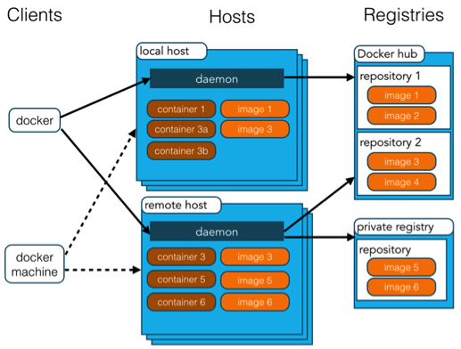
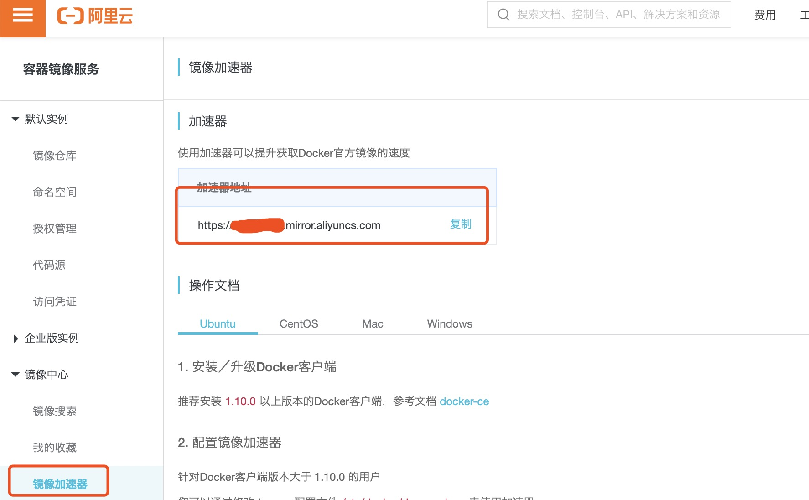

 @[TOC](第1章 docker)

# 0 格式
## 0.0 格式要求

# 1 docker安装
## 1.1 以CentOS 7安装举例：

- yum update：yum包更新到最新；
- yum install -y yum-utils device-mapper-persistent-data lvm2：安装需要的软件包，yum-util提供yum-config-manager功能，另外2个是devicemapper驱动依赖的；
- yum-config-manager --add-repo http://download.docker.com/linux/centos/docker-ce.repo：设置yum源；
- yum install -y docker-ce：安装docker，都选y；
- docker -v：查看docker版本，验证是否成功。

## 1.2 配置Docker镜像加速器：

目的，修改registry-mirrors。
国内从 DockerHub 拉取镜像有时会遇到困难，此时可以配置镜像加速器。Docker 官方和国内很多云服务商都提供了国内加速器服务，例如：
- 科大镜像：https://docker.mirrors.ustc.edu.cn/
- 网易：https://hub-mirror.c.163.com/
- 阿里云：https://<你的ID>.mirror.aliyuncs.com
- 七牛云加速器：https://reg-mirror.qiniu.com
- 阿里云镜像获取地址：https://cr.console.aliyun.com/cn-hangzhou/instances/mirrors，登陆后，左侧菜单选中镜像加速器就可以看到你的专属地址了(有如何配置镜像加速器)
  

### 1.2.1 Ubuntu14.04、Debian7Wheezy系统

对于使用 upstart 的系统而言，编辑 /etc/default/docker 文件，在其中的 DOCKER_OPTS 中配置加速器地址：DOCKER_OPTS="--registry-mirror=https://registry.docker-cn.com"。
重新启动服务：sudo service docker restart。

### 1.2.2 Ubuntu16.04+、Debian8+、CentOS7

对于使用 systemd 的系统，请在 /etc/docker/daemon.json 中写入如下内容（如果文件不存在请新建该文件）：{"registry-mirrors":["https://reg-mirror.qiniu.com/"]}。
之后重新启动服务：
sudo systemctl daemon-reload
sudo systemctl restart docker

### 1.2.3 检查镜像生效

检查加速器是否生效：docker info命令，出现Registry Mirrors: https://reg-mirror.qiniu.com证明配置成功。

# 2 docker架构

|概念|说明|
|:--|:--|
|Docker 镜像(Images)|Docker 镜像是用于创建 Docker 容器的模板，比如 Ubuntu 系统。|
|Docker 容器(Container)|容器是独立运行的一个或一组应用，是镜像运行时的实体。|
|Docker 客户端(Client)|Docker 客户端通过命令行或者其他工具使用 Docker SDK (https://docs.docker.com/develop/sdk/) 与 Docker 的守护进程通信。|
|Docker 主机(Host)|一个物理或者虚拟的机器用于执行 Docker 守护进程和容器。|
|Docker Registry|Docker 仓库用来保存镜像，可以理解为代码控制中的代码仓库。

Docker Hub(https://hub.docker.com) 提供了庞大的镜像集合供使用。

一个 Docker Registry 中可以包含多个仓库（Repository）；每个仓库可以包含多个标签（Tag）；每个标签对应一个镜像。

通常，一个仓库会包含同一个软件不同版本的镜像，而标签就常用于对应该软件的各个版本。我们可以通过 <仓库名>:<标签> 的格式来指定具体是这个软件哪个版本的镜像。如果不给出标签，将以 latest 作为默认标签。|
|Docker Machine|Docker Machine是一个简化Docker安装的命令行工具，通过一个简单的命令行即可在相应的平台上安装Docker，比如VirtualBox、 Digital Ocean、Microsoft Azure。|

# 3 docker命令
## 3.1 docker服务命令(操作docker这个软件的命令)

|命令|含义|
|:--|:--|
|systemctl start docker|启动docker|
|systemctl stop docker|停止docker|
|systemctl restart docker|重启docker|
|status docker|查看docker服务状态：Active表示docker状态|
|systemctl enable docker|开机启动docker|

docker在命令参数位置，可以将另一个命令的结果当作参数，通过``调用，如docker rmi `docker images -q`：查看docker所有本地镜像id，并进行镜像删除。

## 3.2 docker镜像相关命令

docker images [OPTIONS] [REPOSITORY[:TAG]]：查看本地镜像
- -q：只显示镜像id；

docker search [OPTIONS] REPOSITORY：搜索远程镜像，想知道可下载的版本，去镜像地址上查
- --no-trunc :显示完整的镜像描述；
- -f <过滤条件>:列出收藏数不小于指定值的镜像。

docker pull [OPTIONS] NAME[:TAG|@DIGEST]：从镜像仓库中拉取或者更新指定镜像
- -a :拉取所有 tagged 镜像。
- 备注：不指定tag和digest，默认拉取最新版本，且默认名为latest。

docker rmi [OPTIONS] IMAGE:TAG|IMAGE_ID [IMAGE:TAG...]：删除本地一个或多个镜像。
- -f :强制删除；
- --no-prune :不移除该镜像的过程镜像，默认移除；

## 3.2 docker容器相关命令

docker ps [OPTIONS]：查看容器
- -a :显示所有的容器，包括未运行的。
- -q :静默模式，只显示容器编号。
- 备注：contrainer id容器id，image 镜像:版本，command 进入容器初始化的命令，status 状态，names 容器名称

docker run [OPTIONS] IMAGE:TAG [COMMAND] [ARG...]：启动容器
举例：docker run -it --name myredis redis:latest /bin/bash：以交互式方式创建redis:latest的容器，容器名称为myredis，并运行/bin/bash命令
- -i：以交互模式运行容器(即不会关闭)，通常与 -t 同时使用。加入it参数后，创建后自动进入容器，退出容器，自动关闭；
- -t：为容器重新分配一个伪输入终端，通常与 -i 同时使用；
- -d: 以守护(后台)模式运行容器，并返回容器ID(不用输入/bin/bash)，使用docker exec进入容器。退出容器，容器不会关闭；
- --volume , -v: 绑定一个卷，查看数据卷部分内容；
- --name：为创建的容器命名；
- 备注：容器退出后自动会终止容器，除非前台有守护线程。it是交互式容器，id是守护式容器。

docker exec [OPTIONS] CONTAINER [COMMAND ARG...]：在运行的容器中执行命令，或进入容器
举例：docker exec -it CONTAINER_ID /bin/bash：以交互式方式进入容器(通过id)，并执行/bin/bash命令。
- -d：分离模式: 在后台运行。

exit：退出容器
举例：docker exec -it CONTAINER_ID /bin/bash：以交互式方式进入容器(通过id)，并执行/bin/bash命令。
- -d：分离模式: 在后台运行。

docker start|stop|restart 容器id|容器名:启动(停止|重新启动)一个或多个已经被停止的容器

docker rm [OPTIONS] CONTAINER [CONTAINER...]：删除一个或多个容器
- -f：通过 SIGKILL 信号强制删除一个运行中的容器(可以删除运行中的容器)。
- -l :移除容器间的网络连接，而非容器本身。
- -v :删除与容器关联的卷。

docker inspect [OPTIONS] NAME|ID [NAME|ID...]: 获取容器/镜像的元数据
- -f :指定返回值的模板文件。
- -s :显示总的文件大小。
- --type :为指定类型返回JSON。

# 4 docker容器的数据卷
## 4.1 概念及作用

问题：
- docker容器删除后，在容器中产生的数据也会被销毁；
- docker容器和外部机器不可以直接交换文件；
- 容器之间不能进行数据交互。

数据卷就是解决3个问题的。
数据卷：
- 是宿主机中的一个目录或文件；
- 当容器目录和数据卷目录绑定后，对方的修改会立即同步；
- 一个数据卷可以被多个容器同时挂载；
- 一个容器也可以被挂载多个数据卷。

数据卷作用：
- 容器数据持久化；
- 外部机器和容器间接通信；
- 容器之间数据交换。

配置数据卷
docker run -it --name=c1 -v 宿主机目录(文件):容器内目录(文件) 容器名|容器版本 /bin/bash

注意点：
- 目录必须是绝对路径；
- 如果目录不存在，会自动创建；
- 可以挂载多个数据卷，每挂载一个目录卷加一个-v就行；
- 多个容器可以挂载同一个数据卷。

